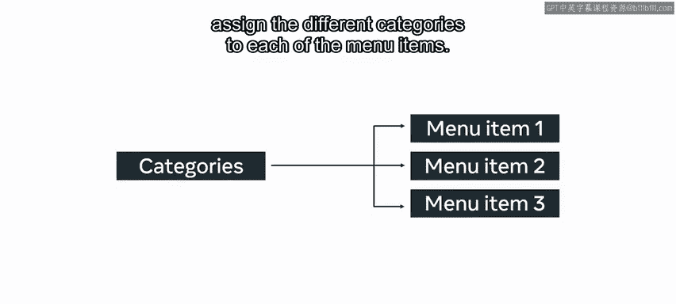
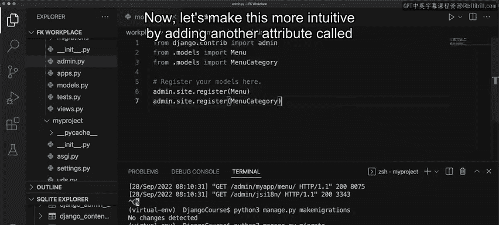

# 后端开发：P28：使用外键的模型 🔗

在本节课中，我们将学习如何在Django模型中使用外键来建立表与表之间的“一对多”关系。我们将通过为“小柠檬”餐厅构建在线菜单的实例，来理解如何创建关联模型、定义外键字段以及执行相关数据库迁移。

现在，你已经熟悉了创建模型和执行迁移的基础知识。接下来，我们将通过使用“一对多”关系连接另一个模型，来加深你对模型的理解。

## 理解外键与关系

外键是Django ORM中的一个字段，它代表数据库表中的一个列。你使用它来在数据库的表之间创建关系。

想象一下为“小柠檬”餐厅构建在线菜单的场景。解决方案始于创建一个表来为网页添加菜单项。然而，“小柠檬”是一家提供多种菜系的餐厅，将每个菜品正确归类到其所属的类别需要一些技巧。

为了成功实现这一点，首先需要为“类别”创建另一个模型，并将不同的类别分配给每个菜单项。

## 创建模型与定义外键

现在，让我们探索如何通过在Django中使用外键来实现“一对多”关系。

我们首先从`models.py`文件开始。这里需要创建两个模型。第一个模型用于菜单类别，第二个模型用于菜单项。之后，你将在菜单类别中添加子类别，并使用外键来引用这些类别。

需要知道的是，添加这两个模型的方式与独立添加模型的方式相同。

以下是创建模型的具体步骤：

1.  **创建菜单类别模型**：添加一个名为`menu_category_name`的属性并保存文件。
2.  **创建菜单项模型**：创建第二个名为`Menu`的模型。在此模型内，添加`menu_item_name`、`price`和`category_id`属性。
3.  **定义字段类型**：为菜单项名称分配一个字符字段，为价格分配一个整数字段。
4.  **添加外键**：在`category_id`字段处，使用`models.ForeignKey`命令来定义外键。

外键内部有两个必需的参数：
*   第一个参数是要连接到的模型类。
*   第二个参数是`on_delete`设置，它定义了当被引用的对象被删除时的行为。在本例中，它被定义为`on_delete=models.PROTECT`。

此外，还可以添加另一个参数，如`default=None`。

## 注册模型与执行迁移

下一步包括更新`admin.py`文件，添加必要的导入。

接下来是注册模型。请注意，其效用将在后续的Django Admin课程中变得更加明显。目前，请确保更新了应用配置中的`settings.py`文件。

然后，运行服务器，接着执行迁移操作。

你会注意到输出中包含了两个已迁移的模型。最后，运行命令`python3 manage.py migrate`。

## 验证数据库关系

下一步是检查数据库。打开`db.sqlite3`文件，右键单击并选择“打开数据库”。向下滚动到SQLite资源管理器，选择`myapp_menu`表。

对于此示例，我们假设数据库中已添加了一些条目。现在，再次打开数据库，在`myapp_menucategory`表下，ID列出了1、2和3，分别对应意大利菜、希腊菜和土耳其菜。

接着访问`myapp_menu`表。你会注意到有一个名为`category_id_id`的第四字段。该字段的ID号与`myapp_menucategory`表中各自的类别ID相匹配。

例如，希腊沙拉的ID列为2，而在`myapp_menucategory`表中，类别名称“希腊”的ID也是2。菜单项的ID被引用，并与菜单类别中列出的ID相对应。

## 优化关系显示

为了让这种关系更直观，我们可以在外键字段中添加另一个属性：`related_name='category_name'`。

这意味着`myapp_menu`表现在将列出类别名称，而不是`category_id_id`。这在再次运行迁移时会很明显。菜单上的类别字段被更改了。

请注意，当选择了`on_delete=models.PROTECT`时，即使类别表中的任何类别被删除，也不会移除与之关联的菜单项。

## 总结

本节课中，我们一起学习了如何在Django模型中实现“一对多”关系。我们创建了`MenuCategory`和`Menu`两个模型，通过在`Menu`模型中定义`models.ForeignKey`字段，将菜单项与其类别关联起来。我们还了解了`on_delete`参数的作用，并通过数据库验证了这种关联关系。最后，我们使用`related_name`参数优化了关系的可读性。掌握外键的使用是构建复杂数据关系应用的基础。