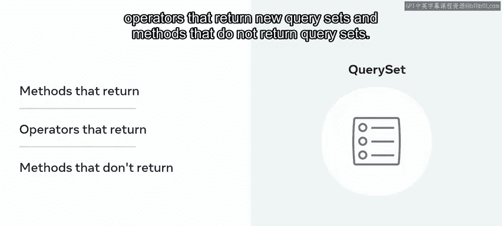
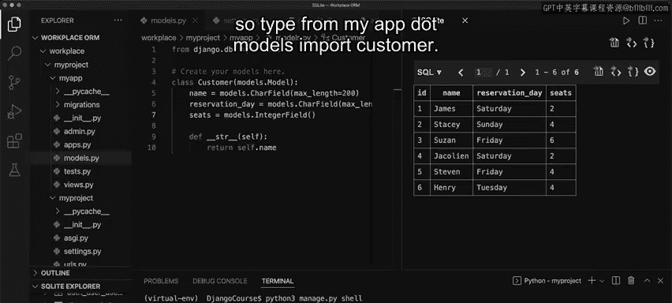

# 后端开发：P29：使用ORM

## 概述

在本节课中，我们将要学习对象关系映射（ORM）的概念，了解Django如何利用ORM自动生成SQL查询来与数据库交互。我们还将探索查询集API，学习开发者如何使用它来保存和检索数据库中的数据。

## 什么是对象关系映射（ORM）？

构建Web应用程序时，开发者使用数据库存储数据，并编写SQL查询来获取和操作这些数据。随着应用程序规模和复杂度的增长，SQL查询的数量和复杂度也会相应增加。

为了帮助开发者，Django提供了一个称为对象关系映射（ORM）的功能。ORM能自动创建所需的SQL查询。

对象关系映射是一个抽象层，旨在简化编程语言与数据库之间的交互。它允许程序员使用SQL数据库，而无需编写SQL语句。ORM通过观察数据对象的变化，在内部创建一个结构化映射，为给定的关系数据库生成SQL代码。

## 查询集（QuerySet）简介

在之前的课程中，你可能已经注意到，为给定模型添加的每一行条目都会创建一个对象。你可能还记得输出结果带有“QuerySet”前缀。

查询集是Django中用于给定模型的此类对象的集合。Django使用查询集从数据库中检索和操作这些对象。

例如，假设你有一个名为`Customer`的模型。你可以通过运行命令`Customer.objects.all()`来访问此模型的内容。此命令将输出返回为一个查询集。该列表将包含与数据库中行条目对应的不同对象的条目。

## 查询集API

对于可以构建的每一个SQL查询，都有一个对应的命令。这些命令是查询集API的一部分。

例如，如果你想在SQL中使用`WHERE`或`LIMIT`子句连接多个参数，你可以使用`filter`函数并将条件作为参数传递给它。

考虑到SQL中可以构建的各种复杂查询，Django提供了多个函数来支持这些操作。根据需要在查询集上运行的逻辑，它们可以分为以下几类：

以下是查询集API方法的分类：

*   **返回新查询集的方法**
*   **返回新查询集的运算符**
*   **不返回查询集的方法**

## 实践：使用查询集API

现在，让我们打开VS Code，通过一个示例来探索如何使用这些方法与数据库交互。

假设Little Lemon餐厅的管理人员希望跟踪来访的顾客。在`Models.py`文件中，有一个名为`Customer`的模型，它包含诸如姓名、预订日期和顾客要求的座位数等属性。该模型已经迁移完成，并且数据库中已包含一些条目。

要查看数据库的内容，请点击SQL Explorer并选择`customer`表。请注意，数据已显示出来。

数据库中有条目后，在终端中输入`python3 manage.py shell`打开shell。你可能记得，进入shell后，首先需要从`Models.py`文件导入`Customer`类。因此，输入`from myapp.models import Customer`。

### 探索不返回查询集的方法

让我们探索一个不运行查询字符串的方法示例。使用`Customer.objects.get`方法。在括号内，输入一个ID值，例如`4`。请注意，返回了与ID`4`对应的顾客姓名。此方法类似于你在SQL中使用的`SELECT`语句。

### 探索返回新查询集的方法

接下来，让我们使用`filter`函数探索返回新查询集的方法。假设你想查找星期六的预订。使用`Customer.objects.filter`方法，并传递`reservation_day`等于`Saturday`的条件。请确保使用双引号，因为你正在处理字符串值。按回车键，注意返回了James和Jacqueline的查询集。`filter`方法类似于SQL中的`WHERE`子句。

假设你将日期改为`Friday`，并添加另一个具有不同条件的`filter`方法，将条件设置为`seats`等于`4`，然后按回车键。注意只返回了一个查询集，因为这是唯一满足两个条件的查询集。使用的`AND`运算符类似于SQL中使用的`AND`运算符。此运算符是返回新查询集的查询集API的一部分。

## 总结

在本节课中，我们一起学习了对象关系映射（ORM）的概念，以及Django如何利用它来创建针对数据库的SQL查询。我们还探索了查询集API，了解了开发者如何使用它来保存和检索数据库中的数据。查询集API是一个广泛的主题，如果你想了解更多，本课末尾提供了一个额外阅读材料的链接。