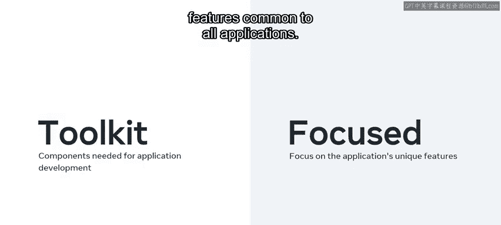
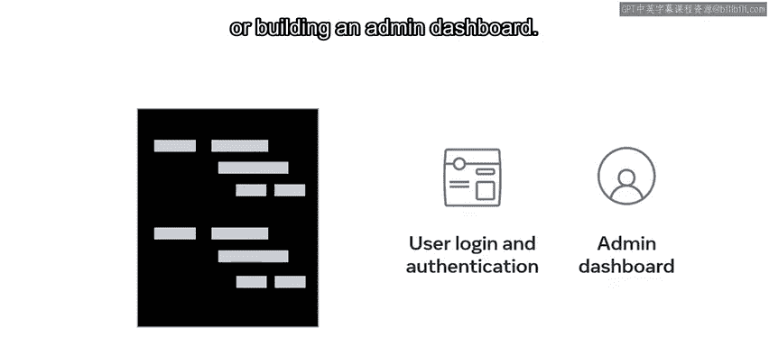
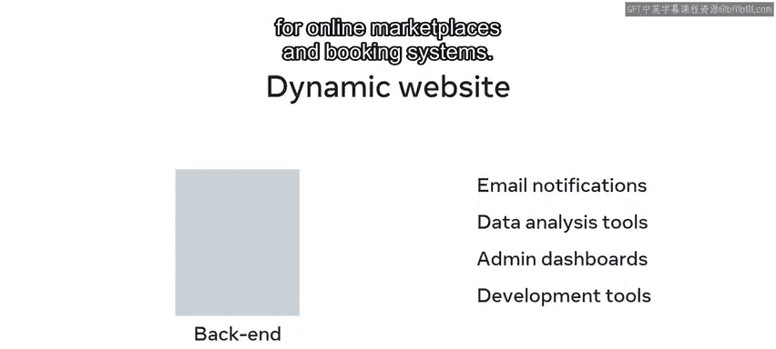
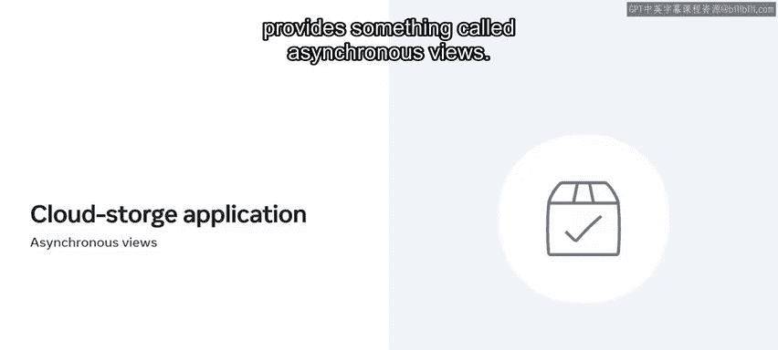
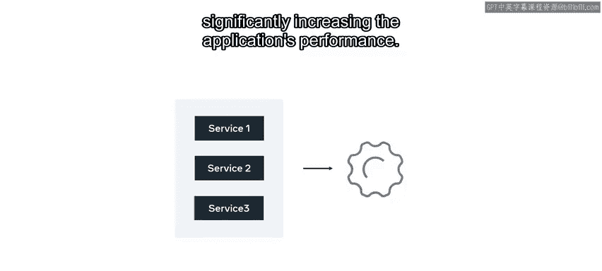
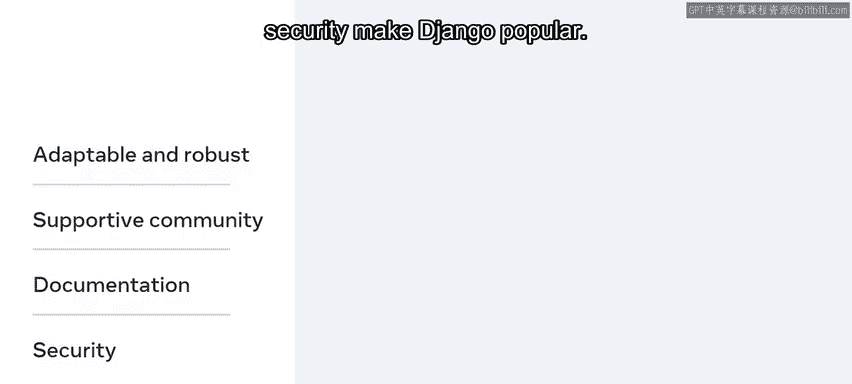

# 后端开发：P2：什么是Django

在本节课中，我们将要学习什么是Django框架，了解其核心概念、优势以及在现实世界中的应用场景。

---

构建Web应用程序时，开发者和开发团队在代码方面有两种选择。

选择一：自己构建所有功能。选择二：使用一种称为Web应用程序框架的工具。

你可以将Web应用程序框架视为一个工具箱，它包含了应用程序开发所需的所有组件。

通过使用框架，开发者和开发团队可以专注于应用程序的独特功能，而无需花费时间开发所有应用程序共有的通用功能。

以下是使用框架可以避免重复开发的常见功能示例：

*   用户登录与身份验证的代码。
*   构建管理仪表盘。

---

上一节我们了解了框架的基本概念，本节中我们来看看Django框架本身。

本视频将概述Django框架。你将了解Django在现实世界中的应用场景以及使用它的Web应用程序类型。

Django是一个开源的Web开发框架，它使用Python编写，最初是为一家报纸出版商的Web应用程序创建的。因此，它非常适合构建需要处理大量文本内容、媒体文件和高流量的项目。

Django的开源特性促成了其快速发展和广泛采用，这使其能够用于各种各样的Web应用程序。

Django框架允许轻松集成多种工具和语言，并得到其他Python库的支持。

一个Web框架的成功很大程度上取决于其提供健壮、安全、适应性强和可扩展功能的能力。Django满足了所有这些要求，并提供了模板、库和API等特性，这些特性都易于管理和扩展。

除了出版业，Django也是电子商务、医疗保健、金融、交通、旅游、社交媒体等领域的流行选择。

---

Django的强大之处在于其分离功能的能力，这对于需要使用多个框架创建项目的组织非常有帮助。

例如，开发者可以使用Django创建一个后端框架，该框架可以通过API连接到前端框架。这样，组织就可以自由选择他们喜欢的任何前端框架，例如Meta的React或React Native。

在后端，开发者可以利用Django的强大功能，包括：

*   用于通知的电子邮件系统。
*   数据分析工具。
*   管理仪表盘。
*   用于在线市场和预订系统的开发工具。

---

因此，Django框架成为世界各行业领先公司和互联网巨头的选择也就不足为奇了。

这些领域包括机器学习和人工智能、可扩展的Web应用程序、软件即服务应用程序、流媒体平台以及购物、活动管理、新闻和出版等行业。现在让我们更详细地探讨这些领域。

首先是机器学习和人工智能领域。开发者可以使用Django部署机器学习算法，这些算法可以通过API、RPC和WebSocket等方式提供。Django可以处理许多API端点，每个端点可以包含多个ML模型，并且支持这些模型的快速集成和部署。

接下来是可扩展的Web应用程序。Django如此受欢迎的一个重要原因是其易于扩展。许多Web应用程序和科技公司通常从小规模起步，但很快会迅速扩张。例如，构建社交媒体应用的组织。像Meta的Instagram这样的流行社交媒体应用就使用Django来满足不断增长的内存和资源管理需求。可扩展性原则对于用户基数未知的Web应用程序同样有帮助。应用程序扩展能力的一个关键因素是能够为其用户提供快速高效的流量管理。因此，Django在社交媒体、杂志和博客等应用中很受欢迎。

大多数基于Web构建的应用程序都提供某种形式的软件即服务。这可能意味着提供数据存储、应用商店和版本控制系统等服务的平台。例如，Django是云存储应用程序的流行选择，因为它提供了异步视图。这允许应用程序并发运行不同的服务，而不是排队等待完成每项服务，从而显著提高了应用程序的性能。

最后，让我们探讨提供音频和视频流服务的流媒体平台。流媒体平台最近越来越受欢迎，Django经常被用来满足其需求。需要指出的是，Django的应用并不仅限于本视频中提到的服务和行业。

然而，人们普遍认为Django更适合大型项目，因为它提供了良好的容错能力。此外，其开源特性本质上是免费的，大大降低了公司的成本。同时，易于适应、健壮性、支持性的开源社区、全面的文档和安全性也使Django广受欢迎。

---

归根结底，开发者和组织青睐Django，是因为就像Python一样，它帮助他们避免了重复造轮子。

本节课中我们一起学习了Django框架的概述，以及为什么它在构建Web应用程序时受到青睐。你也了解了Django在现实世界中的应用场景和使用它的Web应用程序类型。