# 后端开发（Django/APIs/全栈/毕业项目/面试）：P31：使用Django表单字段和数据类型 📝

在本节课中，我们将要学习Django中表单字段的使用方法以及如何利用它们来存储正确的数据类型。表单是Web应用从用户处收集数据的关键工具，理解不同的字段类型及其参数对于构建有效且用户友好的表单至关重要。

## 概述

Web应用通常通过HTML表单从用户那里收集数据，并将这些数据发送到服务器进行处理。在Django中，我们使用`Form`类来创建和处理表单。表单字段是构建表单的基本单元，它们不仅定义了表单的视觉元素，还决定了后端接收和处理的数据类型。

上一节我们介绍了Django表单的基本概念，本节中我们来看看构成表单的具体字段类型以及如何定制它们。

## 表单字段类型

以下是Django中一些常用的表单字段类型及其对应的HTML元素：

*   **CharField**：接受任何字符串输入。它等同于HTML中的`<input type="text">`元素。
*   **EmailField**：接受符合电子邮件格式的输入。它等同于HTML中的`<input type="email">`元素。
*   **IntegerField**：仅接受整数输入。它等同于HTML中的`<input type="number">`元素。
*   **ChoiceField**：提供多个选项供选择。它等同于HTML中的`<select>`和`<option>`元素。
*   **FileField**：允许用户选择文件进行上传。它等同于HTML中的`<input type="file">`元素。

## 核心字段参数

除了字段类型，我们还可以为字段传递不同的参数来进行定制。虽然具体参数因字段而异，但有几个核心参数是大多数字段都支持的：

*   **`required`**：默认情况下，每个字段都假定为必填项。你可以通过设置`required=False`来将其改为可选。
*   **`label`**：此参数用于为字段指定一个自定义的标签文本。
*   **`initial`**：可以为特定字段设置初始值。
*   **`help_text`**：用于为字段指定描述性文本，帮助用户理解如何填写。

记住，你构建的每个表单都有不同的数据需求。例如，一个客户反馈表单和一个关于顾客最爱菜单项的调查表单所需的字段就完全不同。了解使用哪种字段类型对于构建有效的表单至关重要。

## 实践：在代码中探索字段

现在，让我们在VS Code中实际操作，探索用于创建表单的不同字段以及可用的自定义选项。

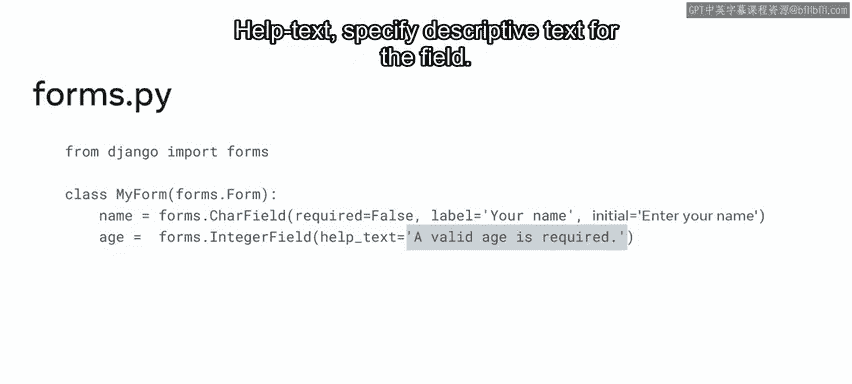

首先，我们创建一个包含`CharField`的演示表单。

```python
# forms.py
from django import forms

class DemoForm(forms.Form):
    name = forms.CharField()
```

在浏览器中查看此表单，你会注意到Django根据定义的属性值自动生成了标签“Name”。如果你更改属性名，表单上的标签也会相应更新。

你可以通过传递参数来进一步编辑表单，例如使用`widget`参数。以下代码将默认的文本输入框替换为文本区域（`textarea`）。

```python
name = forms.CharField(widget=forms.Textarea)
```

刷新页面后，表单会更新为一个更大的文本输入区域。如果你希望文本区域小一些，可以在`Textarea`小部件中传递`attrs`参数来指定行数。

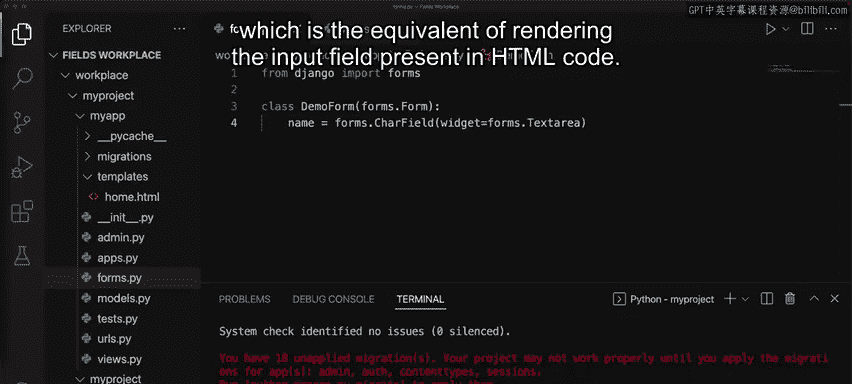

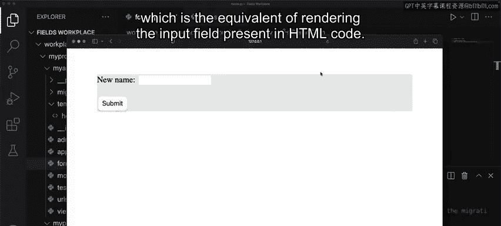

```python
name = forms.CharField(widget=forms.Textarea(attrs={'rows': 5}))
```

保存并刷新后，文本区域将缩小，只显示5行的空间。

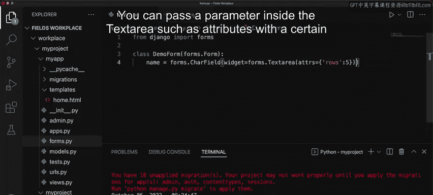

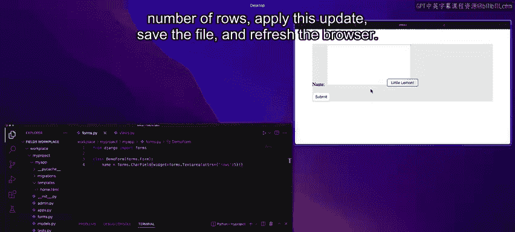

## 更多字段示例

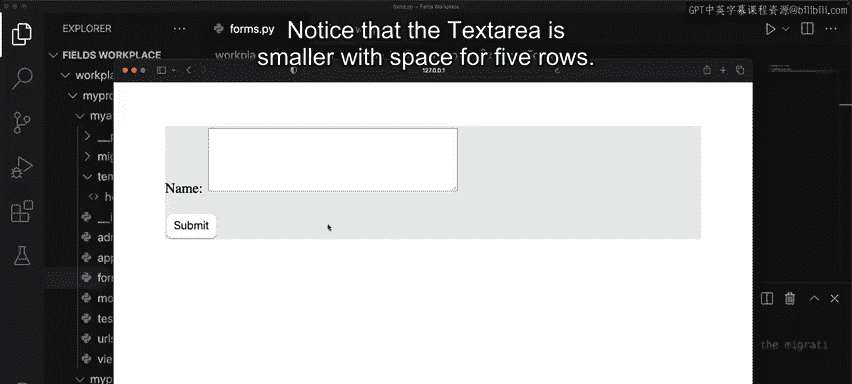

接下来，让我们探索`EmailField`。将代码替换如下：

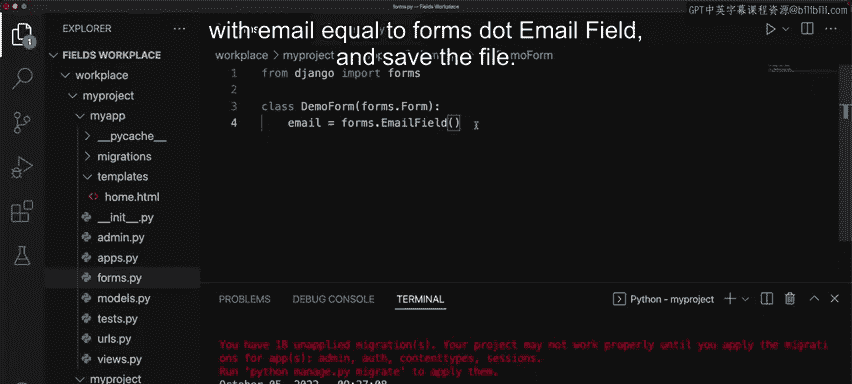

```python
email = forms.EmailField()
```

刷新页面，表单会更新为电子邮件输入字段。值得注意的是，Django表单字段默认带有基本验证功能。如果你输入一个无效的电子邮件地址并提交，页面会显示错误提示：“请输入一个有效的电子邮件地址”。输入有效地址后，错误提示消失。

为了帮助用户了解在每个字段中应输入什么内容，我们可以使用`label`参数。

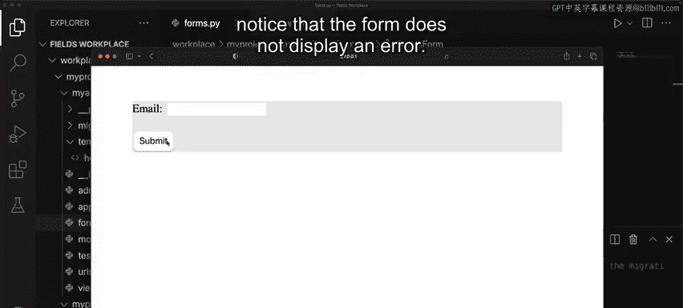

```python
email = forms.EmailField(label="请输入您的邮箱地址")
```

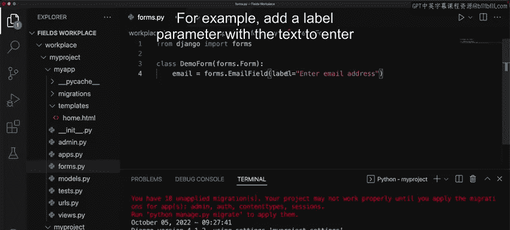

保存并刷新后，表单标签将显示我们自定义的文本，而不是默认的属性名。

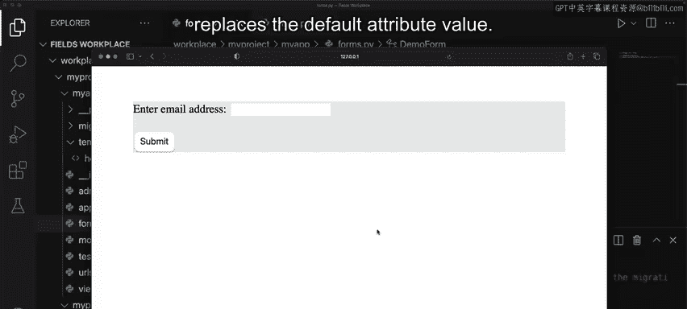

现在，让我们看一个使用`DateField`的例子。假设你想让顾客为Little Lemon餐厅输入预订日期。

```python
reservation_date = forms.DateField(widget=forms.NumberInput(attrs={'type': 'date'}))
```

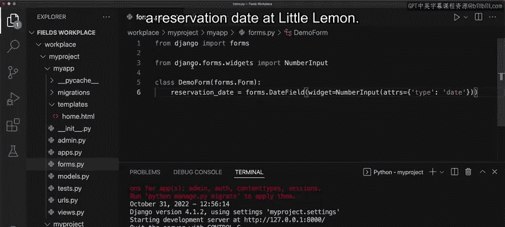

保存并刷新页面，会出现一个日期字段。点击它可以打开日历并选择特定日期。

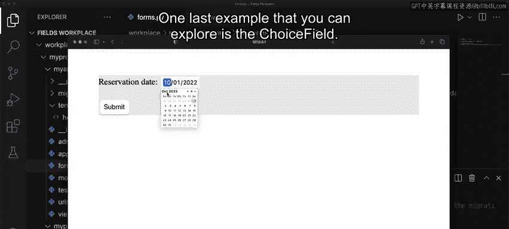

最后一个例子是`ChoiceField`。这个例子使用一个常量作为参数传递给选择字段，该常量中的值允许顾客选择他们在Little Lemon最喜欢的菜品。

```python
FAVORITE_DISH_CHOICES = [
    ('pasta', '意大利面'),
    ('salad', '沙拉'),
    ('soup', '汤'),
]
favorite_dish = forms.ChoiceField(choices=FAVORITE_DISH_CHOICES)
```

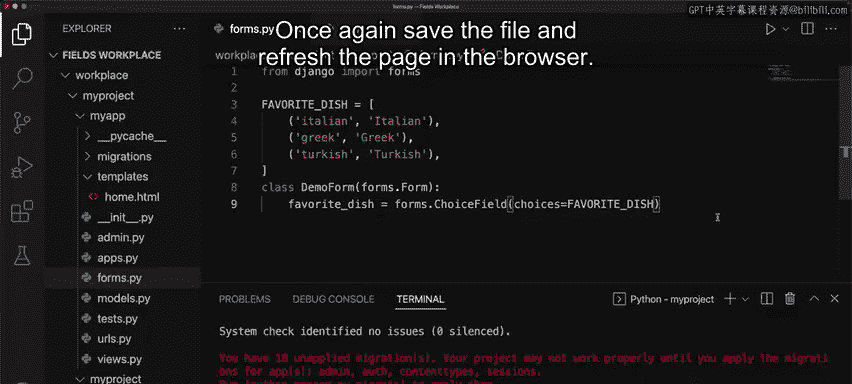

保存并在浏览器中刷新页面，你会看到一个下拉菜单供用户选择。然而，如果你希望同时显示所有三个选项，可以通过使用另一个小部件选项`RadioSelect`来实现。

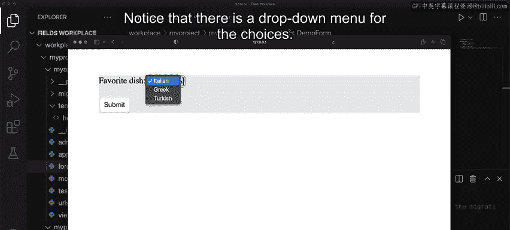

```python
favorite_dish = forms.ChoiceField(choices=FAVORITE_DISH_CHOICES, widget=forms.RadioSelect)
```

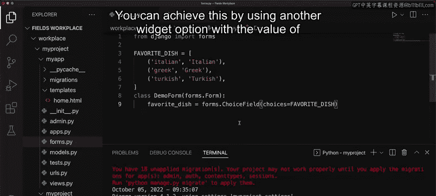

保存并刷新后，选项将以单选按钮的形式呈现，用户可以直观地选择。

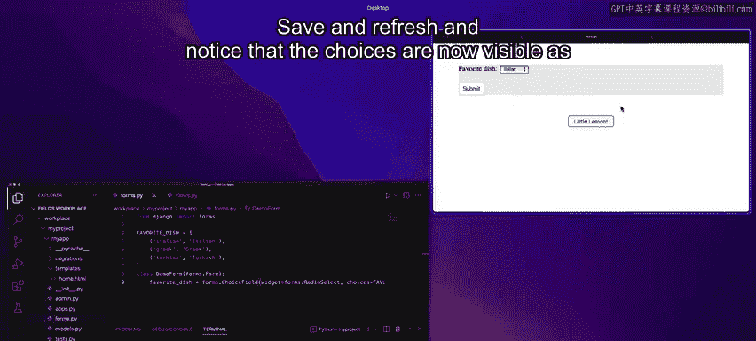

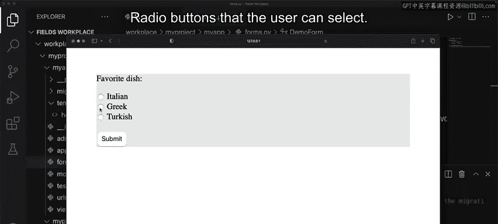

## 总结

本节课中我们一起学习了如何在Django中使用表单字段来存储正确的数据类型。我们介绍了多种字段类型（如`CharField`、`EmailField`等）以及用于定制字段的核心参数（如`label`、`required`）。我们还通过代码示例实践了如何改变字段的小部件（如将输入框改为文本区域或单选按钮）以优化用户体验。

需要强调的是，这些示例仅展示了Django中可用表单字段和参数的一部分。建议你查阅Django官方文档以了解所有可用选项，这将帮助你创建出更强大、更符合需求的表单。