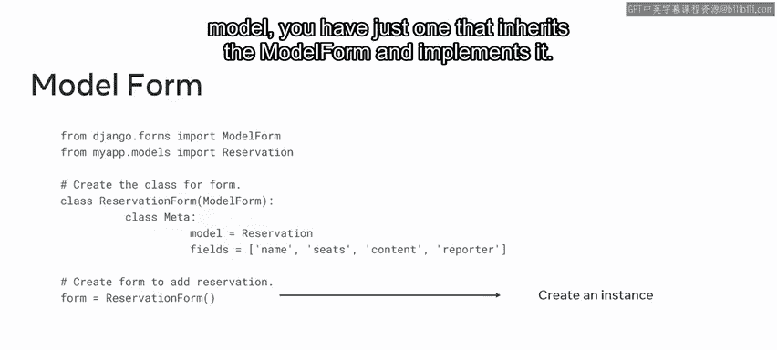
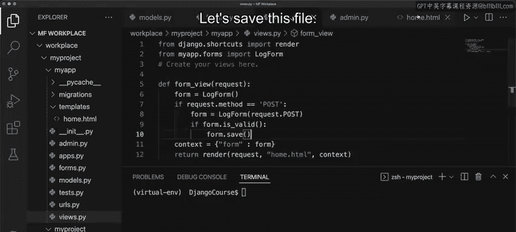
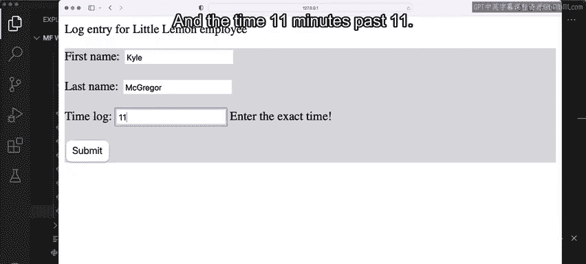
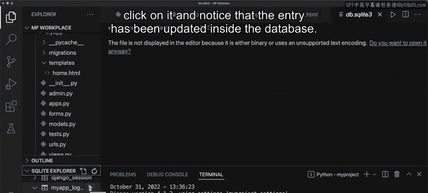
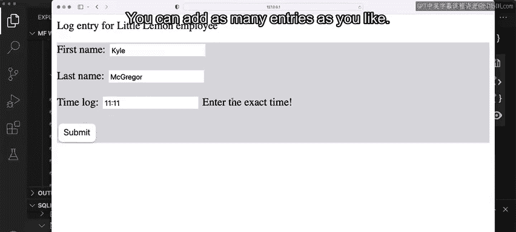
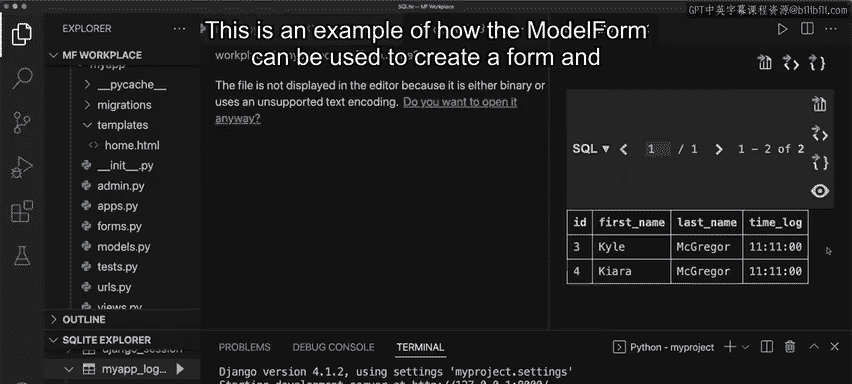

# 后端开发：P33：模型表单 📝

在本节课中，我们将要学习如何使用Django的模型表单（Model Form）。模型表单提供了一种高效的方式，将表单中接收到的数据直接保存到数据库中，从而将模型和表单的功能结合在一起。

到目前为止，在课程中你已经学习了如何使用Django的类实现来创建模型和表单。但是，如果你想将它们结合使用，将表单中输入的数据保存到数据库中，该怎么办呢？Django通过模型表单提供了一种非常高效的方法，它可以将接收到的数据作为响应直接保存到数据库。

## 模型表单简介

上一节我们介绍了独立的模型和表单。本节中我们来看看如何将它们结合。创建模型表单的过程与创建模型和表单类似。就像模型和表单一样，Django提供了另一个名为`ModelForm`的辅助类，以帮助更轻松地实现。

让我们举个例子。假设你想为“小乐餐厅”创建一个预订表单。

## 创建模型表单

以下是创建模型表单的基本步骤：

1.  **导入模型**：首先，导入你想要与表单绑定的模型。
2.  **定义表单类**：然后，使用`Meta`类为其添加实现细节。
3.  **实例化表单**：最后，创建该表单的一个实例。

请注意，与为表单和模型分别创建单独的类不同，你只需要创建一个继承自`ModelForm`并实现它的类。由于这个实现涉及将表单数据作为响应发送回来，你还需要在视图内部添加一些关于`POST`方法的实现细节。

## 实现步骤详解

现在，让我们详细看看如何实现这一点。



之前，你学习了可以使用Django的Form API来生成静态表单。作为提醒，请注意`forms.py`文件中的代码，以及它如何用于在浏览器中渲染表单。

基于已有的项目，这次我们来修改表单以使用模型表单。

### 1. 准备模型

首先，为了简化，移除`forms.py`中表单的字段属性。由于这是一个模型表单，将内容复制并粘贴到`models.py`文件中。

接下来，你需要重新配置所有细节，使其与模型的配置代码匹配。注意类名如何从`LogForm`更改为`Logger`，这是模型的名称。

**代码示例：`models.py`**
```python
from django.db import models

class Logger(models.Model):
    name = models.CharField(max_length=100)
    time = models.TimeField()
    # ... 其他字段定义
```

### 2. 创建模型表单类

然后，再次转到`forms.py`，删除现有内容，并根据已有的模型创建模型表单。

首先，使用`from .models import Logger`导入模型（`Logger`是我的模型名称）。接着，输入`class LogForm`，这是模型表单的名称。这次，在括号内传入`ModelForm`。

接下来，添加`class Meta`，后跟模型名称`Logger`，以及另一个名为`fields`的属性。与其分配单个字段，不如直接输入值`‘__all__’`，这将导入该特定模型中的所有字段。

**代码示例：`forms.py`**
```python
from django.forms import ModelForm
from .models import Logger

class LogForm(ModelForm):
    class Meta:
        model = Logger
        fields = ‘__all__’
```

保存此文件。

### 3. 注册模型到管理后台

接下来，你必须确保为此模型注册到管理后台。转到`admin.py`并更新详细信息。

**代码示例：`admin.py`**
```python
from django.contrib import admin
from .models import Logger

admin.site.register(Logger)
```

### 4. 更新视图以处理表单数据

接下来，切换到`views.py`文件。进入视图后，你会注意到已经有一些基本的配置可以帮助渲染表单。

如果你还记得，表单对象（这次是模型表单）被传递到一个上下文字典中，然后该字典被传递到`render`函数中。

现在，你必须添加一些代码来帮助接收表单数据并将其发送到模型数据库。



因此，让我们添加一个条件语句，例如`if request.method == ‘POST’`。接着，添加`form = LogForm(request.POST)`。这段代码的作用是使用请求对象中的内容更新表单对象。

接下来，检查表单是否有效，如果有效，则使用`save()`方法保存表单。



**代码示例：`views.py`**
```python
from django.shortcuts import render
from .forms import LogForm

def form_view(request):
    if request.method == ‘POST’:
        form = LogForm(request.POST)
        if form.is_valid():
            form.save() # 将数据保存到数据库
    else:
        form = LogForm()
    return render(request, ‘your_template.html’, {‘form’: form})
```

保存此文件。在表单模板方面，你已经拥有了所需的一切。

## 运行与测试



运行迁移后，启动服务器。再次转到浏览器并刷新页面。输入姓名“Kyle McGreor”和时间“11:11”。

一旦你按下提交按钮，请注意控制台上记录了`POST`方法。在左侧面板中，你可以转到数据库，右键单击它，然后单击“打开数据”。在SQLite浏览器中，展开后，单击`myapp_logger`（这是从模型创建的表的名称）。单击它，你会注意到条目已更新到数据库中。



你可以添加任意数量的条目，每次条目都会被添加到数据库中。



## 总结

本节课中我们一起学习了如何创建和使用Django模型表单。这是一个关于如何使用模型表单创建表单并将表单数据保存到相应数据库表的示例。通过继承`ModelForm`类并在`Meta`类中指定关联的模型和字段，我们可以快速构建出与数据库模型紧密集成的表单，并通过视图中的简单逻辑处理数据验证和保存，极大地提高了开发效率。干得不错！