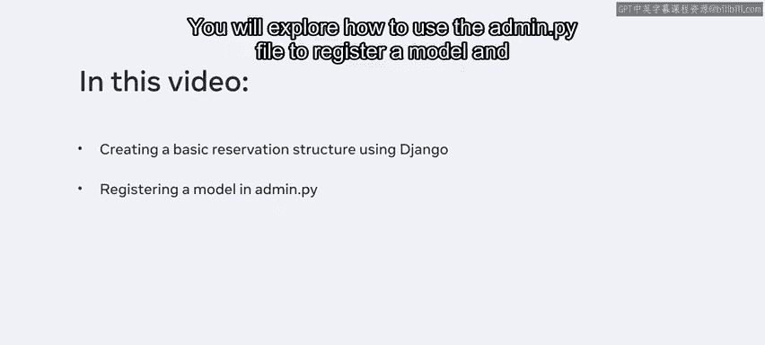
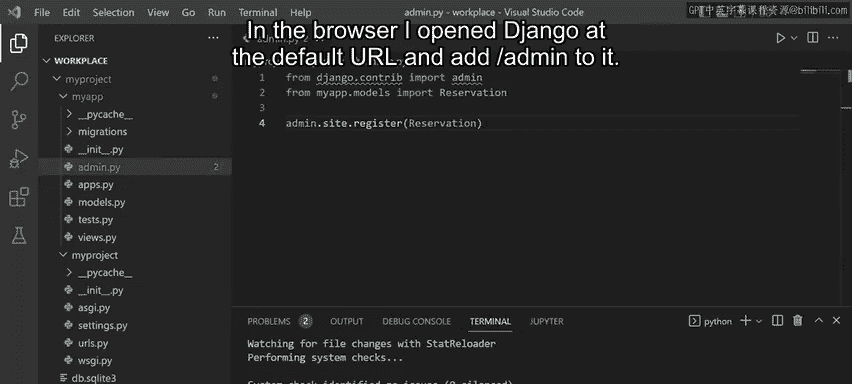
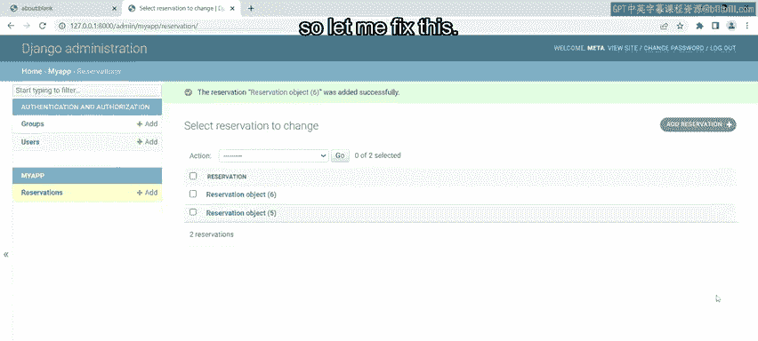
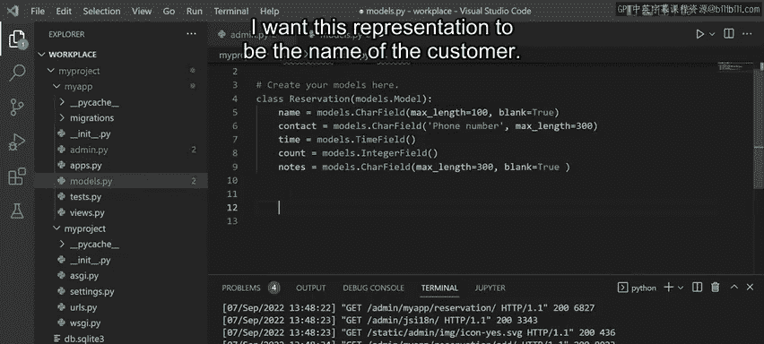
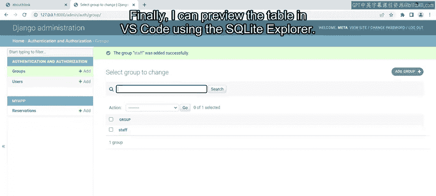
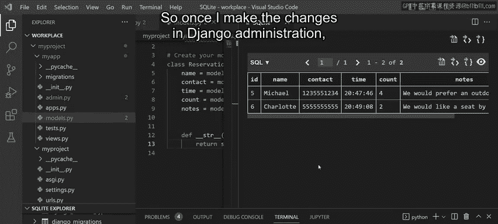
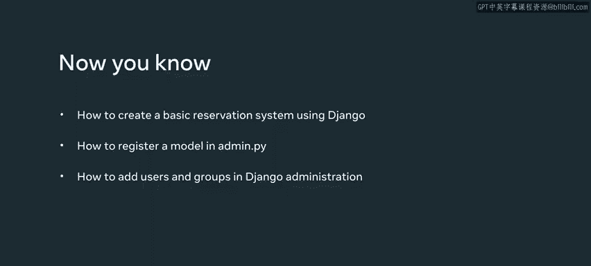

# Meta《后端开发（Django／APIs／全栈／毕业项目／面试）｜Meta Back-End Developer》中英字幕 - P35：34_添加组和用户.zh_en - GPT中英字幕课程资源 - BV1SZ421y7Fv

In this video， you will learn how to create a basic reservation system for the front desk of little lemon。

You will explore how to use the admin。pi file to register a model and add users and groups using Django administration。

Employees at Little lemonmon have been manually entering reservation details on a sheet， however。

 they want a more efficient way to do it。First， let me open the Model that P file。

 which contains a model and notice it's already populated with some code。

It contains a reservation class with five attributes。

 the attributes consist of the name of the customer。

 their contact details and the time of their arrival。

The final two attributes will be to count the number of guests and for some additional notes。Next。

 I need to open the Setting tab high file and ensure that the app is added to the installed apps list。

Everything looks good， so I just need to make the migrations and I'm ready to create the reservation system。

The first thing I need to do is to create a super user， I do this using the command Python， manage。

t Pi create super user。I enter a username such as Me and again enter an email address such as admin@LittleLmon。

com。I will use a weak password for this demonstration。

 but it's important to know that you should always use a strong password in production。

Notice that Django sends a prompt for password validation。

 I type Y and the super user is created successfully。

One final thing I need to do before running the server is register this super user。Okay。

 so now I'm ready to work in the admin。pi file。First。

 I import the reservation model using the import statement。On a new line， I type admin。sight。

register and inside the parentheses the name of the table reservation。

Now I can save this file and run the server。In the browser。

 I open Django at the default URL and add forward slash admin to it。

I press Enter and notice that a new page loads with a login form containing username and password fields。

So I enter the credentials I set up earlier and click on the login button。

The default Django administration page loads containing two sections， site administration and my app。

In site administration， notice there are links for groups and users。Then in the MyApp section。

 notice a link for the reservations table I created earlier。If I click the link。

 notice that there are no reservations added and this means that the table is empty。

So let me first create some reservations， I click on the Add reservationserv button and now an add reservation form displays。

I enter some details such as name and phone number。For the time input。

 I can click on the word now to get the current time and then modify its format。

I will set the reservation count to four people。And finally。

 I will add a note such as we would prefer an outdoor table。 I want to add another reservation。

 so I click on the save and add another button。 noticeice that it success message displays。

 and the form has been reset。 So let me add another reservation quickly。 Now， I add the name。

 Charlotte and a phone number in time。I will set the reservation count to two people and for the notes I will type a message like we would like a seat by the window。

Okay， so I'm finished with adding the data and I can just click on the save button。Once I save。

 notice that two entries have been created， which are displayed as reservation objects。However。

 this does not display much information about the reservations， so let me fix this。

Back in the Modelspi file， I can use the STR method to override the default string representation of the object and define my own。

I want this representation to be the name of the customer。

So using their return statement， I type self。t name。

Which will display the value stored in the name attribute of the object。

I save this file and then go back to the browser and refresh the web page。

Notice that the name of the reservation objects have now been renamed according to the customer。

 If I click on the customer name， the web form will load where I can edit the details if I want to。

 There are also options to delete the object and explore the version history。

Now let me navigate to the app。Notice I have options to add a new table or change the current one。

 Okay， now let's explore the users and groups of Jgo administration。 I click on the home link。

And first， let's explore users。Notice that there is just one user， which I added earlier。

 I can add another user by clicking on the add user button。

I type Little Li staff and the username input and add a password。

Notice that I I try and add a week password， Django will not let me。

So let me add a password that's a bit stronger。I click the save button and notice that the user has been added。

Once created， I can add personal info for the user such as first name， last name， and email address。

In the permission section， I assign permissions such as active staff and super user。

Recall that users with the permission of staff can access the admin page。

 it's also possible to add users to groups， but it's beyond the scope of this video。

You will learn how to do this later。I can also set some permissions， for example。

 I select that this user can only view and change the log entry。To the right。

 notice that these are the added user permissions Finally。

 details for the last login and date joined are displayed in the important date section。

Let me save this and once I go to the users page again， notice that the staff。

 little lemonmon user with the name of Jean was added。

I can filter users according to super user status， so if I select this option。

 notice that only the meta super user is displayed。

I can also create groups by selecting the groups link and clicking on the Add group button。

On the a group page， I can assign the name of the group such as staff。

Then I can their missions for the staff member and save them。

And this allows me to configure which little lemon staff can access the admin panel and make the reservations。

Finally， I can preview the table and VS code using the SQL light Explorer。

If I click on my app then reservations and then show table。

Notice that these entries are updated in the table。

 so once I make the changes in Jjango administration， they're reflected in the table。

In this video you learned how to create a basic reservation system for the front desk of little lemon。

 you explored how to use the admin。 P file to register a model and add users and groups using Dgo administration。

