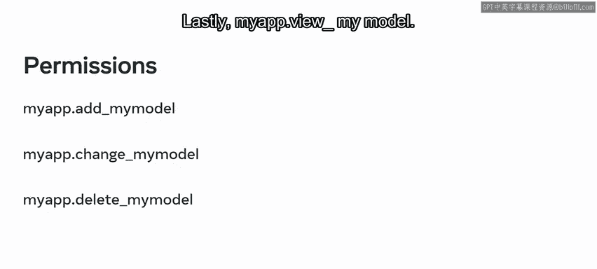
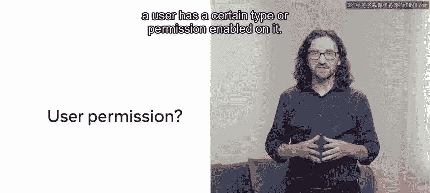
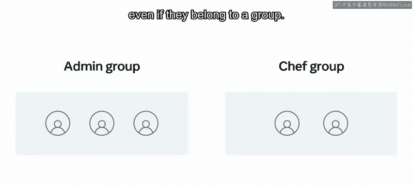

# Django后端开发：P36：用户与模型权限 🔐

在本节课中，我们将要学习Django框架中的用户与模型权限系统。权限是Web应用控制用户能执行哪些操作的核心机制，理解它对于构建安全的应用程序至关重要。

## 用户分类与权限基础

在大多数应用中，用户被分配了不同的角色，这些角色允许他们执行特定的操作。为了启用这些操作，用户需要被授予相关的权限。

设想以下场景：当你访问一家餐厅时，你不被允许进入厨房。然而，如果你是餐厅员工，你则被允许进入厨房。Web应用程序有一个类似的概念，用于控制哪些用户被允许执行哪些操作，这被称为“权限”。

Django框架内置了一个处理权限的系统。这个认证系统集成了身份验证和授权功能，便于使用。为了让用户执行某个特定操作，他们需要被授予相关的权限。

在深入探讨权限之前，需要明确一点：在Django中，用户可以分为三种类型，即超级用户、员工用户和普通用户。与Django的其他组件类似，Django中的用户也是Python对象。特定的用户类型由用户对象内部设置的特殊属性来定义。

以下是关于这三种分类的详细说明：

*   **超级用户**：是系统的顶级用户或管理员。这类用户拥有添加、更改或删除其他用户的权限，并且可以对项目中的所有数据执行操作。
*   **员工用户**：被允许访问Django的管理员界面。但是，员工用户不会自动获得在Django管理员中创建、读取、更新和删除数据的权限，这些权限必须被明确授予。请注意，超级用户默认就是员工用户。
*   **普通用户**：默认情况下，普通用户无权使用管理站点。用户默认被标记为“活跃”状态。如果认证失败或因某些原因被禁止，用户可能被标记为“非活跃”。

## 创建用户与设置权限

虽然你可以通过管理员界面创建用户，但也可以通过Django Shell来完成。权限机制由Django的`django.contrib.auth`应用处理。

你可以使用`create_user`函数来创建一个新的用户对象。创建用户后，你可以授予用户某种状态，例如使其成为员工。要授予员工状态，需将用户的`is_staff`属性设置为`True`。

那么，如何创建超级用户呢？你可以在Django Shell中直接使用命令。系统会提示你为这个超级用户分配密码，随后进行认证。之后，前往管理员界面查看用户列表，新用户就会出现在列表中。请记住，超级用户拥有系统中的所有权限，无论是自定义权限还是Django自动创建的权限。

## 模型权限

在多个地方都可以启用特定的权限设置，例如针对特定的模型或对象。那么，如何在模型中设置权限呢？

当你在Django应用中创建模型时，Django会自动为该模型创建添加、更改、删除和查看的权限。权限的命名遵循“应用_操作_模型”的模式。其中，“应用”是Django应用的名称，“操作”是`add`、`change`、`delete`或`view`，“模型”是小写的模型名称。

假设在当前项目中创建了一个名为`my_app`的Django应用，并且其中声明了一个名为`MyModel`的模型。现在，你可以应用你新学到的知识了。这个模型的权限会是什么呢？

以下是该模型的权限列表：

*   `my_app.add_mymodel`
*   `my_app.change_mymodel`
*   `my_app.delete_mymodel`
*   `my_app.view_mymodel`

## 在代码中检查权限

在Python代码中，可以检查某个用户是否启用了特定类型的权限。为此，你可以使用`has_perm`函数，该函数返回`True`或`False`。

例如，如果请求用户没有适当的权限，你可以抛出一个`PermissionDenied`错误，而不是返回正常的HTTP响应。



```python
if not request.user.has_perm('my_app.view_mymodel'):
    from django.core.exceptions import PermissionDenied
    raise PermissionDenied
```



## 使用用户组管理权限

为每个用户单独分配权限是一项繁琐的任务，尤其是在用户数量庞大的情况下。幸运的是，Django提供了一个解决方案：你可以通过Django的“组”来管理用户集合的权限，这被证明非常有用。

那么，什么是组呢？在Django中，组是一个权限列表，可以分配给一个或多个用户。一个用户可以属于任意数量的组。回到餐厅的例子，你可能有一个“厨房员工”组和一个“服务员”组。

当你创建或修改用户时，只需选择所需的组，该组中列出的所有权限将自动分配给该用户。需要注意的是，即使用户属于某个组，你仍然可以手动为用户添加额外的权限。

## 在视图中强制执行权限

上一节我们介绍了如何通过组来批量管理权限，本节中我们来看看如何在视图函数中直接强制执行权限检查。为了在执行视图函数时强制执行权限，你可以使用`@permission_required`装饰器。

```python
from django.contrib.auth.decorators import permission_required



@permission_required('my_app.change_mymodel')
def my_view(request):
    # 只有拥有 'my_app.change_mymodel' 权限的用户才能执行此视图
    ...
```

## 总结

本节课中我们一起学习了Django中的用户与模型权限。你可以在管理员面板或Shell界面中创建用户时为其分配权限。使用“组”是为多个用户启用相似权限集合的一种便捷方式。最后，通过在视图函数上使用`@permission_required`装饰器，可以有效地在代码层面控制访问权限，从而构建更安全的Web应用。