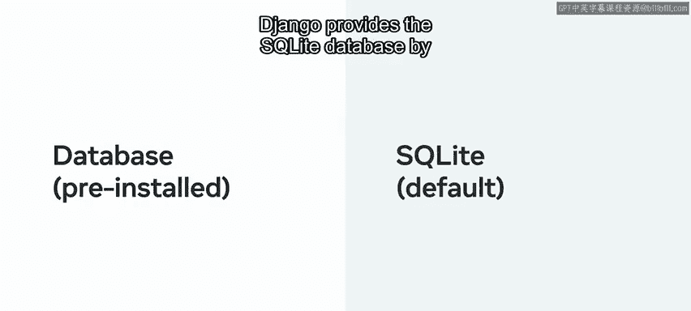
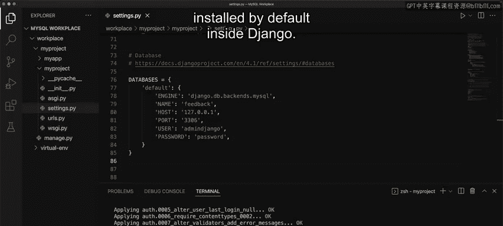

# Django后端开发：P39：设置MySQL连接 🗄️

在本节课中，我们将学习如何在Django项目中安装和配置MySQL数据库。你将了解MySQL的特点、安装步骤、数据库连接器的配置，以及如何将MySQL与Django的ORM（对象关系映射器）集成。

---

## 概述

Django因其开源特性和丰富的工具集而广受欢迎，这些工具支持轻松扩展和快速开发。MySQL是Django支持的众多数据库之一。数据库有助于存储来自不同来源的数据，这些数据可用于不同目的，例如为网页添加内容。Django开发框架内置了与不同数据库连接的支持。

之前的学习中，你了解到Django使用一种称为对象关系映射器（ORM）的技术。ORM促进了数据库与应用模型之间的数据映射，而无需编写任何SQL查询。MySQL是一个流行的数据库管理系统，可以与Django一起使用，尤其是在处理大量数据负载时。

---

## MySQL的特点回顾

在深入配置之前，让我们快速回顾一下MySQL的一些关键特性：

*   **开源且文档齐全**：MySQL是开源的，拥有完善的官方文档和社区支持。
*   **可靠且快速**：数据在内存中高效存储，确保了操作的可靠性和速度。
*   **可扩展性强**：能够处理从小型到海量的数据量。
*   **安全性高**：提供基于加密密码保护的灵活验证安全层。

---

## 准备工作：安装数据库

在开始使用模型之前，需要先安装一个数据库。Django默认提供SQLite数据库，无需预先安装。



然而，如果你想使用其他数据库（如MySQL），则必须单独安装并进行配置。


接下来，让我们探索在Django项目中安装和配置MySQL的具体步骤。

---

## 步骤一：安装MySQL

要开始将MySQL与Django结合使用，首先确保你的计算机上已安装MySQL。

根据操作系统和用途，你可以使用MySQL官网上提供的不同安装包。本视频中的示例基于Mac OS系统。对于其他操作系统，你可以在本课末尾的补充阅读材料中找到特定的命令。

对于Mac OS，你可以使用如HomeBrew这样的包管理器来管理安装。

首先，输入以下命令来安装MySQL：
```bash
brew install mysql
```
这个命令会安装MySQL数据库。

---

## 步骤二：访问MySQL并创建数据库

接下来，进入MySQL以访问数据库。请注意，使用Mac OS时有一些特定的命令。

现在，输入命令连接到MySQL服务器：
```bash
mysql -u root -p
```
其中，`-u` 指定用户名（这里是 `root`），`-p` 表示需要密码。

按回车键后，系统会提示你输入密码。请注意，此处输入的密码需要与MySQL数据库内为`root`用户设置的密码匹配。

进入MySQL命令行界面后，输入以下命令查看所有数据库：
```sql
SHOW DATABASES;
```
并以分号结束查询。这将生成你的MySQL服务器上所有数据库的列表。

例如，创建一个名为 `feedback` 的数据库。为此，输入命令：
```sql
CREATE DATABASE feedback;
```
现在，再次运行 `SHOW DATABASES;` 命令，你会发现列表中包含了刚刚创建的 `feedback` 数据库。

---

## 步骤三：为Django项目创建用户

下一步是为Django项目创建一个专用用户。运行以下命令：
```sql
CREATE USER 'admin_django'@'localhost' IDENTIFIED BY 'password';
```
这里的密码是单词 `password`。请注意，这个命令可能有其他变体，但这是其中一个简化版本。按回车执行。

接着，输入命令授予该用户对 `feedback` 数据库的权限：
```sql
GRANT ALL PRIVILEGES ON feedback.* TO 'admin_django'@'localhost';
```
最后的命令是刷新权限，使更改立即生效：
```sql
FLUSH PRIVILEGES;
```
至此，数据库已准备就绪。

---

## 步骤四：安装数据库连接器

为了使MySQL数据库能够与Django的ORM交互，需要安装一个数据库连接器。

在本示例中，我们将使用 `mysqlclient` 库。你也可以使用其他与Django兼容的Python 3数据库连接器库。

现在，退出MySQL命令行界面，输入以下命令安装 `mysqlclient`：
```bash
pip3 install mysqlclient
```
请注意，你可能需要安装额外的文件，以使这个特定的库在你的操作系统上正常工作。

---

## 步骤五：配置Django项目设置

一旦数据库和数据库连接器就位，接下来需要配置Django项目。进入你的项目文件夹，找到 `settings.py` 文件。Django将在这里引用数据库连接信息。

要使用MySQL，数据库配置需要遵循特定的格式。找到 `DATABASES` 配置部分，将其替换为MySQL的设置，并将数据库名称改为 `feedback`。

**重要提示**：在本例中，数据库名称是 `feedback`。请始终检查你想要连接到的数据库的实际名称。

配置示例如下：
```python
DATABASES = {
    'default': {
        'ENGINE': 'django.db.backends.mysql',
        'NAME': 'feedback',        # 你的数据库名
        'USER': 'admin_django',    # 你创建的用户名
        'PASSWORD': 'password',    # 对应用户的密码
        'HOST': 'localhost',
        'PORT': '3306',
    }
}
```
将用户替换为 `admin_django`，密码替换为 `password`。

---

## 步骤六：运行数据库迁移

在可以使用数据库之前，最后一步是运行迁移命令。让我们运行以下两个命令。

首先，创建迁移文件：
```bash
python3 manage.py makemigrations
```
按回车执行。

接着，应用这些迁移到数据库：
```bash
python3 manage.py migrate
```
请注意刚刚执行的迁移列表。然而，由于数据库内还没有任何条目，你对此的视图是有限的。

---

## 关于数据库选择的说明

在本课程的大部分内容中，即使没有使用MySQL数据库，了解Django默认安装的SQLite数据库之外还有其他可用替代方案也是有益的。



---


## 总结

本节课中，我们一起学习了如何在Django中设置MySQL数据库连接。我们回顾了MySQL的特点，逐步完成了从安装MySQL、创建数据库和用户、安装连接器，到配置Django项目设置并最终运行迁移的整个过程。掌握这些步骤使你能够在需要处理更重数据负载或特定数据库功能时，灵活地将Django项目与强大的MySQL数据库集成。