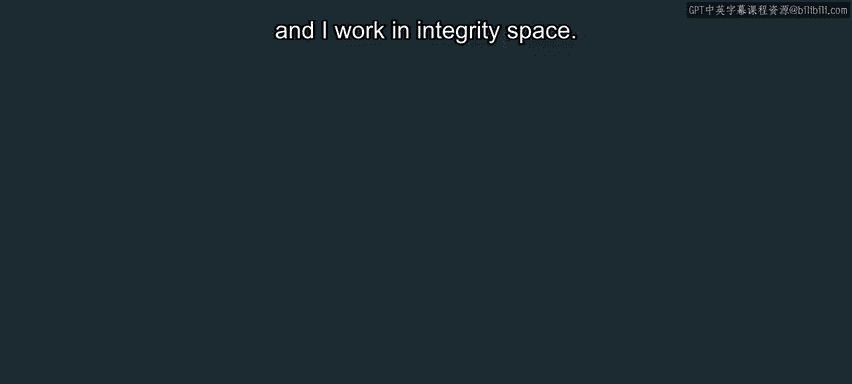
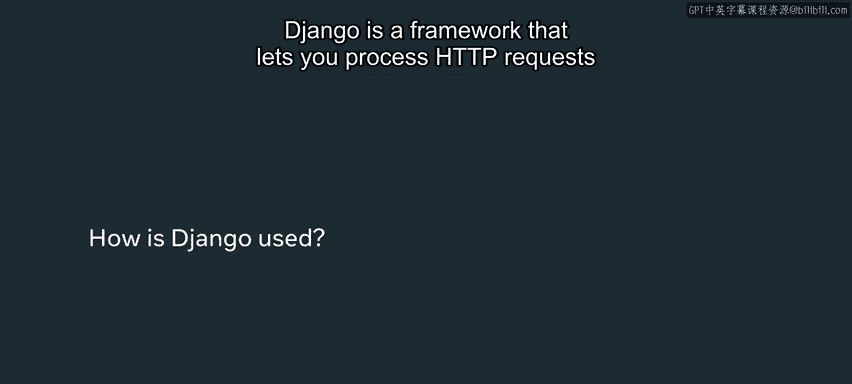
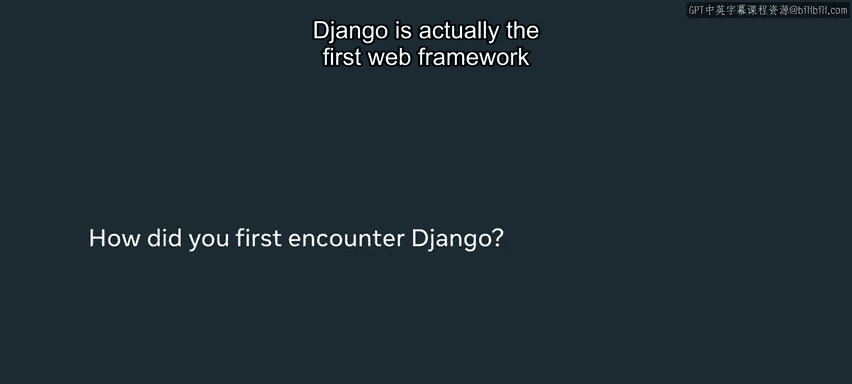
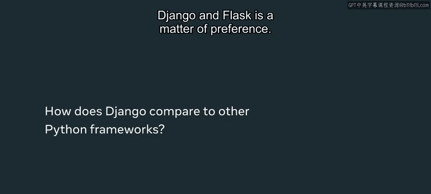
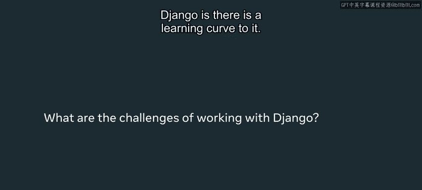
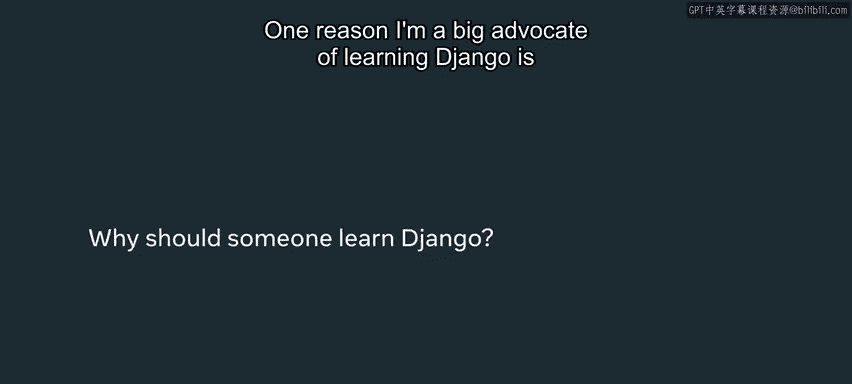
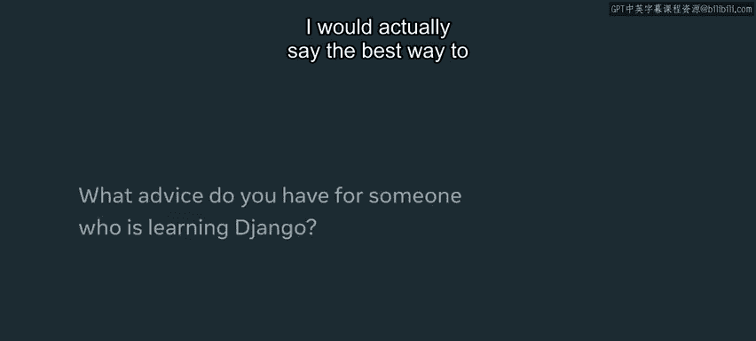

# 后端开发：P3：Django在现实世界中的应用 🚀

在本节课中，我们将探讨Django框架在现实世界中的实际应用，了解它为何成为最流行的Python Web框架，并比较它与其他框架的差异。

## Django简介与核心功能

Django是一个Web框架，它允许你处理来自最终用户的HTTP请求，并最终将内容返回给他们，例如一个HTML页面。Django驱动着用户请求数据或向我们发送数据、我们处理数据并返回更多数据的整个交互过程。





**核心交互流程**可以用以下伪代码表示：
```
用户请求 -> Django处理HTTP请求 -> 与数据库交互/处理业务逻辑 -> 返回HTML/数据 -> 用户接收
```

上一节我们介绍了Web开发的基本概念，本节中我们来看看Django如何具体实现这些功能。

## Django的优势与特点



Django是我个人学习的第一个Web框架。我在大学的黑客马拉松和本科研究项目中都使用过它。我使用它的原因是它非常轻量级且易于快速启动。

Django附带了许多工具，这些工具作为框架的一等特性已经内置其中。这意味着框架内部已经包含大量代码，用于执行诸如与数据库交互或处理HTTP请求等任务。



以下是Django内置的一些核心功能：
*   数据库ORM（对象关系映射）
*   用户认证系统
*   管理后台界面
*   URL路由分发器
*   模板引擎

## Django与Flask的对比

Django和Flask这类框架之间的区别某种程度上是偏好的问题。我会分析你的需求：你是否需要一个非常轻量级的框架，它只接收HTTP请求并返回内容，而不需要数据库管理等功能？如果是，我会选择像Flask这样的框架。

但如果你希望免费获得许多功能，例如，你正在尝试构建一个可能与数据库交互的网站，并且你希望非常快速地创建快速原型或最小可行产品（MVP），那么Django是一个绝佳的选择。

## 学习Django的挑战与价值

也许Django最大的挑战之一在于它存在学习曲线。它内置了许多不同的工具，需要你学习所有这些不同特性的含义。





我大力倡导学习Django的一个原因是，它能让你接触到我们所谓的**全栈开发**。这意味着你将学到很多关于如何与数据库交互、如何制作最终返回给用户的前端代码（即用户实际看到的内容），以及显然还有编写Web服务器代码的知识，这些代码将你的后端数据库和前端客户端这两个组件连接起来，Web服务器位于两者之间。这意味着你将全面了解整个软件开发周期是如何运作的。

## 掌握Django的最佳实践

实际上，我认为提高技能的最佳方法是**在实践中学习**。这就是为什么我大力支持进行个人项目，即使项目本身对任何人都不是超级有用。我自己也构建了许多无用的项目，仅仅是为了学习不同的框架。随着时间的推移，这实际上使我成为一名更强大的开发者。



我大力倡导在学习课程的同时进行编码实践。原因在于，在软件开发中，如果你被动地观看，知识往往不容易牢固掌握。因此，如果你进行互动式学习，例如学习本课程中的示例并尝试边学边构建，或者进行你自己的个人项目，我认为这将使你的学习更加牢固，同时也更加高效。

## 总结

本节课中我们一起学习了Django在现实世界中的应用场景、其核心优势、与Flask等轻量级框架的对比，以及学习Django带来的全栈开发视野。掌握Django需要克服一定的学习曲线，但通过动手实践和项目驱动学习，你可以有效地掌握这一强大工具，为成为全面的软件工程师打下坚实基础。