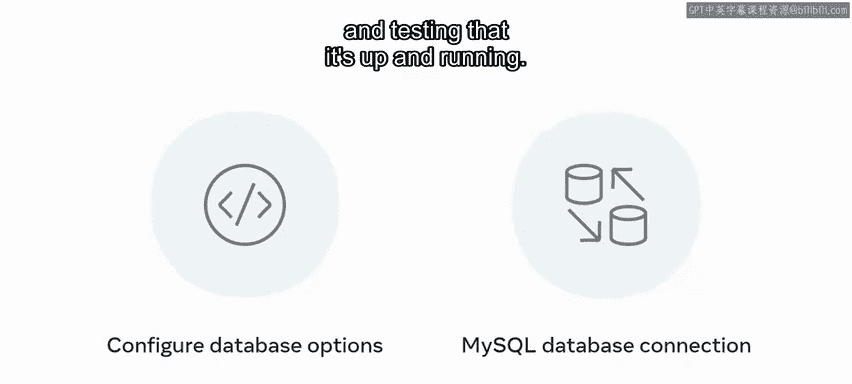

# Meta《后端开发（Django／APIs／全栈／毕业项目／面试）｜Meta Back-End Developer》中英字幕 - P40：39_模块总结：模型.zh_en - GPT中英字幕课程资源 - BV1SZ421y7Fv

Congratulations you've reached the end of this module on models in this module you've learned to create models。

 apply migrations to appropriate use cases， using best practice principles。

 and learned to use the Queery set API to interact with the database。Next。

 you discovered how to create a form and use the form API to bind data to objects。

You learned how to use the Django admin panel to add and control the permissions of users and groups。

 and finally， unpack how to set up a MySQL database for your Django app。

It's now time to recap the key points and the skills you gained。

 You began the module with models and migrations here， you explored models， fields。

 attributes and keys。You are now able to describe the relationship and similarities between models and databases with tables。

And demonstrate how to create models in D Jjangle， focusing on the different attributes。Furthermore。

 you can now summarize the concept of migrations and how they are beneficial in web applications through best practices dealing with issues and rolling back。

You can discuss how migrations can save a lot of time for development teams by separating the SQL away from the coding。

There is no need to create SQL queries directly against the database R where to store these files so that other developers can run them Next you explored objectject relational mapping RORM and how Django uses it to create SQL queries against the database。

You also discovered the Queery set API and how developers use it to save and retrieve data in the database。

😊，Following models and migrations， you learned about models and forms。

 you were introduced to Django's rich framework for forms and how to manipulate form data to extract and send information。

You are now able to showcase setting up a model with different data types and how they are mapped from a standard body request。

You also exercise creating forms by using the form API and some of its in build data types Next you focused on admin。

This section introduced you to the Django admin and some of its core features you can demonstrate how to create and manage users and groups directly from the admin panel to provide access to the web applications。

You also learned how permissions work at the view， model and controller levels。

 and how they can be added using the Django admin View。Lastly。

 you can set up users and add or revoke permissions。Finally， you explored database configuration。

You are now able to showcase the different database options that are available in dnangle with Mysql light and MysqLl as the main focus。

 you practice the steps needed to set up the database configuration an SQLite database for local development。

 Then you learned about the configuration options for setting up a Mysql database and exercised setting up a MysqL database connection and testing that it's up and running。

😊。

You're now familiar with models。More specifically， you can create models and apply migrations。

You can also use the queryery set API to interact with the database and create forms by leveraging the form API to bind data to objects you familiarized yourself with the Django admin panel to add and control the permissions of users and groups。

Finally， you concluded by setting up a MySQL database for your Jngo app。😊，Well done。

You're making excellent progress through your Django development。

