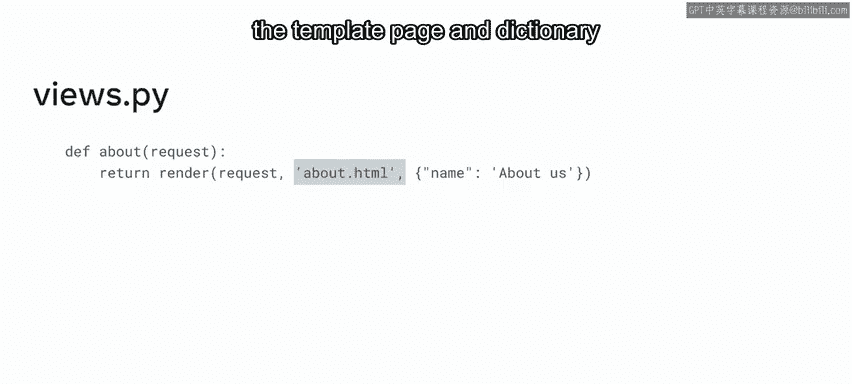
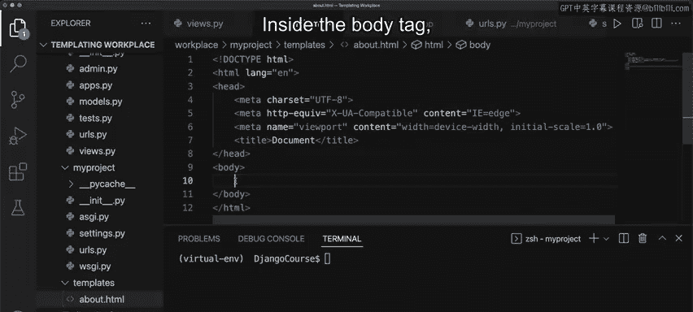
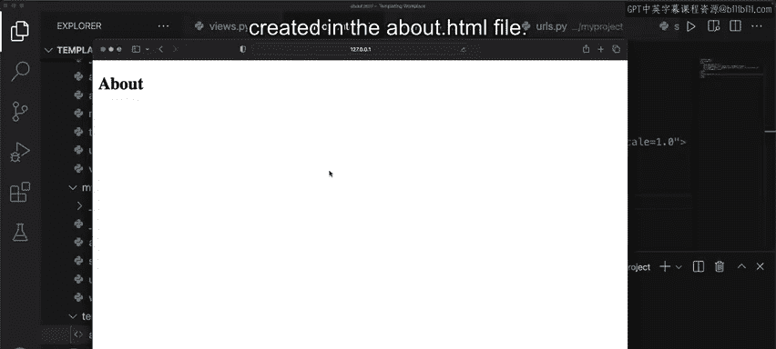
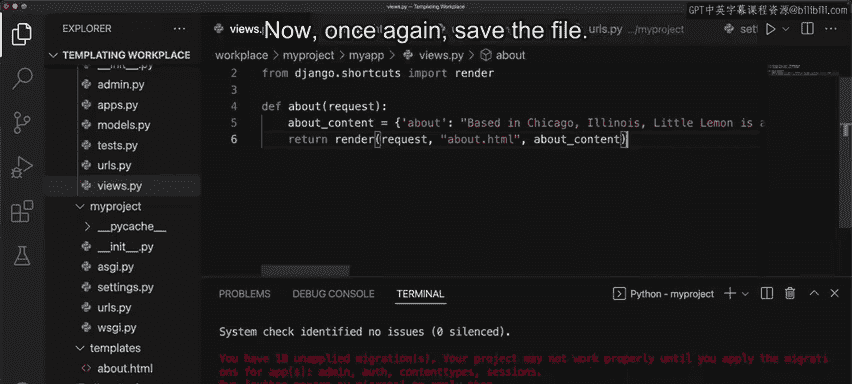
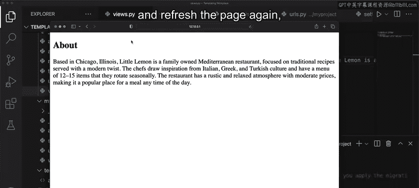
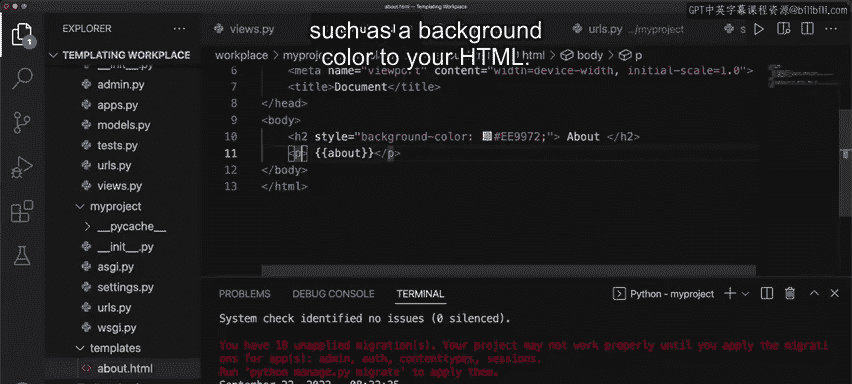
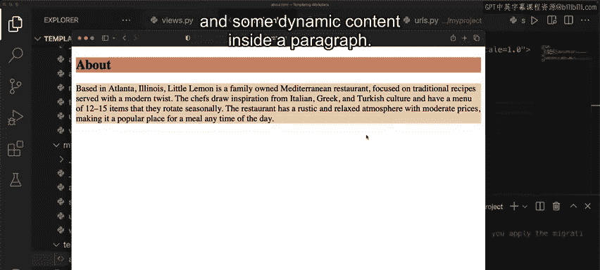

# Meta《后端开发（Django／APIs／全栈／毕业项目／面试）｜Meta Back-End Developer》中英字幕 - P42：41_创建模板.zh_en - GPT中英字幕课程资源 - BV1SZ421y7Fv

Web page design can become time consuming， especially if you work with dynamic web pages when building a web application in Django templates provide developers with many benefits。

 one of the main benefits is that they promote code reusability and render dynamic content。

In this video you will learn how to create a template using Django templates and the Django template language。

 you will explore the steps to render static HTML elements that display dynamic content from a Python dictionary。

As you have learned previously， in Django， developers use templates to display dynamic data。

Let us now explore this in a little more detail。The view functions retrieve the data from some data structure。

 our database connected to our application。Developers use templates and the Dngo template language to display this dynamic data。

Templates contain static HTML and dynamic data rendered by the render function。

The render function takes three parameters， request， path， and a dictionary of variables。

Let's explore this in a little more detail now。😊，Request represents the initial HTTP request object。

Path represents the relative path of the HTML file to the template directory or folder。

 and the dictionary contains the variables as keys that the template can use to display dynamic data。

Okay， so now you know about the structure of the render function。

 let's explore how it returns data to the user。The render function returns a string as part of the HTTP response object that the webp page renders。

Since this process is created inherently with Python code。

 there is flexibility to define and pass variables to the template。😊。

To create a template inside Django， you can take the following steps。First。

 you define a view that returns the render function Next。

 update the URL configurations inside URL patterns。

 then ensure that you configure the settings for templates and installed apps。Next。

 create a HTML page containing static HTML and dynamic data using the Django template language Finally。

 make sure you pass the name of the template page and dictionary as arguments inside the render function。

Now that you know about the process of rendering a template。

 let's open VS code and explore the steps further。😊。

In this example， let me demonstrate how to create a template that returns HTML content using a dictionary for the About page of little Le。

😊，To begin， create a view inside the views。pi file。For this example。

 let's create an about page for the little Lemon website。😊。

The first step is to create a view function called about。And pass the request object inside it。Next。

 return a render function and pass the request object followed by the HTML page namedabout do HTMLtm。

 which will display the content。The next step is to ensure that the URL configuration files are updated in the URL's dotpi files at both the project and app levels。

Okay， so the code looks good now go to the settings。

pifi and add templates inside the DirRS key then you need to make sure that the app is registered Next you need to create the about dot HTML page so go to the main project directory and create a folder called templates。

Now， right click on the templatelates folder and create a file named about dot HTML。

Notice that within the About dot HTML file by typing an exclamation mark and selecting the first option。

 VS code will automatically create the code for a basic HTML page。Inside the body tag。

 add the heading element H2 with the text about。

Save the file and run the server by typing Python 3 manageage。pi run serverver and press enter。

 launch the browser at the local Ho URL and add about at the end。

Notice that the template is rendered from the content you created in the About dot HTML file。Okay。

 so now the template is working， let's use it to create some dynamic content。

To do this， first go to the views。pi file and create a dictionary called About content。Next。

 create a key value pair named about and colon， followed by a string containing additional content about the Little Le website。

Now， save the file。The next step is to pass the dictionary inside the render function to give the template access to the dictionary object。

😊，Now， once again， save the file。

Next， go back to the About Dart HTML file。Then add a paragraph tag with the keyword about inside double curly braces。

This is the key insides the dictionary object。😊，Now save the file， go to the browser again。

 and refresh the page。Notice that the page updates and the additional content is displayed。Now。

 if you modify content inside the dictionary， save it and refresh the page again。

 notice that the content is automatically updated。

Finally， you can add some styling such as a background color to your HTML。

Save the file and refresh the webp page， the page now reflects the styling updates。

This example demonstrates how to create a HTML template in Django with some static content inside a heading and some dynamic content inside a paragraph。

In this video， you learned how to create a template using Django templates and the Django template language。

