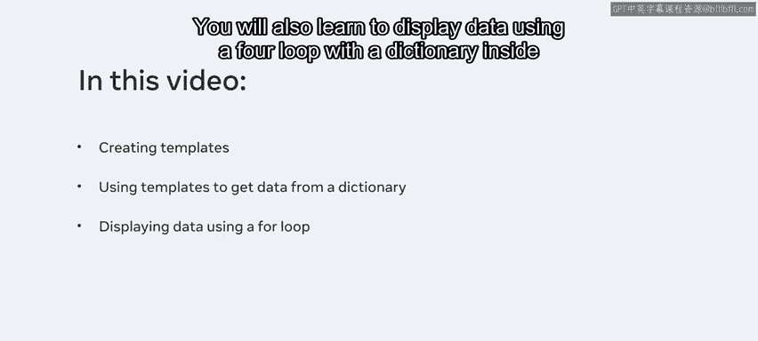
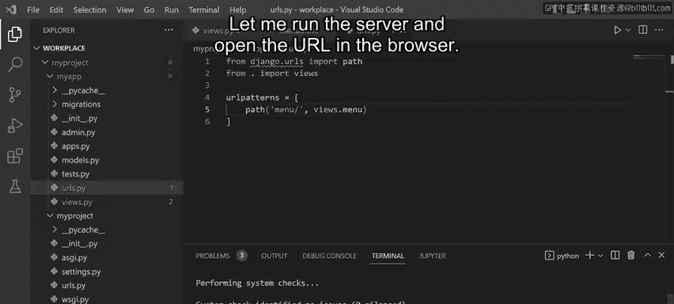
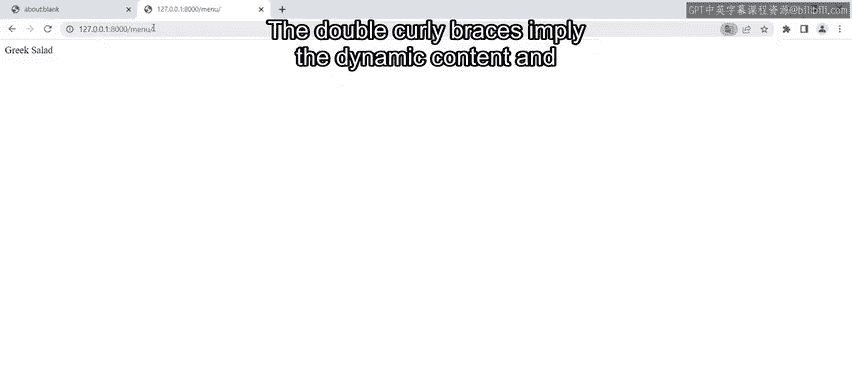
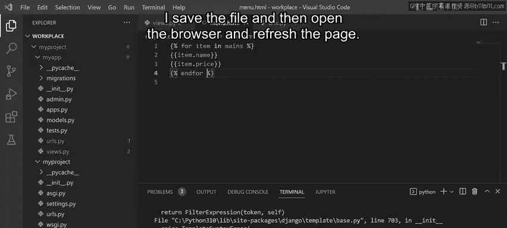
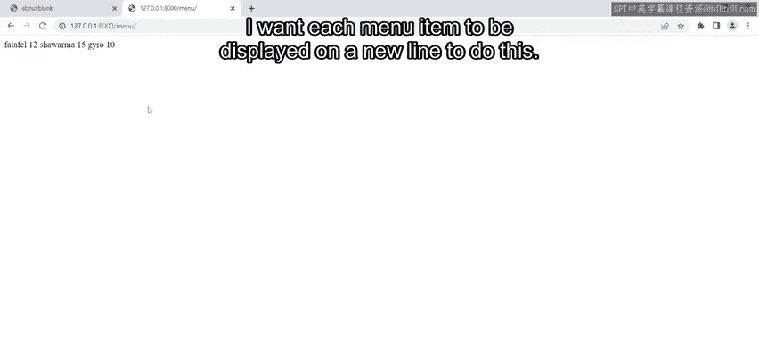
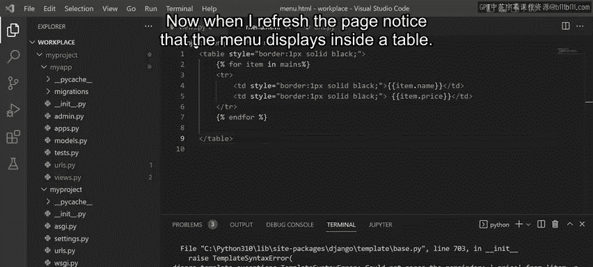
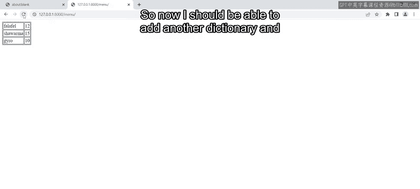
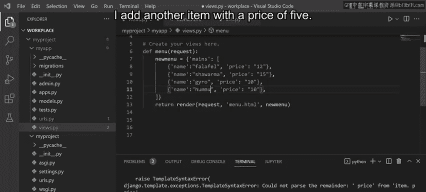
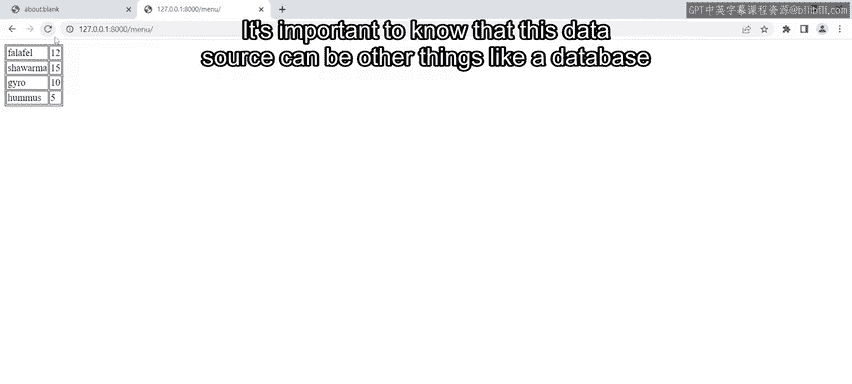
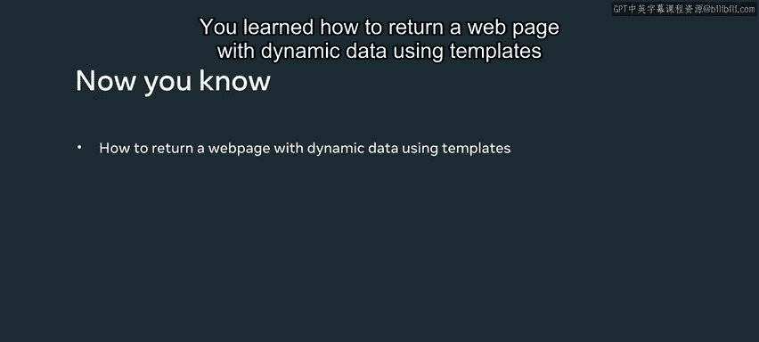

# Django后端开发：P44：Django中的动态模板 🧩

在本节课中，我们将学习如何使用Django模板来返回包含动态数据的网页，具体以展示“小柠檬”餐厅的菜单为例。你将探索如何创建模板，如何从字典中获取数据并将其显示在网页上，以及如何在模板内部使用`for`循环来遍历字典并展示数据。



## 概述

上一节我们介绍了Django视图和HTTP响应的基础。本节中，我们来看看如何利用模板系统，将后端数据动态地渲染到HTML页面上，从而创建更丰富、可交互的网页内容。

## 创建视图与数据字典

首先，打开应用的`views.py`文件。接下来，创建一个视图函数，它接收`request`对象作为参数。

在函数内部，通过添加花括号`{}`来创建一个字典。然后，定义一个键`name`并为其赋值`Greek salad`。现在，需要将这个字典赋值给一个变量，我们将其命名为`menu_item`。

至此，字典的代码已完成。但这次，我们不返回`HttpResponse`，而是使用`render`函数。在`render`函数的括号内，传递三个参数：首先是`request`对象，然后是HTML文件的名称，最后是包含字典的变量。

可以这样理解：Python字典类似于Web开发中常用的JSON对象。我的代码设置为与`menu.html`模板文件配合工作，因此现在需要创建这个文件。

以下是创建字典和调用`render`函数的代码示例：
```python
def menu(request):
    menu_item = {'name': 'Greek salad'}
    return render(request, 'menu.html', {'menu': menu_item})
```

## 创建与配置模板

回到项目目录，创建一个名为`templates`的新文件夹，并在其中创建一个名为`menu.html`的新文件。打开此文件，编写代码以动态显示字典对象。

为此，首先创建双花括号`{{ }}`，并在其中传递字典的键，在本例中是`name`。然后保存文件。



为确保Django能找到`menu.html`文件，需要打开`settings.py`文件，在`TEMPLATES`列表的`DIRS`选项中添加模板文件夹的名称。同时，需要确保已在`INSTALLED_APPS`列表中注册了该应用。

最后一步是打开`urls.py`文件，在`urlpatterns`列表中添加`path`函数。然后传递想要映射的URL，例如输入`menu/`，以及要调用的视图函数名称，即`views.menu`。

以下是URL配置的示例：
```python
from django.urls import path
from . import views

urlpatterns = [
    path('menu/', views.menu, name='menu'),
]
```

## 运行服务器与查看结果

代码准备就绪后，运行服务器并在浏览器中打开对应的URL。导航到菜单页面，你会注意到字典中存储的值显示在了浏览器中。



需要知道的是，字典中保存的值就是将在网页上显示的内容。这是通过在HTML模板中传递字典键来在代码中实现的逻辑。这是一个向网页返回动态内容的例子。如果字典中的值更新，网页上显示的值也会相应更新，并且可以根据需要添加任意多的键值对。

你甚至可以将这些内容包裹在HTML标签中，稍后会学到更多相关内容。至此，你已经知道Django开发者可以使用模板使静态页面动态化。页面布局可以用HTML构建，动态数据则放置在双花括号`{{ }}`内。双花括号意味着动态内容，这被称为Django模板语言。

## 使用复杂数据结构与循环

现在让我们进一步扩展这个概念。回到`views.py`文件，我将用一个包含更多值的对象替换之前的字典。

这个结构稍微复杂一些：注意`mains`是键，而值是一个字典列表。每个字典内部有两个键值对，键分别是`name`和`price`。注意，我已将此对象赋值给一个名为`new_menu`的变量，该变量被传递到`render`函数中。

为了在浏览器中显示这些内容，我必须更新`menu.html`文件中的代码和逻辑。



在`menu.html`内部，移除现有的代码。接下来，在一组带有双百分号``的单花括号内，我需要使用`for`循环遍历字典中的每个项。

以下是模板中`for`循环的示例：
```html

  {{ item.name }} {{ item.price }}

```



## 美化输出：结合HTML



虽然代码可以工作，但我希望每个菜单项都显示在新的一行。为此，可以添加一些HTML。回到`menu.html`，我添加了一些带有内联样式的HTML表格标签。





现在刷新页面，会注意到菜单显示在一个表格中。这样，我应该能够添加另一个字典，并且网页上的内容会动态更新。

回到`views.py`文件，我添加另一个项目`hummus`，价格为5。保存文件并刷新页面，可以看到值在网页上被动态更新了。

这就是如何创建编程逻辑并将其应用于模板，以使用Django在网页上渲染动态数据。在这些示例中，我演示了使用字典作为数据源来渲染动态数据。重要的是要知道，数据源也可以是其他东西，比如数据库或API，你很快将学习如何操作。



## 总结



本节课中，我们一起学习了如何使用模板返回带有动态数据的网页。我们掌握了从创建数据字典、配置模板路径、在模板中引用变量，到使用`for`循环遍历复杂数据结构并整合HTML美化输出的完整流程。这为构建动态Web应用奠定了坚实的基础。