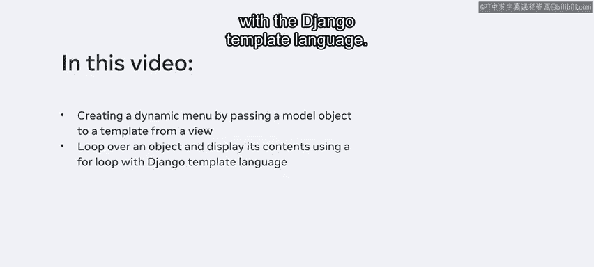
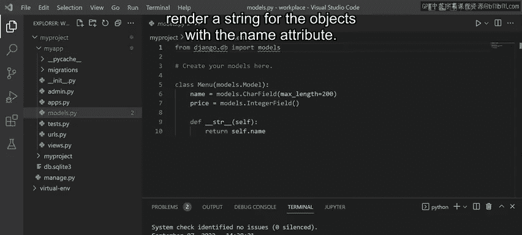
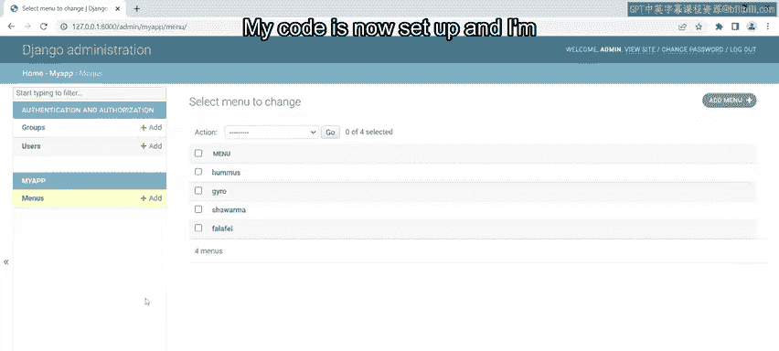
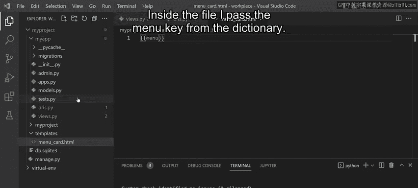
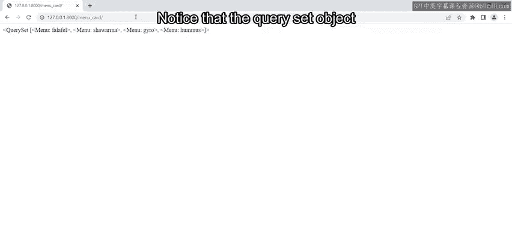
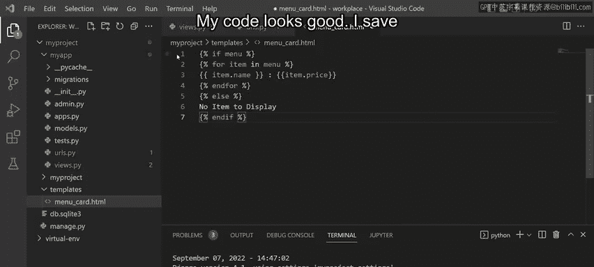
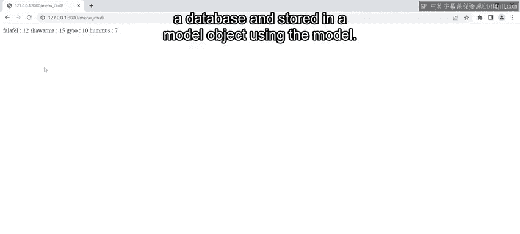
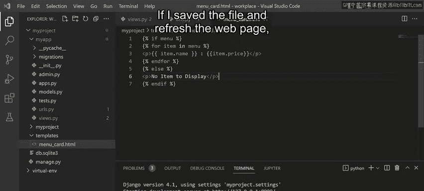
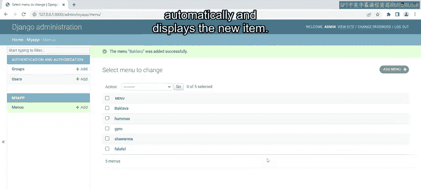
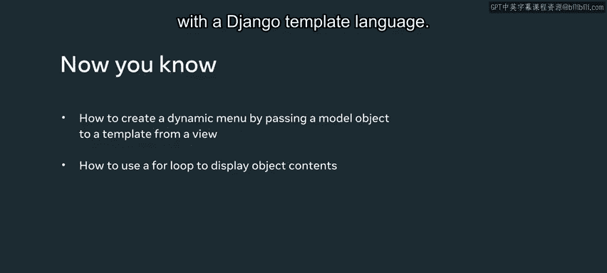

# Meta《后端开发（Django／APIs／全栈／毕业项目／面试）｜Meta Back-End Developer》中英字幕 - P45：44_将模型对象映射到模板.zh_en - GPT中英字幕课程资源 - BV1SZ421y7Fv

One of the reasons Django is so popular is that it allows developers to create dynamic website content quickly。

With just a few steps， you can take data that's stored in a database， write some logic for it。

 and then display it to the end user in the browser。

Previously you learned how to display dynamic data on a web page using objects that were passed to a template。

In this video， you will learn how to create a dynamic menu for little lemon by passing a model object to a template from a view。

You will also explore how to loop over an object and display its content using a for loop with a Jjago template language。

 so I'm NVS code and I have the models。 Pi file open。

Previously you learned how to create a model named menu with attributes for name and price。

 noticeice that name is set to a chart field and the price to an integer field。

I've also created a D string method that will render a string for the objects with the name attribute。

And recall that this just helps with visualization and identification in Jngo administration。

If I open Jjago administration in the browser， recall that this model contains data like the menu items for hummus。

 falafel， and so on。Okay， so my code is now set up and I'm ready to create the view function。

Inside the View that Pfil， I create another view function called menu by ID。

And just like in earlier videos， I pass in the request object。

 but there are a couple of different steps I need to take。First， I import the menu from the models。

 Pi file。Next inside the function， I need to create an object containing all the values present inside the menu model To do this I use the method menu。

objects。or and assign this to a variable named new menu。

The next step is to create a dictionary using similar logic represented in the code above that you learned about previously。

So inside the curly braces， I create a key called menu。And the value will be the variable new menu。

And this will be assigned to another variable called New menu underscore Dict。

The last step is to return a render function that takes three parameters。The request object。

 the name of the template file and the dictionary。There's a lot of code on the screen。

 so let me just comment out the view function I created earlier。

This will also ensure no regular expression conflicts as some of the names in the two functions are similar。

I saved this file and now I need to check the mapping and the URL Spi file。

Notice that the URL inside the path is set to menu_ card as the URL resource location。

For the final part， I need to create an HTML file with the same name that I typed inside the render function。

 menuCar。htm。Inside the file， I passed the menu key from the dictionary。

Okay， so let me check that I've saved on my files， I open the browser and navigate to the URL menu_ card and press enterter。

Notice that the query set object is displayed on the web page。

 I want the page to only display the items of the object， so I need to modify my code。

 So back in the H M L file， I need to use the Jjango template language with a conditional statement。

 I start by adding single curly braces with a percentage symbol。

Next， I create an if condition by typing if menu to check if items are inside the menu。

If this condition is true， I use a for loop to iterate over the items in the menu。

On the following line， I add item dot name and item dot price。

Then I need to make sure I end the for loop by typing in4。Finally。

 I will add one more piece of logic and else's condition that displays some text if the menu object is empty。

I end the if condition。And my code looks good。

So I save the file and refresh the webage in the browser。Notice that only the objects。

 names and prices are now dynamically displayed。It's important to understand that this data was taken from a database and stored in a model object using the model。

 then I looped over the object to display each value for name and price My code is working。

 but I can take this further by adding one final step to wrap the dynamic output with HTML paragraph tags。

If I save the file and refresh the webage， notice that each item now displays on a new line。

Finally， to demonstrate this dynamic webpage text， let me add another item to the database using Djago administration。

I add the item bakkuva with a price of 10。I save the item and switch to the menu page， and refresh。

Notice that the content updates automatically and displays the new item in this video。

 you learn how to create a dynamic menu by passing a model object to a template from a view。

You also explored how to loop over an object and display its contents using a for loop with a Djago template language。

