# Django后端开发：P46：模板继承 🧩

在本节课中，我们将要学习Django中一个非常重要的概念——模板继承。模板继承是遵循“不要重复自己”（DRY）原则的关键实践，它能帮助我们高效地复用网页的公共部分，如页眉和页脚，从而加速用户界面的开发。

---

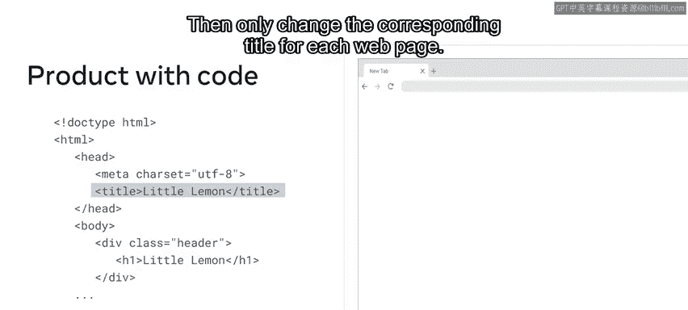

## 概述：为何需要模板继承？

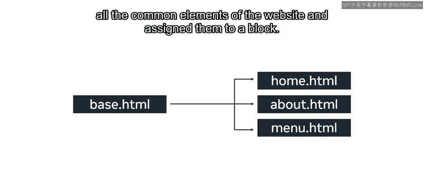

在Django中开发Web应用程序时，需要牢记“不要重复自己”（DRY）这一关键原则。重复，无论是有意还是无意，都可能导致维护问题和逻辑矛盾。每一个独特的概念或数据片段都应该只存在于一个地方。框架应尽可能地从尽可能少的内容中推导出尽可能多的内容。

例如，要为Little Lemon网站的多个页面创建相同的页眉和页脚部分，你可以复制标记代码并多次保存，然后只为每个网页更改相应的标题。但更高效的方法是构建一个包含网站所有公共元素的**基础模板**，并将它们分配给一个**块**。这个块随后可以在每个网页上重复使用。

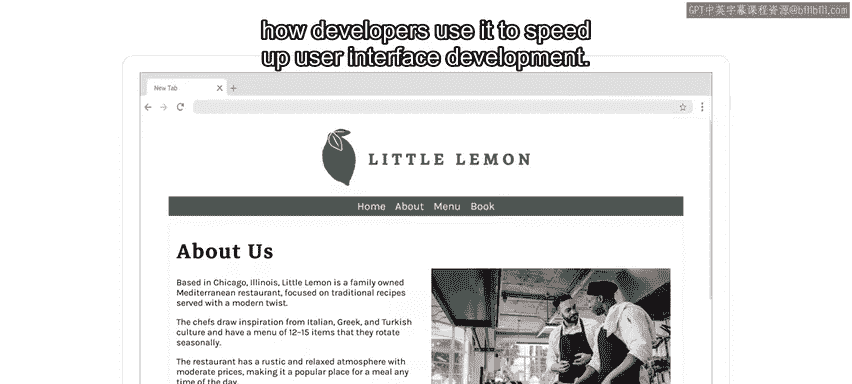

---

## 分解页面：理解区块

为了高效地使用模板，将页面分解成多个部分会很有帮助。在Django中，这些部分被称为**区块**。

以下是大多数网站常见的区块：

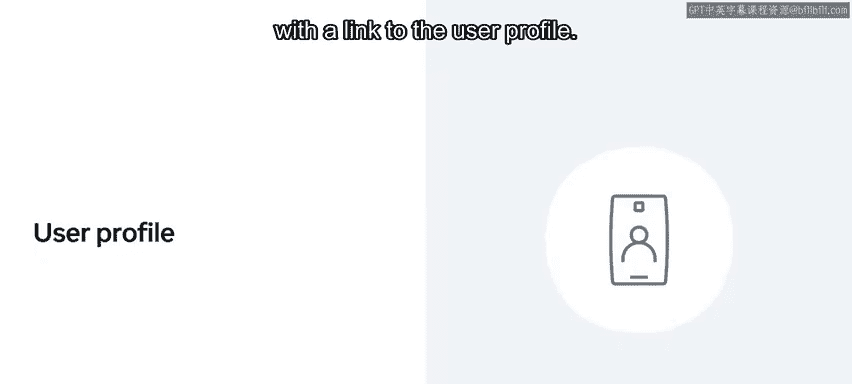

*   **页眉**：这是第一个区块，通常位于页面顶部。它包含公司名称、Logo以及指向网站不同页面的链接（即导航菜单）。有时还包含用户登录区域。
*   **页脚**：这是位于网页底部的区块，包含公司或联系方式的详细信息、导航链接和版权信息。

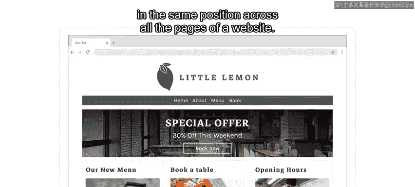

保持页眉和页脚在所有页面中的外观和位置一致，对于良好的用户界面和积极的用户体验至关重要。这种一致性使用户能够更快、更轻松地在网站中导航。

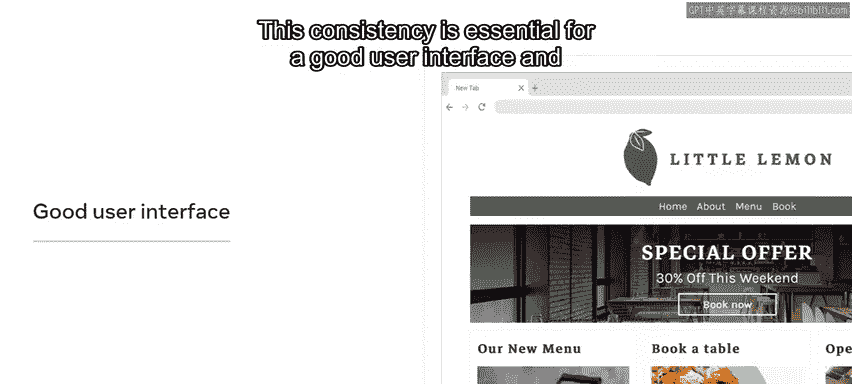

---

## 核心方案：使用模板继承

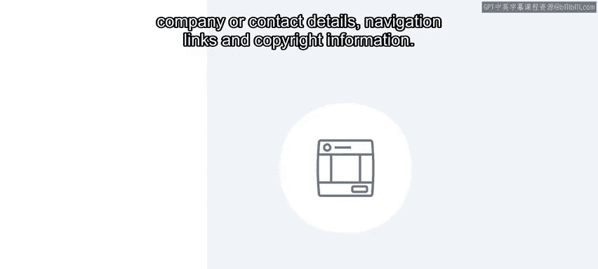

现在你可能会问，如何将页眉和页脚应用到Little Lemon网站的四个页面上呢？答案就是使用**模板继承**。

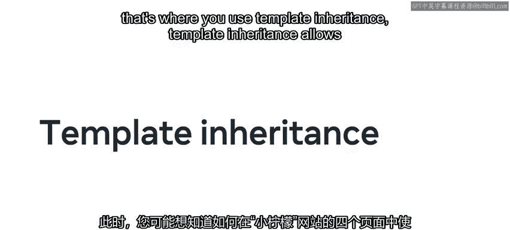

模板继承允许你将内容拆分为独立的组件，然后可以插入和重用这些组件，而无需重复工作。这为你节省了大量时间。请记住，DRY是Django的一个关键原则，而模板继承就是这一原则的绝佳体现。

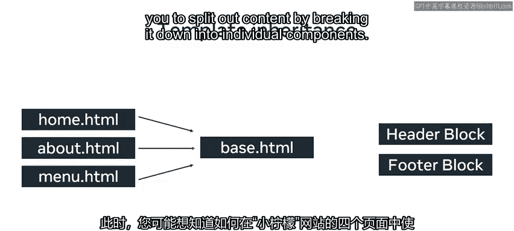

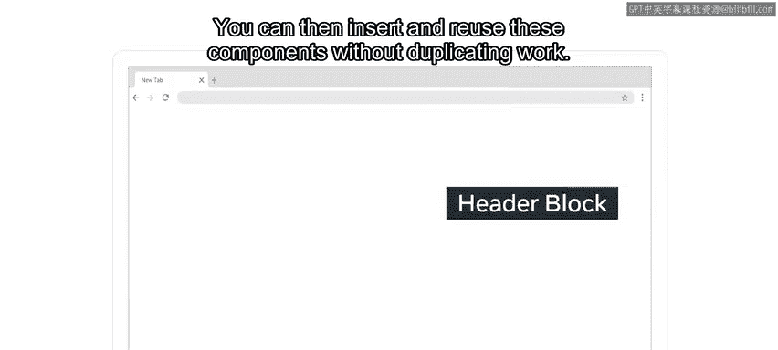

---

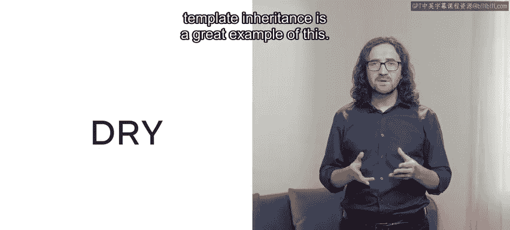

## 实现工具：`include` 与 `extends` 标签

了解了模板继承的概念后，让我们来探索实现它所需的两个标签选项：`include`标签和`extends`标签。

### `include` 标签

基础页面上的HTML标记现在使用`include`标签来引用包含页眉和页脚部分代码的文件。如果你需要更新这些文件中的任何一个，只需操作一次，而不是在每个页面上都进行修改。

`include`标签允许你指定一个模板字符串或一个变量，以便为不同的渲染设置条件。例如，假设你想传递一个包含页面名称等信息的对象。为此，你可以在视图的`render`函数中传递一个字典作为参数，以将变量或对象传递给模板。

为了从页眉文件中访问特定数据（例如页面对象），你需要在`include`标签内添加额外的属性。添加后，你就可以在页面上的任何地方访问该页面对象了。例如，将页面名称显示为标题元素。重要的是要记住，这个对象是视图中`render`函数内传递的字典的一部分。

**使用`include`标签的要点**：当你使用`include`标签时，你指示页面渲染这个子模板并包含其HTML。这意味着被包含的模板之间没有共享状态。每个包含都是一个独立的渲染过程。

---

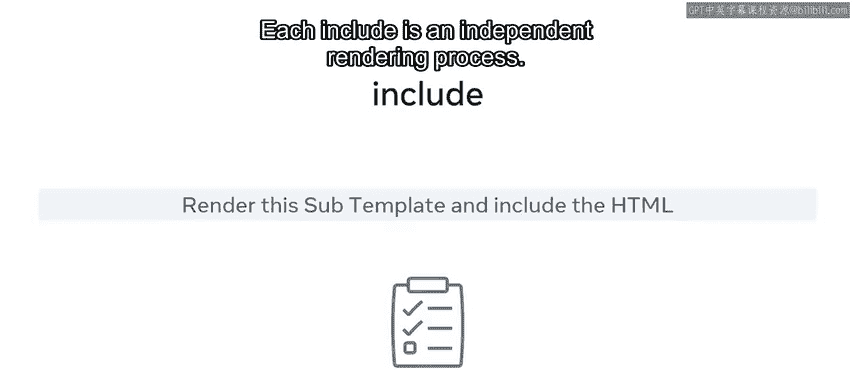

### `extends` 标签

接下来我们看看第二个标签：`extends`标签。它在语法和用法上与`include`标签相似，但其目的和功能不同。

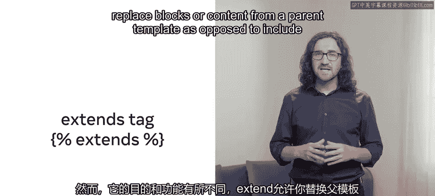

`extends`允许你替换父模板中的块或内容，而`include`则是包含部分内容。`extends`创建了一种父子关系，子模板可以覆盖父模板的功能。而`include`则只是在当前上下文中简单地包含并渲染一个模板。

使用`extends`标签有两种方式：
1.  使用字符串字面量作为要扩展的父模板的名称。
2.  利用变量的值。一旦变量被求值为字符串，Django就会使用该字符串作为父模板的名称。

**示例**：
假设你有一个名为`header.html`的文件，其中包含一个表示为无序列表的导航菜单代码。你可以将`header.html`的文件内容扩展到一个名为`about.html`的文件中。这段代码将有效地把`header.html`的内容添加到`about.html`的内部内容里。

---

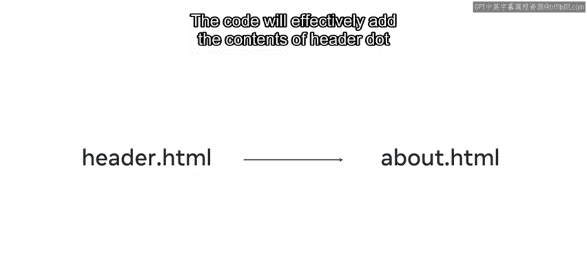

## 总结

本节课中，我们一起学习了Django的模板继承。你了解了模板继承如何通过重用内容块（如页眉和页脚）来节省开发时间。这是实践DRY原则、提高代码可维护性和开发效率的核心技术。掌握了这些知识，你应该能够快速开发出Little Lemon网站的四个页面了。