# Meta《后端开发（Django／APIs／全栈／毕业项目／面试）｜Meta Back-End Developer》中英字幕 - P48：47_Django应用程序的调试.zh_en - GPT中英字幕课程资源 - BV1SZ421y7Fv

Debugging is the process of identifying and isolating an error。

 finding the source and deploying measures to solve the problem。

While making mistakes is a part of programming， correcting errors inside a web framework such as Django can be particularly difficult。

Unlike errors occurring in a standalone file that can be easily spotted。

 web projects consist of several interlinked files and dependencies that can make troubleshooting challenging。

While debugging takes patience， it also helps build a better understanding of the internal working of an application。

In this video， you will learn more about debugging Django applications。😊。

Mistakes can happen in many forms and at any stage of the development process。

These can include missing， adding a view， creating incorrect templates， missing import statements。

 inaccessible resources such as model data， or even missing a comma in some attributes passed inside a function。

As a beginner， seeing the errors and having to troubleshoot can be intimidating。

While observation and hands on practice with web applications are the best means to overcome errors in Jngle projects。

 there are tools available that can speed up the process of getting a project up and running。😊。

You already know how to raise a few errorsRS using provided internal implementations。

 but there are unforeseen errorss that occur that also need to be attended to。

Jenangle has a distinct debugger that appears in the form of a yellow page error。

You may recall seeing the debug equals true flag on the homepage of the local host after running the server。

The Django debugger is enabled by default and settings for it can be found and modified inside the settings。

pifile of your project。While it is a useful component of development。

 the developers of Dngle recommend that it should never be used in the production environment。

This is because it may expose internal file paths， as well as database and project configuration details to the end user using your website。

This can be prevented by changing the setting to debug equals false。

Other than the default debugger provided by Django， Django， as you know。

 is written in Python and can easily integrate third party libraries that help in debugging。

Let's now examine a few ways in which you can debug Dngo applications。

This example uses the Creating Form project demonstrated earlier。

Begin by launching the development server。

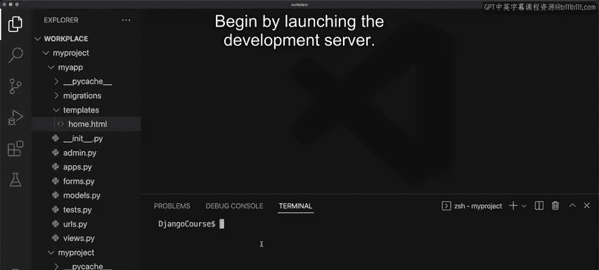

Immediately， you'll notice there is a 404 page not found error。

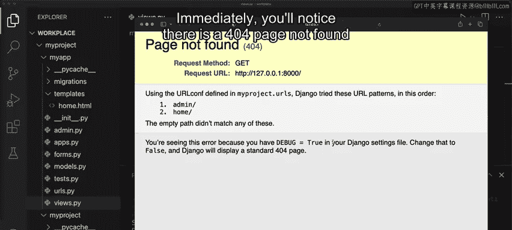

And this is because you haven't configured the URL for the local host。Also。

 notice that this displays in the console in the logger。

It's important to know that the default Django implementation enlists all the steps that Django has performed after you run the command。

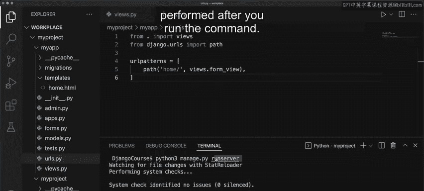

Let's now go to the correct URL。Notice that the logs update at the bottom inside the console。

Now open the formss。 Pi file。Python specific errors will most likely occur in the console log。

For example。If you comment out there shifts constant and save the file。

 notice and error log displays inside the console。The name error displays with the text。

 name shifts is not defined。And if you try to refresh the local hostst URL in the browser。

 notice that the page will not load。 However， some other errors are not that obvious， for example。

 remove the import you passed inside the log form and save the file。

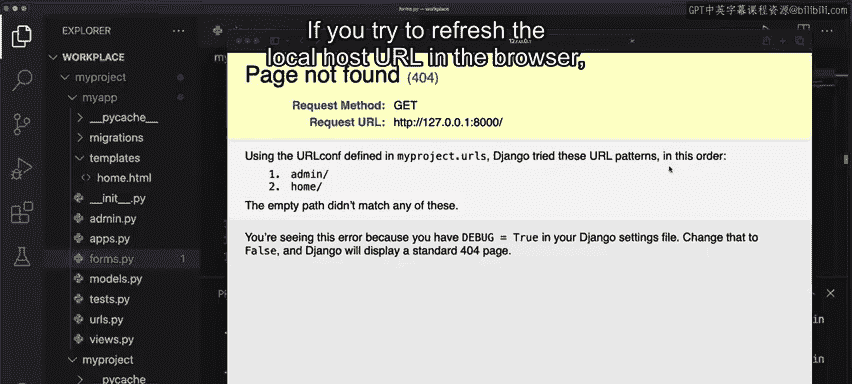

Notice that you do not get any error in the log。However， if you refresh the webage。

 notice that the template for the form disappears except for the submit button that was rendered using static HTML Markup。

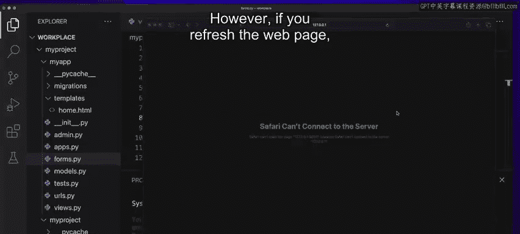

To prevent this from happening， always ensure you have the right imports and that you pass the correct arguments inside functions。

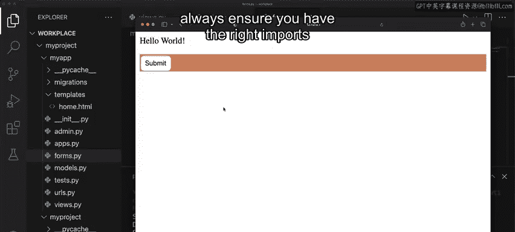

Let's say you open the file， my templatelate home。thtm。Inside the file。

 remove the code for the CSRF token and save the file。

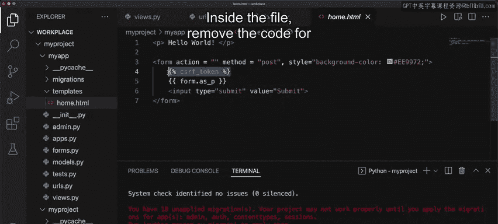

If you go to the Local hostt URL and reload the page， notice that the forms render correctly。😊。

Fill out the form and press the submitit button。

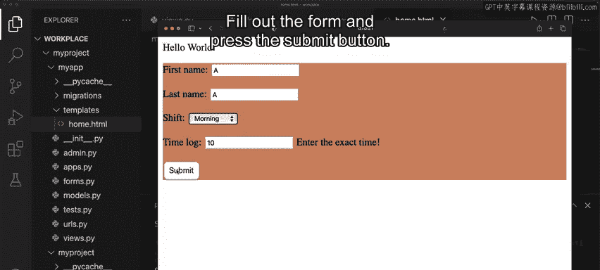

Notice that an error displays stating forbidden CSRF， verification failed。

This error specifies that the CSRF token is missing， which is helpful for troubleshooting。So。

 you can broadly say the yellow page errors are more specific to problems inside Djanangle than Python code。

Now let's say you go to the files。pi file again and misconfigud the template you are trying to render。

So let's say you call this home underscore page。htm and save it again。

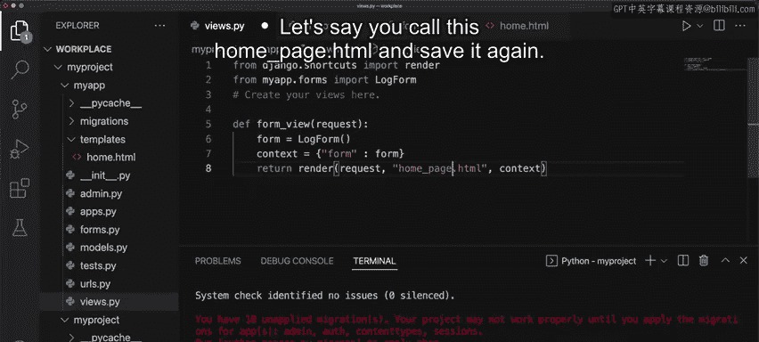

Once you go to a template page， you get an error such as templatelate does not exist in the particular path。

Let's examine this page in a little more detail。First， it specifies the exception location。

 and you can get a hint from get template and how it is raised during Form view。Next。

 if you keep scrolling， you get a stack， which is called the traceback stack。It contains Python code。

 in sequential order， with a particular line highlighted。

 which will likely be the place of the error。You can also convert this to switch to copypy and paste View。

When you change this， you get a much cleaner interface mentioning all the details。😊。

You can additionally click on sharere this trace Back on a public website， which when clicked。

 will take you to Dbase。com。This page displays convenient clipboard content that you can share on different forums。

😊。

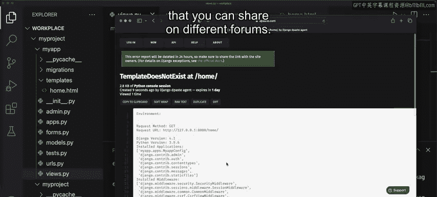

If you scroll down further， there's information about the dictionary containing all available HTTP header information called metata。

On further scrolling， you can find details inside the settings and all of these are potentially helpful。

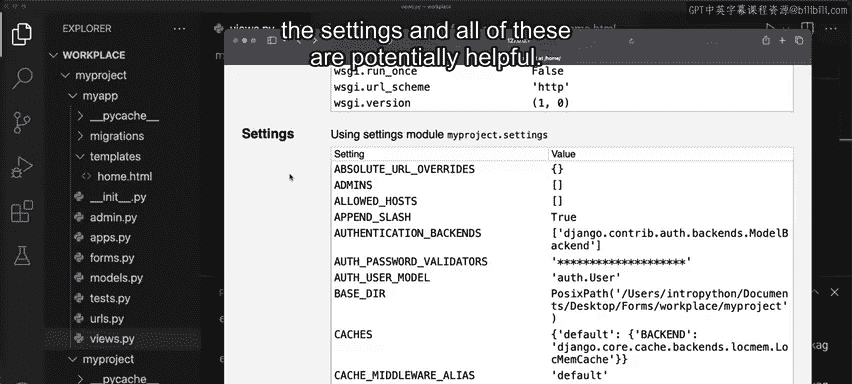

Regarding debugging， you can never apply a one rule for all approach with practice。

 the number of errors you encounter will slowly decrease。

And a systematic and patient approach in dealing with these projects is the best way forward。

In this video， you learned how to debug Dngo applications。

 which will help you in the future when you have to troubleshoot errors。

