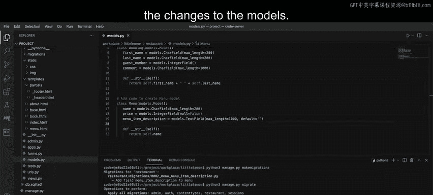
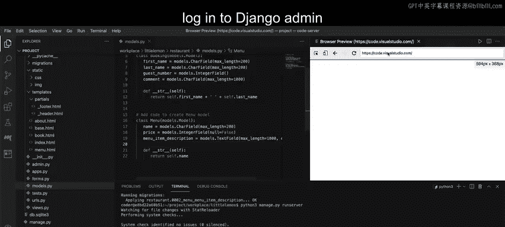
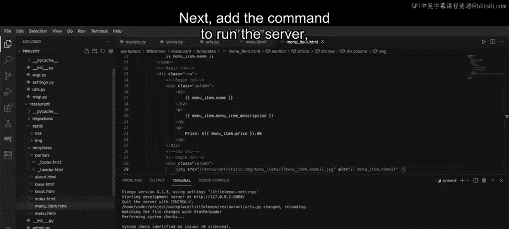
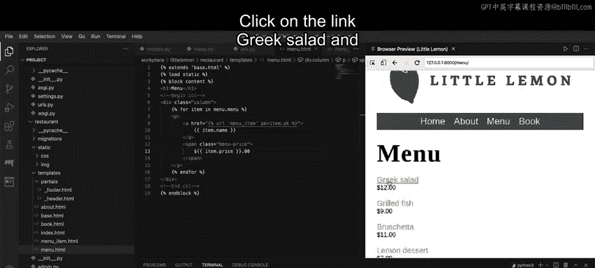
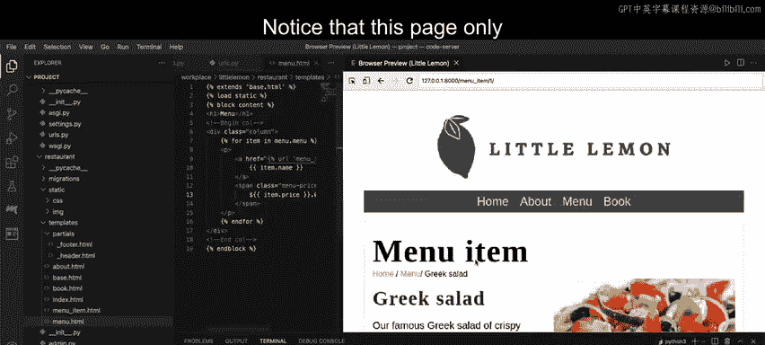

# Meta《后端开发（Django／APIs／全栈／毕业项目／面试）｜Meta Back-End Developer》中英字幕 - P53：52_解决方案第2部分：创建菜单项页面.zh_en - GPT中英字幕课程资源 - BV1SZ421y7Fv

The first step is to open themods。pi file and update the menu model with the description attribute。

Next， in the terminal， run the commands to perform migrations to implement the changes to the models。

Once this is complete， log in to Django admin using the super user credentials created earlier and update the menu items with the description provided in the zip file。

Inside the Django admin panel， click the menu model from the restaurantrant app to display the list of menu items。

Select a specific item from the list to edit。And update the description with the details provided in the zip file。

Once all the descriptions are added， open the viewss。

pi file and create a view function called displayplay menu item。

The function must contain two arguments， request， and the primary key， set to the value of none。

Inside the function body， add the code to define the view logic。😊。

Use the if condition to check if the primary key contains a value。If true。

 create a variable menu item and assign it the value of the primary key of the menu model using the objectge method。

For the else condition， assign an empty string to the variable menu item。

Return the render function from the view and pass the following arguments。The request object。

 the template name menu。 HTML and a dictionary object with the string value menu item as the key and a variable menu item as its value。

Once this is complete， open the app level URLs dotpi file and add the path function inside the URL Pat list。

Before you configure the new menu item page， open the file menu。

htm and update the code to add the link to the menu item page。

Select the complete string inside the HR attribute and replace it with the DTL code for the dynamic link for the menu item page。

Remember， do not remove the enclosing quotes for the string of the HTML attribute。

The next step is to create a file called menu item。

htm inside the templates inside the app called Restaurant。Once created， add the starter code。

Replace the code matching the comment using the appropriate Django template language syntax。To begin。

 add the name attribute from the menu item object。Next。

Add the description attribute from the menu item object。

Then add the price attribute from the menu item object， finally。

 add the code to display the image that is stored with the menu item name。

While you are adding these steps， ensured the changes are inside the enclosing paragraph tags。

Now it's time to save the menuite。html file and make sure all the other file changes are saved。Next。

Add the command to run the server。Paste the local hostt URL to the browser and add the file path of menu at the end。

Press enter and the same page displayed earlier should load。

 but this time the menu item name displays as a hyperlink。

Click on the link Greek Sal and the menu item page for Greek Sal appears。

Notice that this page only contains the information that is stored in the database row for Greek salad and displays the name。

 description， price and image。Now it's time to move to the third part of the project and create the footer。

