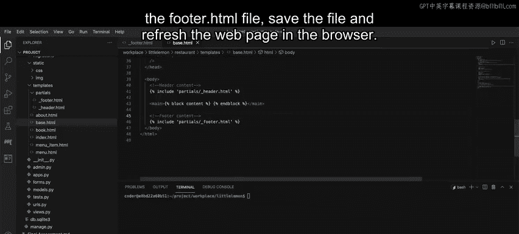
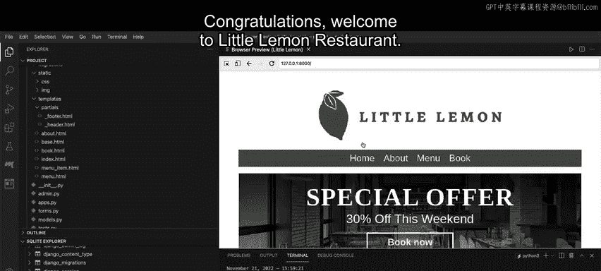

# Meta《后端开发（Django／APIs／全栈／毕业项目／面试）｜Meta Back-End Developer》中英字幕 - P54：53_解决方案第3部分：如何创建页脚.zh_en - GPT中英字幕课程资源 - BV1SZ421y7Fv

First， open the file underscore footer。html and paste the code that was supplied to you。

Then replace the code inside the angled brackets of the image tag with the appropriate template code。

Next， make sure to remove the angled brackets and save the file。

The final step is to open the file base。htm and locate the comment footer content。

On the line underneath， add the includelude tag with the relative path of the footer。 HTML file。

 save the file， and refresh the webage in the browser。

Notice that the footer content now displays on the Little Le website。

Now it's time to move to the final part of the project and test the form。

On the Little Lemon website navigation， clickBook。In the form that displays。

 enter the details such as your initials as the first and last name。

The number of guests and a comment press on the submit button to send the form data next。

 back in VS code right click on the database db。sql Li 3 and select open database。

Notice that the SQL Light Explorer option will be generated at the bottom of the Explorer panel in VS code。

Click on the arrow next to SQL Light Explorer to expand its contents。

Scroll down to the tableable restaurantrant， underscore booking and click on the Show table icon。

Notice that the reservation form data you sent is stored in the database table。

And there you have it This concludes the video of the solution to the assessment congratulations We to Little Limon R。

😊。

