# Meta《后端开发（Django／APIs／全栈／毕业项目／面试）｜Meta Back-End Developer》中英字幕 - P56：0_课程简介.zh_en - GPT中英字幕课程资源 - BV1SZ421y7Fv

Hello and welcome to this course on API development。

 Nearly all of us have interacted with an API before， even if we don't know it。

 if you've checked the weather on your phone or if you've ordered food online。

 then you relied on an API to give you access to another app's functionality or to retrieve information for you。

 In fact， most of today's web applications relied on As to work。

 An API or application programming interface is a gateway to back end data。😊。

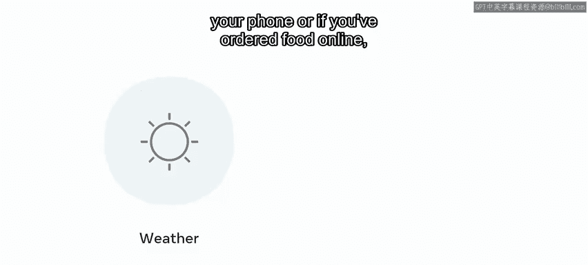

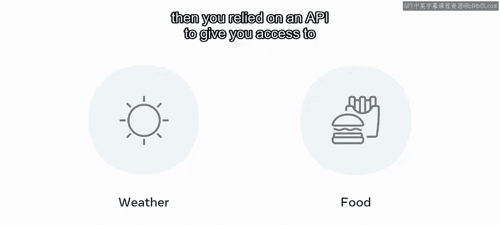

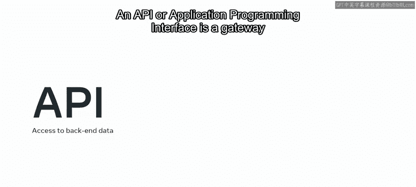

Apis allow different apps and services to exchange information or allow access to functionality。

 And as the use of mobile and other technologies increases， So too does the demand for As。

 This means that learning how to create and use As may be invaluable to you in your developer journey And in this course you'll learn about the tools and resources available to you to create and use As。

 to start off， you'll learn more about how Apis are used in the real world。

 Then you'll have an opportunity to reflect on what you hope to learn the course syllabus and how to be successful in this course。

 After this， theres a short refresher on how HtTP and H Ttps work。 including HtTP methods， requests。

 responses and status codes before moving on to rest As。

 you will learn how to set up visual studio code and configure it with all the necessary extensions and you'll also learn how to use a packet。

😊。

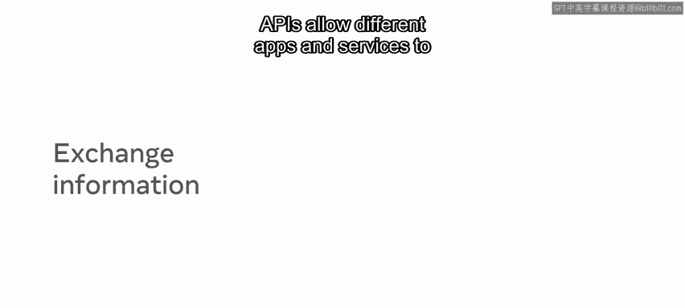

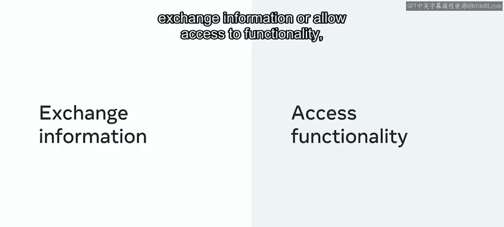

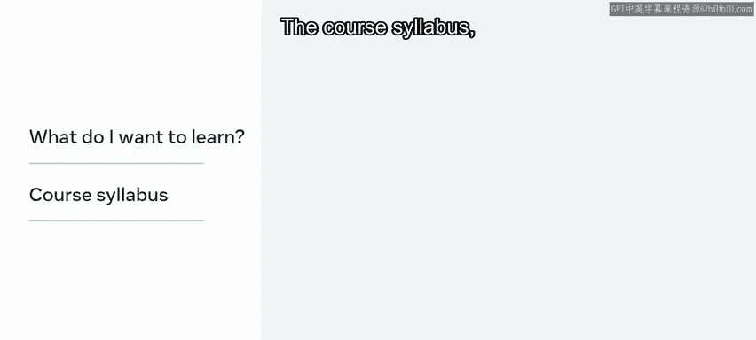

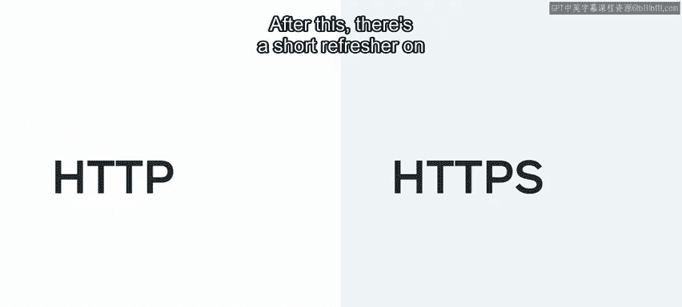

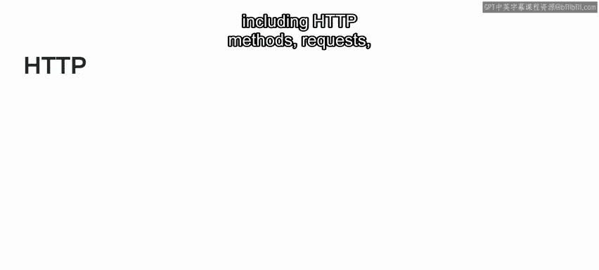

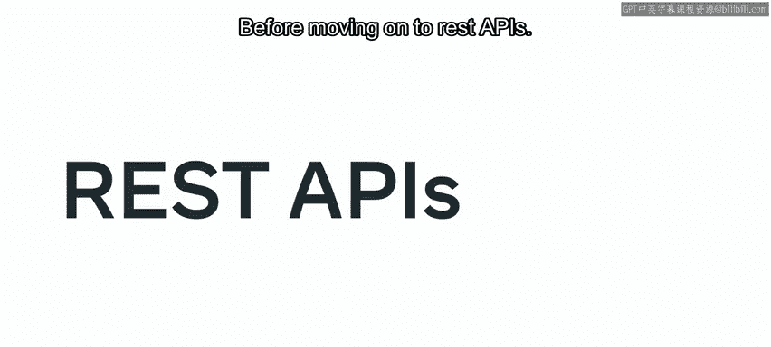

Tool like Pip envy。

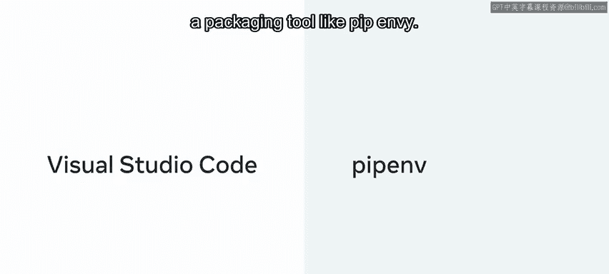

When it comes to RE APIs， you will learn about their key characteristics， benefits。

 states and resource types， as well as the API Re lifecycle。

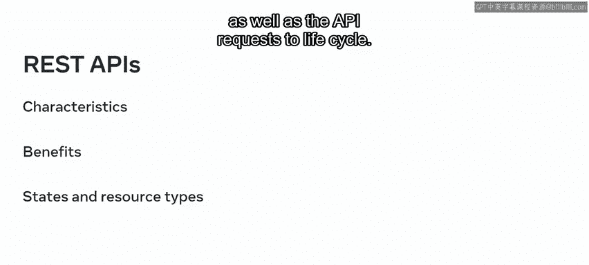

You'll also learn about the principles of authentication in arrest rest API and what the difference is between authentication and authorization。

 and you'll have an opportunity to create routes with the correct naming conventions when you create your own API and organize an API project。

😊。

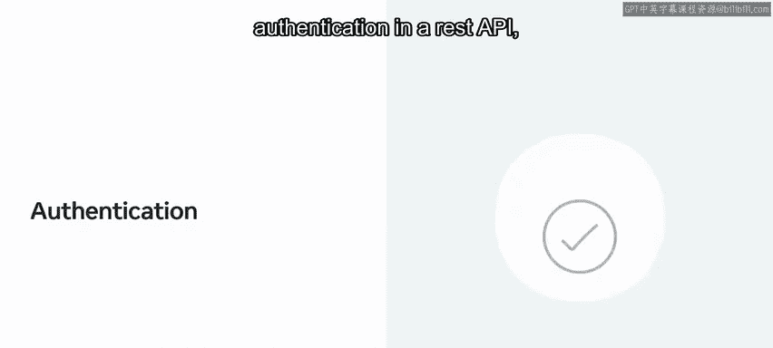

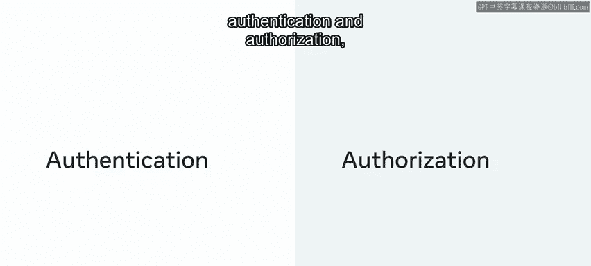

In the second week， you will learn how to install and set up Django RE framework or D or F。

Following this， you'll also learn how to use function and class based views to create API endpoints efficiently。

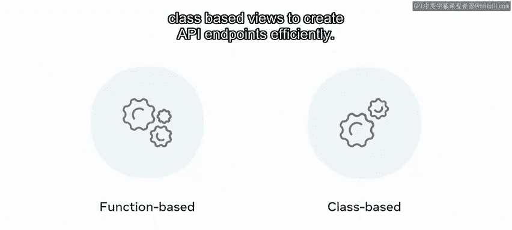

You will enrich your knowledge of serializers and gain insight into how to convert and validate your data。

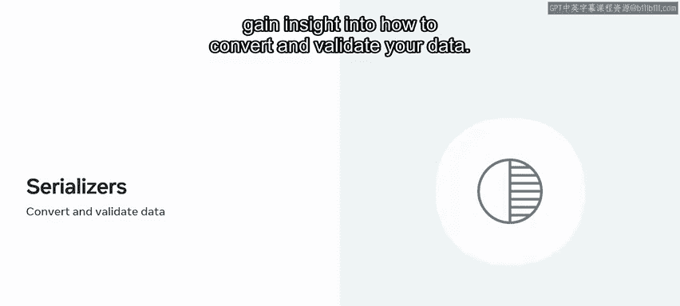

And you'll learn how to map user input to database models using desialization。

 as well as how to use throttling and caching to optimize and protect your API。 In the third week。

 you will learn how to control access to your As and put systems in place to ensure you maintain their health。

 Lastly， youll have an opportunity to complete the graded assessment。

 which is the little Lemon Rrant API project。 And you'll get an opportunity to provide feedback on your classmates projects as well。

 Since this is a peer reviewed assignment。😊。

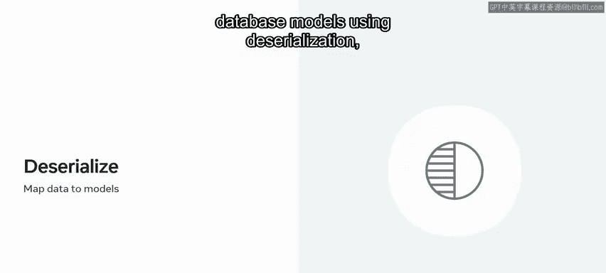

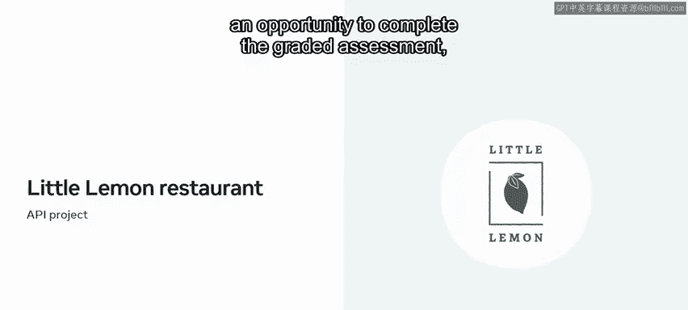

If you've encountered new technical words in this video。

 don't worry if you don't fully understand them。 Now。

 everything you need will be covered during your learning with each lesson made up of video content。

 readings and quizzes。There are many videos in the course that will gradually guide you towards your goal of becoming a developer。

 Watch， pause， rewind and rewatch the videos until you are confident in your skills。

 Then consolidate your knowledge by consulting the course readings and putting your skills into practice during the course exercises。

😊。

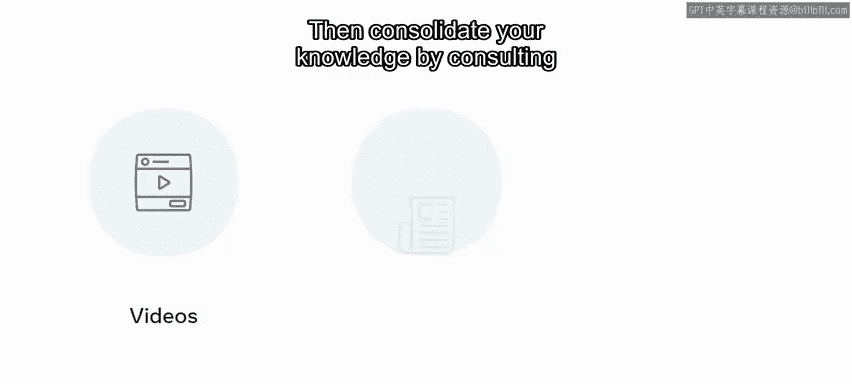

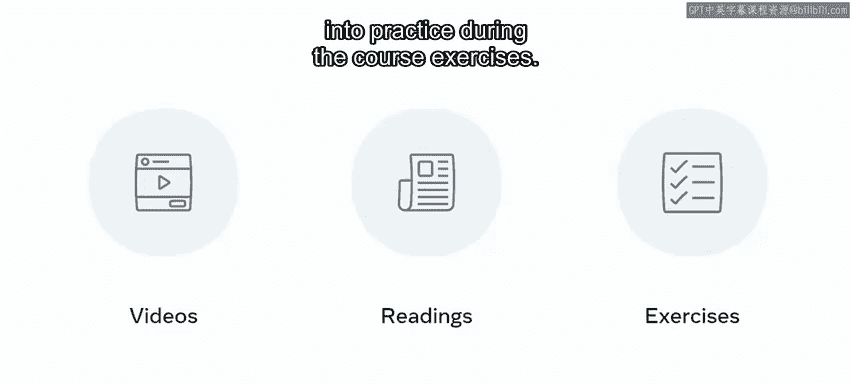

Along the way， you'll encounter several knowledge quizzes for you can self check your progress。

 And remember， you're not alone in considering a career as a developer。

 which is why you'll also work with course discussion prompts that help you to connect with your classmates。

 It's a great way to share knowledge。 discuss difficulties and grow a network of contacts in the development world。

😊。

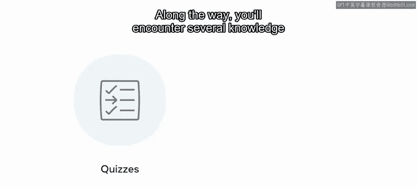

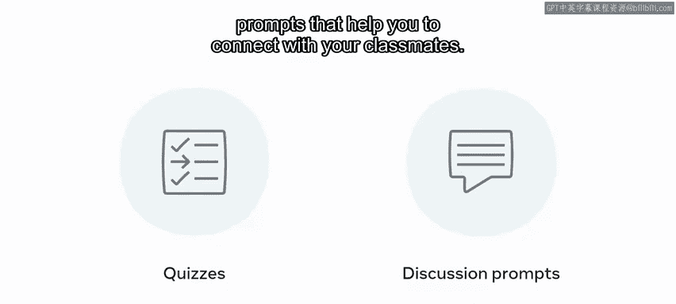

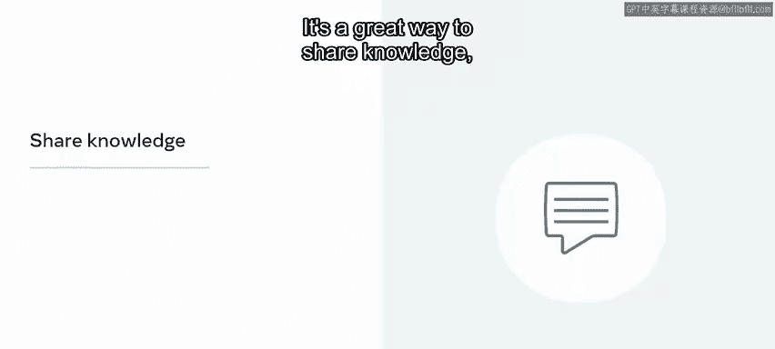

To be successful in this course， it is helpful to commit to a regular and disciplined approach to learning。

 although it is an online self paced course， you need to be serious about your studies and。

 if possible， map out a study schedule with dates and times that you can devote to attending the course。

 In summary， this course provides you with a complete introduction to API development and will set you on your way toward professional certification and a career in API development。

😊。

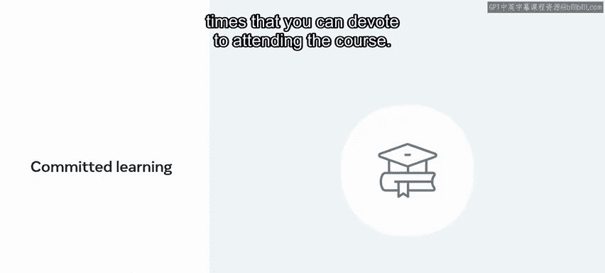

Be sure to also check out the other courses in this learning path。

 Looking forward to working with you on your learning journey。😊。

