# 后端开发：3：REST风格 🏗️

在本节课中，我们将要学习什么是REST，以及如何设计符合REST风格的API。我们将了解REST的核心约束、资源的概念，以及这些原则如何帮助你构建易于使用和维护的应用程序接口。

## 什么是REST？

现在你已经复习了HTTP和HTTPS，可以开始学习REST了。但首先，你需要知道什么是REST。换句话说，是什么让API变得“RESTful”。

API，即应用程序编程接口，是访问后端数据的网关。它允许你轻松访问和修改这些数据。而REST是一种为你的项目设计API的架构风格。它在开发者中非常流行，因为它比其他架构风格更容易开发和实现。对你有利的是，它的学习曲线并不陡峭，你可以在短时间内创建可用于生产环境的API。但不要操之过急，你现在还不会创建API。相反，你首先要学习REST的基础知识。

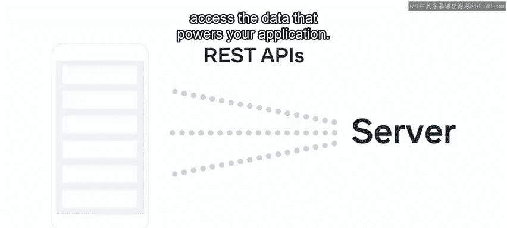

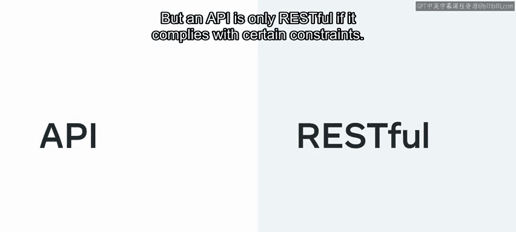

## REST API的核心约束

REST API为你提供了一种与服务器通信并访问驱动应用程序数据的简便方式。但一个API只有在符合某些约束条件时才是RESTful的。我们来逐一审视它们。

它必须采用客户端-服务器架构。REST API始终是无状态的，并且应该是可缓存的。它应该是分层的，具有统一的接口，并且可能还包括“按需代码”，但这是可选的。

以下是每个约束的详细说明：

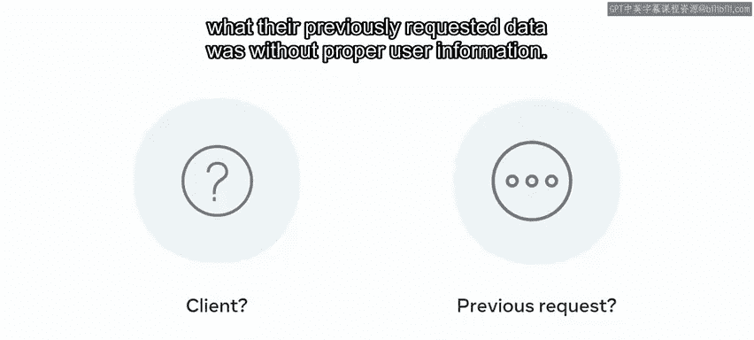

### 客户端-服务器架构

API应使用客户端-服务器架构。应该有一个提供资源的服务器，以及一个消费这些资源的客户端。

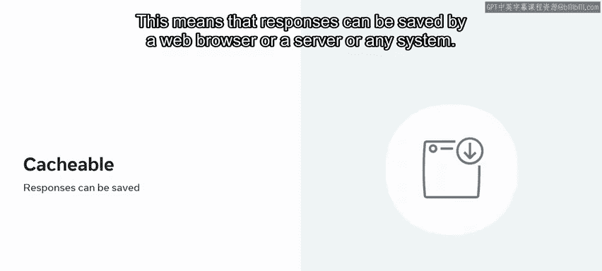

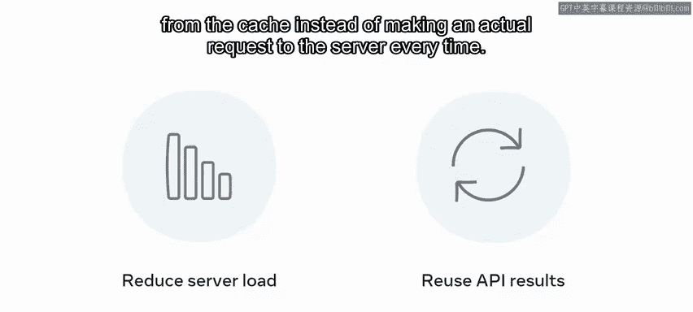

### 无状态性

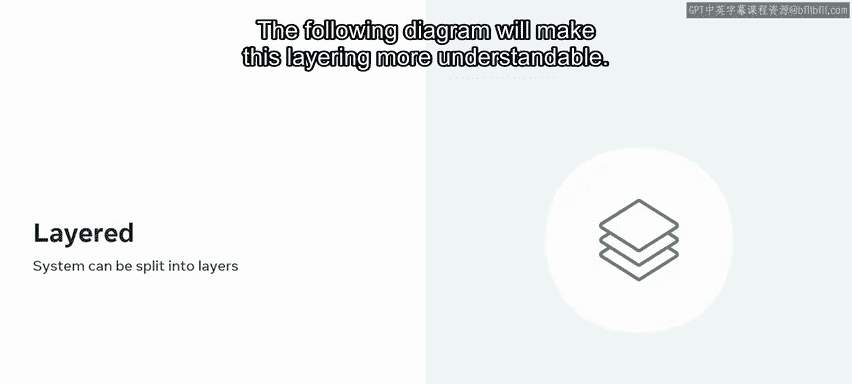

REST API是无状态的。这意味着服务器不包含任何发出调用的API客户端的状态。因此，如果没有适当的用户信息，服务器无法识别是谁在发出请求，或者他们之前请求的数据是什么。实际上，状态只保存在客户端机器上，而不是服务器上。这会影响你应该在API端点或URL路径中包含什么内容，但这一点稍后会详细说明。

### 可缓存性

API也应该是可缓存的。这意味着响应可以被Web浏览器、服务器或任何系统保存。这种缓存过程有助于减少服务器负载，因为它可以从缓存中使用API结果，而不是每次都向服务器发出实际请求。

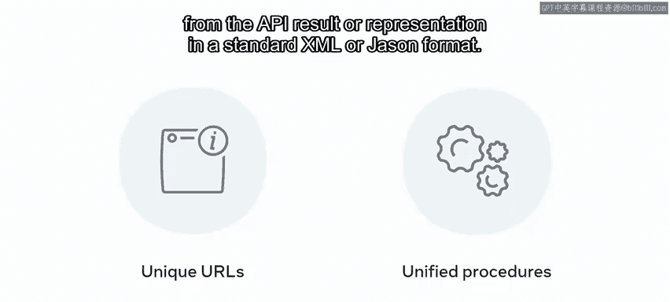

### 分层系统

“分层”意味着整个系统架构可以被拆分或解耦成多个层，并且你应该能够在任何时候添加或移除一个层。下图将使这种分层更容易理解。

一个RESTful API系统的层可以包括防火墙、负载均衡器、Web服务器和数据库。

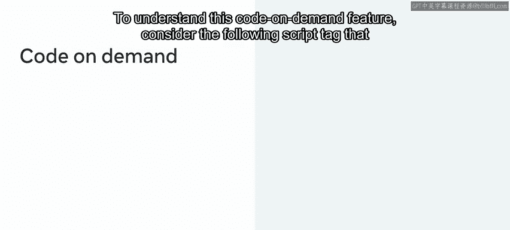

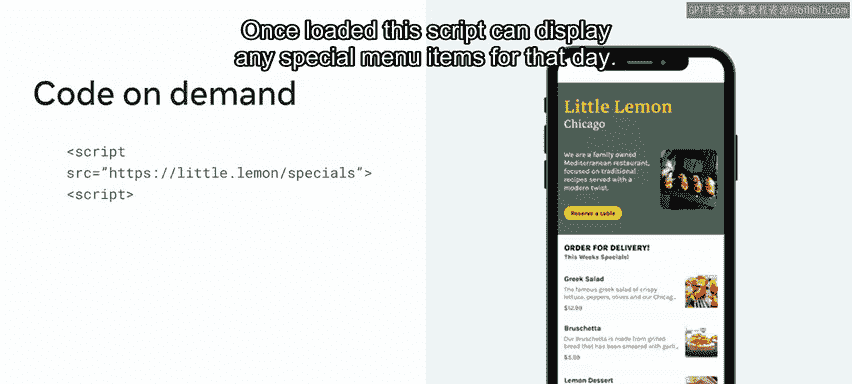

### 统一接口

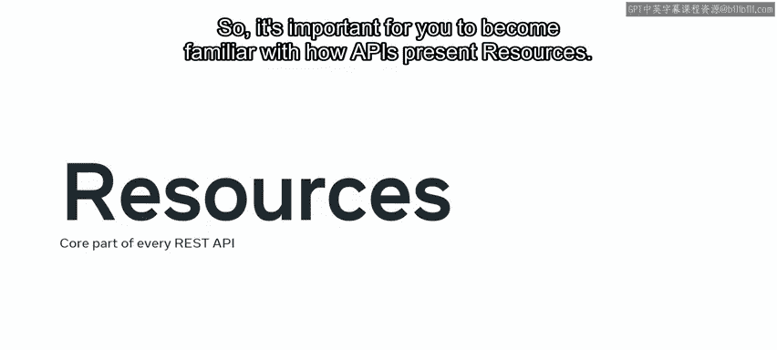

接下来我们看看统一接口的约束。这在目前听起来可能有点令人困惑，但它意味着系统应该提供一个统一的通信系统来访问资源。例如，每个资源都应该有唯一的URL。还应该有一种统一的方式来修改资源，或者根据API结果（以标准的XML或JSON格式表示）对资源进行进一步处理。

### 按需代码

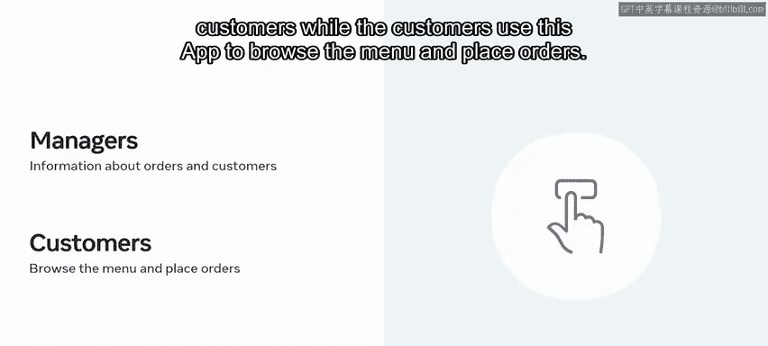

最后，“按需代码”意味着API可能会传递一些业务逻辑或代码，客户端可以运行这些代码来进一步改善响应结果。

为了理解这个“按需代码”功能，请考虑以下脚本标签，它从小柠檬餐厅的某个API端点加载一些JavaScript代码。一旦加载，这个脚本可以显示当天的任何特色菜单项。

目前，这六个约束只是理论上的。不要让它们把你搞糊涂。一旦你开始开发自己的API，这些术语对你来说就会变得清晰。

## 理解资源

接下来，让我们关注资源。资源是每个REST API的核心部分，因此熟悉API如何呈现资源对你来说很重要。

假设小柠檬餐厅有一个移动应用程序，顾客和经理都可以使用。经理可以使用该应用程序获取订单和顾客的信息，而顾客则使用该应用程序浏览菜单和下单。为了支持这些功能，应用程序使用不同的API从服务器获取数据，并且在每种情况下，资源类型都会不同。让我们探讨几个例子。

以下是几个API调用及其返回的资源类型示例：

*   **获取所有订单**：如果经理想查看所有订单，应用程序会调用API `littlelemon.com/orders` 并显示结果。这种情况下的资源类型是**订单对象列表**。
*   **获取特定订单**：如果经理想查看特定订单（例如ID为16的订单）的更详细信息，应用程序会调用API `littlelemon.com/orders/16`。资源类型是**订单对象**。
*   **获取订单的顾客信息**：要查看是谁下的订单，应用程序会进行一个带有额外过滤器 `/customer` 的API调用。这会检索该订单顾客的所有详细信息。这种情况下的资源类型是**顾客对象**。
*   **获取订单的菜单项**：假设经理想查看订单16包含哪些菜单项，应用程序会进行一个API调用，将 `/customer` 替换为 `/menu-items`。结果中只会显示订单16的菜单项。这次的资源类型是**菜单项对象**。

另一方面，如果顾客想浏览菜单，应用程序会使用另一个API `littlelemon.com/menu-items`。虽然资源类型也是**菜单项对象**，但返回的将是餐厅所有可用的菜单项。

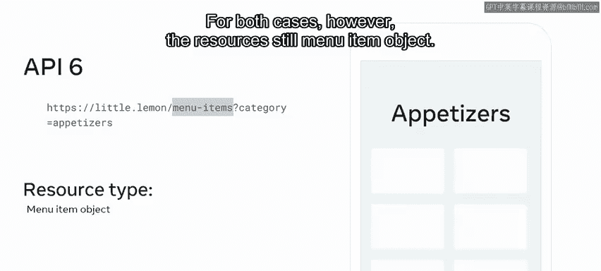

但有时，资源类型是相同的，尽管结果可以被过滤得更具体。让我们探讨最后一个API来理解这一点。这次，顾客想浏览特定类别（比如开胃菜）的食品。应用程序会添加 `?category=appetizers`。请注意，端点与之前的API相同，但它将输出过滤为仅限开胃菜。然而，资源仍然是**菜单项对象**。

## 重温无状态约束

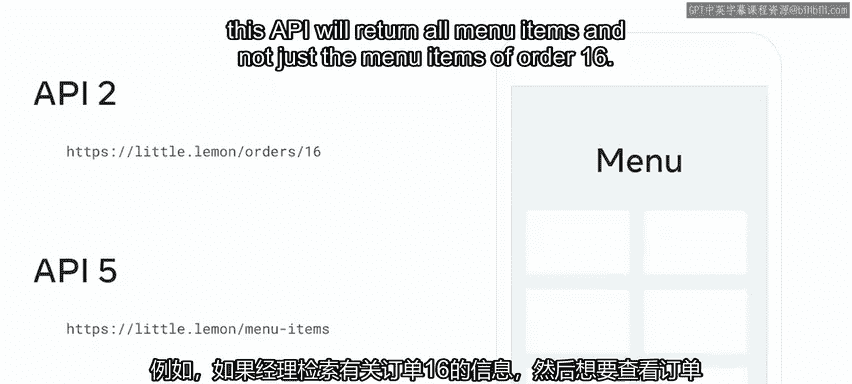

现在你已经探索了几个API资源的例子，让我们重新审视REST API的无状态约束。

你需要记住，服务器总是只呈现你所请求的内容。它不记得之前发生的任何事情。例如，如果经理检索了订单16的信息，然后想查看订单16的菜单项，你不能仅仅向端点 `/menu-items` 发送一个后续的HTTP请求，因为这个API将返回所有菜单项，而不仅仅是订单16的菜单项。服务器不记得你之前的调用是针对特定订单的。

如果你想获取特定订单号的菜单项，你需要明确地向服务器提供该订单号，如 `orders/16/menu-items`。简单来说，这就是无状态的含义。服务器无法自动识别客户端。API调用必须包含更多关于用户的信息，但你将在课程后面学到更多相关内容。

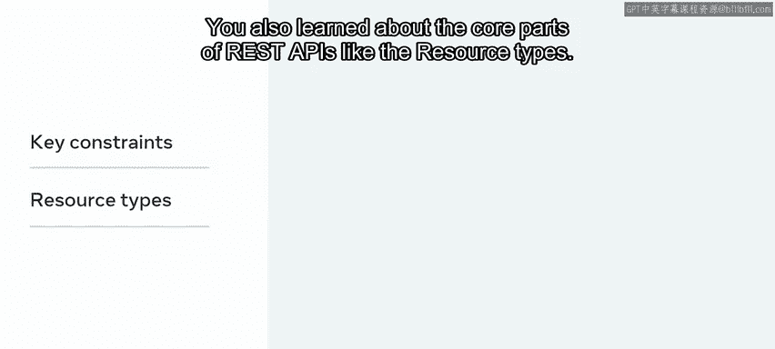

## 总结

本节课中，我们一起学习了如何通过遵循一些关键约束来创建REST API。我们还学习了REST API的核心部分，如资源类型。这些约定将帮助你构建易于使用和维护的API。但是，关于如何优化你的API还有很多需要学习，例如使用正确的命名约定，这些内容将在接下来的视频中介绍。