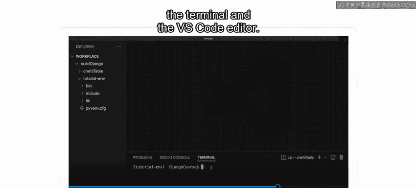
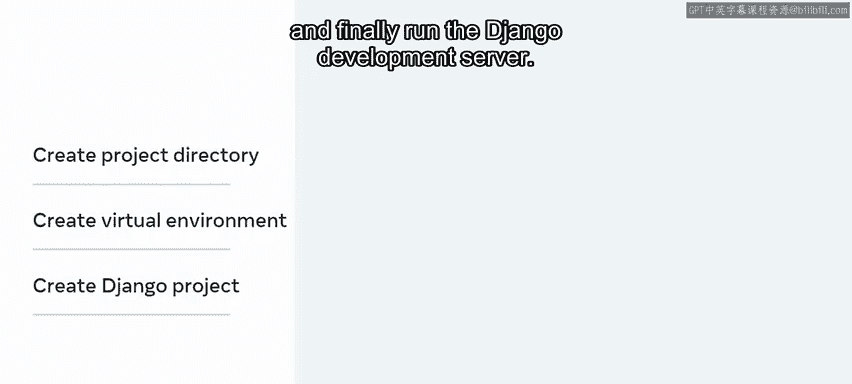
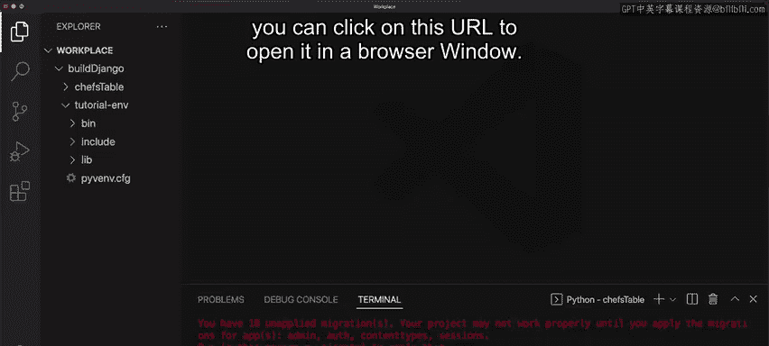
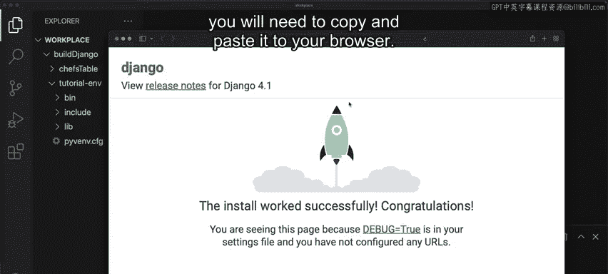
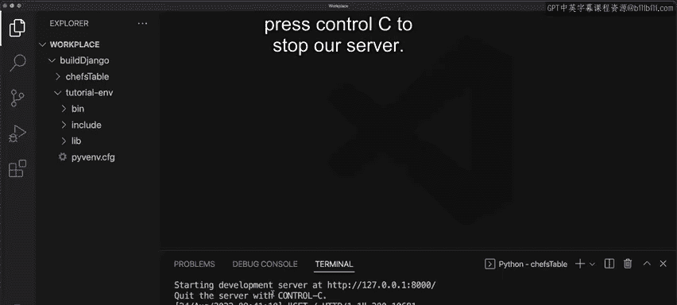

# Django后端开发：P5：创建您的第一个项目 🚀

在本节课中，我们将学习如何使用终端和VS Code编辑器创建您的第一个Django项目。您还将学习如何通过安装虚拟环境来设置开发环境，并探索一些用于创建Django项目和启动开发服务器的常用CLI命令。

## 虚拟环境与开发服务器概述



上一节我们介绍了Django项目和应用程序的概念。本节中，我们来看看如何实际创建一个项目。

如果您是一名处理多个项目的Python开发者，最佳实践是将您的项目隔离在虚拟环境中。您可能想知道为什么需要这样做。Django项目通常规模较大，并且涉及特定依赖项，例如软件包。例如，某个软件包可能依赖于特定版本。您不希望这与其他Python或Django项目发生冲突，因此最好使用虚拟开发环境来隔离您的项目。

虚拟环境是您创建的用于管理依赖项和整个项目的隔离空间。这允许您将解释器、库和脚本等功能隔离并安装到特定项目中。

除了提供的功能外，Django还附带一个集成的开发服务器。这意味着应用程序与客户端具有请求-响应关系。

现在您已经熟悉了虚拟开发环境和开发服务器的概念，让我们探索创建Django项目所涉及的步骤。

以下是创建Django项目的主要步骤：
1.  创建项目目录。
2.  为您的Django应用程序创建虚拟环境。
3.  创建Django项目。
4.  运行Django开发服务器。

## 详细步骤演示

让我们现在使用VS Code中的一些示例更详细地探索这些步骤。

### 1. 创建项目目录

项目是一个由设置和数据库信息组成的组织单元。它可以存储在您开发计算机上的任何位置，但作为最佳实践，最好将其保存在包含所有其他Django应用程序的子文件夹中。

首先，从顶部菜单中选择“终端”->“新建终端”以打开新终端。接下来，使用`mkdir`命令创建一个新目录，并为您的目录命名，例如`BuildDjango`。

```bash
mkdir BuildDjango
```



然后，使用`cd`命令进入此目录。


```bash
cd BuildDjango
```

### 2. 设置虚拟环境

接下来，您需要设置虚拟环境。为此，输入`python3 -m venv`，然后给出虚拟环境名称，例如`tutorial_env`。完成后，按回车键。

```bash
python3 -m venv tutorial_env
```

如果您在VS Code中打开目录结构，会注意到生成了一些新文件。

现在您需要激活虚拟环境。输入`source`和激活路径，即`tutorial_env/bin/activate`，然后按回车。

```bash
source tutorial_env/bin/activate
```

请注意，终端中的圆括号后缀表示虚拟环境已激活。

### 3. 安装Django并创建项目

虚拟环境包安装完成后，您就可以安装Django了。使用命令`pip3 install django`来完成。

```bash
pip3 install django
```

为确保Django已安装，您可以运行命令`python3 -m django --version`。请注意，当前版本是4.1。

```bash
python3 -m django --version
```

设置完成后，您就可以创建项目了。通过运行Django内置的命令行工具来完成：输入`django-admin startproject`，然后为项目命名。在本例中，命名为`ChessTable`。最后，按回车运行命令。

```bash
django-admin startproject ChessTable
```

如果您再次展开目录结构，会注意到`ChessTable`已创建，并附带支持性的Django特定文件。

### 4. 启动开发服务器

创建Django项目后，您需要启动开发服务器。在此之前，了解随项目自动创建的`manage.py`文件很重要。回想一下，`manage.py`是一个命令行实用程序，其工作方式类似于`django-admin`命令。因此，您可以用`manage.py`替换`django-admin`命令，因为它使用的是项目设置。

要启动开发服务器，您可以使用`manage.py`命令运行`runserver`命令。



```bash
cd ChessTable
python manage.py runserver
```



您将在后面了解更多关于如何使用`django-admin`和`manage.py`命令的信息。请注意，生成了一个URL。如果您使用的是Mac，可以单击此URL在浏览器窗口中打开它。如果您使用的是Windows，则需要将其复制并粘贴到浏览器中。



请注意，终端为我们提供了按`Ctrl+C`停止服务器的选项。

## 重要说明与总结

需要指出的是，虚拟环境和开发服务器本身是广泛的主题，您将在本课程后面了解更多相关内容。如果您愿意，甚至可以省略虚拟环境的使用，但这并不推荐。

本节课中，我们一起学习了如何在Django中创建您的第一个项目，使用了终端、VS Code和Django内置的命令行工具。您掌握了从创建目录、设置虚拟环境、安装Django到最终启动开发服务器的完整流程，为后续的Django开发奠定了基础。