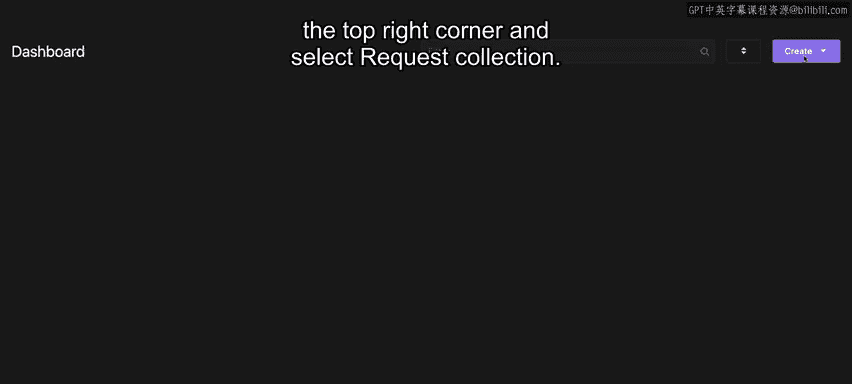
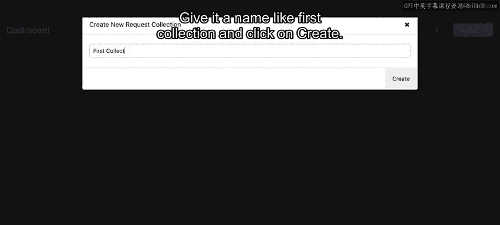
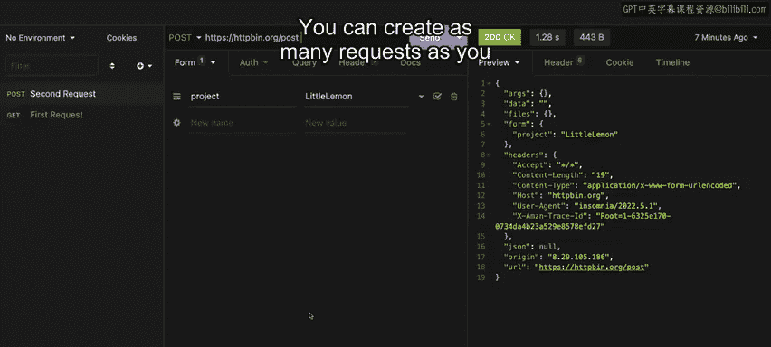
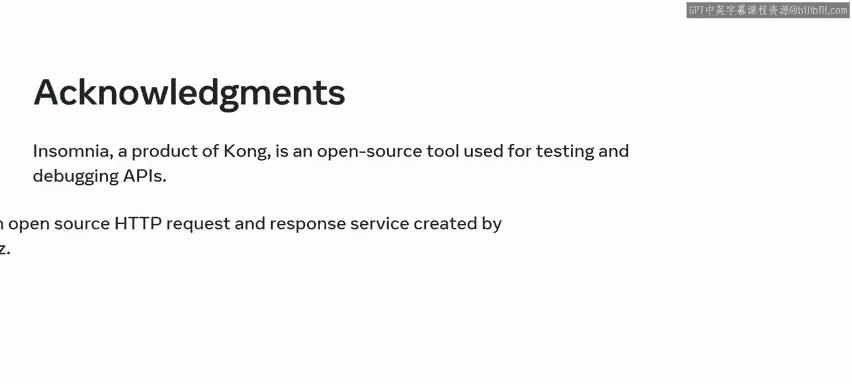

# Meta《后端开发（Django／APIs／全栈／毕业项目／面试）｜Meta Back-End Developer》中英字幕 - P61：5_面向api开发的基本工具.zh_en - GPT中英字幕课程资源 - BV1SZ421y7Fv

If you want to work quickly and efficiently as a developer， you need the right tools； for example。

 an intelligent code editor can help you develop more rapidly and become more competent。

In this video， you will learn about a few command line and graphical tools that you can use to play around with your APIs。

 You will also explore a practical demonstration of how to test As in insomnia。

 These tools are a across platform so you can use them on Windows， Mac OS and Linux。

 You will be using some of these tools like insomnia throughout this course。

 so it's important to learn about them now。 Let's get started。First is curl。

 a well known tool for developers who want to make HTTP calls from the command line。

 It is available for all major operating systems， but it doesn't have a graphical tool。To use curl。

 simply open your power shell in Windows or the terminal in Linux or Macs。 type curl and hit enter。

Curl makes it easy to send H T T P get requests。 For example， simply add the API U R I after curl。

 This command sends a H T T P get request to postman Echo a service from postman to display the headers and request body sent to it。

 Pretty useful for testing API calls。It works slightly differently for a post request This time。

 add the request body using hyphen D and the H TTP method name， which is post preceded by hyphen X。

The second tool is Postman， which has cross platform desktop tools that make it easy to test and debug APIs with an advanced graphical interface and a web version。

 Postman is a powerful tool for API development。 with Postman。

 you spend less time fiddling with API details。 and more time building the perfect API。

 You can explore their website and the additional resources for more information and learning materials。

Another important tool is the insomnia rest client， a powerful rest API client used to store。

 organize and execute rest API requests。Insomnia is free。

 Cross platform and comes with a very user friendly interface。

 You can download and install insomnia for your operating system from the link provided in the additional resources at the end of this lesson。

 Note that theres only a desktop version for insomnia。

In the rest of this course， you will be using insomnia to play and interact with the APIs you build。

 Let's examine how to use it。Insomnia is a great tool for playing with As。

 All requests in insomnia will be saved in a request collection to get started。

 click on the create button in the top right corner and select request collection。

 Give it a name like first collection and click on create。😊。

Now， you are inside an empty collection to create your first API request。

 click on the plus icon on the left sidebar and select H TTP request。

 You can also do this by pressing command plus N on Mac O or control plus N in Windows and Linux。

You can double click on the default request name new request。

 and change the name to something more personal like first request。

At the top of the middle section where it says get。

 you can click and select the type of H T TP method your request is going to be。

 Leave it as get for now。In the text box next to it， write your API URL， H T TPS。

 H TTP bin dot org forward slash get question mark project equals little Le。HTTPBd。

 org is a free service that allows you to experiment with different types of HTTP methods。

When you call one of these APIs， it prints back what you sent to it。Now。

 hit the send button on the right， and you will see that H T T B bin has returned the same query argument you sent to it。

Which， in your case， was project is equal to little lemon。This time。

 let's try making a new H TTP post request to do this。

 click on the plus icon in the left sidebar and select H TTP request。 Once the request is created。

 double click on its name and give it a new name， such as second request。

Now click on the HTTP method drop down and select post and this time add HtTPShtTPBin。

org forward/lash post in the URL field。You already know that a H T TP post request accepts arguments as form data or Json data with insomnia。

 you can easily input data for a post request by clicking on the body tab and selecting form URL encoded or Json。

Here in this argument window， you can finally lay out all your arguments in an easy to use and organized manner。

On the left， you can write the argument name and on the right， the value。

Write project in the argument field and little lemon as the value。 Now。

 click on the send button to display the output。 You can create as many requests as you want and come back later to play with them any time in this video。

 you learned about great tools such as curl， postman and insomnia that you can use to create and test your A Ps。

