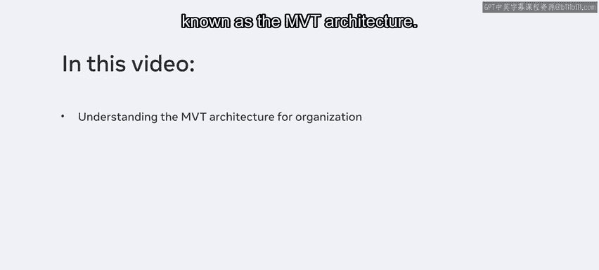
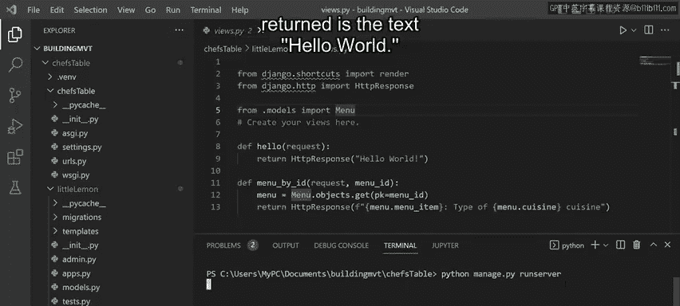
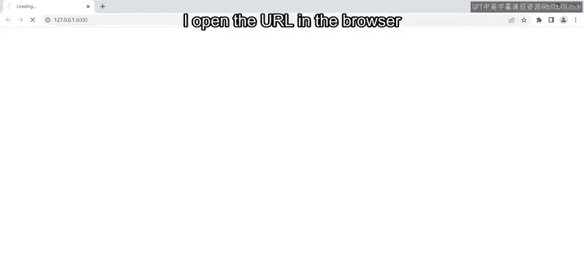
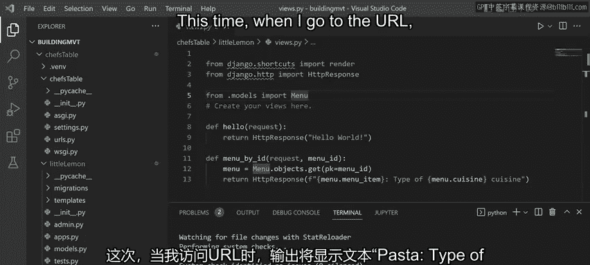
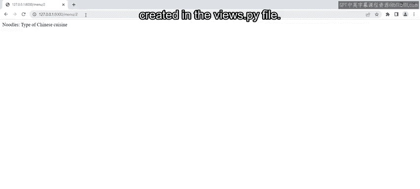
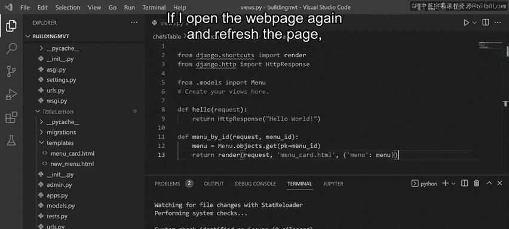
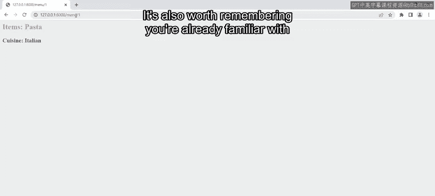
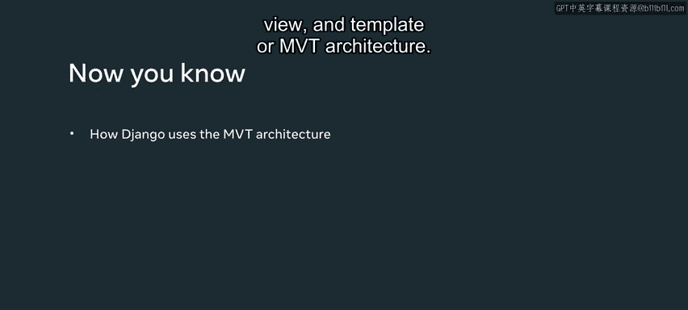

# 后端开发：P9：MVT架构示例 🏗️

在本节课中，我们将要学习Django框架的核心组织方式——MVT（模型-视图-模板）架构。我们将通过三个循序渐进的示例，了解数据、逻辑和显示是如何在Django项目中分离的，并理解这种分离如何帮助开发者构建大型、可维护的Web应用。

你已经了解到，Django项目可以变得非常庞大。对于一个有抱负的开发者来说，Django项目包含许多活动部件，这很容易让人望而生畏。在本视频中，我将为你提供一个宏观概述，并演示Django如何使用模型、视图和模板（通常称为MVT架构）来组织一个项目。




如果你不能完全理解本视频中的所有概念，请不要担心，因为你很快就会学到它们。相反，请专注于理解在Django框架中，数据、逻辑和显示是相互分离的这一概念。你甚至可以将本视频视为对未来开发者如何在后端开发中使用Django框架的一次预览。

## 项目结构概览

之前，我创建了一个名为`Building_MVT`的文件夹。展开它，你会注意到我创建了一个名为`tutorial_env`的虚拟环境。我还创建了一个名为`Chefs_Table`的项目，并在该项目中安装了Django。

在`Chefs_Table`项目内部，请注意我创建了一个名为`Little_Lemon`的应用。同时，Django已经自动为项目和应用创建了相关的文件。

在演示MVT架构的文件之前，我首先需要更新两个地方的`urls.py`文件，以便Django能将不同的URL匹配到正确的视图函数。在这些文件中，我已经添加了将调用视图函数的URL。

## 三个MVT示例

现在，我将通过三个示例来演示MVT架构的概念。第一个示例将只包含视图。接下来是一个包含模型和视图的示例。最后，是一个包含模型、视图和模板的完整示例。

### 示例一：仅包含视图

让我们从第一个仅包含视图的示例开始。如果你打开`views.py`文件，会注意到它包含一个Python函数，该函数向运行在本地主机开发服务器上的网页发送一些数据。在这个示例中，返回的数据是文本“Hello World”。

```python
# views.py 中的函数示例
from django.http import HttpResponse

def hello_world(request):
    return HttpResponse("Hello World")
```

现在让我演示一下。启动开发服务器，在浏览器中打开URL，你会看到文本“Hello World”被显示出来。






好的，让我关闭浏览器窗口并停止服务器。

### 示例二：模型与视图

对于第二个示例，我对代码做了一些修改，以演示视图如何与模型协同工作。请注意，我在`views.py`文件中创建了另一个函数。这个函数与模型通信，从数据库表中检索存储的数据，然后动态地将其返回到Web浏览器。

现在，让我们探索模型如何与数据库通信。打开`models.py`文件，你会注意到这段代码包含一个Python类，它代表数据库中的一个表，而创建的每个变量都像是该表中的一列。

```python
# models.py 中的模型示例
from django.db import models

class MenuItem(models.Model):
    name = models.CharField(max_length=100)
    cuisine_type = models.CharField(max_length=50)
    # ... 其他字段
```

如果你熟悉关系数据库的概念，可能会好奇这是如何实现的。目前，你只需要知道Django将类中的代码映射到数据库中存储的相应表即可。



好的，让我再次运行服务器。这次，当我访问URL时，输出将显示文本“pasta type of Italian cuisine”。


Django根据URL中发送的数值，动态地从数据库表中获取了文本。这个数值对应于表中的某个条目。目前它的值是1。如果我将它从1改为2，你会注意到浏览器输出了不同的文本。这之所以可能，是因为在`views.py`文件中创建的逻辑。

### 示例三：完整的MVT（模型、视图、模板）

对于最后一个示例，我需要修改视图以返回一个模板。我在应用文件夹内创建了这个模板。请注意，如果我展开这个文件夹，里面会有一个名为`menucard.html`的文件。




该文件包含三个带有基本样式的HTML元素。在这最后一个示例中，除了添加模板和修改`views.py`文件外，我没有做任何其他更改。

如果我再次打开网页并刷新页面，输出将显示应用了HTML和CSS的样式。




这种格式和样式将应用于我做出更改的所有页面。重要的是要注意，虽然这个输出看起来可能很基础，但其概念非常强大。通过将数据、逻辑和显示分离为M、V和T，开发者可以快速创建大规模的数据驱动应用程序。

## MVT架构的优势

MVT架构允许开发者轻松地更新数据库、逻辑代码、呈现方式和样式，以创建动态的Web应用程序。虽然项目文件夹中的文件数量可能看起来令人生畏，但你将在本课程的后续部分中，在需要时探索这些文件。

正如我在视频开头所说，你很快就会更详细地探索这个MVT概念。同样值得记住的是，你已经熟悉将要处理的代码，因为它主要是Python。



## 总结


在本节课中，我们一起学习了Django如何影响模型、视图和模板（MVT）架构。我们通过三个示例看到了数据（模型）、业务逻辑（视图）和用户界面（模板）是如何分离的。这种分离使得代码更易于维护、测试和扩展，是构建健壮后端应用的基础。记住，MVT是Django高效开发的核心模式。



