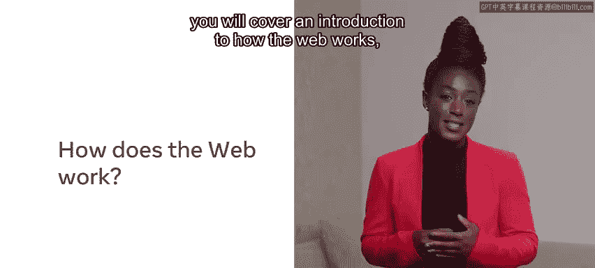
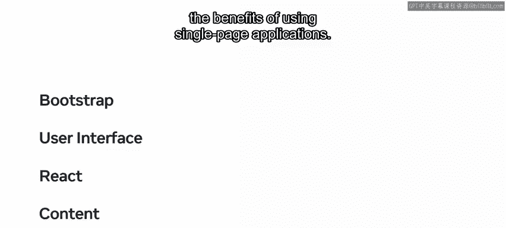

# 后端开发（简介/Python/Git/数据库）：P2：1_课程简介

在本节课中，我们将要学习Meta后端开发专业证书课程的整体介绍。课程将概述互联网如何运作，并引导你从零开始学习构建网站和Web应用所需的核心技术与工具。

## 概述：互联网与Web开发

你每天进行的许多活动都可以完全在线完成。你可以使用手机、电脑、平板或其他设备上的应用程序访问网络，执行购物、预订酒店以及与朋友和同事聊天等任务。

随着远程工作日益普及，你可以在家中舒适地工作、与同事互动并保持高效。这一切的实现，依赖于互联网基础设施、技术以及构建你所使用应用程序的专业人员的技能。需要说明的是，当你遇到“app”这个术语时，它可能指手机上的应用程序，也可能指在网站上或以其他在线方式运行的Web应用程序。

## 课程内容概览

上一节我们了解了互联网的普遍性，本节中我们来看看本课程将具体涵盖哪些内容。

从模块1开始，你将学习互联网的工作原理，包括对网页、Web服务器和Web浏览器的探索。你将了解它们各自是什么，以及它们在将互联网呈现给你时所扮演的角色。

你还将获得使用HTML、CSS和JavaScript等核心互联网技术的实践机会。你将学习开发者如何将这些技术结合起来，构建功能性和交互性的网站与Web应用程序。

随着课程的深入，你将探索专业开发者使用的一些工具，并学习使用最佳实践和标准进行编码的基础知识。

以下是开发者常用工具的一个例子：
*   你将学习如何使用网页浏览器内置的开发者工具。
*   你将学习使用被称为集成开发环境（IDE）的行业标准软件进行编码。专业人士使用IDE来更高效地编写代码。

在模块2中，你将通过HTML5和CSS的介绍开启编码之旅。你将学习这两种语言的基础知识，以及它们如何相互配合来布局和样式化网页上的元素。这包括文本、图像和视频等多媒体元素。

此外，为了确保你的网页对所有人都可访问，你将学习如何进行Web无障碍编码。

在模块3中，你将学习开发者如何使用框架和库。本模块将重点介绍响应式设计。你将学习如何实现Bootstrap库，使网页无论使用何种类型的设备都能提供出色的浏览体验。

你还将了解用户界面（UI）设计，以及如何使用常见的UI组件，并通过灵活的Bootstrap网格系统来定位它们。

接下来，你将接触React——一个免费开源的JavaScript库，开发者用它基于UI组件来构建用户界面。然后，你将了解静态内容与动态内容的区别，以及使用单页应用程序的好处。

说到内容，在模块4中，你将有机会通过编辑你自己的个人传记网页来实践新学到的技能。

## 学习路径与建议

上一节我们介绍了课程的技术模块，本节中我们来了解如何有效地完成这门课程。

总而言之，本课程为你提供了Web开发的入门介绍。它是一个引导你走向软件开发职业的系列课程的一部分。你的课程中有许多视频，将逐步引导你实现这个目标。

观看、暂停、回放并重新观看视频，直到你对自己的技能充满信心。然后，通过查阅课程阅读材料来巩固你的知识，并在课程练习中将你的技能付诸实践。

在学习过程中，你会遇到几个知识测验，可以用于自我检查进度。

考虑成为Web开发者的并非只有你一人，课程中的讨论提示使你能够与同学建立联系。这是分享知识、讨论困难和结交新朋友的好方法。

为了在课程中取得成功，你应该尝试为你的学习计划制定一个时间表。理想情况下，为自己设定一个固定的学习时段和时长。

你可能在本视频中遇到了许多新的技术词汇和术语。如果你现在不能完全理解所有这些术语，请不要担心。随着课程的推进，一切都会变得更加清晰。

## 总结

本节课中我们一起学习了Meta后端开发课程的总体介绍。我们了解了课程将如何从互联网基础讲起，逐步深入到HTML、CSS、JavaScript、响应式设计、Bootstrap、React等核心Web技术，并强调了实践、社区互动和制定学习计划的重要性。现在，你已经为开启Web开发之旅做好了准备。