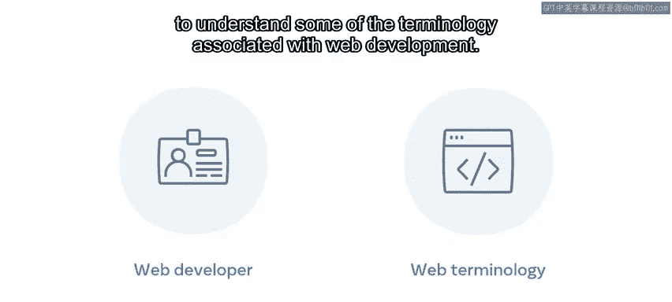
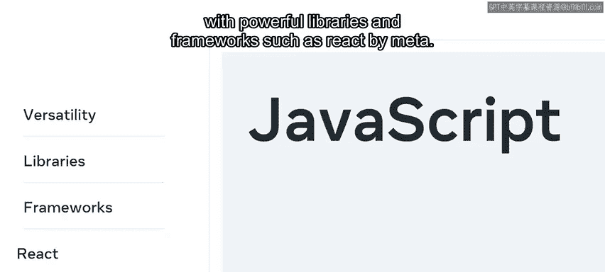
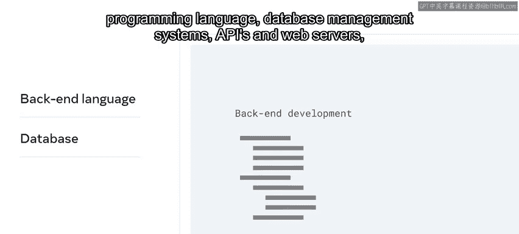

# 后端开发（简介/Python/Git/数据库）：P3：前端、后端和全栈开发人员角色

## 概述

在本节课中，我们将要学习网站和应用开发中的三种核心角色：前端开发人员、后端开发人员以及全栈开发人员。我们将了解他们的职责、所需技能以及彼此之间的区别，帮助你找到适合自己的发展方向。

当你在餐厅用餐时，通常会有许多厨师在不同的区域准备你的餐点。同样地，对于你每天使用的网站和应用程序，也有许多不同的角色参与其中，共同将这些项目交付给用户。

如果你去查阅一份高薪IT工作的列表，Web开发人员的角色肯定会名列前茅，并且理由充分。如果没有开发人员在我们设备上创建、架构和维护我们每天使用的技术，我们生活的数字世界将不复存在。

然而，对于有志成为开发人员的人来说，理解与Web开发相关的一些术语可能会令人困惑。为你找到合适的领域，将取决于你对Web开发人员的角色、职责和技术的更深入理解。

## 前端开发人员 👨‍💻

上一节我们介绍了Web开发中的不同角色，本节中我们来看看前端开发人员。

前端开发人员负责处理网站或Web应用中用户将与之交互的所有部分。这可以包括样式、颜色、按钮、菜单，或者用户在点击、滑动和与网站交互时的用户体验。

前端开发人员的技能可能有所不同，但他们始终会专注于三项核心技术：**HTML**、**CSS**和**JavaScript**。

以下是前端开发的一个典型任务示例：

假设你是一名前端开发人员，被分配了在网站主页上添加新闻通讯注册选项的任务。在这种情况下，你会使用**HTML**来构建显示元素，例如供用户输入电子邮件地址的输入区域，以及点击发送的按钮。

然后，你可以使用**CSS**来定位、着色和设计这些元素在页面上的样式。

最后，你可以使用**JavaScript**来处理用户点击按钮时的活动。这可能是检查电子邮件地址是否有效，然后将该电子邮件地址发送到网站，以便存储在新闻通讯成员列表中。

虽然HTML和CSS技能至关重要，但最关键的技能通常是**JavaScript**。它是前端技术的核心动力。这主要是因为它的多功能性，以及它与强大的库和框架（例如Meta的**React**）相结合的事实。这些工具可用于构建快速、安全且高度可扩展的、以丰富用户界面为驱动的企业网站和Web应用。

前端开发人员的薪资具有竞争力，并可能根据经验而有所不同。通常，前端开发人员的职位会面向初级、中级和高级专业人士开放。对于有志成为开发人员的人来说，这是一个很好的入门领域。通过展示一些核心概念和技能的基础演示，以及一个引人注目的作品集样本，就有可能进入初级职位的就业市场。

## 后端开发人员 🖥️

了解了前端开发人员后，我们接下来看看后端开发人员的工作。

后端开发人员负责处理网站或Web应用中最终用户看不到的部分。这些活动发生在幕后，特别是在Web服务器上、数据库中或在构建架构时。

后端开发人员负责在用户请求信息时，或网站需要与Web架构的另一部分进行通信以进行处理时，创建和维护功能。例如，执行账户登录或使用信用卡完成在线购买。后端开发人员将促进网站与数据库中存储内容的交互。

因此，后端开发需要不同的语言、技能和工具。虽然这些可能有所不同，但它们通常包括与后端编程语言、数据库管理系统和Web服务器相关的知识。

后端开发人员的薪资与前端开发人员相似，取决于经验。尽管如此，在某些情况下，薪资可能会更高，特别是对于入门级和高级职位。这是因为开始学习后端技术需要更多的设置、配置、资源和一般的基础结构知识。这与前端形成对比，在前端，你仅使用一个Web浏览器就可以开始学习一些元素。

通往后端开发的道路通常比较漫长，因为你必须精通前端技术的需求。这可能包括互联网、网络和服务器的内部工作原理。对于有志成为开发人员的人来说，首先从前端开始，然后在获得专业知识后再转向后端，这是相当常见的。

## 全栈开发人员 🌐

前面我们分别探讨了前端和后端，现在我们来认识一下结合两者的全栈开发人员。

全栈开发人员是指能够同样熟练地处理前端和后端技术的人。全栈开发人员在Web开发项目周期的所有领域都拥有技能和知识。例如，他们在网站或Web应用的规划、架构、设计、开发、部署和维护方面拥有相关的专业知识。

全栈开发人员的职位通常处于更高级别的水平。要成为一名全栈开发人员，需要花费一些时间来获取知识、专业经验和技能。因此，该领域的职位需求很高，并且是IT行业中薪酬最高的工作之一。

## 总结

本节课中，我们一起学习了Web开发中的三种主要角色。前端开发人员专注于用户直接看到和交互的部分，主要使用**HTML**、**CSS**和**JavaScript**。后端开发人员则负责幕后的服务器、数据库和业务逻辑，使用如**Python**、**Java**等后端语言和数据库技术。而全栈开发人员则兼具前端和后端的技能，能够处理整个开发流程。理解这些角色的区别和联系，将帮助你明确自己的学习路径和职业目标。