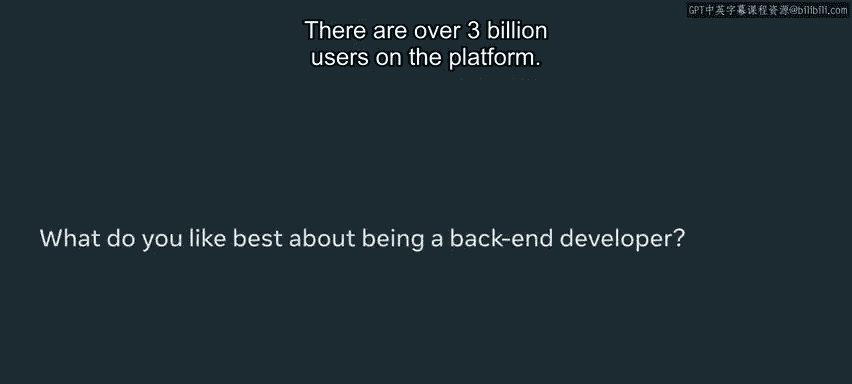
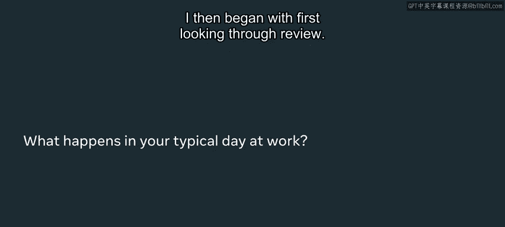
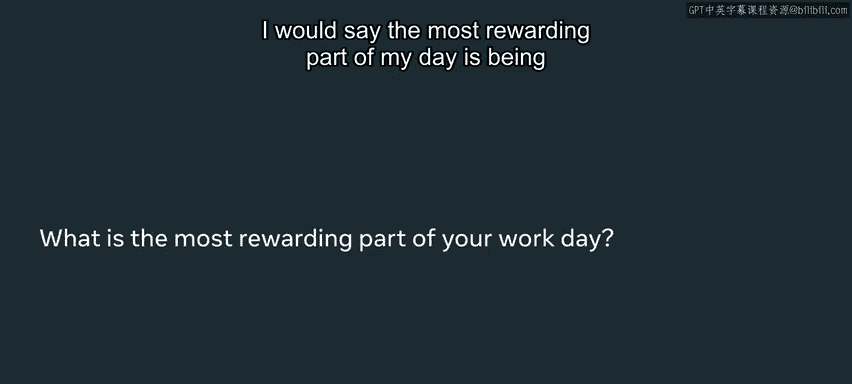
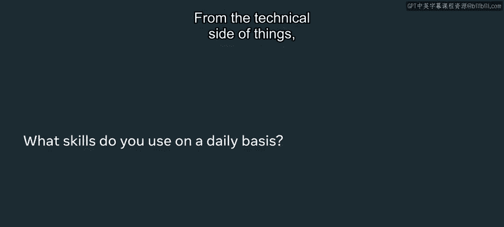
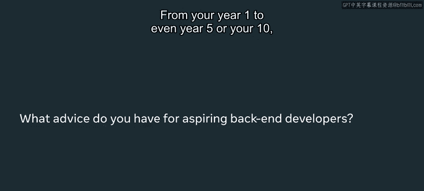

# Meta《后端开发（简介／Python／Git／数据库）｜Meta Back-End Developer》中英字幕 - P4：3_后端开发人员的一天.zh_en - GPT中英字幕课程资源 - BV1wr421H72b

Have you ever wondered how your app loads up so fast or how when you keep on scrolling。

 the information comes back just as quick， we help to pretty much build snappy programs。

 build architectural solutions that can help you use your app well and efficiently。All right。

My name is Grace Ebo and I'm a backend engineer at Meta and I help to build solutions that can help build our products at Me at scale to run efficiently and reliably。

 My hope is that you get to understand just a little bit more about what a backend engineer is and the unique value that they add to the team there are over 3 billion users on the platform And so a question that always comes up is how can we ensure that we are able to support all these users that are using this platform and not let's say bring down the site or make the programs and applications to be really slow。

 And so for me， that's probably one of the cool parts that I like to do is how to optimize and see how can I make this experience of even faster。

 How can I push the limits how can I continue to make it of a more efficient and better experience for users after I get some food and get my fuel up。

 I then begin what first looking through review So I pretty much review my coworker。

Code just to see how I can support them。 I there anything that looks good。

 anything that needs changes just so they can get their code to production。 And then from there。

 I usually have some meetings。 And these meetings usually are around the area of either updates or what are potential projects that we can be working on then begin to code and get into my flow。

 I would say the most rewarding part of my day is。

Being able to have a potential solution to something that has probably been nagging at my brain for days at Meadow。

 we honestly encounter some really complex problems。

 Almost the fact that I think they're impossible sometimes But that's the beauty of being able to really push the limits and say。

 can we go faster， Can we make it more snappiier。 Can we make it more ideal for even our client and engineers to work with。

 Something I've had dreams。 about just potential code optimizations。

 And then it's just when I now say kind of that aha moment， is like this can work。 This is it。

 And I write it now。 type it in the code。 and then bo， that's it。 it actually works。

 and is actually helping to achieve the goal that I set when I wrote it on my note。

 So from the technical side of things。 I use Python。

 I use Java more so depending on the project and what could kind of help me achieve my goal easier。

 because definitely languages each have their prose in their cons。😊。

But what you may not always realize is that soft skills are even all the more necessary。

 So things like communication how are you able to listen and listen， not just to respond。

 but actually listen to understand。 And when you hear different perspectives that may not agree with yours。

 And especially in this distributed remote world， it has become all the more necessary as well。

 So I work with front end engineers and full stack engineers in honestly diverse ways。 So。

 for example， on my team in particular， we usually have a product And then from there。

 we are able to just deviate up based on different platforms and use cases。

 And so as a backend engineer， I'm able to now build what is called the schema and the architecture of how we should be able to use this data。

😊，And it's a two way street。 Sometimes for client and front end engineers and say。

 we actually need this data to be worded this way， or we need it to be in a different structure。

 So from there， I can either update， change， optimize just to ensure that the client engineers they able to do their work more efficiently as well。

 And in the end， we want to ensure that we build a product for our users that it's well built and efficient and scalable for ultimately years to come。

From your year one to even year five or year 10。

There is always going to be something that you may not know It is always going to be an opportunity to learn something new and to continue to grow your skill set and your repository。

 pun intended of different technologies and opportunities to grow and make things more optimal or or scalable at different companies。

 There is always going to be a need of how we can scale of how we can make things more snapier about how we can make things run more efficient。

 and it's you and the work that you're doing now that is going to be able to help power that in the future。

