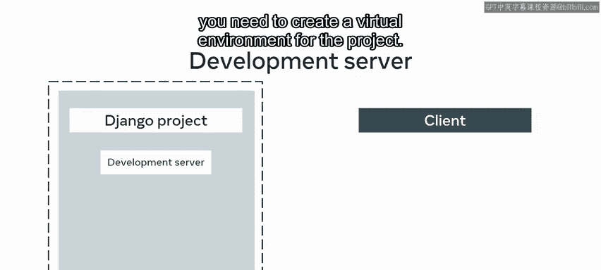
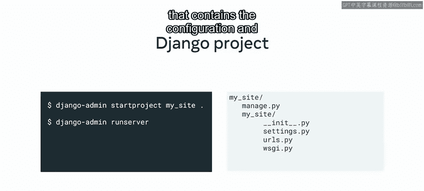
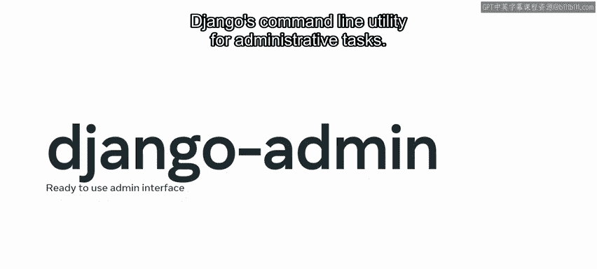
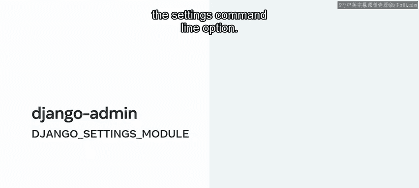
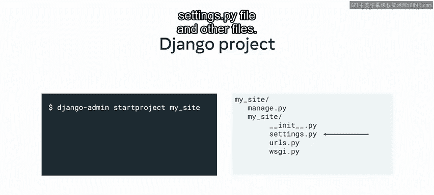
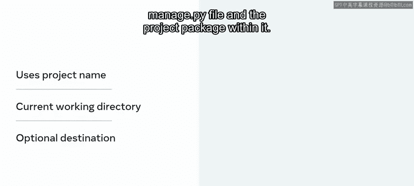
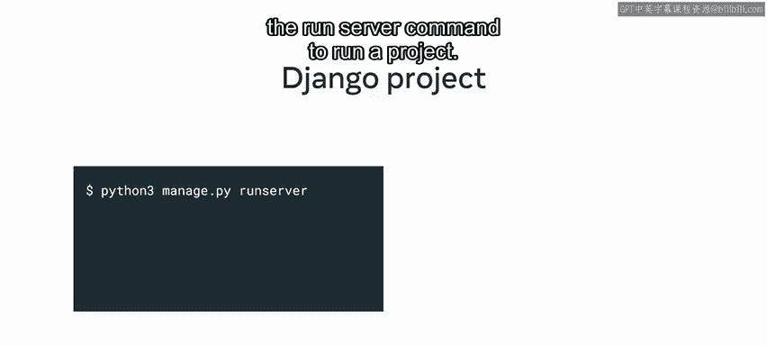
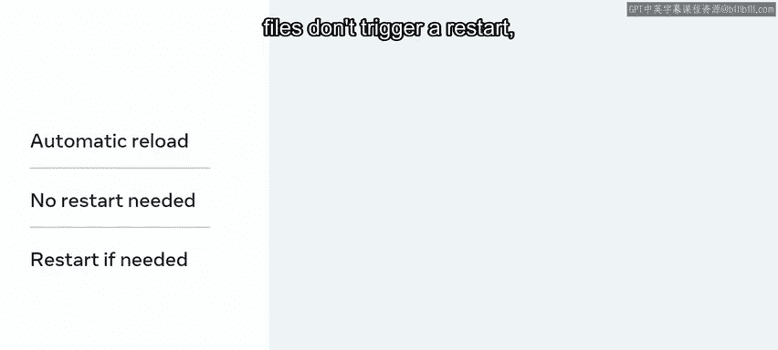

# 6：Django Admin与Manage.py命令详解 🛠️

在本节课中，我们将要学习Django框架中两个核心的命令行工具：`django-admin` 和 `manage.py`。你将了解它们的功能、区别以及如何在项目开发中正确使用它们来执行管理任务。




## 核心结构与命令回顾

上一节我们介绍了Django项目的核心结构。现在，我们来回顾一下创建和运行一个Django应用的基本流程。

要创建一个Django应用程序，你需要：
1.  为项目创建一个虚拟环境。
2.  创建项目。
3.  运行开发服务器。



你通过运行特定的命令来完成这些步骤，例如使用Django命令行工具执行 `startproject` 和 `runserver`。

Django提供了一系列命令，这些命令还会生成一个项目结构，其中包含与整个Web应用程序相关的配置和设置。

## 两种命令行工具：Django Admin 与 Manage.py

在Django项目中工作时，开发者有两种命令行工具选择来执行任务。



他们可以使用 `django-admin` 或 `manage.py`。虽然两者都可以用来执行相同的任务，但存在一些细微差别，你的使用选择将取决于你希望如何开展项目工作。

以下是两种工具的核心概念：

*   **`django-admin`**： 这是一个全局命令行工具，在你安装Django时生成。其路径通常位于Django环境目录的 `Scripts` 文件夹中。
    ```bash
    # 示例：使用django-admin创建项目
    django-admin startproject myproject
    ```
*   **`manage.py`**： 这是一个本地脚本，是 `django-admin` 的本地版本，位于项目文件夹内。它会设置 `DJANGO_SETTINGS_MODULE` 环境变量，使其指向你项目的 `settings.py` 文件。
    ```bash
    # 示例：使用manage.py运行服务器
    python manage.py runserver
    ```

`django-admin` 是一个在你安装Django时创建的文件。如果你通过 `pip` 安装了Django，`django-admin` 工具应该在你的系统路径上。如果你在系统路径上找不到它，请确保你已经激活了虚拟环境，并在其中使用 `pip3 install django` 这样的命令安装了Django。

`manage.py` 是一个每次创建Django项目时自动生成的文件。这个文件特定于项目的虚拟环境。它执行与 `django-admin` 相同的操作，但还会设置 `DJANGO_SETTINGS_MODULE` 环境变量以指向你项目的 `settings.py`。

通常，在单个Django项目上工作时，开发者倾向于使用 `manage.py`，因为 `django-admin` 的管理任务也可以用 `manage.py` 执行。然而，如果你需要在多个Django设置文件之间切换，可以使用带有 `--settings` 命令行选项的 `django-admin` 命令。

本视频中的命令行示例为保持一致性使用了 `django-admin`，但任何示例同样可以使用 `manage.py`。

## 关键命令详解



了解了工具的区别后，本节我们来看看两个最常用的命令：`startproject` 和 `runserver`。

### Startproject 命令

你可能记得使用 `startproject` 命令来创建一个Django项目。这会在当前目录或给定的目标路径中，为指定的项目名称创建一个Django项目目录结构。



默认情况下，新目录包含 `manage.py` 文件和一个项目包。这个项目包包含 `settings.py` 文件和其他文件。

需要注意的是，如果只提供了项目名称，项目目录和项目包都将使用与项目名称相同的名称。此外，项目目录将在当前工作目录中创建。

如果提供了一个可选的目标路径，Django将使用该现有目录作为项目目录，并在其中创建 `manage.py` 文件和项目包。



一个常见的开发者工作流程是使用句点符号 `.` 来表示当前工作目录，这样可以避免出现具有相同名称的子目录。

### Runserver 命令



回想一下，你使用 `runserver` 命令来运行一个项目。

此命令在你的本地机器上启动一个轻量级的开发Web服务器。默认情况下，服务器在IP地址 `127.0.0.1` 的端口 `8000` 上运行。然而，你可以通过显式传入IP地址和端口号来更改这一点。

```bash
# 示例：在指定端口运行服务器
python manage.py runserver 8080
# 或指定IP和端口
python manage.py runserver 0.0.0.0:8000
```

需要注意的是，如果你以具有普通权限的用户身份运行此脚本（这是推荐的），你可能无法在低端口号上启动端口。这是因为低端口号是为超级用户或root用户保留的。

开发服务器非常适合应用程序开发和测试。然而，Django建议你永远不要在生产环境中使用此服务器，因为它没有经过安全审计或性能测试。

开发服务器会根据需要为每个请求自动重新加载Python代码。你不需要为了代码更改生效而重启服务器。但是，某些操作（如添加文件）不会触发重启，在这些情况下，你必须重启服务器。



## 总结

本节课中我们一起学习了Django框架中两个核心的命令行工具 `django-admin` 和 `manage.py`。我们明确了 `django-admin` 是全局管理工具，而 `manage.py` 是项目特定的本地脚本。我们还详细探讨了创建项目的 `startproject` 命令和启动开发服务器的 `runserver` 命令的使用方法、注意事项以及它们之间的细微差别。掌握这些工具和命令是高效进行Django开发的基础。