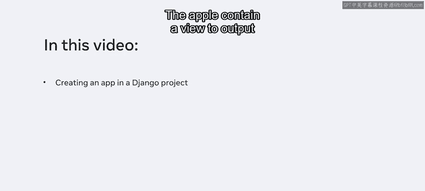
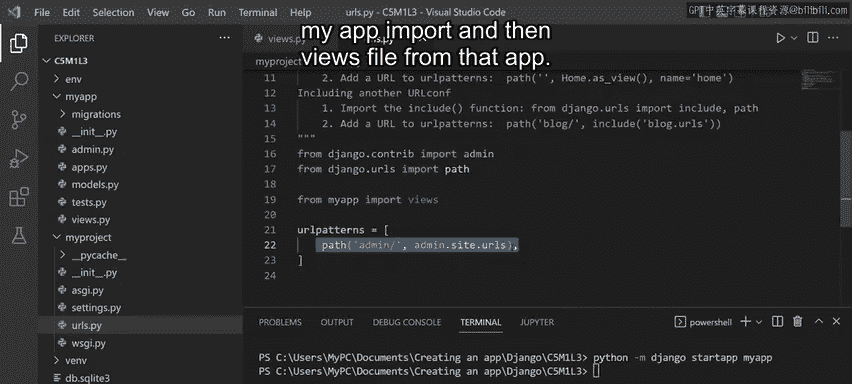
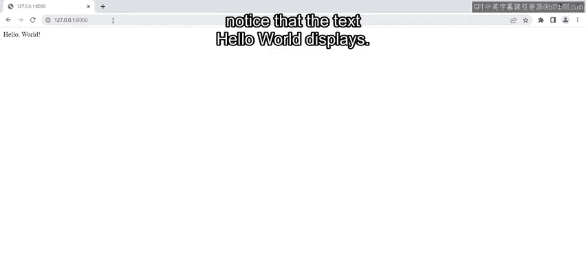
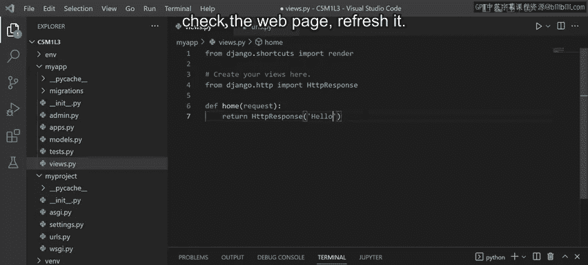
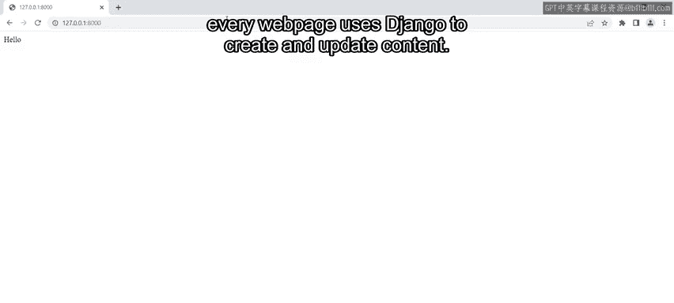
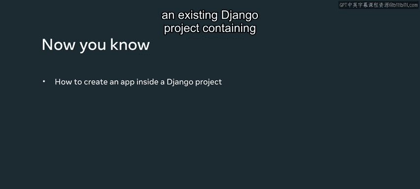

# 7：创建应用 🚀

在本节课中，我们将学习如何在现有的Django项目中创建一个应用（App）。应用是Django项目的功能模块，我们将创建一个简单的应用，使其能够在网页首页上输出“Hello World”文本。

---

## 项目与应用的关系



上一节我们介绍了Django项目的基本结构。本节中我们来看看如何向项目中添加功能模块。

一个Django项目代表整个Web应用程序，而应用则像是项目的子模块，用于提供特定的功能。之前我们已经设置了项目文件夹并在其中创建了虚拟环境。

---

## 创建Django应用

以下是创建Django应用的步骤。

首先，在项目目录下，使用`startapp`命令创建一个新应用。该命令的基本语法如下：

```bash
python manage.py startapp <app_label> [destination]
```

*   **`<app_label>`**： 这是应用的唯一名称。
*   **`[destination]`**： 这是可选参数，用于指定应用的创建位置。如果不指定，应用将默认创建在当前工作目录中。

例如，要创建一个名为`myapp`的应用，可以执行：

```bash
python manage.py startapp myapp
```

执行此命令后，项目文件夹内会生成一个名为`myapp`的新文件夹。该文件夹包含多个文件，如`__init__.py`、`admin.py`、`models.py`、`tests.py`和`views.py`。

对于初学者，无需立即理解每个文件的具体作用。关键在于理解概念：**通过创建应用来为项目添加不同的功能**。由于本项目目前只需在网页上显示文本，因此创建一个应用即可。

---

## 理解视图与路由

现在我们已经创建了应用，接下来需要让它能在首页输出文本。这需要用到Django中的两个核心概念：**路由（Routes）**和**视图（Views）**。

当用户访问网站首页时，我们希望显示一些文本。在Django中，当用户导航到一个URL时，该URL会被**路由**到一个称为**视图**的组件。

目前，你可以将视图简单地理解为**Python函数**，它负责生成构成网页的内容。视图函数接收一个请求（Request），并返回一个响应（Response）。由于请求和响应通过网络进行，因此会使用`HttpRequest`和`HttpResponse`这两个对象。

---

## 创建视图函数

首先，我们需要创建视图函数。打开应用文件夹中的`views.py`文件，你会发现Django已自动生成了一些代码。我们无需修改这些现有代码，只需添加新内容。

在`views.py`文件中添加以下代码：

```python
from django.http import HttpResponse

def home(request):
    return HttpResponse("Hello World")
```

*   **第一行**： 导入`HttpResponse`类，这是返回HTTP响应所必需的。
*   **`home`函数**： 这是一个视图函数，它接收一个`request`参数，并返回一个包含文本“Hello World”的`HttpResponse`对象。

需要注意的是，仅仅创建这个返回HTTP响应的函数本身并不会产生任何效果。它只是定义了当用户访问项目首页时需要执行的逻辑。

---

## 配置URL路由

为了使视图工作，我们需要将视图函数映射到一个URL。Django项目的URL配置存储在一个名为`urls.py`的文件中，该文件位于项目目录下。这个文件可以看作是一个**映射表**，Django用它来确定哪个视图函数与特定的URL相关联。

打开项目目录下的`urls.py`文件，你会看到Django已经生成了一些默认代码，包括导入语句和一个名为`urlpatterns`的列表。

我们需要在此文件中添加代码，将首页的URL映射到我们刚刚创建的`home`视图函数。

在`urls.py`文件中进行如下修改：



```python
from django.contrib import admin
from django.urls import path
# 导入视图模块
from myapp import views

urlpatterns = [
    path('admin/', admin.site.urls),
    # 添加首页路由映射
    path('', views.home, name='home'),
]
```

*   **`from myapp import views`**： 从我们的应用`myapp`中导入`views`模块。
*   **`path('', views.home, name='home')`**：
    *   `''`： 这是一个空字符串，代表网站的根路径，即首页。
    *   `views.home`： 指定当访问根路径时，应调用`views.py`中的`home`函数。
    *   `name='home'`： 为这个URL模式命名，这在后续开发中会很有用。

---

## 运行开发服务器并测试

代码配置完成后，保存所有更改。接下来，运行Django开发服务器以查看效果。

在终端中执行以下命令：

```bash
python manage.py runserver
```

服务器启动后，通常会运行在`http://127.0.0.1:8000/`（即本地主机）。你可能会看到一个关于“未应用迁移（unapplied migrations）”的警告，目前可以暂时忽略，我们将在后续课程中学习如何处理迁移。

现在，在浏览器中访问`http://127.0.0.1:8000/`，你应该能看到页面上显示“Hello World”文本。这段文本正是由我们的`home`视图函数返回的HTTP响应。



你可以尝试修改`views.py`中`HttpResponse`的文本内容，例如将“Hello World”改为“Hello Django”，保存文件后刷新浏览器页面，内容会立即更新。



---

## 总结

本节课中我们一起学习了如何在Django项目中创建应用。我们了解了项目与应用的关系，创建了一个名为`myapp`的应用，并编写了一个简单的视图函数来向网页输出文本。接着，我们通过配置`urls.py`文件，将网站的根URL路由到该视图函数，最终在开发服务器上成功运行并看到了结果。





虽然这个视图的内容非常简单，但**所有使用Django创建的网页内容，其创建和更新的核心流程都与此相同**。掌握了这个基础流程，就为后续学习更复杂的Django功能打下了坚实的基础。