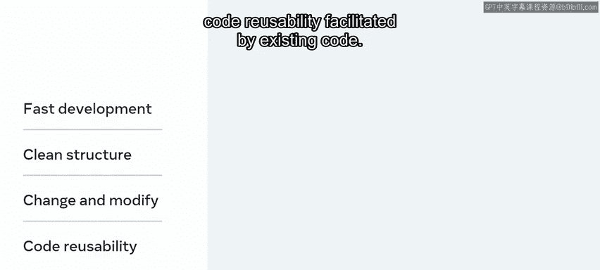
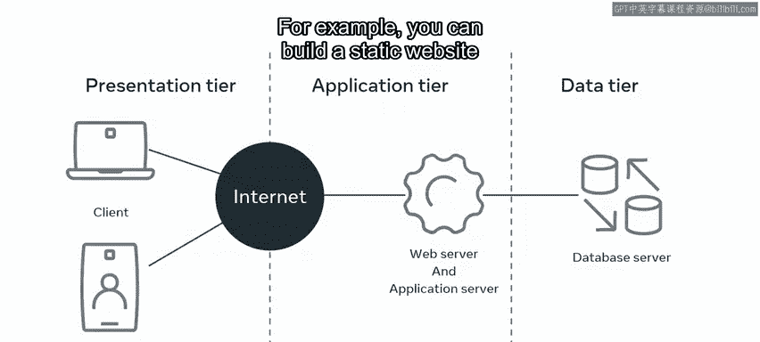
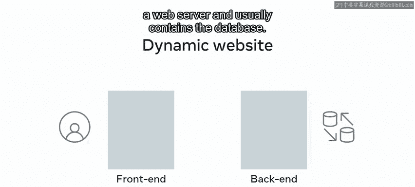
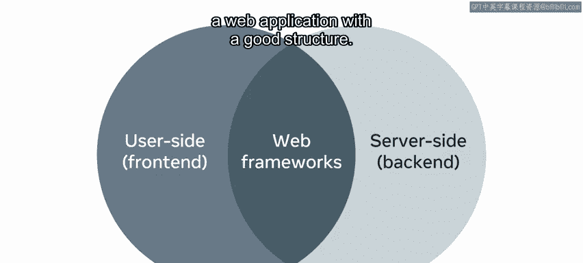
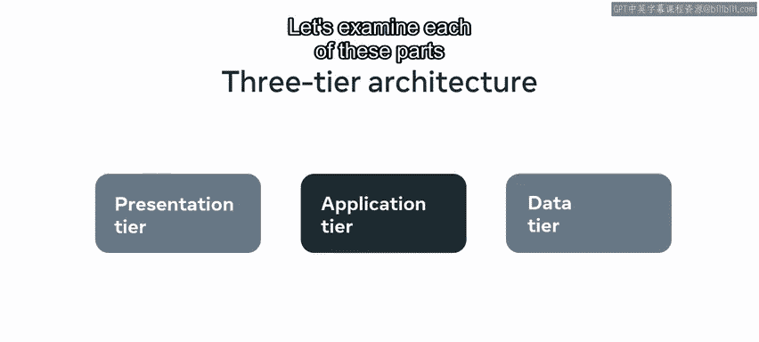
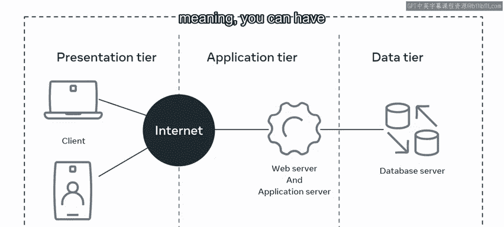

# 8：什么是Web框架 🧱

在本节课中，我们将要学习什么是Web框架，以及为什么Django是构建后端Web应用程序的热门选择。我们还将探讨三层架构的概念，以理解现代Web应用的基本结构。

---

作为一名有志于开发新Web项目的开发者，有时可能会对项目的结构方式感到困惑。因此，扎实地理解Web框架及其核心概念至关重要。

## 什么是Web框架？

Web框架旨在支持开发者构建Web应用程序。其目的是使应用程序开发更容易，并为开发者提供一个清晰的结构，以保持事物有序，并允许进行更改和修改。框架还通过现有代码促进了代码的可重用性。

## 为什么需要Web框架？

在构建Web应用程序时，理解存在许多不同的部分和组件非常重要。例如，你可以只用一些HTML、CSS和JavaScript构建一个静态网站。然而，假设你想添加电子商务功能，比如一个商店。在这种情况下，你将必须实现诸如用户登录、支付交易、安全性、性能以及处理从Web表单提交的数据等功能。

这将要求你的应用程序分为两部分：前端和后端。前端是用户通过Web浏览器与之交互的网站部分。后端是在Web服务器上运行的部分，通常包含数据库。

因此，如果你的网站需要诸如电子商务、网站用户、支付处理以及存储在数据库中的数据等功能，它很可能需要一个后端。更具体地说，需要一个后端应用程序来管理后端。

## 选择后端框架

在选择构建后端的框架时，有许多选项可供选择。这些框架都有一个共同的目标：提供功能以创建具有良好结构的Web应用程序。

如果打个比方，你可以将框架视为建造房屋的地基。你总是需要一个坚实的地基，没有它，房子就不会非常稳定。Web框架正是如此。它们提供了一个坚实的构建基础，而Django就是其中最受欢迎的之一。

## Django框架简介

Django是一个高级、免费、开源的Python Web框架，鼓励快速开发和简洁实用的设计。它由经验丰富的开发者构建，并处理了许多与Web开发相关的任务，让你可以专注于编写应用程序，而无需重复造轮子。

以下是使用Django框架的一些好处：

*   **速度**：Django速度极快，通过减少需要编写的代码量来加速开发过程。这意味着你可以尽可能快地将应用程序从概念变为成品。
*   **功能丰富**：Django功能齐全，包含许多开箱即用的功能，可用于处理常见的Web开发任务。这些任务包括用户认证、内容管理、站点地图和RSS订阅等。
*   **安全性**：Django非常安全，帮助开发者避免许多常见的安全错误。它提供了一个安全的内部中间件层，保护其免受试图窃取信息的常见攻击。
*   **可扩展性**：Django具有高度可扩展性。它允许数据存储在正在使用的服务器之外的其他服务器上，而无需太多配置更改。这提供了灵活性和速度，因此，一些网络上最繁忙的站点都利用了Django快速灵活扩展的能力。

## 三层架构

现在你已经对什么是Web框架以及为什么Django是应用程序开发的热门选择有了基本了解。让我们通过学习所谓的“三层架构”来探索其结构。

架构指的是软件系统的基本结构。现代应用程序倾向于构建在所谓的“三层架构”中。这是一种基于模块的客户端-服务器架构方法，将应用程序分为三个逻辑部分：表示层、应用层和数据层。

现在，让我们更详细地检查每个部分。

*   **表示层**：这是用户主要通过其桌面、笔记本电脑或移动设备上的用户界面与之交互的层。它通常使用UI框架或库（如Meta的React）构建，并通过应用程序接口发送结果与其他层通信。
*   **数据层**：通常由数据库服务器组成，用于存储和检索信息。动态网站需要能够存储和检索数据。数据库是最佳选择，因为它将数据存储在表或对象中（取决于数据库的选择）。
*   **应用层**：这是连接其他两层的部分。它从表示层获取数据，并将其持久化到数据层。重要的是要注意，这些部分是逻辑上的，而非物理上的。这意味着你可以在同一个Web服务器上运行所有三层。

---

在本节课中，我们一起学习了Web框架的概念，了解了Django作为后端开发框架的优势，并探讨了构建Web应用程序的三层架构模型。理解这些基础概念是成为一名高效后端开发者的重要一步。