# 11：视图

在本节课中，我们将要学习Django框架中的核心概念——视图。我们将了解什么是视图，以及开发者如何使用视图来处理HTTP请求并返回HTTP响应。

## 静态网站与动态网站

如果你正在构建一个基本的静态网站，你只需要将网站文件上传到Web服务器即可。

然而，如果你正在使用框架构建一个动态网站，你可能需要获取或检索数据并将其渲染到浏览器。这些数据可以是任何内容，例如用户的姓名或信息列表。

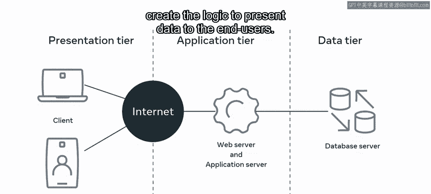

在Django中，你使用一种称为“视图”的东西来创建向最终用户呈现数据的逻辑。

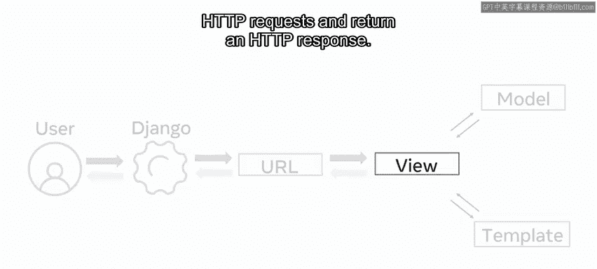

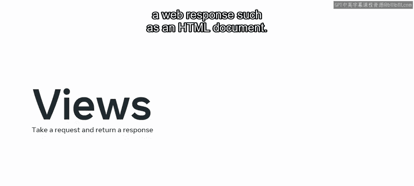

## 什么是Django视图？

在Django中，视图是一个专门设计用于处理Web请求并返回Web响应（例如HTML文档）的函数。

为了演示这一点，让我们通过一个静态文件和一个动态文件的例子来探索HTTP请求-响应场景。

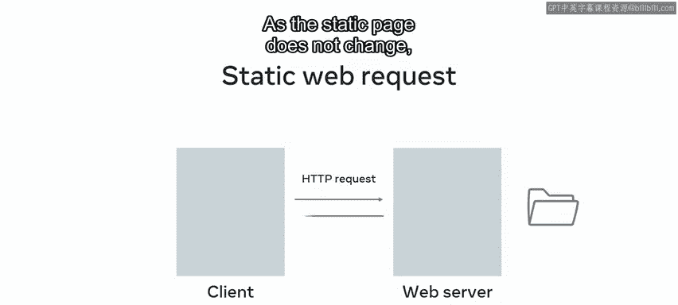

对于一个没有动态内容的静态文件，HTTP请求只需要映射到文件所在的位置并返回该页面进行渲染。由于静态页面不会改变，因此不需要其他操作。

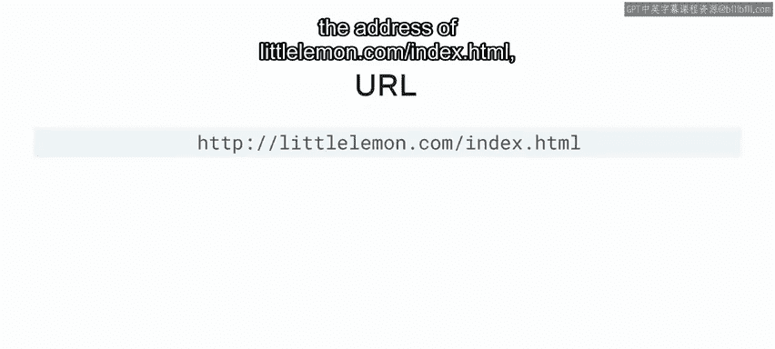

假设页面地址是 `littlelemon.com/index.htm`。

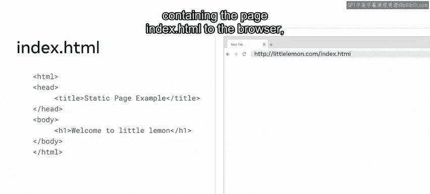

Web服务器将处理该请求，并返回一个包含 `index.htm` 页面的响应给浏览器，然后浏览器渲染内容。

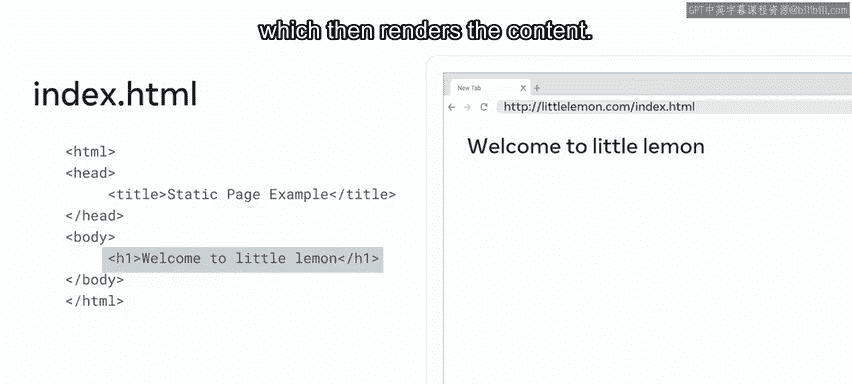

你可能还记得，这个过程被称为HTTP请求-响应周期。

然而，如果你想在Django中做同样的事情，你需要编写一个Python函数来创建一个叫做“视图”的东西。

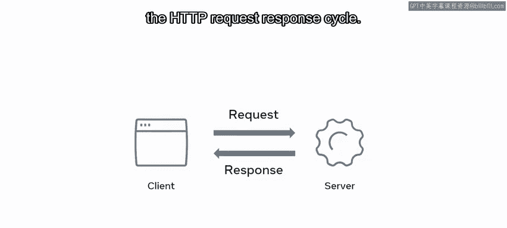

## 创建视图函数

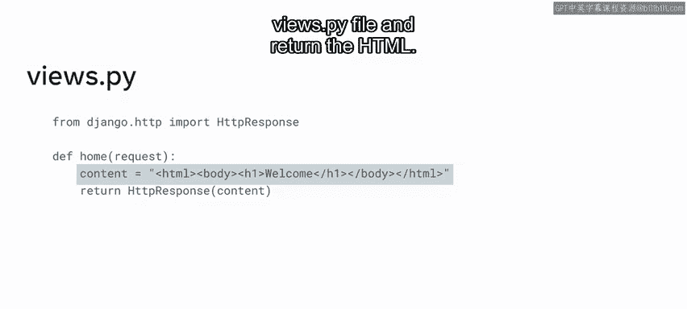

你在 `views.py` 文件中创建这个函数并返回HTML。

现在让我们进一步探索这个概念，并逐行分析代码。

首先，从 `django.http` 模块导入 `HttpResponse` 类。

接下来，定义一个名为 `home` 的函数，这被称为视图函数。每个视图函数都将一个HTTP请求对象作为其第一个参数，通常命名为 `request`。

由于这是一个Python函数，可以定义更多参数并传递参数，你将在本课程后面学到这一点。

需要知道的是，你给视图函数起的名字并不重要。Django不需要以某种特定方式命名函数来识别它。

在这个例子中，它被命名为 `home`，因为定义一个能清楚表明函数作用的函数名是一种良好实践。

接下来，创建一个变量，并用它来存储一个包含要返回的HTML的字符串。同样，你可以随意命名这个变量。在这个例子中，它被命名为 `content`。

最后，你需要返回这个包含代码的变量，通过使用 `return` 语句和 `HttpResponse` 对象来实现。在 `HttpResponse` 内部，你放置这个变量。

你还可以在视图函数内部执行其他编程逻辑，例如处理电子邮件和表单的数据、从数据库检索数据、转换数据以及渲染模板。

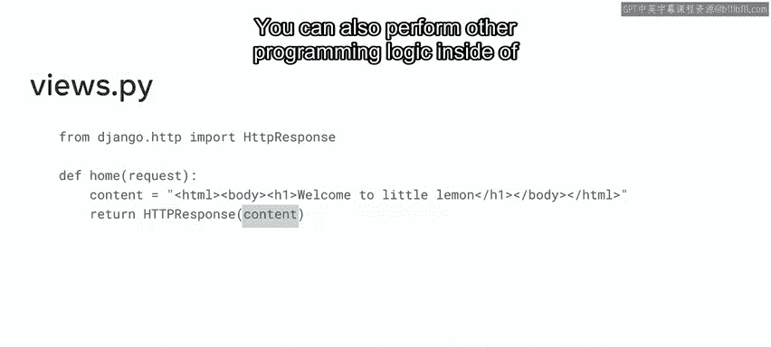

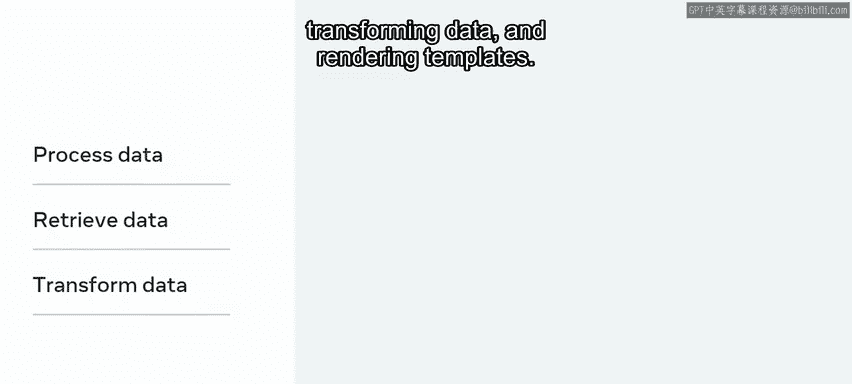

## 视图文件与URL映射

需要知道的是，作为最佳实践，你在 `views.py` 文件中创建视图函数。

理论上，你可以随意命名该文件，但最好将其保持为 `views.py`，因为这使得在同一项目上工作的其他开发者更容易理解。

**重要提示**：仅仅创建视图函数不足以使请求-响应工作。视图函数需要映射到一个URL，这样当对该URL发出请求时，视图函数才会被调用。

这个将URL映射到视图函数的过程被称为**路由**。

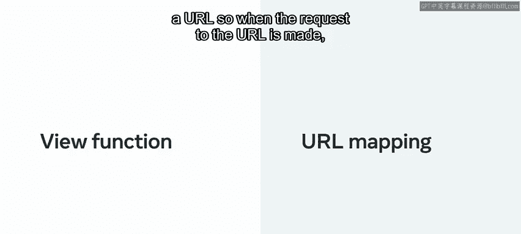

## 设置路由

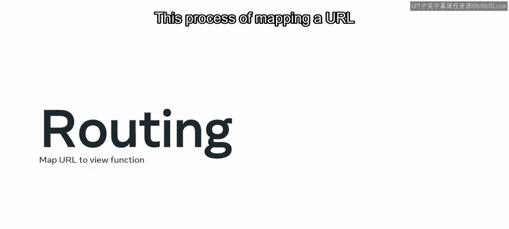

要设置此路由以将URL映射到视图，你需要在项目应用中创建一个新文件，创建一个名为 `urls.py` 的新文件。你可能记得项目也有一个同名的文件，你将在后面了解它们之间的区别。

在应用的 `urls.py` 文件中，首先导入 `path` 函数。

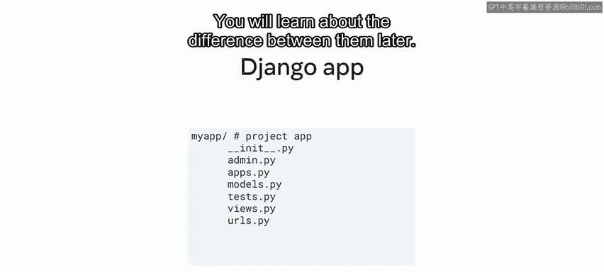

然后，从应用目录导入 `views.py` 文件。注意，两个文件在同一目录中，你只需要在 `import` 语句后放置一个点符号。

接下来，要创建路由并将URL映射到视图，你需要使用变量 `urlpatterns` 创建一个列表序列。

这个变量被分配给一个列表，该列表包含你想在应用内部创建的URL路径。

`urlpatterns` 列表可以包含多个路径，每个路径都是使用 `path` 函数创建的。该函数可以接受参数，其中两个是必需的。

第一个参数是 `route`，它是一个包含URL模式的字符串。

第二个参数是 `view`，它包含视图函数的相对路径和名称。

在这个例子中，视图函数是为应用的主页调用的，所以目前 `route` 被设置为空字符串。

你将在本课程后面学习如何用表示为字符串的URL来填充 `route` 参数。

## 总结

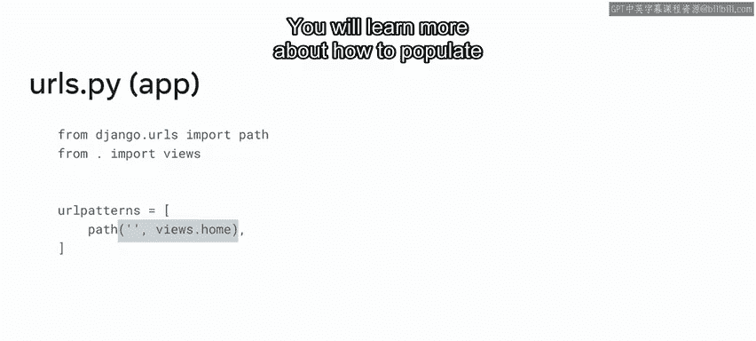

本节课中我们一起学习了视图和视图函数，以及开发者如何使用它们来处理HTTP请求并返回HTTP响应。

我们还学习了视图函数通过应用 `urls.py` 文件中的 `path` 函数映射到URL。