# 14：HTTP请求 🔗

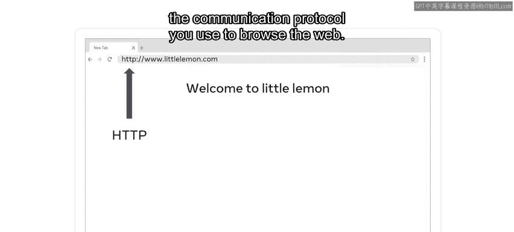

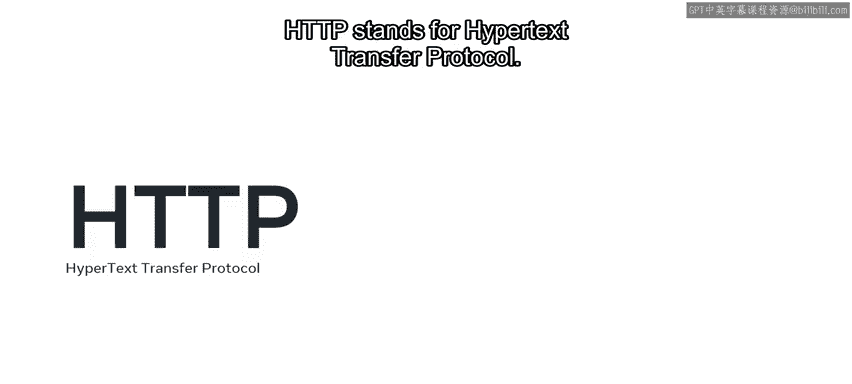

在本节课中，我们将要学习HTTP协议的基础知识。HTTP是万维网的核心通信协议，它定义了客户端（如浏览器）与服务器之间如何交换信息。我们将了解HTTP请求和响应的结构、常见的HTTP方法、状态码，以及安全的HTTPS协议。

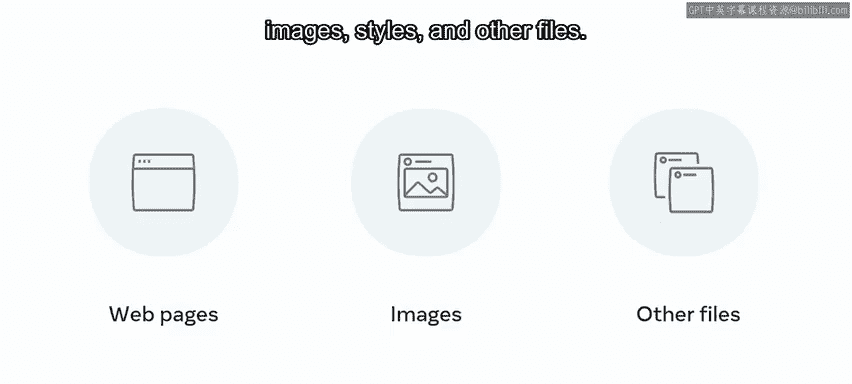

你是否注意过浏览器地址栏URL旁边的锁形图标？这表示正在使用的是HTTPS，即HTTP的安全版本。HTTP是万维网的核心操作协议。它使你的网页浏览器能够与托管网站的Web服务器进行通信。大多数时候，你浏览网页使用的通信协议就是HTTP。

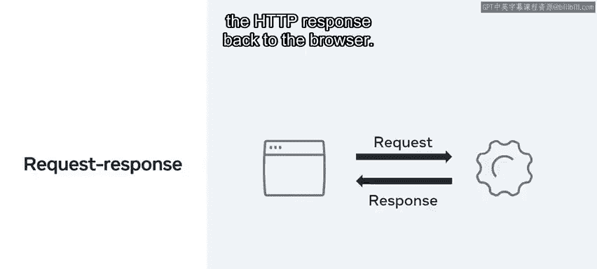

## HTTP的定义与作用 🌐

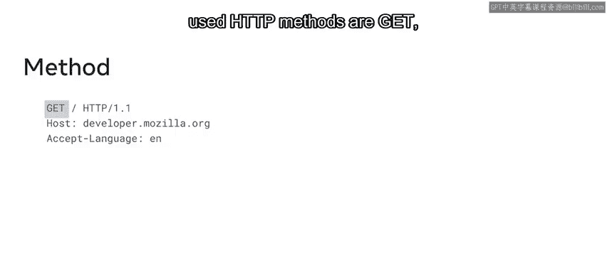

HTTP代表超文本传输协议。它是一种用于传输Web资源（如HTML文档、图像、样式表和其他文件）的协议。

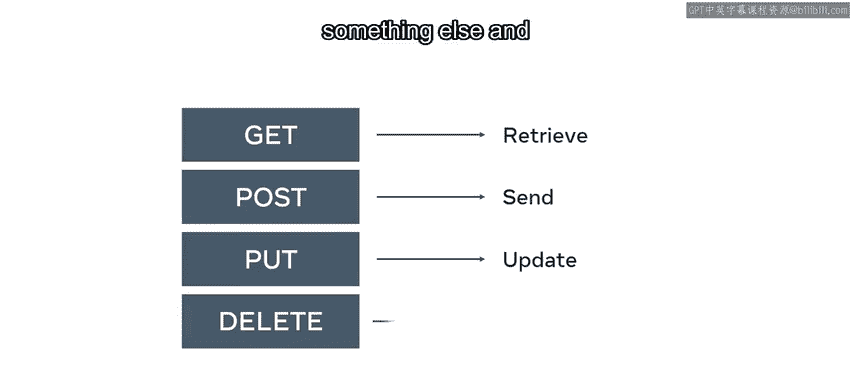

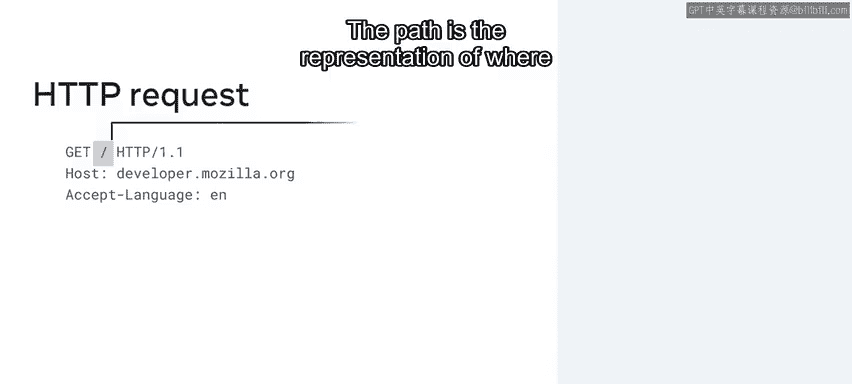

HTTP是一种基于请求-响应的协议。Web浏览器或客户端向服务器发送HTTP请求，然后Web服务器将HTTP响应发送回浏览器。

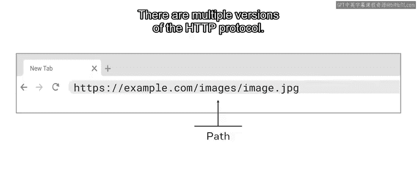

## HTTP请求的构成 📤

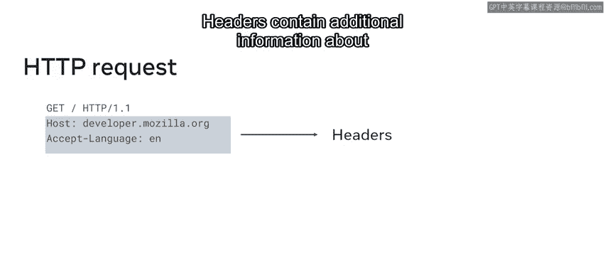

上一节我们介绍了HTTP的基本概念，本节中我们来看看HTTP请求的具体构成。一个HTTP请求由方法、路径、版本和头部组成。

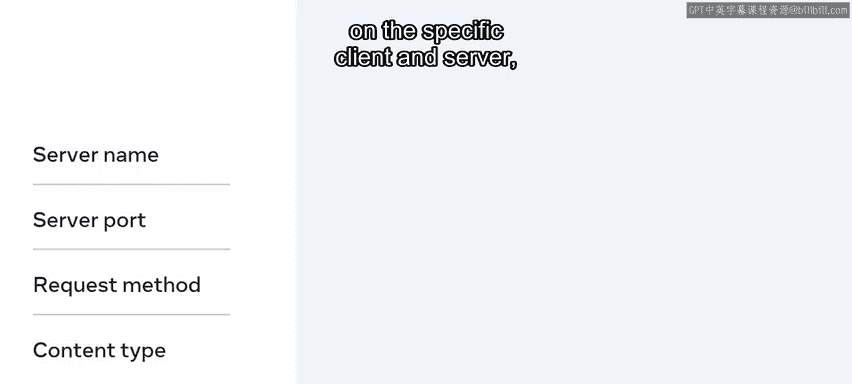

HTTP方法描述了客户端希望执行的操作类型，并将其传达给服务器。主要或最常用的HTTP方法有：**GET**、**POST**、**PUT**和**DELETE**。

以下是这些方法的详细说明：
*   **GET**方法用于从给定服务器检索信息。
*   **POST**请求用于向服务器发送数据。
*   **PUT**方法用新内容更新Web服务器上现有的资源。
*   **DELETE**方法用于删除资源。

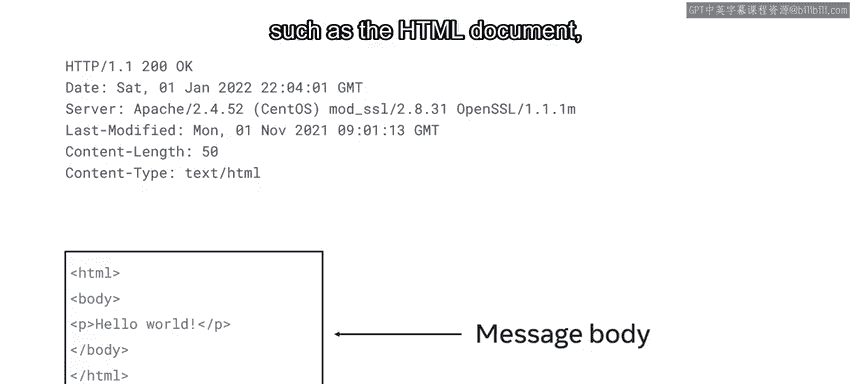

路径表示资源在Web服务器上的存储位置。例如，如果你想从网站的某个页面请求一张图片，那么地址栏中的URL就需要包含该文件在Web服务器上的完整路径。

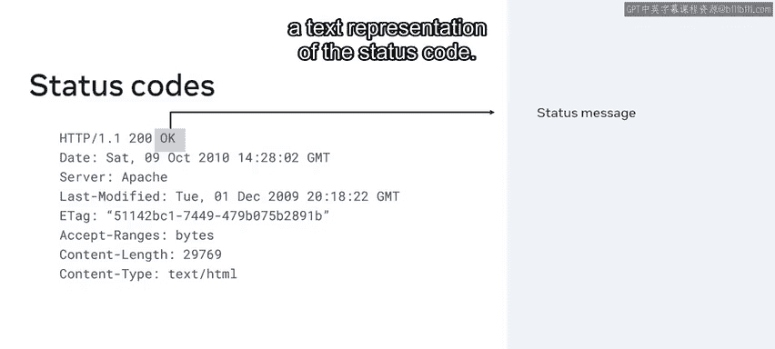

HTTP协议有多个版本，目前最常用的是1.1和2.0版本。

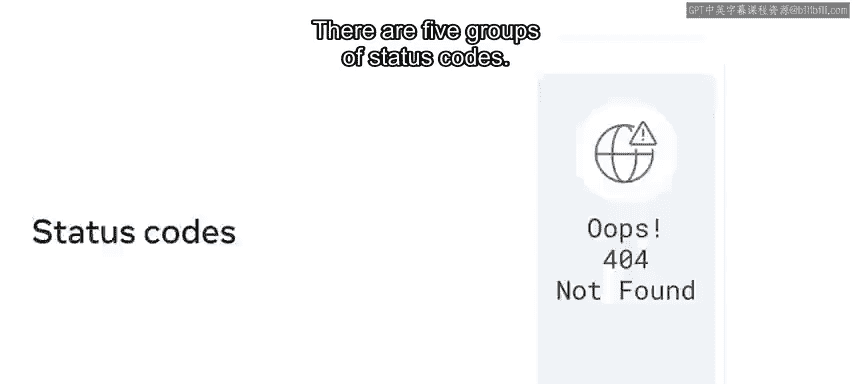

最后是头部。头部包含关于请求以及发出请求的客户端的附加信息。头部可以包含诸如服务器名称、服务器端口、请求方法类型和内容类型等信息。头部的内容可能因特定的客户端和服务器而异，但上述是一些最常见的。

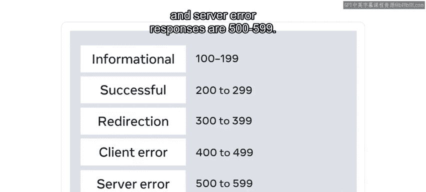

对于某些请求方法（如POST），请求还会包含客户端正在发送的内容主体。

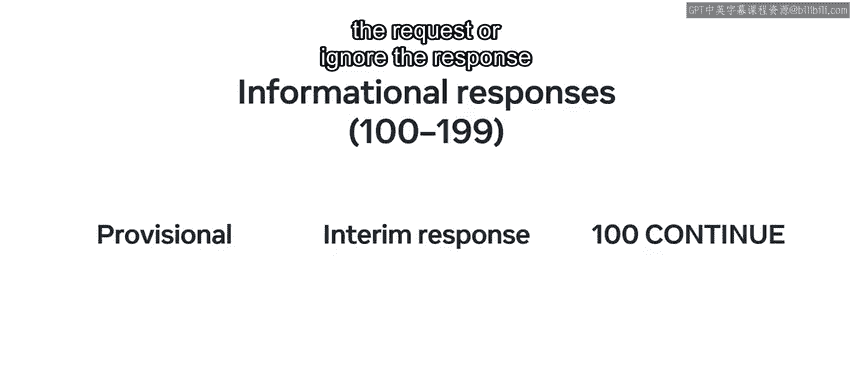

## HTTP响应的构成 📥

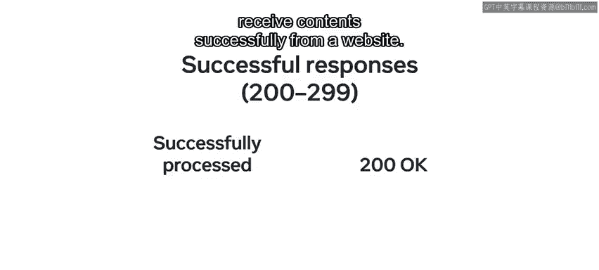

了解了请求的构成后，我们来看看HTTP响应的格式。HTTP响应的格式与请求格式相似。在头部之后，响应可以选择性地包含一个由响应内容（如HTML文档、图像文件等）组成的消息体。

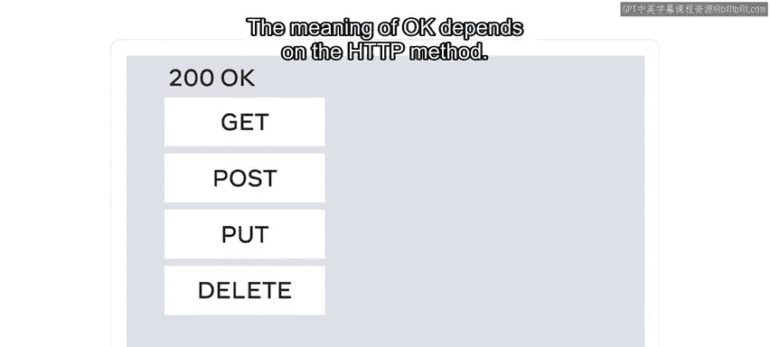

头部中包含的HTTP状态码指示HTTP请求是否成功完成。状态码的值范围在100到599之间，并按用途分组。状态消息是状态码的文本表示。

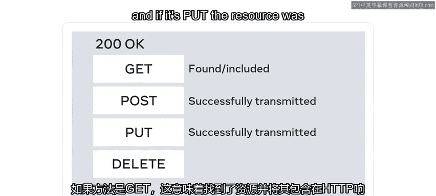

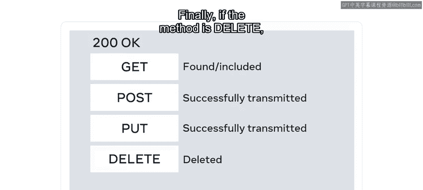

在你浏览网页时，是否遇到过显示“404 未找到”或“500 服务器无响应”错误的页面？让我们简要探讨一下这些HTTP状态码及其分组。

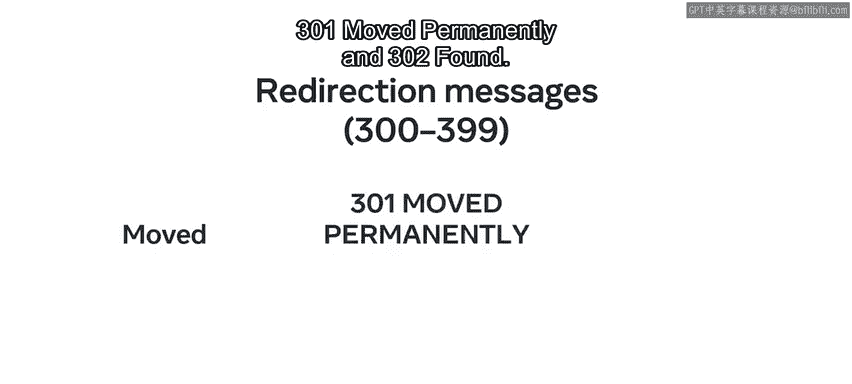

状态码分为五组，它们由状态码的第一个数字来划分：
*   **信息响应**：100到199。
*   **成功响应**：200到299。
*   **重定向消息**：300到399。
*   **客户端错误响应**：400到499。
*   **服务器错误响应**：500到599。

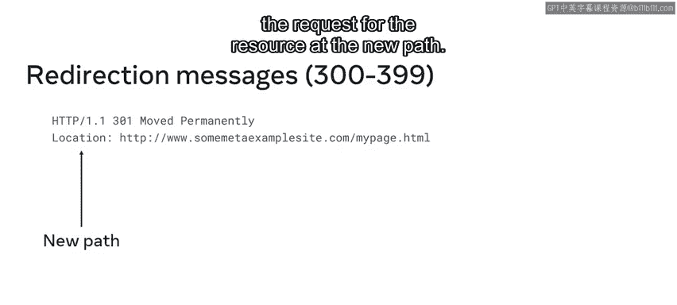

以下是各组状态码的详细说明：
*   **信息响应**是服务器发送的临时响应。这些响应是实际响应之前的中间响应。最常见的信息响应是**100 Continue**，它指示Web客户端应继续请求，或者如果请求已完成则忽略此响应。
*   **成功响应**表示请求已被Web服务器成功处理，最常见的成功响应是**200 OK**。当你成功从网站接收到内容时，你每天都在接收这些响应。“OK”的含义取决于HTTP方法：如果方法是GET，意味着资源已找到并包含在HTTP响应的主体中；如果是POST，意味着资源已成功传输到Web服务器；如果是PUT，意味着资源已成功传输到Web服务器；最后，如果是DELETE，意味着资源已被删除。
*   **重定向响应**指示Web客户端，所请求的资源已被移动到不同的路径。最常用的响应代码是**301 Moved Permanently**（永久移动）和**302 Found**（临时移动）。重定向消息301和302之间的区别在于，302表示临时重定向，即资源已被临时移动。当Web浏览器收到这些响应时，它们会自动向新路径提交对该资源的请求。
*   **客户端错误响应**表示请求包含错误的语法或内容，或者无法被Web服务器处理。让我们探讨一些最常见的响应代码：**400 Bad Request**用于Web浏览器或客户端向Web服务器提交了错误数据时；**401 Unauthorized**用于指示用户必须在请求被处理之前登录账户；**403 Forbidden**用于指示请求有效，但Web服务器拒绝处理它，这通常用于表示用户在Web应用程序中没有足够的权限来执行某项操作；**404 Not Found**用于指示在Web服务器上未找到请求的资源。
*   **服务器错误响应**表示Web服务器在尝试处理请求时发生故障。最常用的代码是**500 Internal Server Error**，这是一个通用错误状态，表示服务器未能处理请求。

## 安全的HTTP：HTTPS 🔒

你是否曾在网上购物并需要输入信用卡信息？你肯定不希望别人从HTTP请求中获取这些信息，对吧？这时就必须使用HTTPS。HTTPS是HTTP的安全版本。

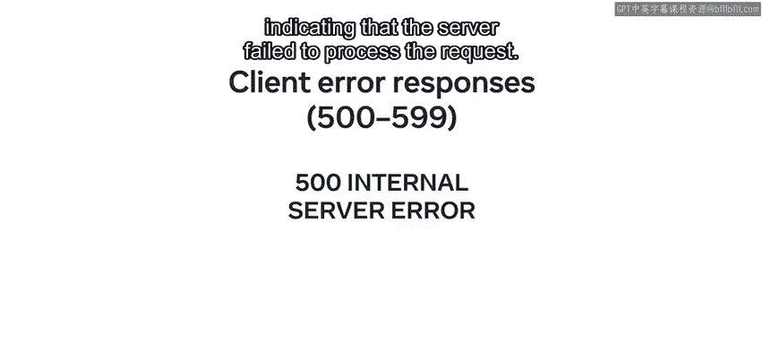

它用于两台计算机之间的安全通信，以确保其他人无法看到正在发送和接收的信息。这是通过一种叫做**加密**的技术实现的。

与HTTP一样，HTTPS中的请求和响应行为方式相同，内容也相同。最大的区别在于，内容在发送之前会被转换成**秘密代码**。只有另一台计算机才能将这个秘密代码转换回原始内容。如果有人查看这段代码，它将无法被理解。

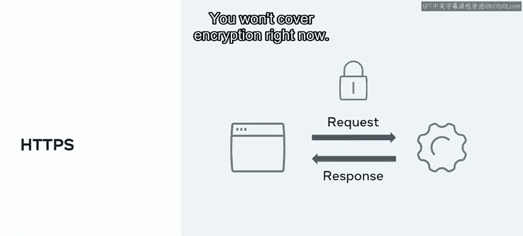

你每天都在使用HTTPS。这就是你在浏览器URL旁边看到的锁形图标。

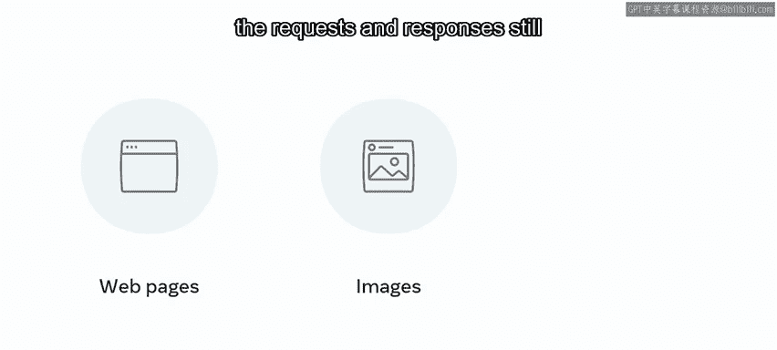

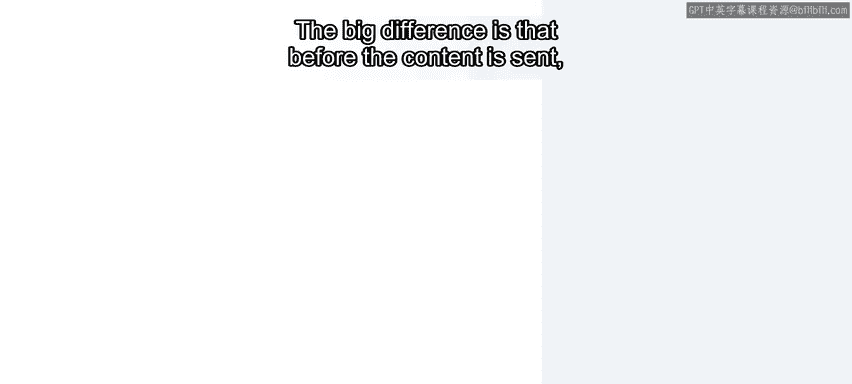

## 总结 📝

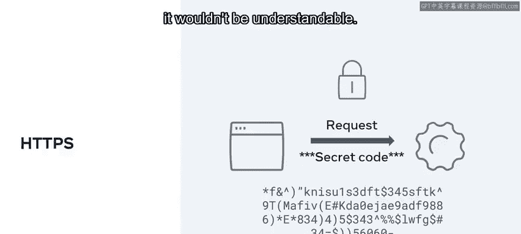

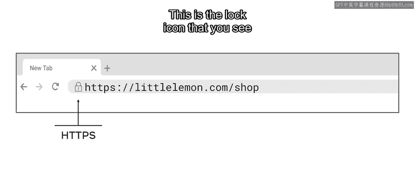

本节课中我们一起学习了HTTP协议的核心知识。

首先，HTTP是Web客户端和Web服务器使用的协议。它用于传输HTML文件等Web资源，是网络上任何数据交换的基础。同时请记住，通过使用HTTPS，我们可以安全地发送信息。

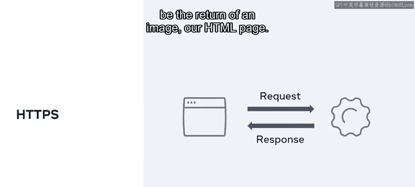

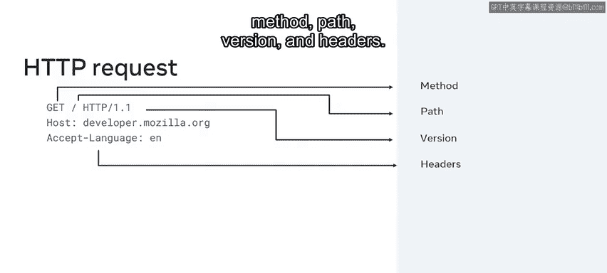

请求由客户端（通常是Web浏览器）发送，服务器则用响应进行回复，响应内容可能是一张图片或一个HTML页面。HTTP请求的语法包括**方法**、**路径**、**版本**和**头部**。

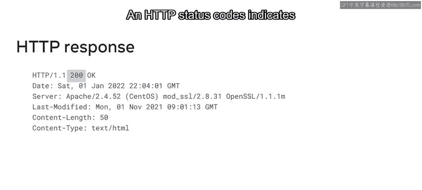

HTTP响应的格式与请求类似，HTTP状态码指示HTTP请求是否成功完成。状态码是一个三位数，对应着代表不同类型结果的分组。

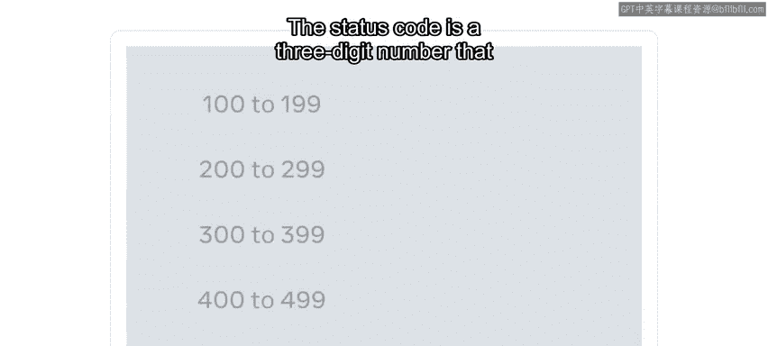

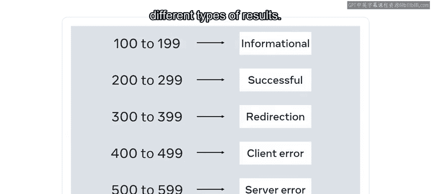

现在，你已经了解了HTTP协议的请求和响应循环是如何工作的，知道了它的方法以及构成HTTP请求的各个要素。做得好！