# 18：17_URL中的正则表达式 📝

在本节课中，我们将要学习如何在Django中使用正则表达式来定义和验证动态URL模式。正则表达式是一种强大的工具，可以帮助我们精确地匹配URL中的特定模式，从而将请求正确地路由到对应的视图函数。

---

现在，你应该已经熟悉了在Django中使用参数映射URL的概念。

Django允许你自由设计URL，这是通过使用`path`函数和路径转换器实现的。例如，创建一个包含动态值的自定义URL。

对于更复杂的匹配需求，你可以使用一种叫做**正则表达式**的东西来定义自己的路径转换器。在本视频中，你将学习如何使用正则表达式在Django中定义URL模式。

假设你接到一个任务，要为Little Lemon网站创建一个菜单项页面。该页面显示菜单上每个项目的内容。

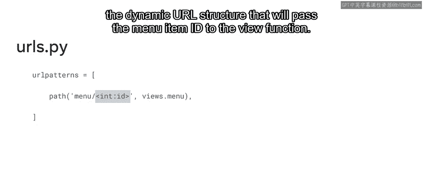

与其为每个菜单项制作一个单独的页面，你可以定义一个动态的URL结构，将菜单项的ID传递给视图函数。


页面的内容将取决于从URL传递给视图函数的菜单项值。根据URL中传递的ID值，视图函数中的逻辑将决定显示什么类型的数据，例如菜单项名称。

这对开发者的优势在于，他们只需要创建一个页面。开发者无需为每个菜单项创建单独的静态页面，只需创建一个页面，其内容根据URL中传递的值动态更新。

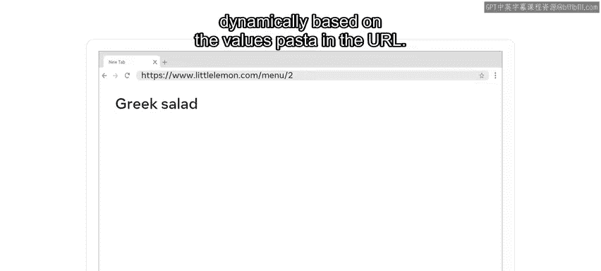


然而，为了确保URL的结构符合视图函数的要求，你需要一种方法来定义和验证URL的值和格式。

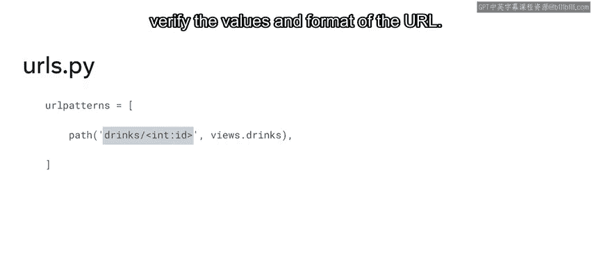


为了验证传递给视图函数的URL值是否正确，你可以使用正则表达式。正则表达式（RegEx）是一组指定模式的字符，用于在字符串中搜索或查找模式。


它们是开发者用来执行提取和验证、高级搜索、分组搜索以及查找和替换操作的强大工具。

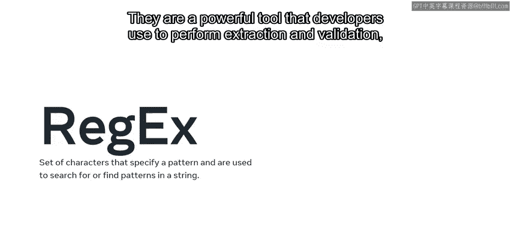
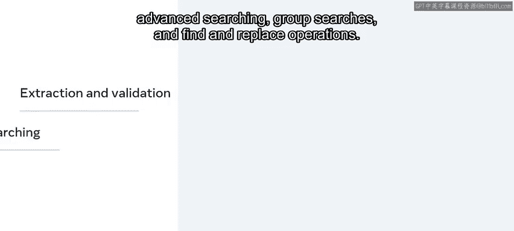
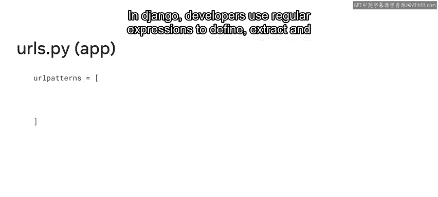


在Django中，开发者在将动态URL路径发送到关联的视图函数之前，使用正则表达式来定义、提取和验证它们。


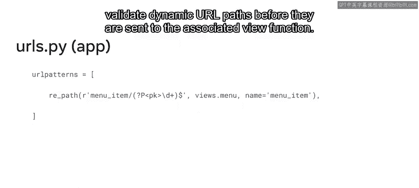

本视频重点介绍在Django URL路径中使用正则表达式。但重要的是要知道，正则表达式并非Python或Django所特有。它们在计算机编程和软件开发的各个领域都有许多用途。


正则表达式及其相关字符是通用的，意味着它们在所有编程语言中都是相同的。


---


上一节我们介绍了正则表达式的基本概念，本节中我们来看看一个具体的代码示例。

让我们从一个包含两个条目的URL模式示例开始探索，这些条目位于`urls.py`文件中。第一个路径使用常规URL构建，第二个使用正则表达式路径。

让我们逐行分析代码。首先，从`django.urls`模块导入两个函数：`path`和`re_path`。

```python
from django.urls import path, re_path
```

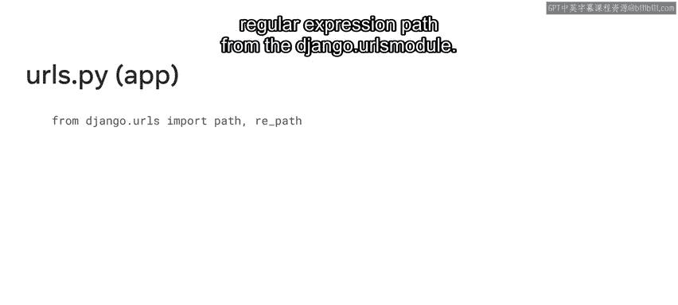

`re_path`用于需要包含正则表达式的路径。

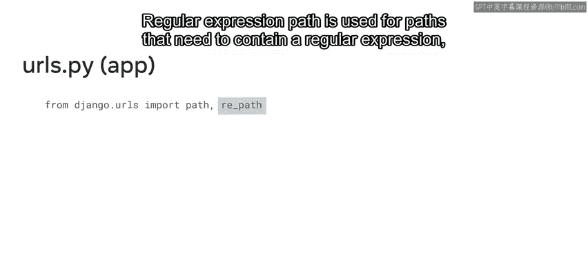


在`urlpatterns`序列内部，有两个条目。这个例子将只探讨传递给这些函数的第一个参数。

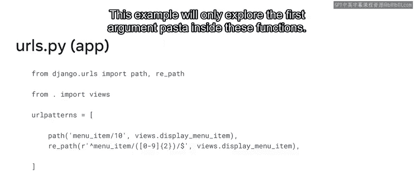


请注意，第一个路径包含URL字符串`menu-item/10`。这个字符串是静态且不可变的，这意味着它没有可能的数值变化，即使格式相同。

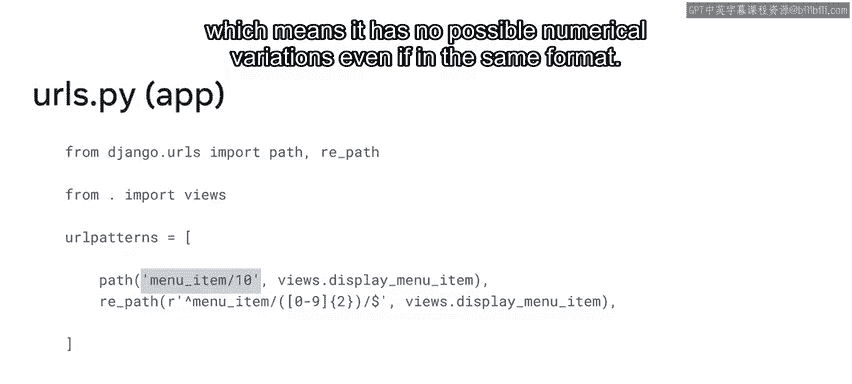


例如，如果你输入一个像`menu-item/1`这样的URL，它将不匹配此路径并映射到视图。结果，将显示404未找到错误消息。

你可以使用`re_path`函数接受所有这种格式的URL，就像第二个条目那样。

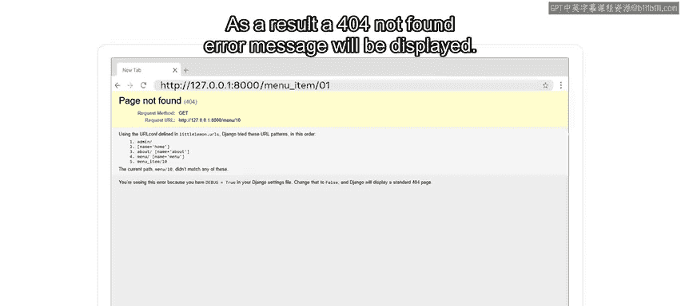

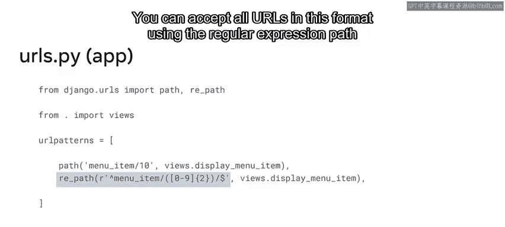


注意字符串开头的`r`字符。这使它成为一个原始字符串，将反斜杠视为字面字符而非转义字符。

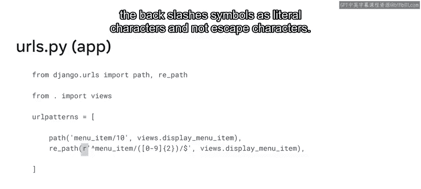


---

了解了基本语法后，接下来我们看看正则表达式中一些最常见的符号。

以下是正则表达式中一些关键符号的用途：

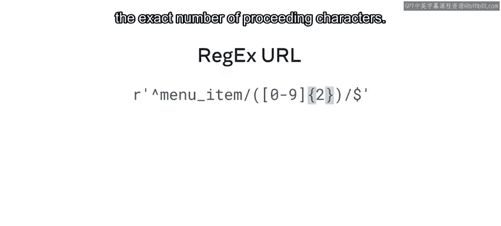

*   **`^`**：用作字符串开头的锚点。它也可以用于否定。
*   **`$`**：用作字符串结尾的锚点。
*   **`[ ]`**：使用方括号定义字符集，匹配其中存在的任何一个字符。
*   **`{ }`**：使用花括号指定前面字符的确切数量。
*   **`( )`**：使用圆括号对正则表达式的部分进行分组。


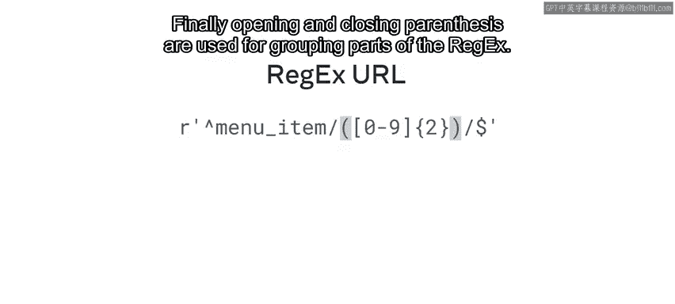


---

现在你已经熟悉了一些字符，可以在正则表达式中使用它们了。让我们重新回顾一下Little Lemon菜单示例中的URL结构。

URL以一个包含单词`menu-item`的字符串开始。然后是一个正斜杠`/`，后面跟着用于分组的圆括号`( )`。括号内是数字0到9出现两次。括号外是另一个正斜杠`/`，后面跟着美元符号`$`来结束字符串。

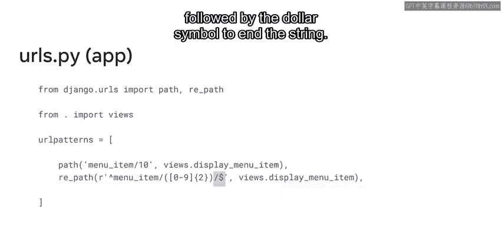


这个正则表达式可接受的字符串可以是`menu-item/`后跟范围1到99。

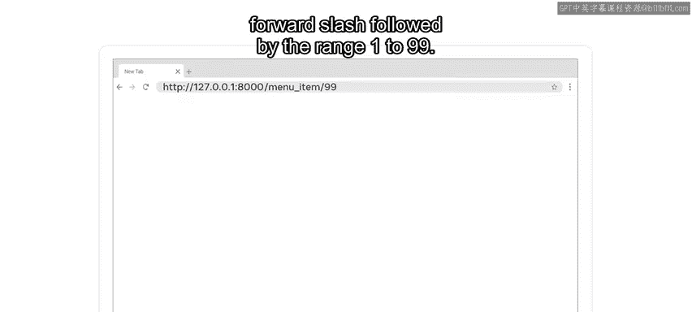


---

正则表达式在创建URL时非常有用，但同时也可能变得非常复杂。对于包含多个特殊字符的正则表达式来说尤其如此。

初学者在学习正则表达式时感到困惑是很常见的。有时一个符号可以用于一个或多个目的，或者同一个符号根据情况可能有不同的行为。

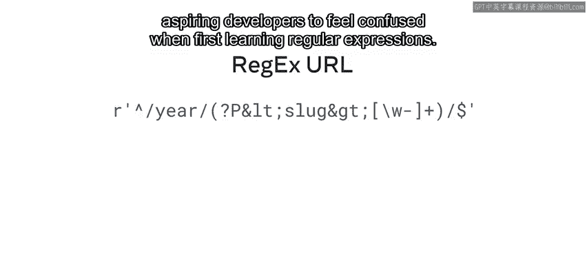


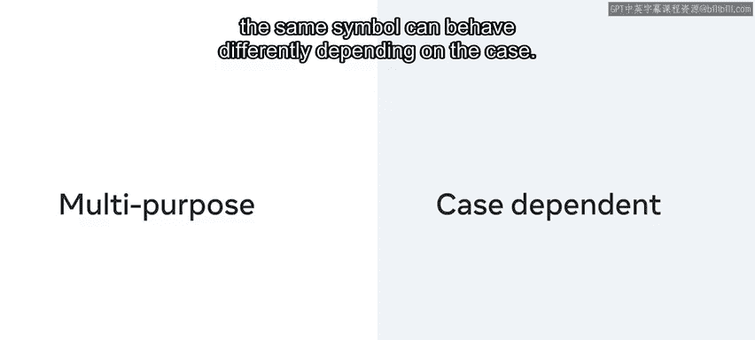


熟悉它们的用法需要一些练习和耐心。

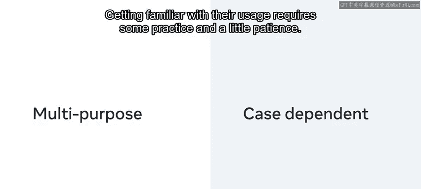


建议从本视频中的示例开始，并利用本课剩余的阅读材料和练习来构建你的知识。

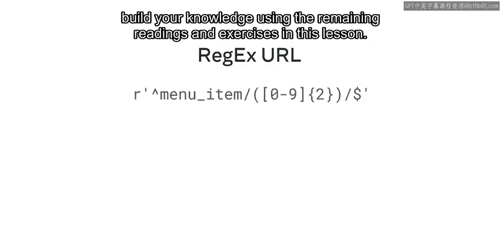


---

在本节课中，我们一起学习了正则表达式，以及开发者如何使用它们在Django中创建和验证动态URL。如果你想了解更多关于正则表达式的知识，本课末尾的补充阅读材料中有一个链接。