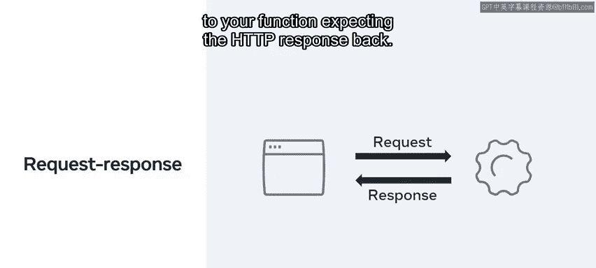
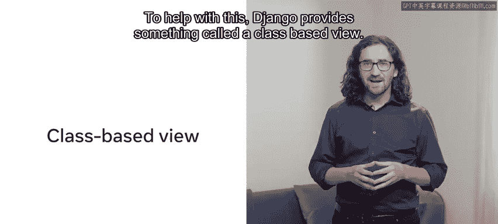
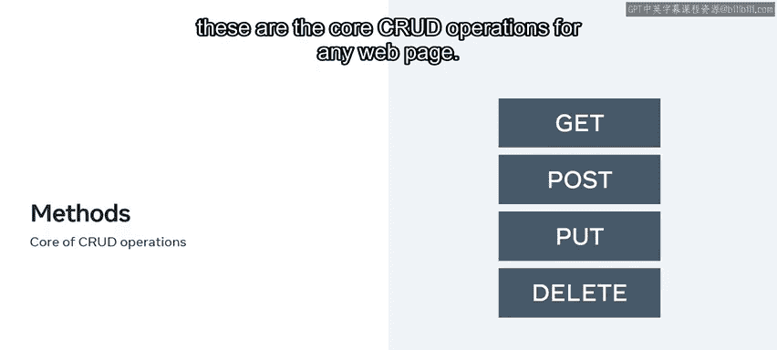
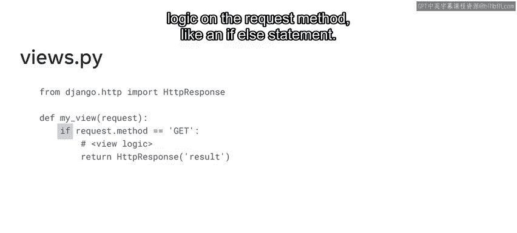
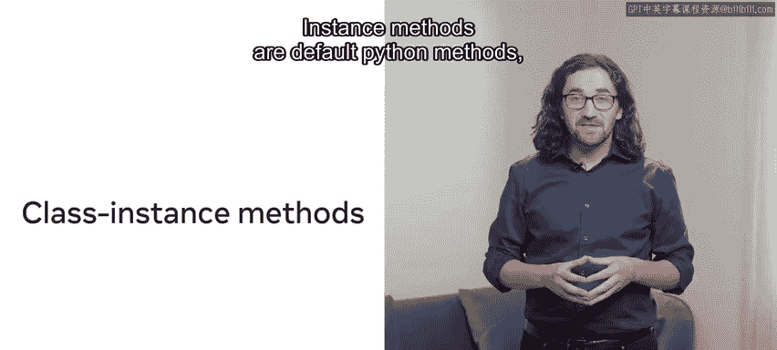
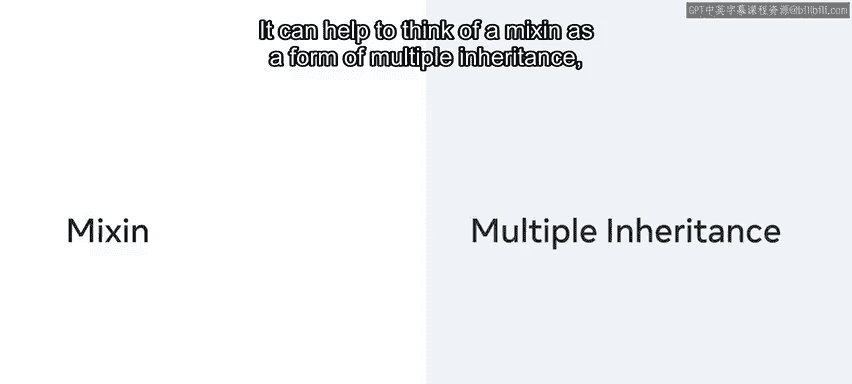
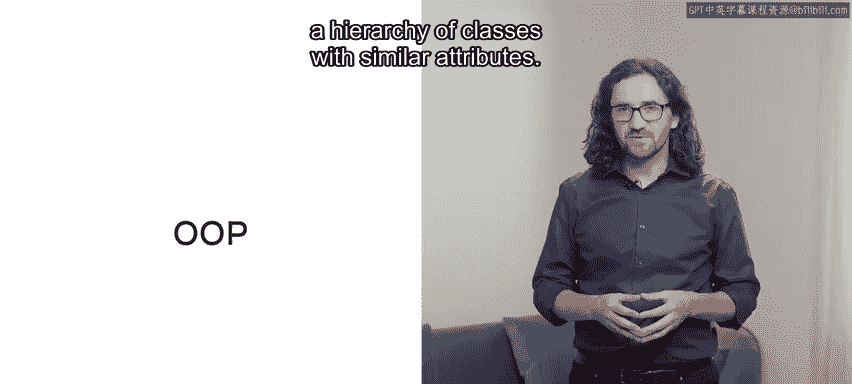
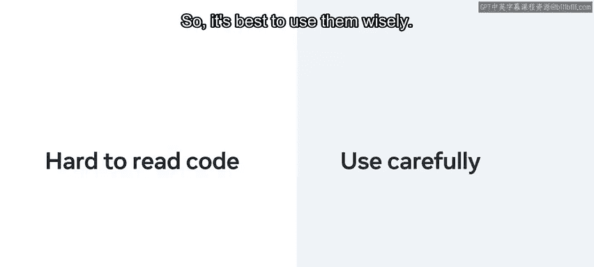

# 21：基于类的视图 🧱

## 概述
在本节课中，我们将要学习Django框架中一个重要的概念——**基于类的视图**。我们将了解它如何帮助开发者以更清晰、更易于维护的方式组织代码，特别是当项目规模增长时。我们将对比基于函数的视图，并探索面向对象技术（如继承）如何简化视图逻辑。

## 保持代码整洁与结构化
在项目开发中，以清晰、易用的方式组织代码至关重要。随着项目规模扩大，保持代码的组织性和良好结构对开发者而言是一个挑战。为了帮助克服这些挑战，开发者通常会使用框架和设计模式，例如MVT（模型-视图-模板）模式。

以Django框架为例，你可以使用视图来向最终用户呈现数据。你已经学过，在Django中可以通过创建一个视图函数来响应Web请求，并使用HTTP响应对象返回数据。在后台，框架将HTTP请求传递给这个函数，并期望返回一个HTTP响应。



```python
# 基于函数的视图示例
from django.http import HttpResponse



def my_view(request):
    return HttpResponse("Hello, World!")
```

虽然这种方式适用于某些场景，但开发者通常需要一个更健壮的解决方案，以便在视图中实现更复杂的应用逻辑。

## 引入基于类的视图
为了应对上述需求，Django提供了一种称为**基于类的视图**的功能。

基于类的视图允许你将视图作为对象使用，并提供了基于函数的视图之外的另一种选择。请记住，视图是可调用的，这意味着它可以接收一个请求并返回一个响应。这个过程非常适合HTTP协议。

当处理HTTP时，你需要为不同类型的请求（如GET、POST、PUT、DELETE）使用特定的方法。这些是任何网页的核心CRUD操作。



如果你使用基于函数的视图，你需要在请求方法上执行一些条件逻辑，例如使用`if-else`语句。



```python
# 基于函数的视图中处理不同HTTP方法
def my_view(request):
    if request.method == 'GET':
        # 处理GET请求的逻辑
        return HttpResponse('GET request')
    elif request.method == 'POST':
        # 处理POST请求的逻辑
        return HttpResponse('POST request')
```

## 基于类视图的工作方式
然而，基于类的视图采用了不同的方法。它不使用`if-else`语句这样的条件分支，而是使用**类实例方法**来响应HTTP请求。



实例方法是Python类中定义的默认方法，可以访问类的对象或实例。

在基于类的视图中，可以通过为GET和POST请求添加不同的实例方法来简化代码。这些方法将独立地实现视图逻辑。

```python
# 基于类的视图示例
from django.http import HttpResponse
from django.views import View

class MyView(View):
    def get(self, request):
        # 处理GET请求的逻辑
        return HttpResponse('GET request')

    def post(self, request):
        # 处理POST请求的逻辑
        return HttpResponse('POST request')
```

基于类的视图使用不同的类实例方法来响应HTTP请求，从而取代了在同一函数内使用`if`语句编写条件分支的方式。

在这种情况下，使用基于类的视图的优势在于，它允许你移除用于检查传入请求方法类型的条件逻辑。这简化了代码并分离了逻辑，使其更易于理解。



## 利用面向对象技术：Mixin与继承
另一个有用的方面是能够利用面向对象技术，例如**Mixin**或**多重继承**，这些技术可以将代码分解为可重用的组件。

在Django中，你可以使用Mixin来扩展基于类的视图的功能。Mixin是基于类的通用视图，与等效的基于函数的视图相比更加灵活。你可以将Mixin视为一种多重继承的形式。



回想一下，**继承**是面向对象设计（OOP）的核心概念之一。它允许你从一个类派生出另一个类，从而形成一个具有相似属性的类层次结构。

例如，假设你有一个名为`Food`的类。其他可以继承这个类的类可能是`Appetizer`、`Entree`和`Dessert`。它们都是食物的类型，并且会共享许多共同的属性。

以下是开发者常用的一些核心Mixin：

*   **Create**: 用于创建模型实例。
*   **List**: 用于列出查询集。
*   **Retrieve**: 用于检索模型实例。
*   **Update**: 用于更新模型实例。
*   **Delete**: 用于删除模型实例。



需要注意的是，在使用Mixin时，它们不能全部一起使用。在某些情况下，过度使用可能会使你的代码更难阅读，因此最好明智地使用它们。

## 总结
本节课中，我们一起学习了**基于类的视图**的概念。我们探讨了开发者如何通过使用面向对象技术（如继承的概念，从继承的类创建视图）来简化他们的视图。基于类的视图通过将不同的HTTP方法逻辑分离到独立的实例方法中，提供了更清晰、更模块化的代码结构，并为进一步利用Mixin等高级特性奠定了基础。