# 22：模块总结：视图 📚

在本节课中，我们将一起回顾“视图”模块的核心内容。我们将总结如何创建视图、处理HTTP请求与响应、配置URL以及进行错误处理等关键知识点。

---

## 概述 📖

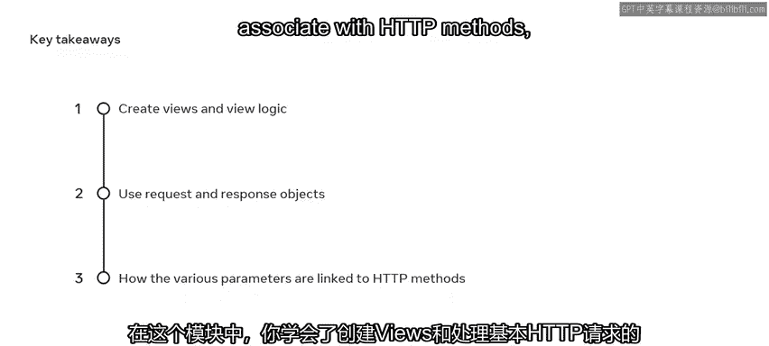

本模块介绍了Django框架中视图（View）的概念与实现。视图是Web应用的核心，负责处理客户端请求并返回响应。通过学习，你将掌握创建视图函数、配置URL映射、处理不同HTTP方法以及使用基于类的视图等技能。

---

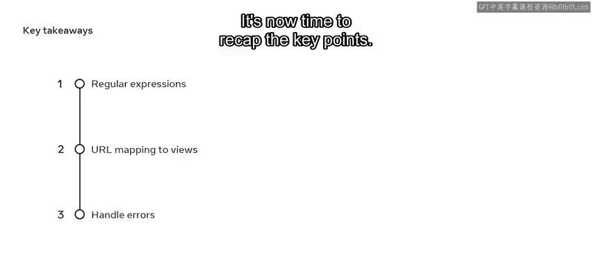

## 视图概述 🧠

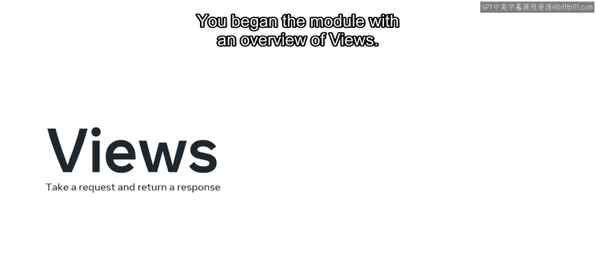

上一节我们介绍了课程的整体目标，本节中我们来看看视图的基本定义。

视图是处理Web请求并返回Web响应的逻辑单元。它本质上是一个Python函数或方法，包含了处理请求所需的所有业务逻辑。

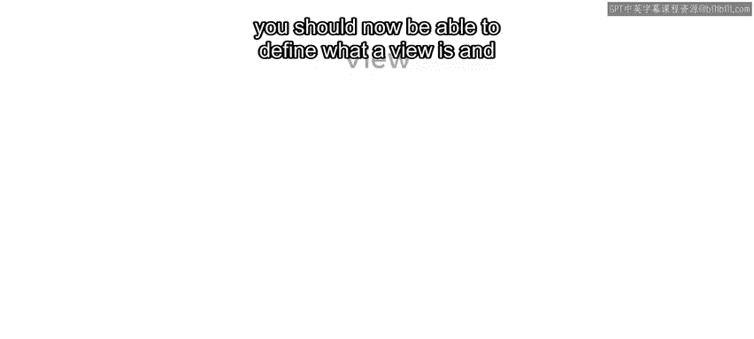

以下是视图的一些常见用途：
*   开发动态网站。
*   处理电子邮件和表单数据。
*   从数据库检索信息。
*   转换数据并渲染模板。

在Django中，创建视图后，需要通过**路由**将其映射到一个URL，这样才能建立起完整的“请求-响应”工作流。

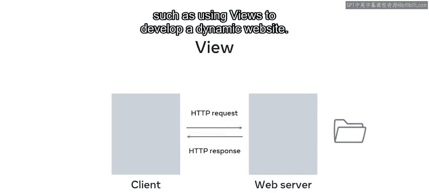

---

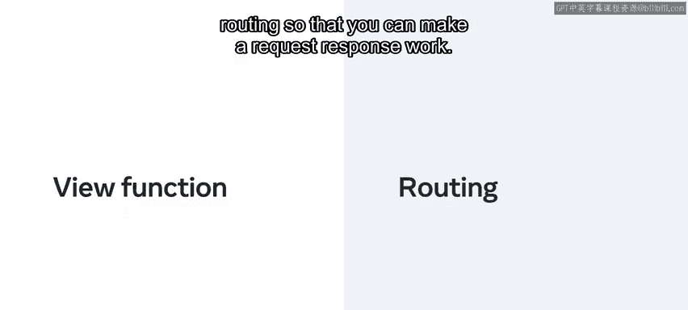

## URL配置与最佳实践 ⚙️

理解了视图的基本概念后，我们需要知道如何让用户访问到它，这涉及到URL配置。

你探索了URL配置文件 `urls.py` 的作用，并学习了如何在项目级和应用级映射视图。使用VS Code等工具可以方便地进行这些配置。

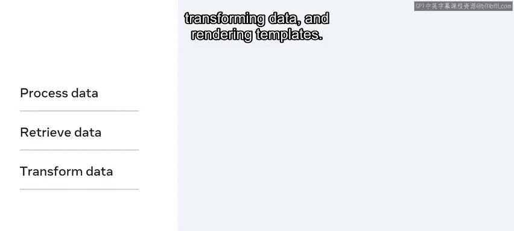

在开发中，遵循最佳实践至关重要。其中，代码复用和 **DRY** 原则是构建健壮Django项目的基石。DRY代表“Don‘t Repeat Yourself”，旨在减少代码重复。

本节的最后，你创建了视图并为其添加了逻辑，以处理常见的HTTP请求和响应用例。

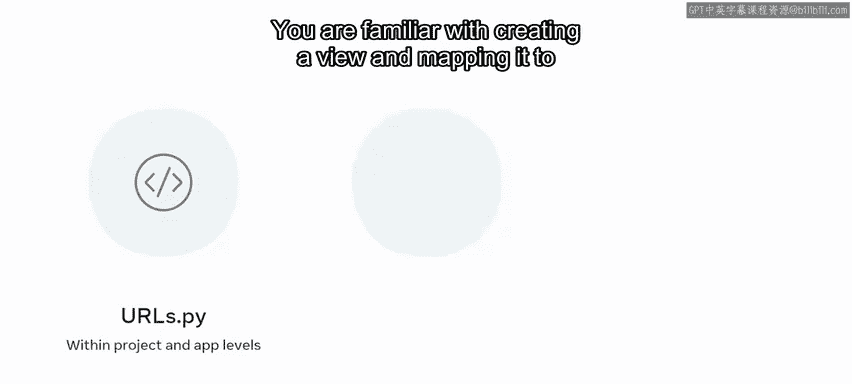

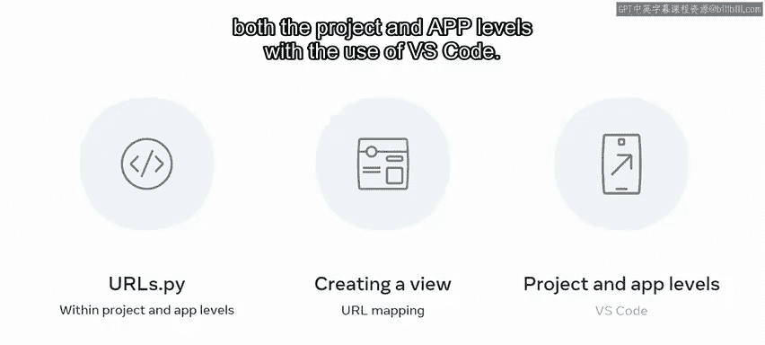

---

## 请求对象与URL映射 🔗

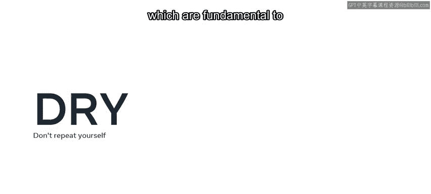

上一节我们介绍了如何配置URL，本节中我们来看看HTTP请求对象以及它与URL的交互。

你首先了解了HTTP请求对象，现在可以演示如何利用它来映射URL、执行常见的CRUD操作，以及通过调用客户端获取信息。

CRUD代表创建、读取、更新和删除，是数据操作的四种基本功能。

随后，你深入学习了如何创建更详细的请求，以及如何将请求和响应对象用于常见操作。

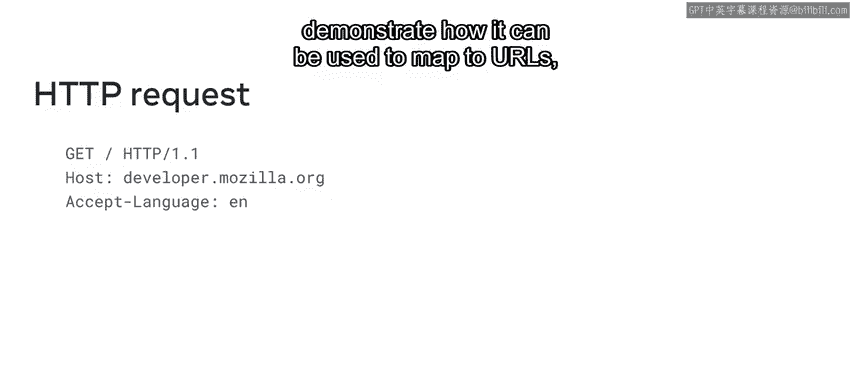

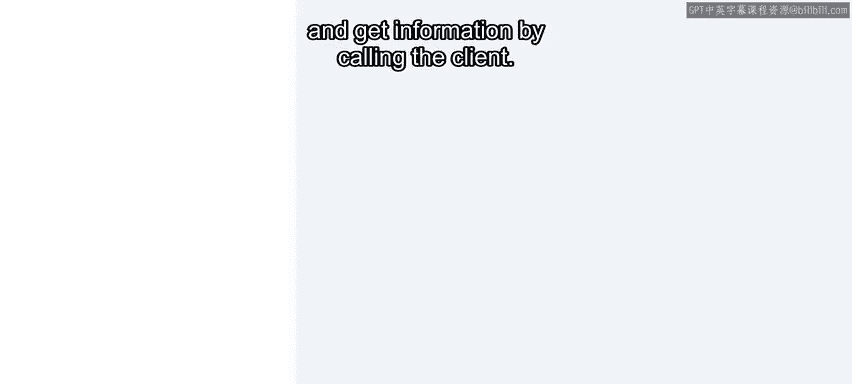

接下来，你探索了URL的构造方式及其如何映射到视图。

你理解了URL命名空间和视图的概念，这本质上就是如何将URL映射到一个名称及其对应的视图。资源将指向相应的用户界面进行渲染。

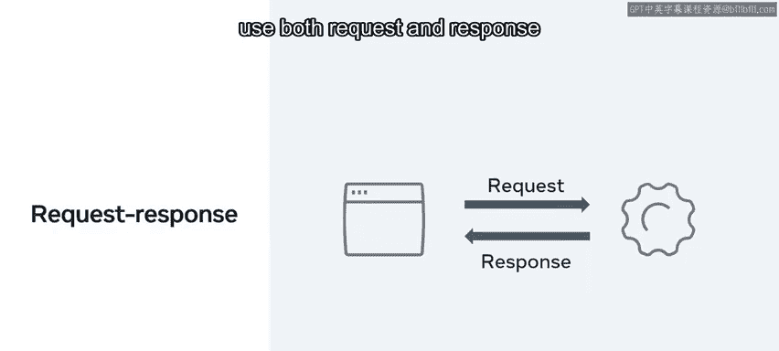

---

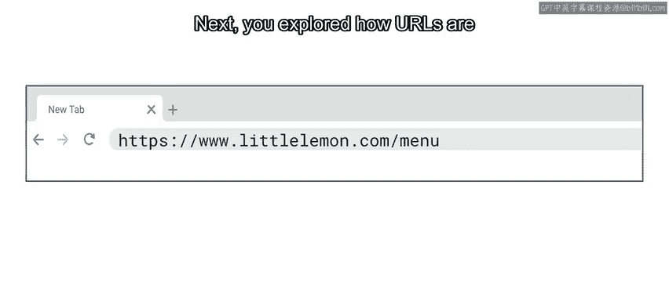

## 参数与HTTP方法 📝

URL映射建立后，视图需要处理来自客户端的各种数据，这些数据通常以参数形式传递。

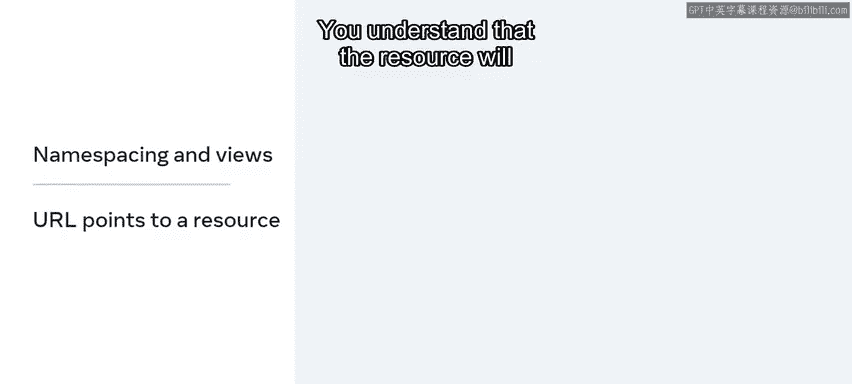

然后，你学习了在Web应用中使用参数的不同选项。

你可以演示参数如何与 **GET**、**PUT**、**POST** 和 **DELETE** 等操作关联。

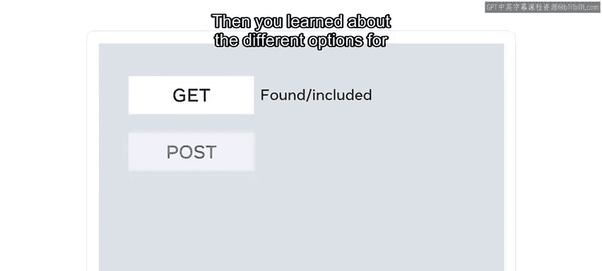

以下是三种主要参数类型及其与HTTP方法的典型关联：
*   **路径参数**：通常用于GET、PUT、DELETE请求，标识特定资源（如 `/users/123/`）。
*   **查询参数**：通常用于GET请求，传递过滤或排序信息（如 `?search=keyword&page=2`）。
*   **请求体参数**：通常用于POST、PUT请求，传递创建或更新所需的数据（如表单数据、JSON）。

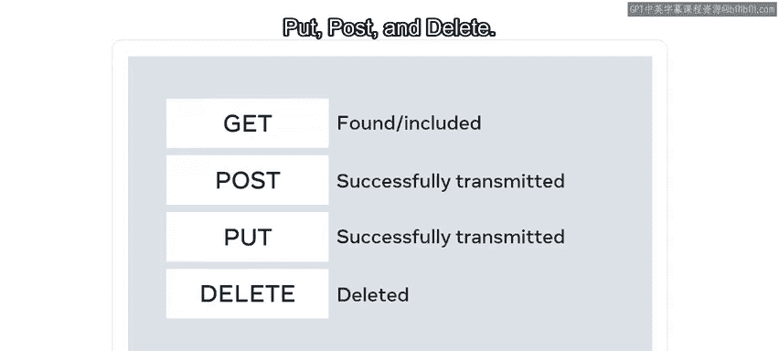

你还练习了使用URL调度器设置带参数的URL配置。

---

## 正则表达式与错误处理 ⚠️

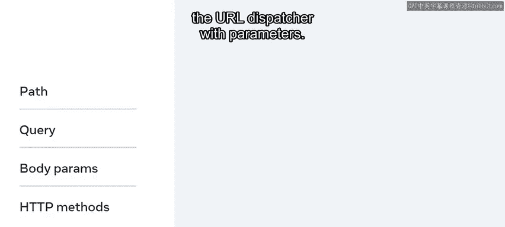

为了更灵活地匹配URL，我们需要使用更强大的工具——正则表达式。

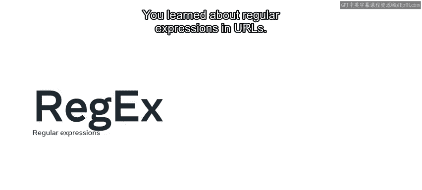

最后，你学习了如何创建URL和视图，并了解了URL中的正则表达式。

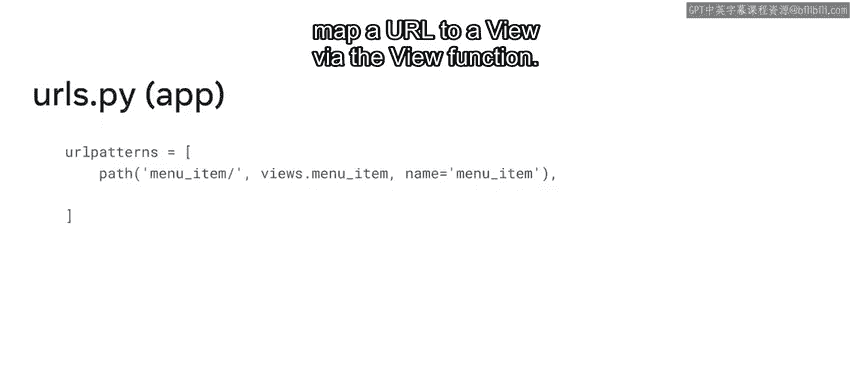

你练习了如何创建不同的URL模式，并通过视图函数将URL映射到视图。

在此基础上，你探索了如何处理错误，例如处理HTTP状态响应码（如100、200、400系列消息）。你还发现了如何处理来自服务器的错误响应。

此外，你学会了在处理PUT和POST操作的请求体时，如何在视图中应用错误处理。

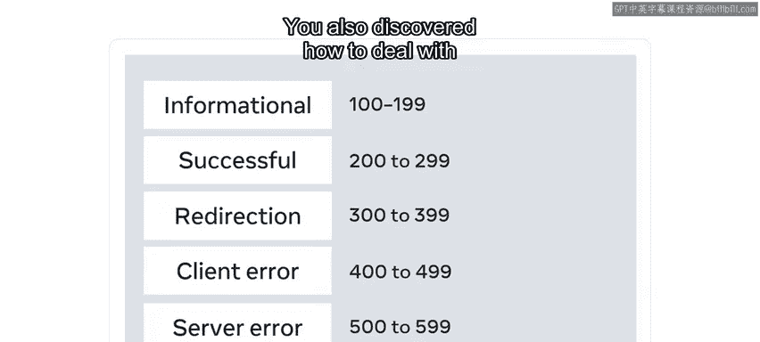

---

## 基于类的视图 🏗️

为了提升代码的组织性和复用性，Django提供了基于类的视图。

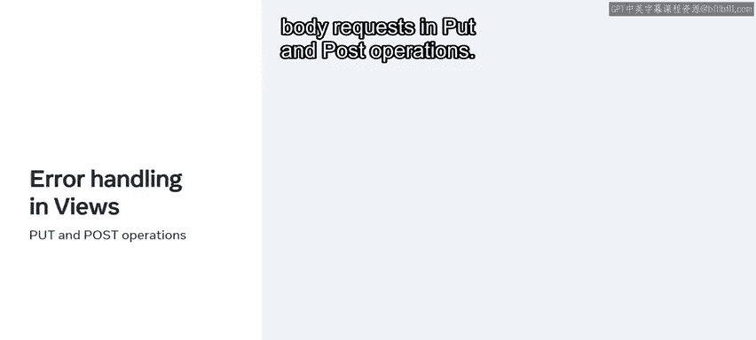

最后，你深入学习了Django中基于类的视图及其在项目中的复用方式。基于类的视图允许你将视图作为对象使用，为基于函数的视图提供了另一种选择。

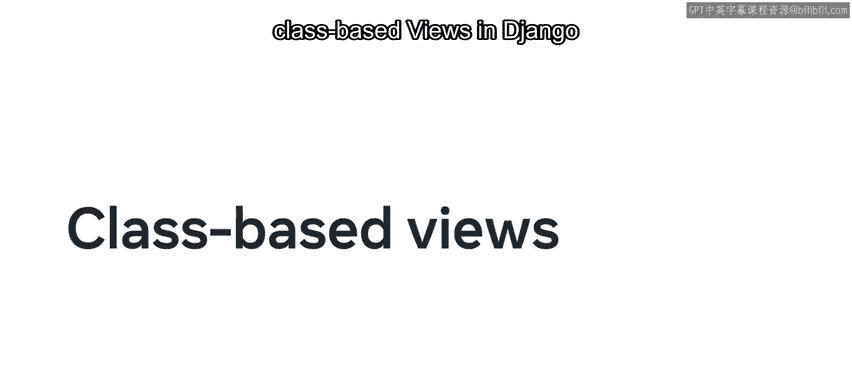

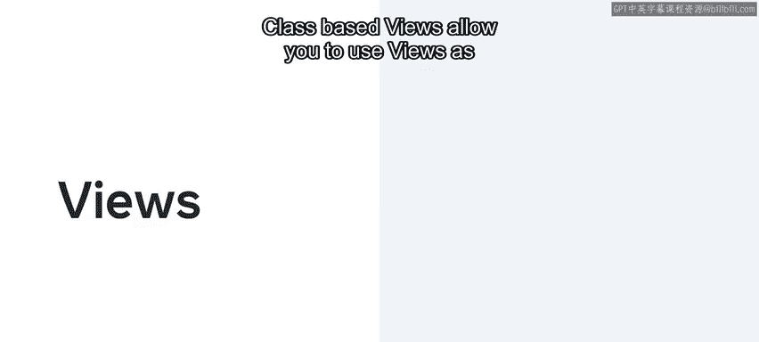

你还探索了开发者如何通过面向对象技术（如继承的概念）来简化视图，从而从基类创建视图。

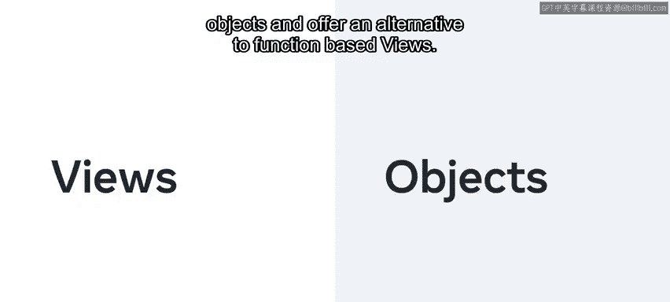

你也了解了针对不同HTTP请求使用不同的类实例方法，这取代了在同一个函数内编写条件分支（如使用if-else语句）的方式。

这种方式也移除了条件逻辑，从而简化了代码并分离了关注点，使其更易于理解。

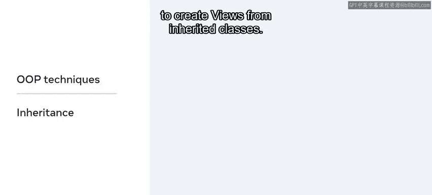

---

## 总结 🎯

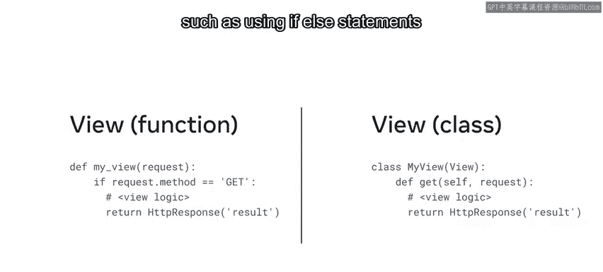

本节课中我们一起学习了视图模块的核心内容。

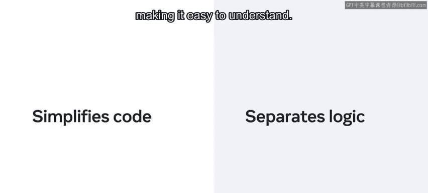

你现在已经熟悉了视图，并能使用它创建逻辑，通过处理HTTP请求和返回HTTP响应来向最终用户呈现数据。

你理解了不同的参数类型以及它们如何与HTTP方法关联。

你可以使用正则表达式创建不同的URL模式，并将URL映射到视图。

在整个开发过程中，你已准备好处理HTTP视图逻辑和视图层面的错误。

最后，你也可以在Django中使用基于类的视图，并在整个项目中复用它们。

做得好！