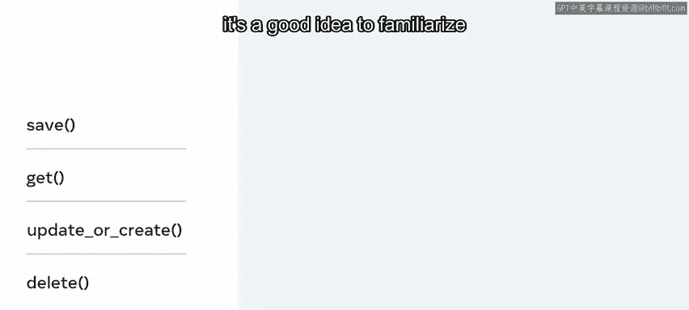

# 23：模型与CRUD操作

在本节课中，我们将要学习Django框架中模型（Model）的概念，以及如何使用模型类和方法来执行数据库的创建、读取、更新和删除（CRUD）操作。模型是MVT（Model-View-Template）架构模式中的核心组成部分，它充当了数据的单一权威来源。

## 模型的重要性

如果你正在使用Web框架构建动态应用程序，那么使用数据库进行数据存储是必不可少的。回想一下，表示层是用户与之交互的层，从表示层提交的任何数据都需要被持久化保存，以便后续检索和使用。

例如，如果网站需要用户登录，它就需要跟踪用户是谁以及他们有权查看、编辑和创建哪些数据。解决方案就是使用模型。模型是Django中使用的数据库表的对象等价物，是关于你数据的单一权威信息来源。在本视频中，你将进一步探索MVT架构模式中的模型部分，并学习Django如何使用模型类和方法来执行CRUD操作。

## 与数据库交互的两种方式

如果你是应用程序后端的开发人员，可以通过以下两种方式之一与数据库交互。

第一种方式是直接在数据库中创建所需的表，然后在你的应用程序中，你需要编写用标准查询语言（SQL）编写的自定义查询来存储和检索数据。

第二种方式是使用框架。你已经了解到，框架旨在通过为开发人员提供一个快速开发的平台来帮助他们，而开发人员可以加速开发的一种方式就是使用模型与数据库交互。

## 什么是模型？

模型是关于你数据的单一权威信息来源，它包含了你所存储数据的基本字段和行为。通常，每个模型都映射到单个数据库表。模型是Django框架不可或缺的一部分。

现在让我们更详细地探讨一下这个结构。每个模型都是一个继承自 `django.db.models.Model` 的Python类。模型的每个属性都代表一个数据库字段。

这意味着，你不必为添加和检索数据库记录编写自定义查询，而是可以使用模型来完成。Django为你提供了一个自动生成的数据库访问API，让你可以用Python代码访问数据库。本质上，你可以将模型视为一个Python对象，模型帮助开发人员创建、读取、更新和删除对象，这些操作通常被称为CRUD操作。

## 从SQL到Django模型

在深入了解这些CRUD操作之前，让我们通过一个创建名为 `user` 的表的场景来探索，先从SQL语法开始，然后使用Django模型。

你可能还记得，使用SQL在数据库中创建表，你需要使用 `CREATE TABLE` 语法编写查询。当代码运行时，将创建一个名为 `user` 的表，包含三个列：`id`、`first_name` 和 `last_name`。

```sql
CREATE TABLE user (
    id INT PRIMARY KEY AUTO_INCREMENT,
    first_name VARCHAR(30),
    last_name VARCHAR(30)
);
```

要在Django中使用模型实现同样的功能，你需要定义一个继承自 `django.db.models.Model` 的类。

```python
from django.db import models

class User(models.Model):
    first_name = models.CharField(max_length=30)
    last_name = models.CharField(max_length=30)
```

你可能会注意到，类中没有指定ID或主键。这是因为Django会自动添加它。但如有需要，你也可以覆盖它。此时，重要的是要知道，仅仅在Python中定义一个模型类是无法创建数据库表的。要完成这个过程，你需要使用一种叫做“迁移”（migrations）的东西，稍后你将了解更多关于它们如何工作的知识。

## 使用模型执行CRUD操作

好了，现在你了解了Django中模型的概念，以及它们可以用来替代SQL操作来访问和管理数据。接下来，让我们探索如何使用模型及其关联方法来执行CRUD操作。Django自动提供了所有这些开箱即用的方法，让我们从创建（Create）开始。

### 创建记录

你可能还记得，在SQL中创建记录需要使用 `INSERT` 语句。例如，在 `user` 表中创建一个新用户。

```sql
INSERT INTO user (first_name, last_name) VALUES ('John', 'Doe');
```

在Django中，创建记录需要你从 `User` 类创建一个新对象，然后使用 `save()` 函数将其持久化。

```python
new_user = User(first_name='John', last_name='Doe')
new_user.save()
```

### 读取记录

在SQL中，要检索信息，你需要使用 `SELECT` 语句编写SQL查询。例如，从 `user` 表中检索ID等于1的用户。

```sql
SELECT * FROM user WHERE id = 1;
```

在Django中，你可以使用绑定到 `User.objects` 的 `get()` 方法。

```python
user = User.objects.get(id=1)
```

### 更新记录

假设你有一个用户表，其中有一个名为John Jones、ID为1的用户，你想将该用户的姓氏更新为Smith。

在SQL中，你使用 `UPDATE` 语句来更新数据库中的现有记录。

```sql
UPDATE user SET last_name = 'Smith' WHERE id = 1;
```

要在Django中实现相同的结果，你可以使用 `get()` 和 `save()` 方法。

```python
user = User.objects.get(id=1)
user.last_name = 'Smith'
user.save()
```

这段代码的工作原理是检查是否存在ID为1的用户，然后将该用户的姓氏更新为Smith。

### 删除记录

在SQL中，需要使用 `DELETE` 语句来删除数据库中的记录。例如，你可以根据ID等于1这样的值来删除用户。

```sql
DELETE FROM user WHERE id = 1;
```

要在Django中实现相同的结果，你可以使用 `delete()` 方法。

```python
user = User.objects.get(id=1)
user.delete()
```



需要注意的是，这些只是Django在处理模型时提供的众多方法中的一部分。作为一名有抱负的开发人员，熟悉本视频中提到的这些方法是个好主意。

## 总结


本节课中我们一起学习了MVT架构模式中的模型部分，以及Django在处理数据库表时如何使用类和方法来执行CRUD操作。模型作为数据的Python对象表示，极大地简化了数据库交互，使开发人员能够更高效地进行后端开发。