# 25：24_迁移 🚀

在本节课中，我们将要学习Django中的**迁移**。迁移是Django用来记录模型变更，并将这些变更应用到数据库结构（即模式）的一种机制。理解迁移对于管理应用的数据模型变化至关重要。

## 什么是迁移？🛠️

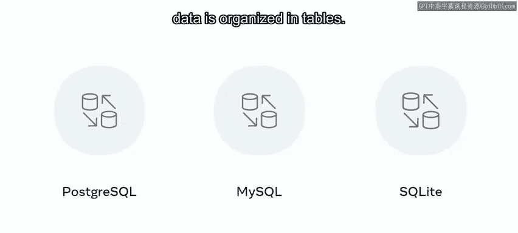

在Web应用开发中，应用需求会不断变化，开发者的工作就是实现这些变化。一个常见的任务是修改应用的数据模型。在Django中，你可以使用**迁移**来完成这项工作。

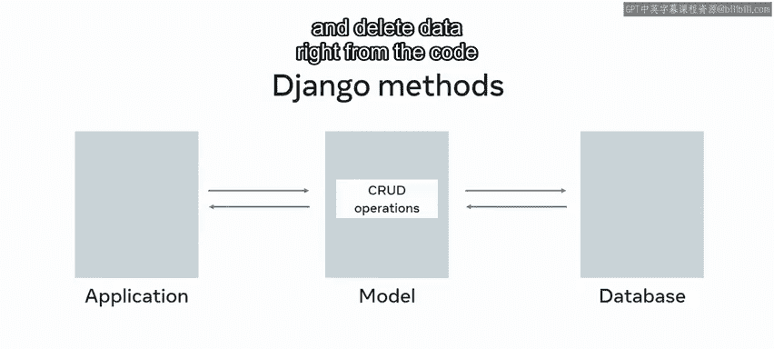

迁移是Django记录对模型所做的更改，并将这些更改实施到数据库模式中的方式。

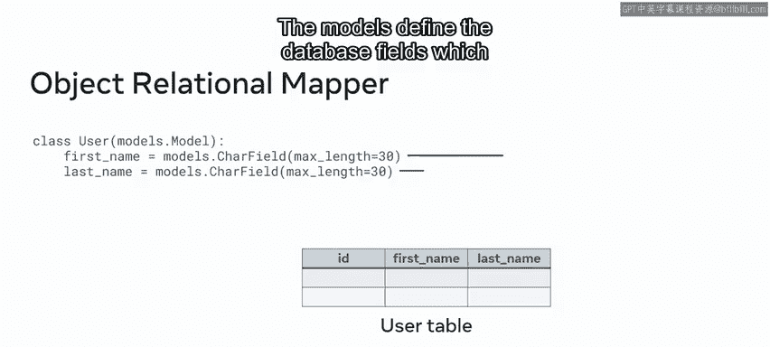

## Django模型与数据库的关系 🔗

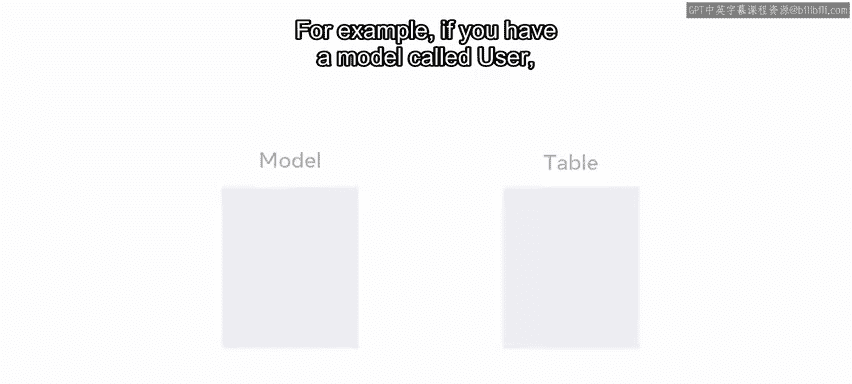

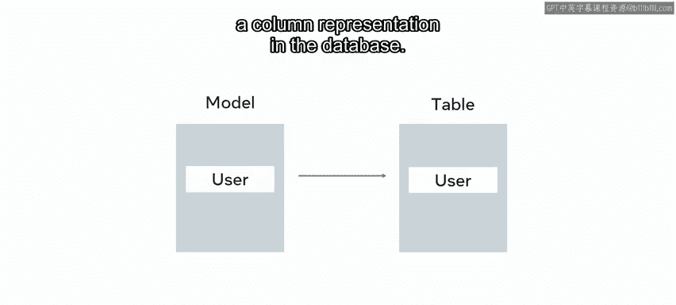

Django设计用于与关系型数据库管理系统（如PostgreSQL、MySQL或SQLite）协同工作。在关系型数据库中，数据被组织在**表**中。

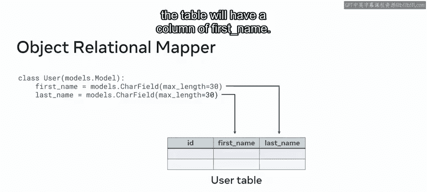

现在你已经知道，可以使用**模型**来表示存储在数据库中的数据表。使用模型时，Django提供了许多方法，允许你直接从代码中添加、更新和删除数据，而无需编写SQL。这得益于一种称为**对象关系映射**的技术。

ORM将关系型数据库映射到以Django模型形式表示的对象。模型定义了数据库字段，这些字段对应其关联数据库表中的列。

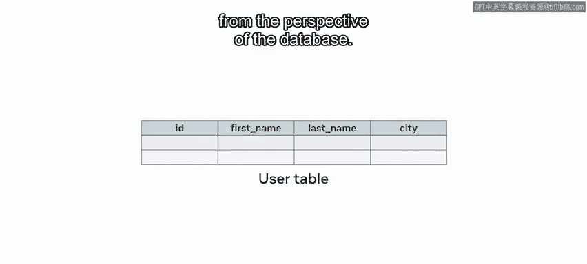

例如，如果你有一个名为`User`的模型，它代表一个名为`user`的表。模型的每个属性在数据库中都有一个列表示。

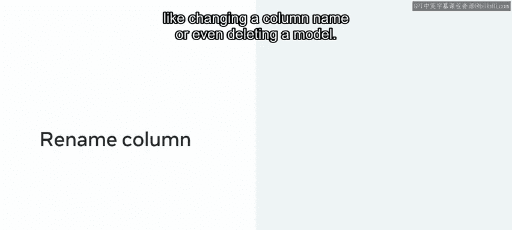

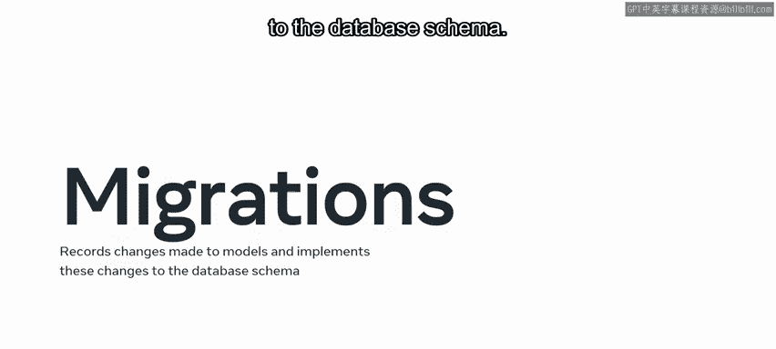

在Python代码中，如果`User`类有一个`first_name`属性，那么表中就会有一个`first_name`列。

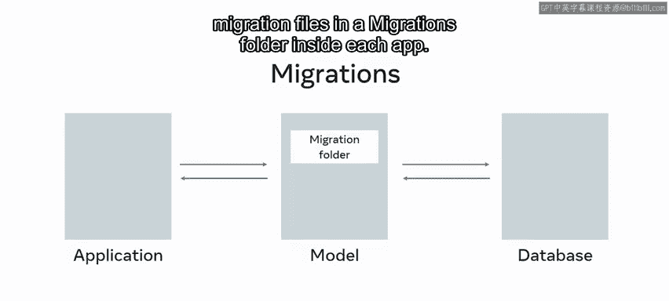

## 为什么需要迁移？🤔

在应用程序的生命周期中，通常需要对数据库的结构或模式进行更改。例如，初始模型可能需要用额外的属性进行扩展。这意味着从数据库的角度来看，需要添加一个新属性，也就是添加一个新列。

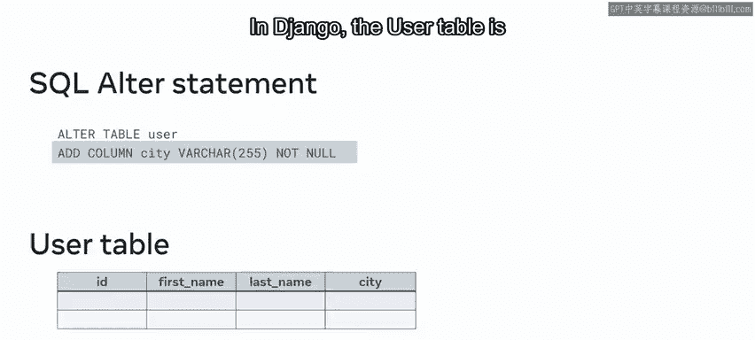

或者，假设你需要执行不同的操作，比如更改列名，甚至删除一个模型。为了使这些操作生效，Django使用了**数据库迁移**。

迁移与Django模型紧密相连，并以迁移文件的形式存储在每个应用内部的`migrations`文件夹中。

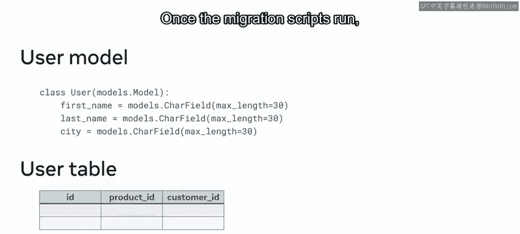

## 迁移如何工作？⚙️

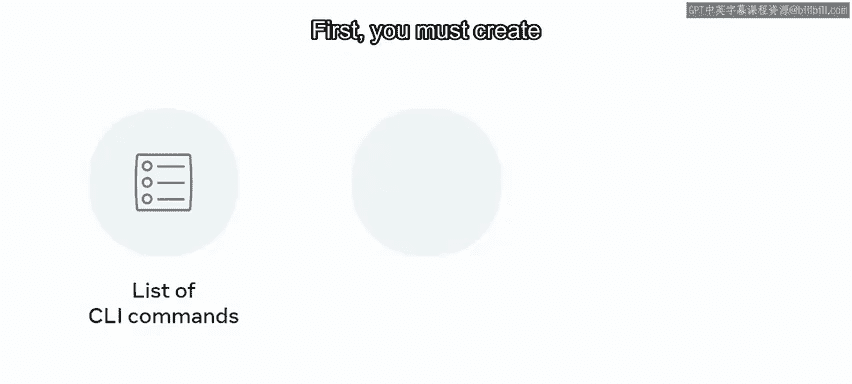

让我们通过一个例子来探索迁移的工作原理。假设你想在`user`表中添加一个名为`city`的新列。

如果没有像Django提供的ORM，开发者必须登录数据库并运行一条SQL `ALTER`语句。你可以使用`ALTER`语句来修改特定表，添加所需类型的列。当语句运行时，`user`表会更新，增加一个名为`city`的列。

在Django中，`user`表是使用模型创建的。模型是数据库中`user`表的基于类的表示。因此，你不需要编写SQL查询，只需将新属性添加到模型中，然后运行迁移脚本即可实施更改。一旦迁移脚本运行，更改就会被应用。

## 运行迁移脚本的流程 📝

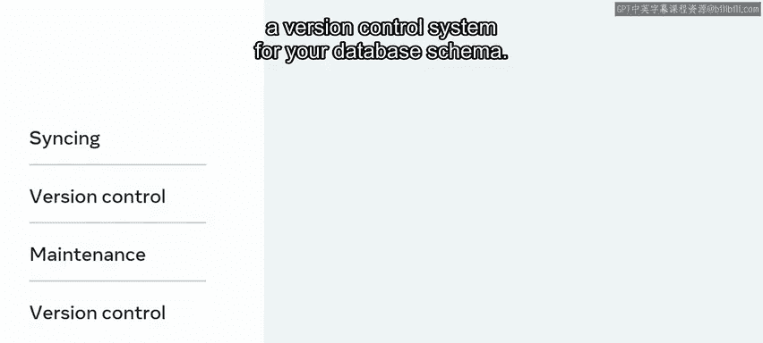

Django提供了一系列CLI命令，允许你应用迁移。首先，你必须创建一个迁移脚本，然后应用这些迁移。

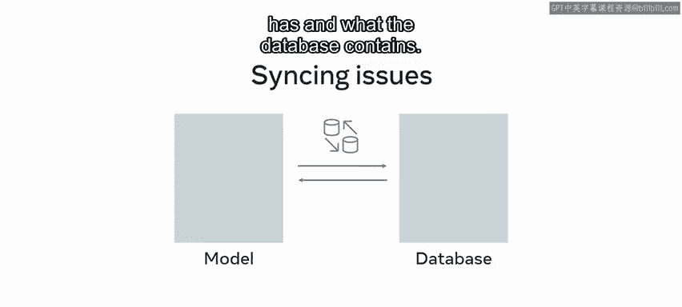

迁移脚本是一组关于针对数据库创建什么模型的指令。你对模型进行更改，运行迁移文件，Django会处理剩下的事情。你不需要编写任何SQL，因为应用程序会处理一切。

## 使用迁移而非SQL的优势 🌟

你可能会想，既然像前面的例子那样直接运行SQL查询来更新表看起来很简单，为什么还需要迁移呢？迁移不仅仅是执行SQL命令。它们有助于解决同步问题、进行版本控制和数据库维护。最好将迁移视为数据库模式的**版本控制系统**。

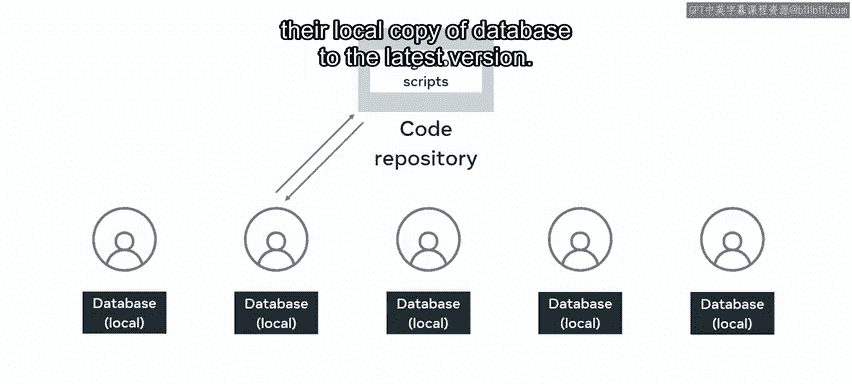

以下是迁移的一些主要优势：

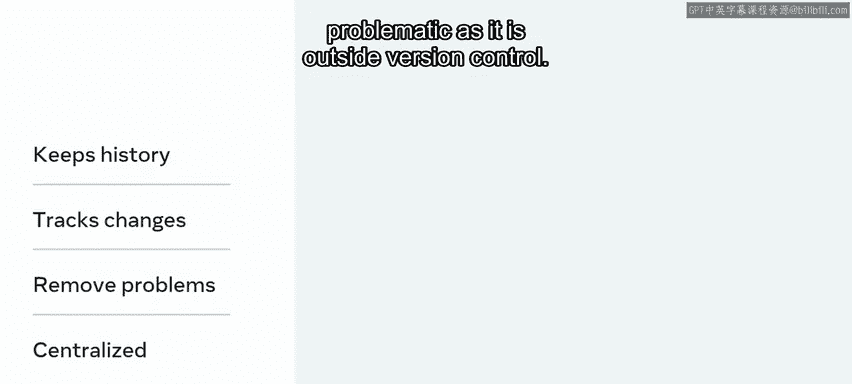

*   **解决同步问题**：使用迁移，可以减少模型定义与数据库内容之间出现同步问题的可能性。在团队协作中，每个开发者通常都有自己的本地数据库副本，以便进行编码和测试。迁移脚本保存在代码仓库中。当团队中的开发者进行更改时，他们会运行迁移脚本，将自己的本地数据库副本更新到最新版本。
*   **版本控制**：所有更改都保存在版本控制中，这提供了整个应用程序变更的完整历史记录。开发者还可以利用它来确定添加了哪些更改以及由谁添加。在应用开发中，你能追踪到的应用内变更越多，遇到的问题就越少。替代方案是直接在数据库中运行脚本，这通常问题更多，因为它处于版本控制之外。
*   **易于维护**：除了有助于解决同步问题和版本控制外，从代码库维护所有数据库变更也使开发团队的工作更加轻松。他们不必担心直接针对数据库创建SQL查询，也不必担心将这些文件存储在哪里以便其他开发者可以运行它们。

## 总结 📚

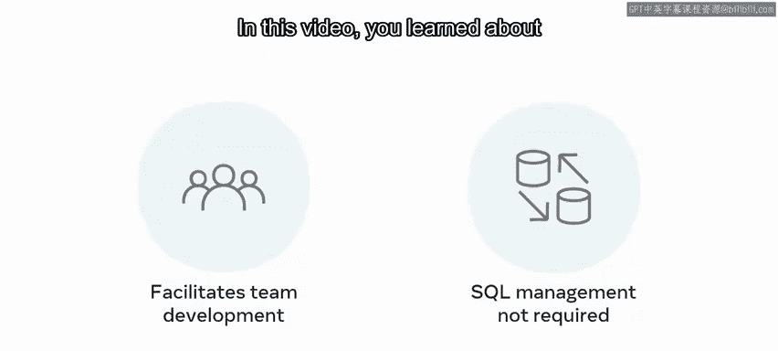

本节课中，我们一起学习了Django中的迁移，以及开发者如何使用它们来对代表数据库模式的模型进行更改。迁移是Django ORM的核心功能，它通过代码来管理数据库模式变更，极大地简化了开发流程，并提供了版本控制和团队协作的优势。