# 30：29_表格 📝


在本节课中，我们将要学习Django框架中表单（Forms）的核心概念。表单是Web应用程序收集用户数据的主要方式，例如登录信息、注册详情或购物订单。我们将了解Django如何通过`Form`类简化表单的创建、渲染和处理，以及如何利用模型（Models）自动生成表单，从而减少潜在的错误。

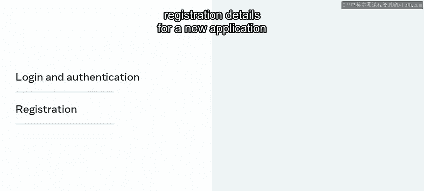

## 表单在Web应用中的作用 🌐

绝大多数Web应用程序都需要从最终用户那里收集数据。

这可以是用于登录和身份验证的用户详细信息、新应用程序的注册信息，或是线上购物的订单详情。

回忆一下，Web应用程序使用HTML的`<form>`标签来构建表单，以收集用户的输入数据。当表单提交时，任何表单元素（如输入框或复选框）都会被发送到服务器进行处理。

## 基础HTML表单示例 📄

在Django中，最常见的表单提交方式是POST请求，它会将数据放在请求体（POST body）中发送。服务器端代码处理传入的请求并在后端处理数据。

例如，假设你使用HTML创建了一个用于提交姓名的基本表单。

以下是该表单的HTML代码示例：

```html
<form action="/your-name/" method="post">
    <label for="your_name">Your name: </label>
    <input id="your_name" type="text" name="your_name" maxlength="100">
    <input type="submit" value="Submit">
</form>
```

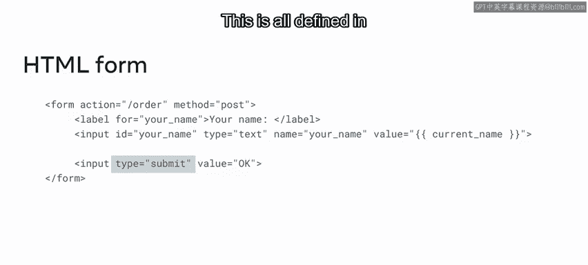

*   `<label>`标签用于显示描述输入内容的文本。
*   类型为`text`的`<input>`元素接受最终用户的输入。在此示例中，它用于存储姓名。
*   第二个类型为`submit`的`<input>`是一个按钮，显示文本“Submit”。当按钮被按下时，将触发`action`中定义的行为，向`/your-name/`路径发起POST请求，并由对应的视图（view）处理。
*   所有这些都定义在表单的`action`和`method`属性中。

## Django表单类的引入 🛠️

虽然上述过程有效，但在处理大型表单时，代码会变得冗长且复杂。例如，表单可能有许多不同的数据收集方式和条件流程。此外，以这种方式设计表单容易出错，因为每个表单元素的`name`或`id`属性都需要与后端代码的期望值匹配。

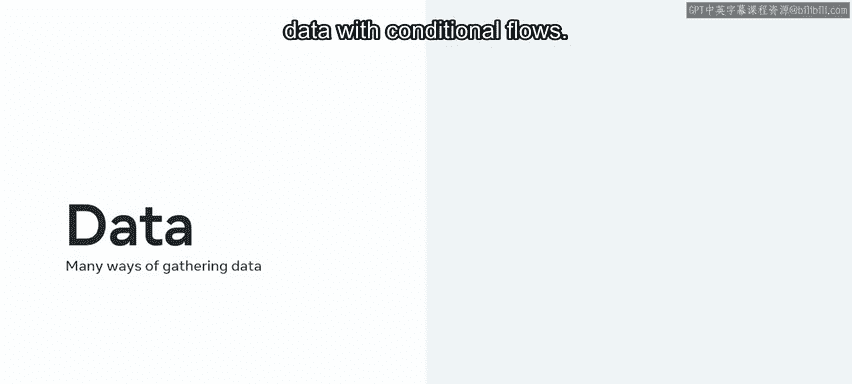

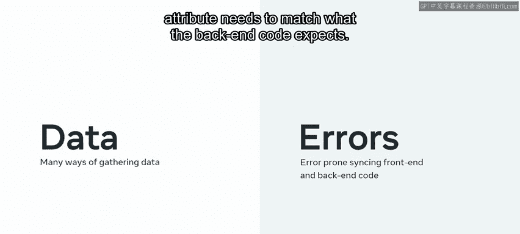

为了帮助开发者进行表单的创建和处理，Django引入了`Form`类。在这个类中，你可以定义所有预期会通过请求传递的属性。这意味着你可以使用一个表单类来表示预期的属性，并在HTML中渲染表单元素。

## 创建Django表单类 🧱

上一节我们介绍了HTML表单的基础，本节中我们来看看如何使用Django的`Form`类来重构它。

例如，上面的“提交姓名”表单可以通过创建一个类来表示。

让我们逐行分析这段代码：

```python
from django import forms

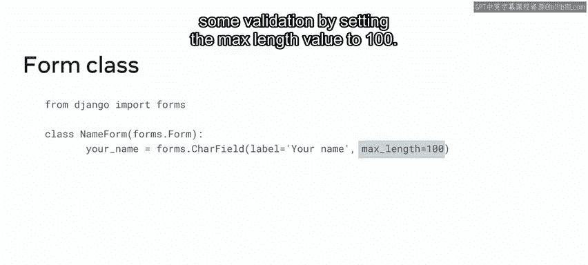

class NameForm(forms.Form):
    your_name = forms.CharField(max_length=100)
```

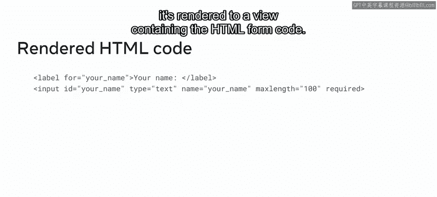

1.  首先，创建一个名为`NameForm`的类，它接受一个参数`forms.Form`。这本质上定义了表单本身的结构。
2.  接着，创建一个名为`your_name`的变量，它被赋值为`forms.CharField`，以代表HTML中的文本输入框元素。注意，你还可以通过设置`max_length=100`来进行一些验证。

最后，当`NameForm`类被渲染时，它会生成包含相应HTML表单代码的视图。

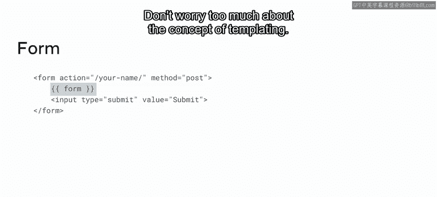

## 在模板中渲染表单 🎨

重要的是要知道，`Form`类本身不包含外层的`<form>`标签。因此，你需要在模板中添加`<form>`标签，然后使用模板语法将表单元素附加到里面。

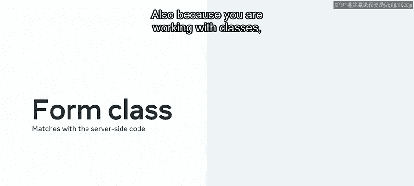

以下是在模板中渲染`NameForm`的示例：

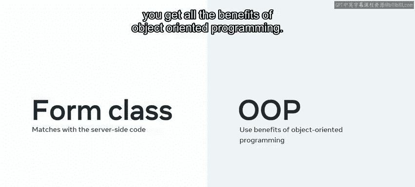

```html
<form action="/your-name/" method="post">
    
    {{ form }}
    <input type="submit" value="Submit">
</form>
```

不必过于担心模板（templating）的概念，你很快就会学到它。

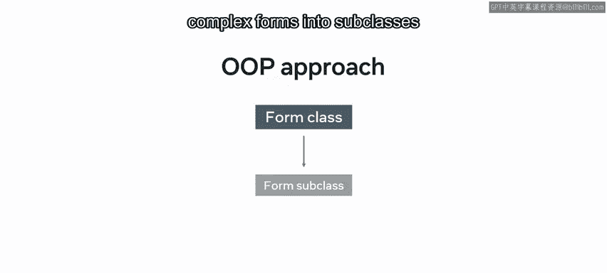

对于开发者而言，以这种方式创建表单的优势在于，管理表单的任何变更都变得更加容易。无需担心输入框的`name`属性是否与服务器端代码匹配，这一切都由`Form`类完全处理。

## 面向对象编程的优势 🧠

此外，由于你是在使用类，因此可以获得面向对象编程的所有好处。

例如，你可以将复杂的表单拆分为子类，使其更易于管理。遗憾的是，深入学习这些功能超出了本视频的范围，但了解它们的存在是很好的。

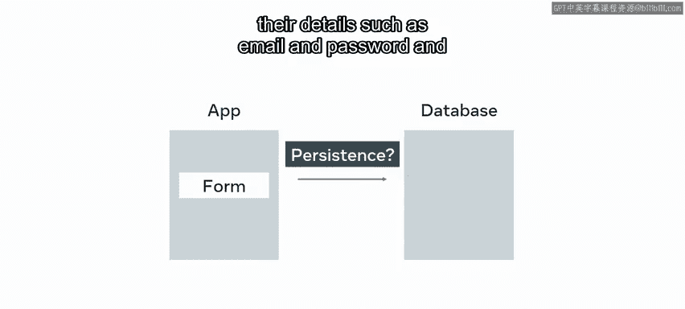

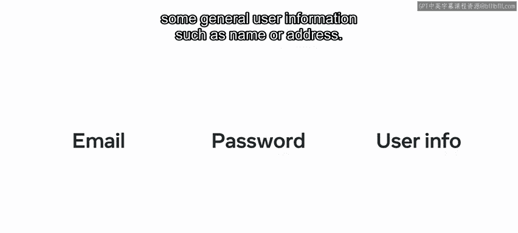

如果你想了解更多，本课末尾提供了额外的阅读材料。

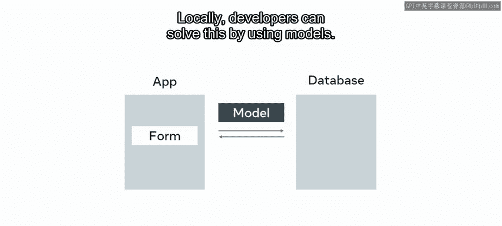

## 模型表单（Model Forms） 🗃️

最后，让我们探讨一下在Django中结合模型（Models）使用表单。使用POST方法将数据发送到后端后，你需要以某种方式持久化这些数据。

例如，假设你正在为新用户设置站点访问权限。你需要持久化他们的详细信息，如电子邮件和密码，以及一些常规用户信息，如姓名或地址。

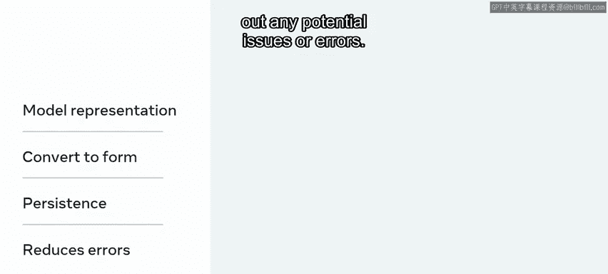

幸运的是，开发者可以通过使用模型来解决这个问题。应用程序中的模型将代表存储此信息的数据库表，因此模型本身可以直接转换为Django表单。这很有意义，因为你希望表单映射到你需要持久化的内容。这个功能对于排除任何潜在的问题或错误非常出色。

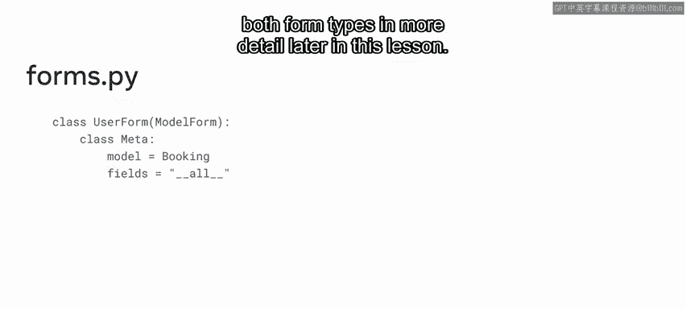

模型表单的代码通常放在`forms.py`文件中，并实现模型的结构。你将在本课程后面更详细地学习这两种表单类型。

## 总结 📚

本节课中我们一起学习了Django中的表单。你了解了Django如何通过`Form`类自动从类生成HTML元素，从而简化表单开发。你也学习了开发者如何利用模型自动生成表单，以移除潜在的处理错误。掌握这些概念是构建健壮、可维护的Django Web应用程序的关键一步。