# 32：创建表单 📝

## 概述
在本节课中，我们将学习如何在Django中使用`Form`类来创建表单。你将了解如何定义表单字段、在模板中渲染表单，并初步探索Django表单的一些内置功能，例如验证。通过构建一个简单的员工打卡表单示例，我们将掌握Django表单开发的基础流程。

---

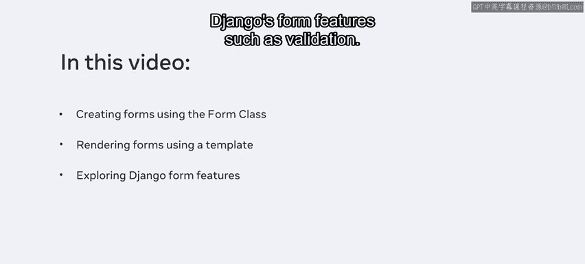

## 表单类简介
上一节我们介绍了Django模型的概念。本节中我们来看看如何使用Django的`Form`类。开发者使用表单类可以自动从Python类生成HTML表单元素，这极大地简化了表单的创建过程。

## 创建表单类
首先，我们需要在应用目录下创建一个名为`forms.py`的文件。我们将为“Little Lemon”网站创建一个表单，允许员工记录他们的上班打卡时间。

以下是创建表单类的步骤：

1.  **导入模块**
    ```python
    from django import forms
    ```

2.  **定义表单类**
    创建一个继承自`forms.Form`的类。我们将此类命名为`InputForm`。

3.  **定义表单字段**
    在类内部，我们将定义四个字段属性：
    *   `first_name` 和 `last_name`: 字符字段，最大长度为200。
    *   `shift`: 选择字段，让员工在早班、中班和晚班之间选择。
    *   `time_log`: 时间字段，用于记录员工的打卡时间。

以下是`forms.py`文件的完整代码示例：

```python
from django import forms

# 定义班次选择的元组
SHIFTS = (
    ('morning', 'Morning'),
    ('afternoon', 'Afternoon'),
    ('evening', 'Evening'),
)

class InputForm(forms.Form):
    first_name = forms.CharField(max_length=200)
    last_name = forms.CharField(max_length=200)
    shift = forms.ChoiceField(choices=SHIFTS)
    time_log = forms.TimeField()
```

## 创建视图以渲染表单
定义了表单类之后，我们需要创建一个视图来在网页上显示它。这与处理模型视图的过程类似。

以下是创建视图的步骤：

1.  **在`views.py`中导入表单**
    ```python
    from .forms import InputForm
    ```

2.  **创建视图函数**
    创建一个名为`form_view`的视图函数。在函数内部，我们实例化表单类，并将其通过上下文传递给模板。

以下是`views.py`中视图函数的示例代码：

```python
from django.shortcuts import render
from .forms import InputForm

def form_view(request):
    form = InputForm() # 创建表单实例
    context = {
        "form": form # 将表单实例放入上下文
    }
    return render(request, 'home.html', context) # 渲染模板
```

## 创建模板
为了让视图能够显示表单，我们需要创建一个HTML模板。

以下是创建模板的步骤：

1.  在应用目录下创建`templates`文件夹。
2.  在`templates`文件夹内创建`home.html`文件。
3.  在`home.html`中编写HTML代码来渲染表单。

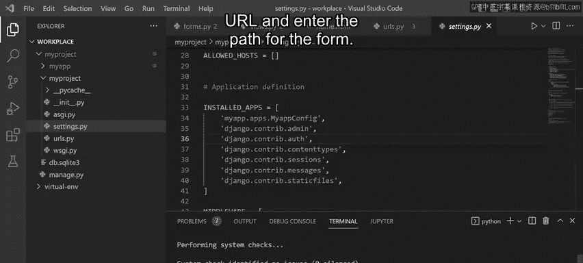

关键点：
*   使用`POST`方法提交表单数据。
*   包含一个类型为`submit`的输入按钮。
*   必须添加``标签，这是Django的一种安全机制，用于防止跨站请求伪造攻击。
*   使用`{{ form }}`变量来渲染我们传递过来的表单。

以下是`home.html`的初始代码示例：

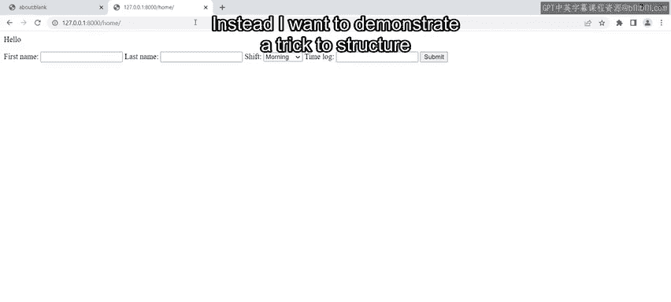

```html
<!DOCTYPE html>
<html>
<head>
    <title>Employee Time Log</title>
</head>
<body>
    <form method="post">
        
        {{ form }}
        <input type="submit" value="Submit">
    </form>
</body>
</html>
```

## 配置URL与运行服务器
在展示表单之前，我们需要完成最后的配置工作。

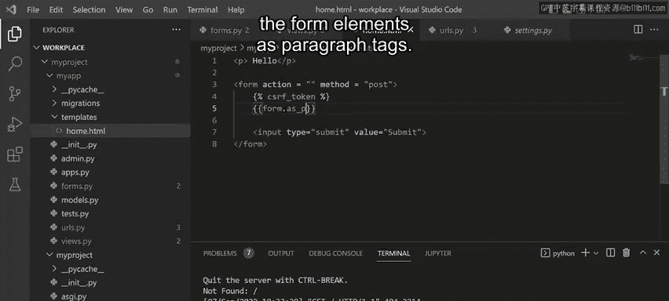

以下是需要完成的配置：

1.  更新应用和项目目录下的`urls.py`文件，将新创建的视图映射到一个URL路径。
2.  确保在项目的`settings.py`文件中已注册当前应用。
3.  在终端中运行开发服务器：
    ```bash
    python manage.py runserver
    ```
4.  在浏览器中访问对应的本地主机URL（例如 `http://127.0.0.1:8000/form/`）。

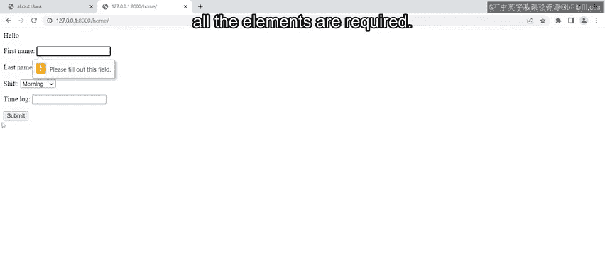

成功运行后，你将看到一个包含“First Name”、“Last Name”、“Shift”和“Time Log”字段的基础表单。

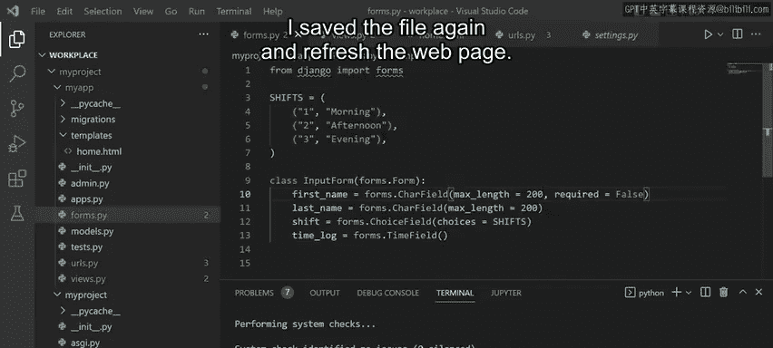

## 定制表单渲染
你可能会注意到，默认渲染的表单没有样式，且所有元素挤在一起。Django提供了简单的方法来调整表单的渲染方式。

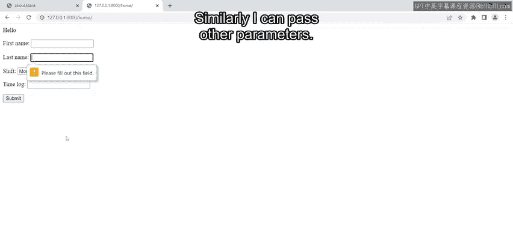

### 使用段落标签渲染
在模板中，你可以通过`{{ form.as_p }}`来告诉Django将每个表单字段渲染在`<p>`（段落）标签内。这会使字段垂直排列，更具可读性。

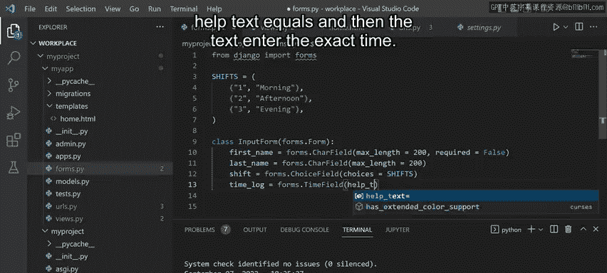

修改`home.html`中的表单渲染部分：
```html
<form method="post">
    
    {{ form.as_p }}
    <input type="submit" value="Submit">
</form>
```
刷新页面后，表单元素将逐个垂直显示。

### 修改字段属性
我们可以在`forms.py`中为每个字段添加参数来改变其行为。

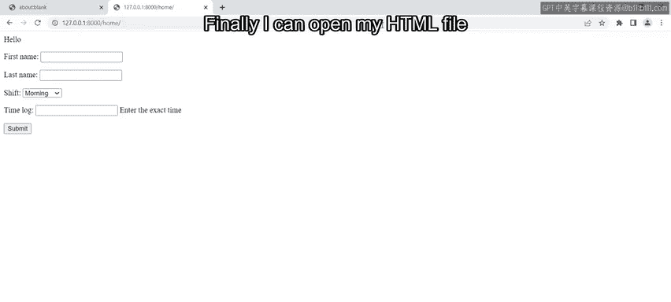

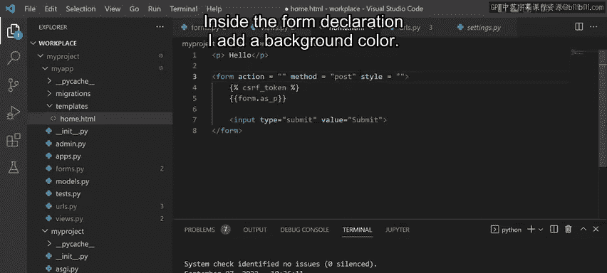

以下是两个常用的参数示例：

1.  **`required`**: 控制字段是否为必填项。默认是`True`。
    ```python
    first_name = forms.CharField(max_length=200, required=False)
    ```
    将`required`设置为`False`后，提交表单时该字段可以为空。

2.  **`help_text`**: 为字段添加帮助文本，显示在输入框旁边。
    ```python
    time_log = forms.TimeField(help_text="Enter the exact time.")
    ```
    这会在时间字段旁显示提示文字“Enter the exact time.”。

### 添加简单样式
你可以在HTML模板中直接为表单添加内联样式，进行快速美化。

例如，为表单添加背景色：
```html
<form method="post" style="background-color: #f0f0f0; padding: 20px;">
    
    {{ form.as_p }}
    <input type="submit" value="Submit">
</form>
```

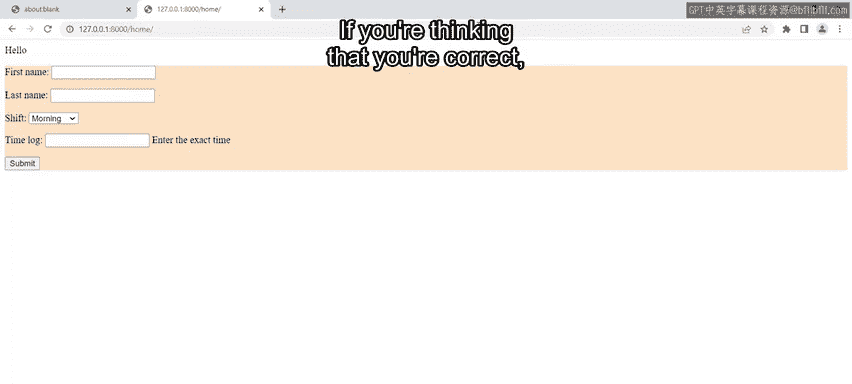

## 表单验证初探
Django表单内置了基础的验证功能。如果你尝试提交一个包含必填字段但未填写的表单，页面会刷新并提示错误信息（尽管在本示例的视图中我们尚未处理提交逻辑，但基础验证依然存在）。这正是使用Django表单类的一大优势——它自动处理了大量繁琐的验证工作。

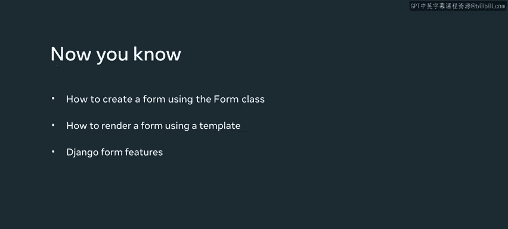

## 总结
本节课中我们一起学习了Django表单创建的核心知识。我们掌握了如何使用`forms.Form`类定义表单结构，如何在视图中实例化并传递表单到模板，以及如何在HTML模板中渲染表单。我们还探索了通过`as_p`方法定制渲染、使用`required`和`help_text`等参数调整字段属性，以及为表单添加简单样式。虽然本节课没有深入讲解如何处理和保存表单数据，但你已经为后续学习表单数据处理打下了坚实的基础。Django的表单功能强大，能帮助开发者高效、安全地构建Web表单。