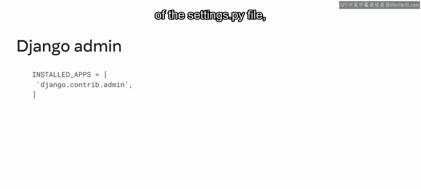
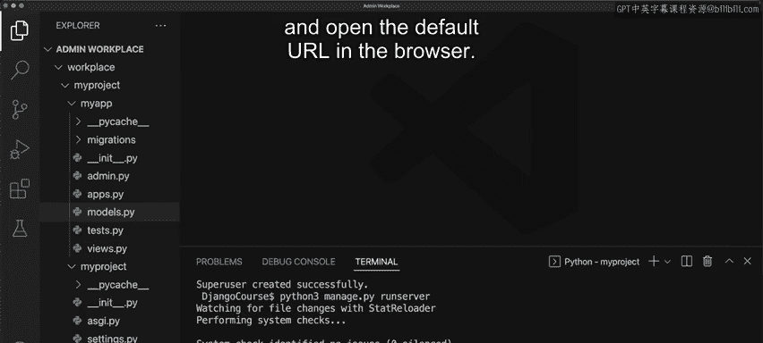
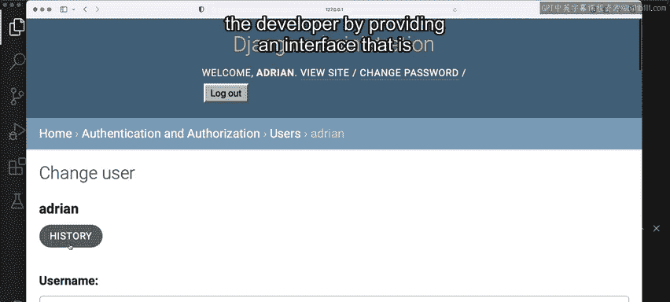

# 34：Django管理界面 🛠️

在本节课中，我们将学习如何激活和使用Django框架内置的管理员界面。这个界面允许网站管理员轻松管理应用程序的数据，例如用户、权限和数据库条目，而无需编写额外的代码。

---

开发Web应用时，大量内容通常存储在某个地方，例如数据库中。因此，为应用程序提供一个管理站点是一项常见任务。

此管理站点的目的是允许特定用户管理和操作应用程序的数据。在本视频中，你将学习如何激活Django的管理界面及其核心功能。

你可能还记得，在讨论URL配置时，管理界面的路径配置默认已在URL配置文件中设置。

现在，假设Little Lemon餐厅的业主要求你将所有网站内容存储在数据库中，以便餐厅员工可以更新。例如，经理可以使用管理站点添加或编辑内容，而这些内容会显示在公开网站上。

对于开发者而言，为每个项目构建这样的站点是繁琐的工作。Django通过自动为站点管理员创建一个统一的管理界面来解决这个问题，用于添加、编辑和删除内容，例如用户、权限和数据库条目。

这个过程是自动化的，因为管理界面直接链接到项目中注册的模型。管理界面通常是大型Web应用的一部分，用于帮助管理员执行某些管理任务。

这些任务包括创建和管理用户、控制访问权限以及组建用户群组。Django读取项目中声明的模型，并根据模型的元数据快速构建一个易于使用的界面。



重要的是要记住，管理站点并非供网站访客使用，而是供站点管理员使用。除了界面，Django另一个强大的功能是提供了一个现成的管理界面，名为Django Admin。

正如你已经学到的，你使用这个命令行工具执行管理任务。Django Admin工具在终端内执行。当你在Django中运行诸如`startproject`之类的命令时，它默认被启用并分配给项目。

由于管理界面依赖于`django.contrib.admin`应用，你可以在`settings.py`文件的`INSTALLED_APPS`部分找到它，以及其他一些应用。

数据库是构建Web应用的内在组成部分。使用Django和Django Admin提供了一个便捷的方式，通过友好的用户界面访问和修改这些数据库。

在访问此界面之前，你首先需要创建一个管理员用户，以提供必要的凭据。现在让我们探索如何操作，并概览Django管理界面。

首先，你必须创建一个用户。为此，运行命令：
```bash
python3 manage.py createsuperuser
```
接下来，在用户名提示符处，你必须创建一个用户名。例如，输入`John`并按回车。请注意，如果用户已存在，Django将抛出错误，提示用户名已被占用。

现在，我创建一个名为`Adrian`的用户并按回车。接着，会出现另一个电子邮件地址的提示。让我们输入`Adrian@littlelemon.com`并按回车。



然后输入密码并按回车。请注意，由于这不是一个强密码，Django会显示警告，提示密码应更安全。你现在可以忽略此警告，输入`y`（代表“是”）继续。但需要知道，在实际应用中，密码应足够强并满足安全要求。

创建超级用户后，运行命令启动服务器。并在浏览器中打开默认URL。

接下来，转到分配的路径，在URL后添加`/admin`并按回车。请注意，Django管理页面加载了一个登录表单，提示你输入用户名和密码。输入你之前创建的用户名和密码，然后点击登录按钮。

登录后，你会看到一个基本界面。第一个选项概述了群组和用户。已经有一个名为`Reservations`的示例模型，其下方是最近操作列表，目前为空。

你可以选择添加和更改这些配置。例如，如果你转到`Reservations`模型并点击“更改”，会看到列出了几个条目。你可以选择使用表单直接更新预订数据或添加新条目。你也可以通过点击名称旁边的复选框来删除选定的预订。

如果返回主页，还有其他选项可以添加或修改已存在的用户。例如，如果你点击特定用户，可以更改用户名和密码、个人信息，并将用户分配到某些群组。此外，你可以指定用户拥有的特定权限，这些权限将列在下方。

还有其他附加细节，例如用户的上次登录信息和加入日期。你也可以转到页面顶部，查看用户的历史记录及其所做的更改。

这个工具的实用性可能不会立即显现，但随着课程的深入，你将意识到使用Django管理面板可以通过提供一个易于修改项目内部和模型的界面，为开发者节省大量时间。



---

在本视频中，你学习了如何启动Django的管理界面站点。你还学习了如何使用它来添加用户、群组、模型和分配权限，这些内容你将在后续课程中进一步学习。做得好！