# 37：用户与权限管理 🛡️

在本节课中，我们将学习Django框架中用户与权限管理的核心概念。我们将探索如何创建用户、分配权限，以及如何通过Django管理界面和Django Shell两种方式来高效地管理这些功能。

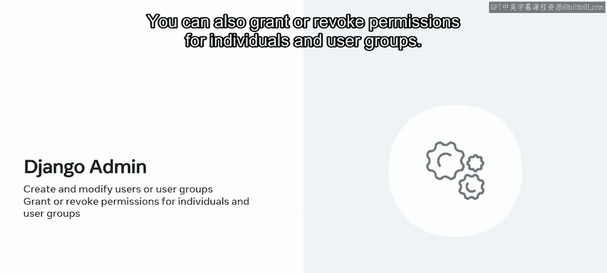

## 概述

Django内置了一个高效的权限管理系统。它允许你为特定用户或用户组添加或移除权限。管理这些权限主要有两种方式：通过用户友好的Django Admin Web界面，或者通过Django Shell进行编程式操作。

---

## 权限系统基础 🔑

上一节我们介绍了Django权限管理的两种方式，本节中我们来看看权限系统本身是如何工作的。

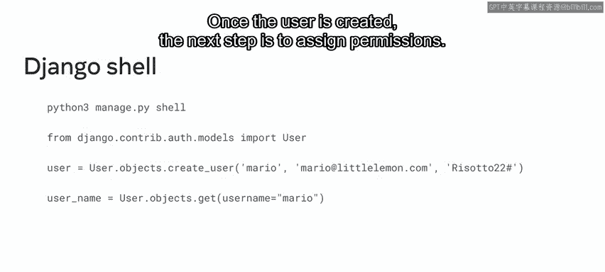

Django的权限系统在`django.contrib.auth`应用被添加到`INSTALLED_APPS`设置中后自动启用。它会为每个已安装应用中的Django模型创建四个默认权限。

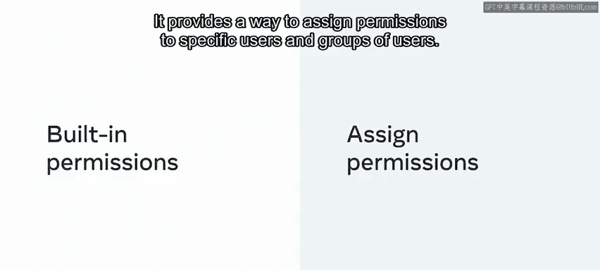

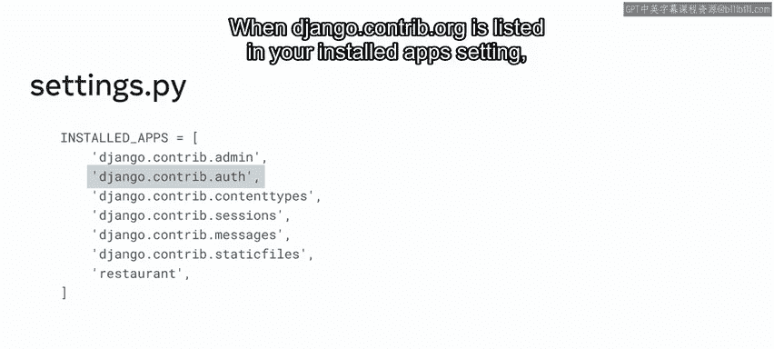

以下是这四个默认权限：
*   **添加（Add）**：创建新对象实例的权限。
*   **更改（Change）**：修改现有对象实例的权限。
*   **删除（Delete）**：删除对象实例的权限。
*   **查看（View）**：查看对象实例的权限。

权限不仅可以按对象类型（模型）设置，还可以针对特定的对象实例进行自定义。通过使用`ModelAdmin`类提供的方法，可以为同一类型的不同对象实例定制权限。

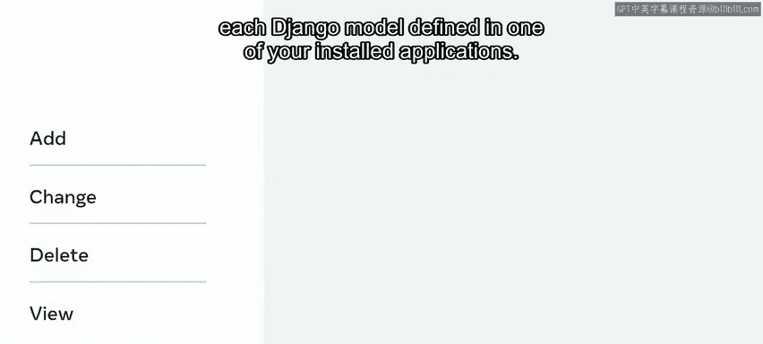

与之前学习的Admin权限类似，模型特定的权限也可以通过`ModelAdmin`类进行管理。`ModelAdmin`类的方法包括`has_view_permission`、`has_add_permission`、`has_change_permission`和`has_delete_permission`，用于自定义权限逻辑。

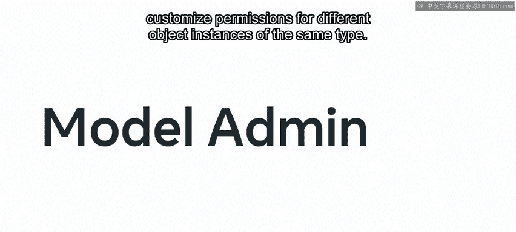

## 通过Django Shell管理权限 💻

了解了权限的基本概念后，接下来我们学习如何在Django Shell中实际操作。

首先，你需要打开一个已导入Django设置的交互式Shell，这允许你直接在项目根目录下工作。

以下是创建用户并查找用户的步骤：
1.  从`django.contrib.auth.models`导入`User`模块。
2.  使用`User.objects.create_user()`方法创建一个新用户，按顺序传入用户名、邮箱和密码参数。
3.  使用`User.objects.get()`方法，通过用户名定位到刚创建的用户。

创建用户后，下一步就是分配权限。用户对象有两个与权限相关的主要字段：`groups`和`user_permissions`。`user_permissions`字段用于关联一个或多个权限对象。

可以通过调用用户对象上的`set()`、`add()`、`remove()`和`clear()`方法来授予或移除权限。

让我们探索一个使用`add()`方法为用户`Mario`授予权限的例子。在这个场景中，我们将提供一个或多个权限对象。

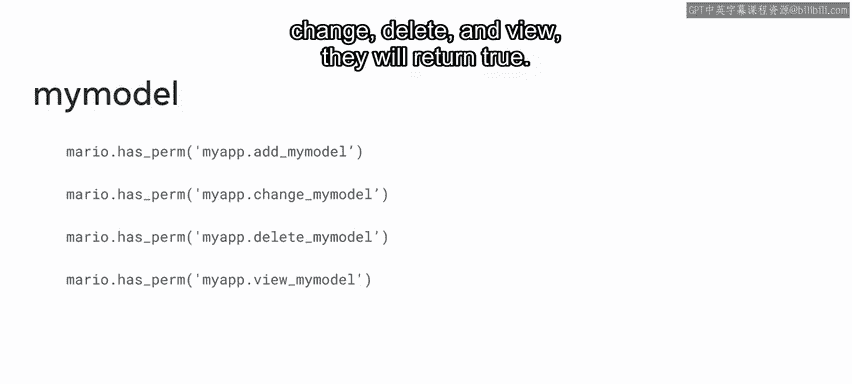

```python
# 示例：为用户添加修改‘myapp’应用中‘Menu’模型的权限
user.user_permissions.add(permission_object)
```

需要注意的是，一旦你将`django.contrib.auth`添加到已安装应用列表，就必须运行`migrate`命令来实施变更。

当你运行`python manage.py migrate`时，每个Django模型都会被自动分配上述的默认权限。例如，假设你有一个名为`myapp`的Django应用，其中包含一个名为`MyModel`的模型，那么验证添加、更改、删除和查看权限的布尔表达式都将返回`True`。

除了默认权限，还可以在模型的`Meta`类中声明自定义权限。

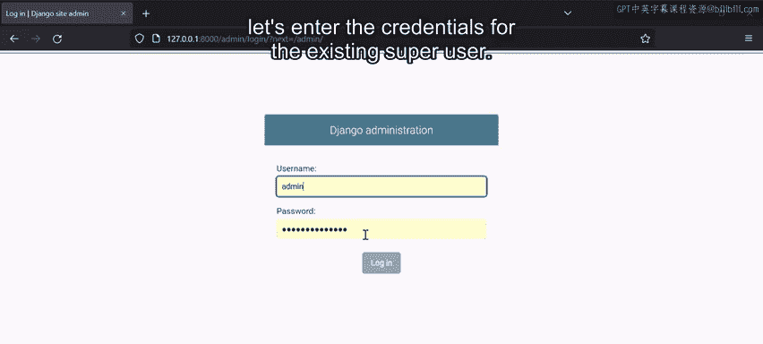

## 通过Django Admin界面管理权限 🌐

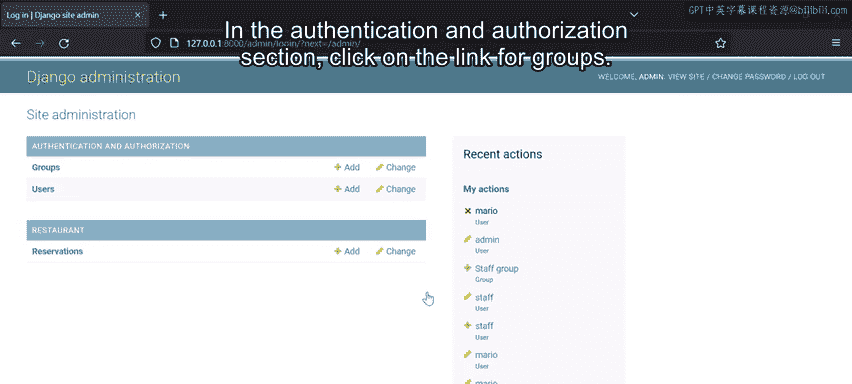

到目前为止，我们已经介绍了如何在Django Shell中修改权限。然而在实践中，使用浏览器中的Django Admin界面来处理权限要容易得多。

让我们探索如何使用Django Admin界面添加和移除权限。基于之前添加组和用户的例子，我们将学习如何使用Django Admin面板为不同用户分配权限。

在浏览器的Admin登录页面，输入现有超级用户的凭据进行登录。

登录Admin面板后，你会看到`Groups`和`Users`的选项。在`Authentication and Authorization`部分，点击`Groups`链接。

首先要知道，除了现有的`staff`组，你还可以创建新的组。例如，假设你想添加两个组：第一个用于预订台员工，第二个用于Little Lemon网站管理员。

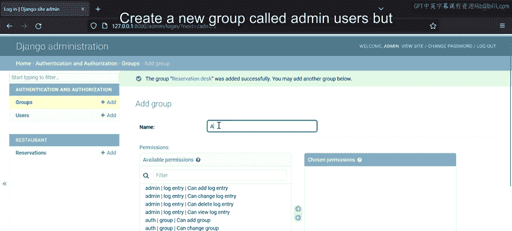

点击`Add group`按钮，会加载一个带有添加组表单的新页面。你必须为组命名，在本例中，组名是`Reservation Desk`。

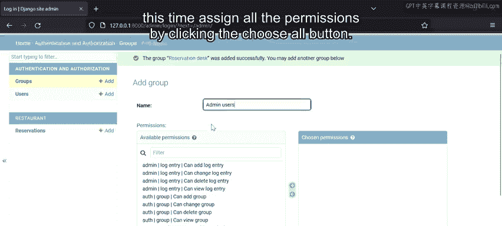

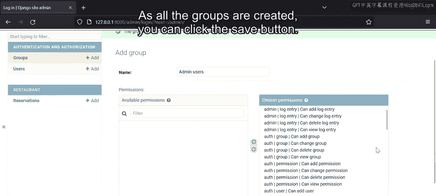

在权限部分，注意`Available permissions`表格中有多个选项。假设你想为此组分配针对`Reservations`模型的权限，你可以选择`Can add reservation`、`Can change reservation`等权限，然后点击右箭头按钮将其添加到`Chosen permissions`表格中。转移完成后，点击`Save and add another`按钮来创建网站管理员组。

注意，`Add group`表单会重置，允许你添加另一个组。创建一个名为`Admin Users`的新组，但这次通过点击`Choose all`按钮分配所有权限。

所有组创建完成后，点击`Save`按钮。

现在组已经创建好了，下一步是添加用户。在`Authentication and Authorization`部分，点击`Users`链接打开用户页面。

假设你想在此部分创建一个名为`Mario`的用户（记住，Mario是Little Lemon的店主）。点击`Add user`按钮，加载一个显示添加用户表单的新网页。

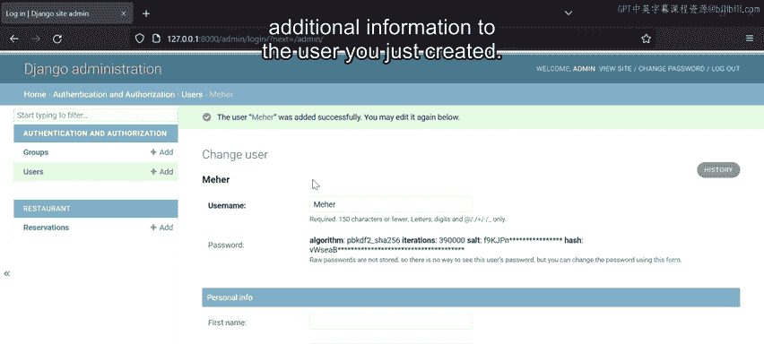

要添加新用户，你必须输入登录凭据：输入`Mario`作为用户名，然后设置密码。点击`Save and add another`按钮来添加另一个新用户。第二个用户是`Meher`，Little Lemon的一名员工。分配密码并点击`Save`按钮。

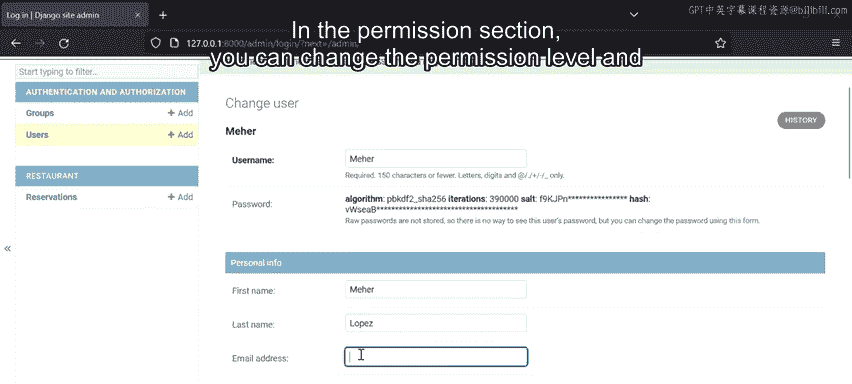

注意，当你点击`Save`按钮时，Django管理界面会立即跳转到可以为你刚创建的用户分配额外信息的页面。

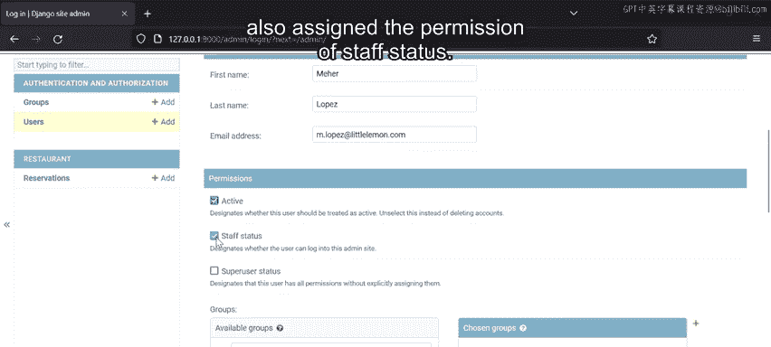

有一个`Personal info`部分，你可以在其中添加用户的名字、姓氏和电子邮件地址。在`Permissions`部分，你可以更改权限级别并将用户分配到一个组。

在这个例子中，用户`Meher`是一名员工，所以让我们保持其`Active`权限，并同时分配`Staff status`权限。接下来，将`Meher`分配到`Reservation Desk`组。

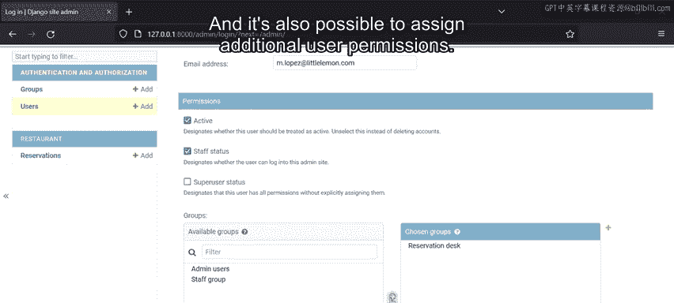

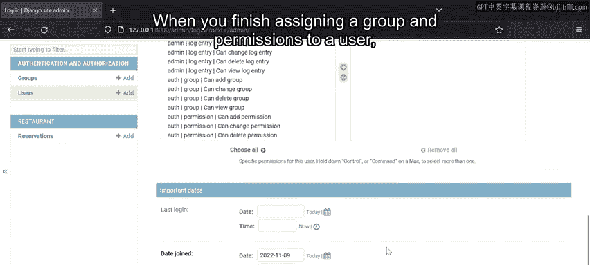

重要的是要知道，一旦你将用户分配到特定组，该组有权获得的所有权限都会自动分配给该用户。当然，也可以为用户分配额外的独立权限。

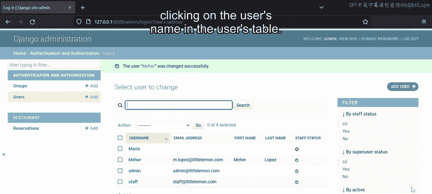

当你完成为用户分配组和权限后，按下`Save`按钮。

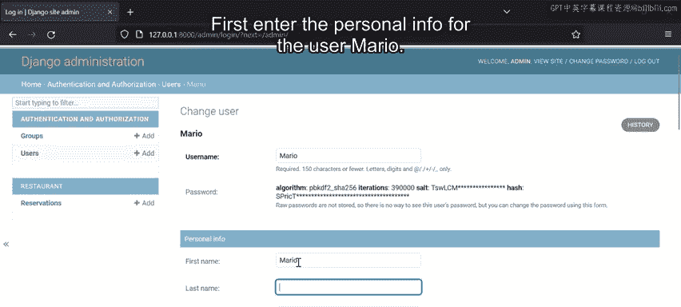

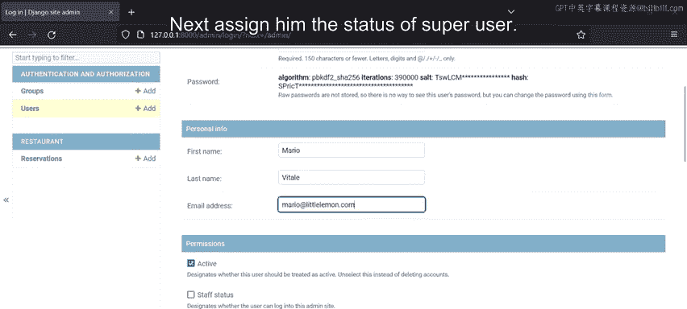

接下来，通过在用户表中点击用户名，来为用户`Mario`添加组和权限。首先，输入用户`Mario`的个人信息。接着，授予他`Superuser`状态。使他成为`Admin users`组的一部分，并保存更改以返回用户页面。

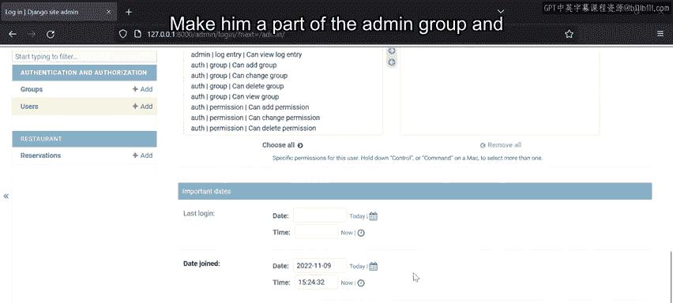

还可以按不同类别筛选用户。在筛选面板中，你可以按员工状态、超级用户状态或他们所属的组（例如`Admin users`）进行筛选。

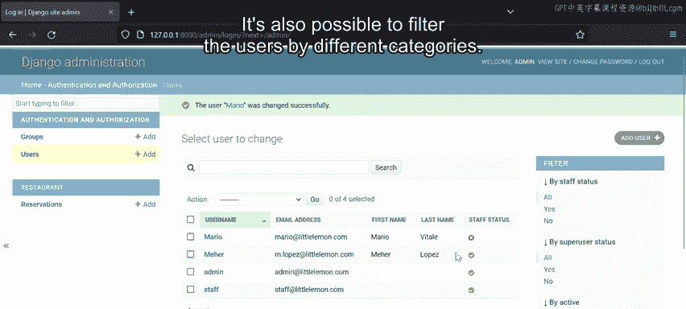

最后，在主页上，注意你的最近操作会显示在`Recent Actions`部分。这个功能允许你快速配置不同的用户并设置他们的权限级别。

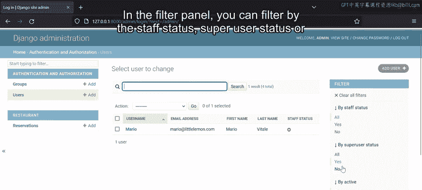

---

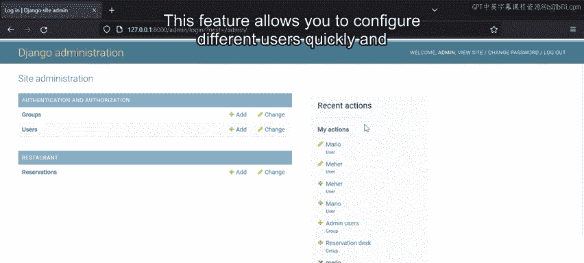

## 总结

在本节课中，我们一起学习了Django中用户与权限管理的核心知识。我们介绍了Django内置的权限系统，包括四种默认权限和自定义权限。我们通过Django Shell演示了如何以编程方式创建用户和分配权限。更重要的是，我们详细探索了如何利用直观的Django Admin界面来添加组、创建用户，以及高效地修改和分配权限。掌握这些技能对于构建安全且可维护的Web应用至关重要。