# 38：数据库选项 🗄️

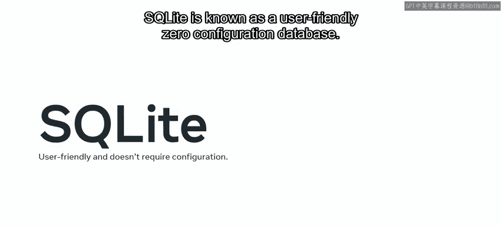

在本节课中，我们将要学习如何在Django项目中配置数据库选项，特别是如何从默认的SQLite数据库切换到更强大、可扩展的MySQL数据库。我们将了解不同数据库的特点、配置方法以及相关的安全注意事项。

## 默认数据库：SQLite

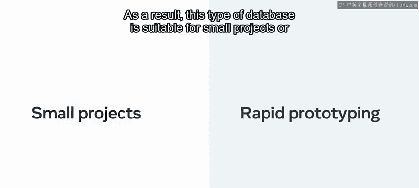

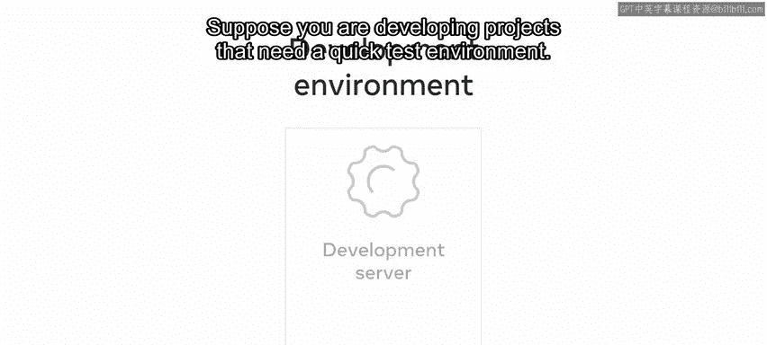

创建Django项目时，默认配置使用SQLite数据库。该配置自动设置在`settings.py`文件中。这意味着你可以立即开始使用数据库。

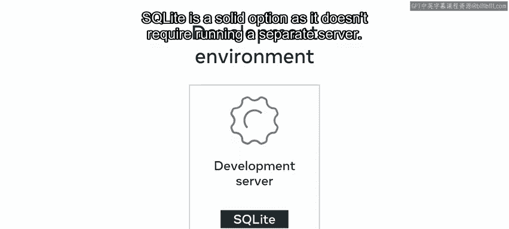

SQLite是一个用户友好、零配置的数据库，使用它有许多优点。你无需安装任何东西来支持该数据库，因为它不作为服务器进程运行。这意味着数据库不需要启动、停止，也不需要额外的配置文件。因此，这类数据库适合小型项目或快速原型开发。

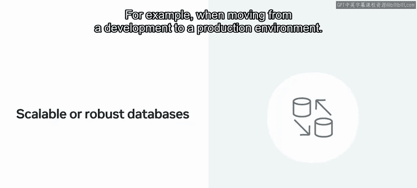

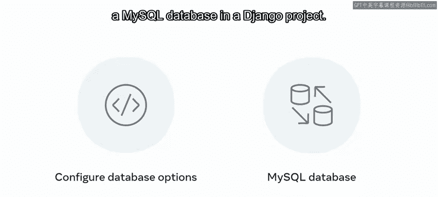

假设你正在开发需要快速测试环境的项目，SQLite是一个可靠的选择，因为它不需要运行单独的服务器。

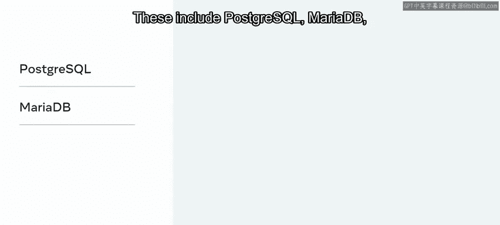

## 切换到生产级数据库

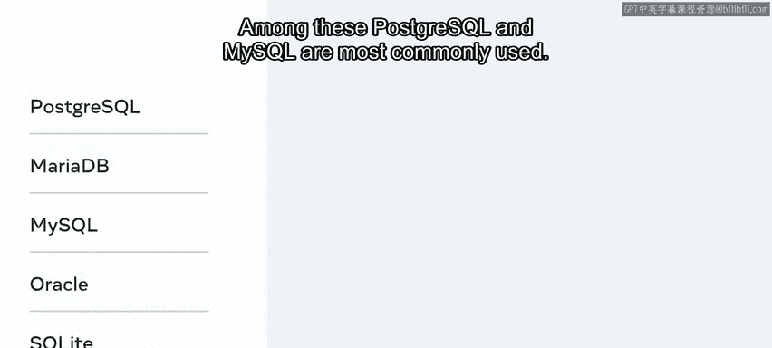

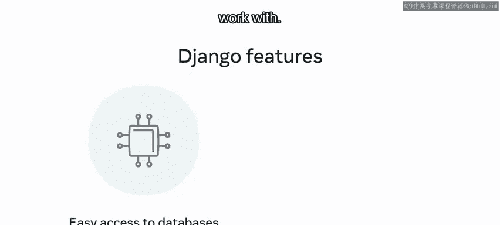

有时可能需要更可扩展、更健壮的数据库，例如从开发环境迁移到生产环境时。在本视频中，你将学习如何配置数据库选项，以便在Django项目中使用MySQL数据库。

## Django支持的数据库

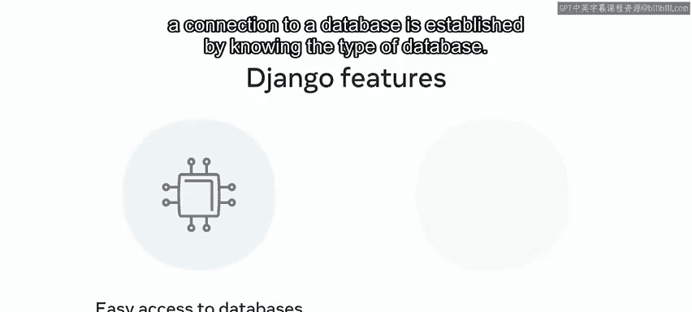

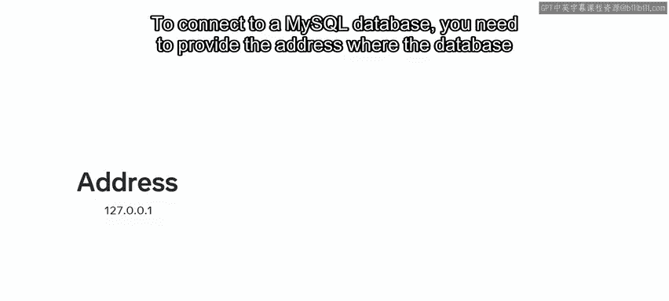

Django支持使用多种数据库，且配置简单。这些数据库包括PostgreSQL、MariaDB、MySQL、Oracle和SQLite。其中，PostgreSQL和MySQL是最常用的。Django提供了支持每种数据库的特性，使其易于连接和使用。

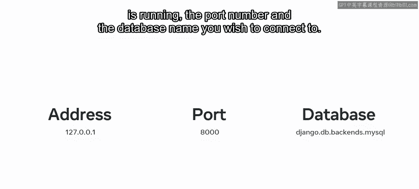

它提供了一种通用的方式来访问不同类型的数据库，通过了解数据库类型来建立连接。在本课中，你将处理最流行和广泛使用的数据库之一：MySQL。

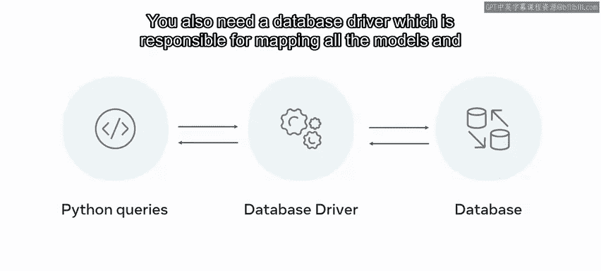

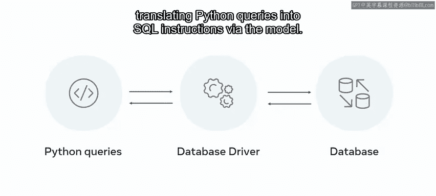

## 配置MySQL数据库连接

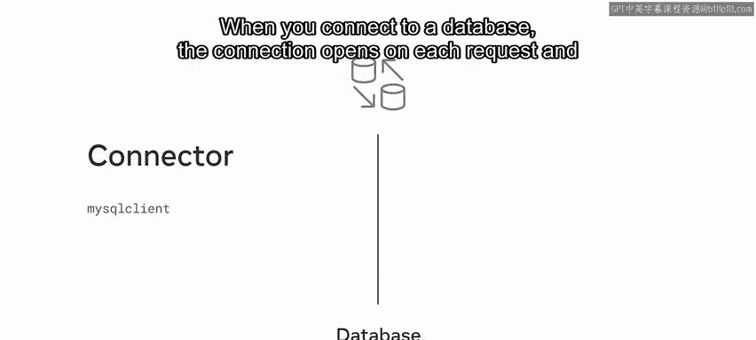

上一节我们介绍了Django支持的多种数据库，本节中我们来看看如何设置与MySQL数据库的连接。

要连接到MySQL数据库，你需要提供数据库运行的地址、端口号以及你想要连接的数据库名称。你还需要一个数据库驱动程序，它负责映射所有模型，并通过模型将Python查询转换为SQL指令。

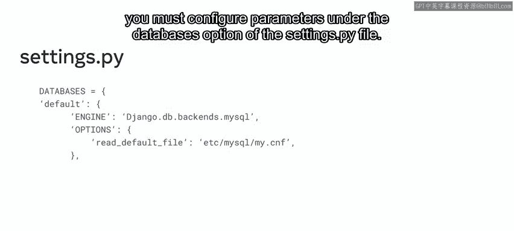

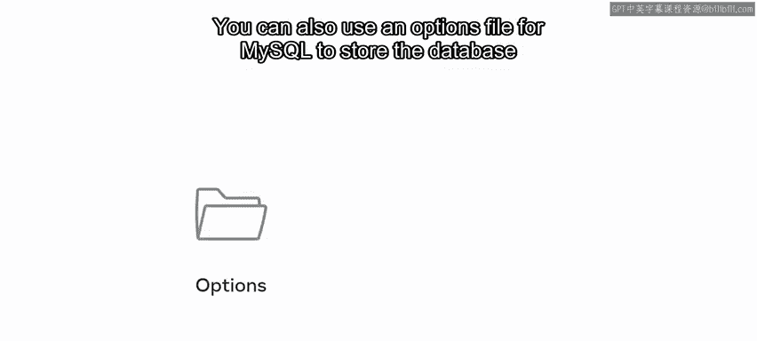

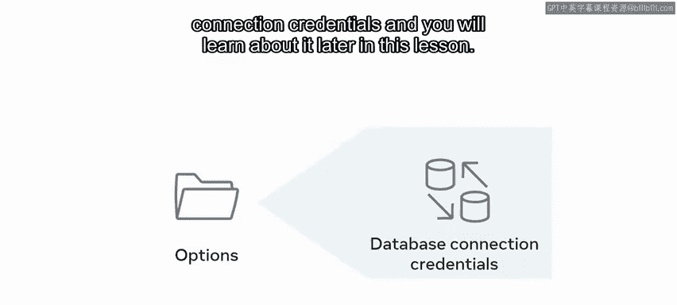

要使用MySQL，需要安装驱动程序或连接器，即MySQL客户端。

当你连接到数据库时，连接会在每个请求上打开，并保持打开特定时间。连接由`CONN_MAX_AGE`参数控制，代表连接自动关闭前的特定时间。

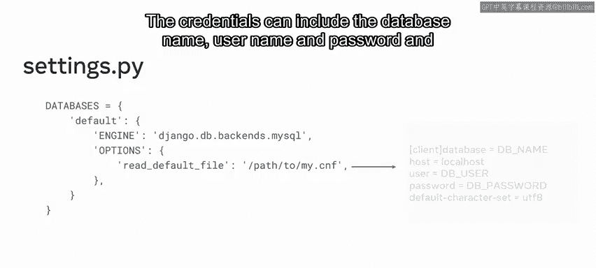

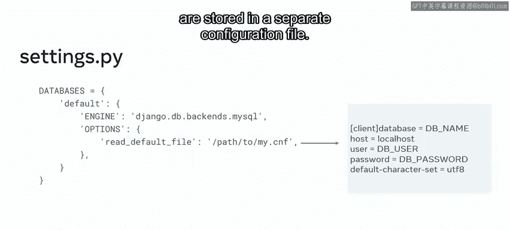

要建立连接，你必须在`settings.py`文件的`DATABASES`选项下配置参数。默认配置是针对SQLite的。

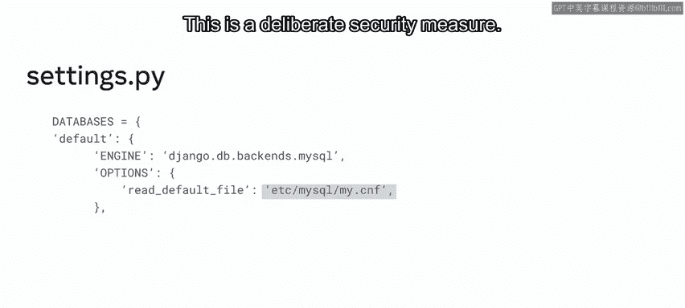

你也可以使用MySQL的选项文件来存储数据库连接凭据，这将在本课后面学习。凭据可以包括数据库名称、用户名和密码，并存储在单独的配置文件中。在`settings.py`文件中，MySQL连接引用会在`/etc/mysql/`目录中查找连接文件。请注意，这不在Django项目内部，这是一种有意的安全措施。

## 创建数据库与安全

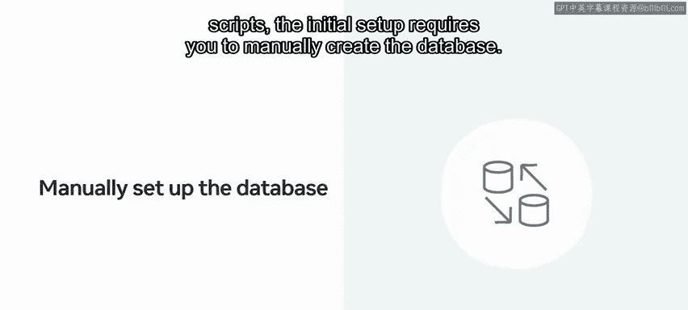

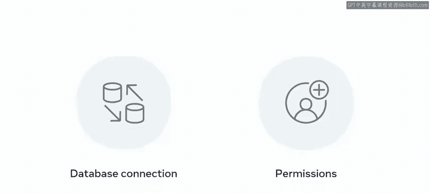

现在你知道了连接到MySQL数据库所需的步骤，让我们来探索数据库的创建过程。虽然Django会根据你的模型通过迁移脚本创建所有表，但初始设置要求你手动创建数据库。

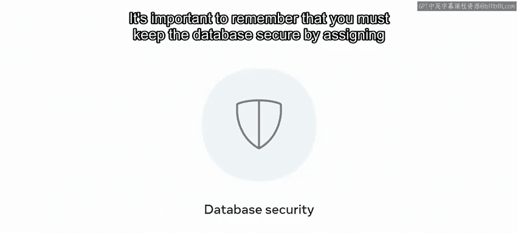

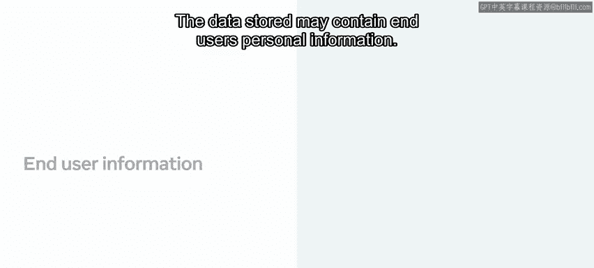

以下是创建数据库时需要注意的要点：
*   创建数据库需要连接到数据库本身，并拥有足够的权限进行身份验证和授权。
*   必须记住，要通过分配安全角色和使用强用户名和密码来保证数据库的安全。
*   存储的数据可能包含最终用户的个人信息，因此保持其私密和安全至关重要。

作为开发者，你需要意识到潜在的安全风险，其中一个重大风险是数据库凭据的安全性。允许他人知道或访问你数据库的用户名和密码可能会带来严重后果。数据库连接凭据仅可在运行Web应用程序的虚拟机或服务器上访问。

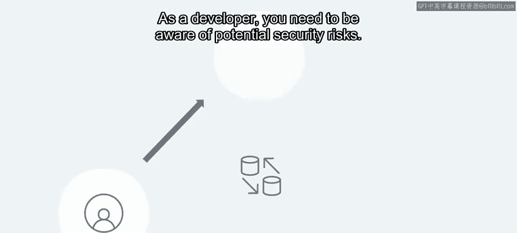

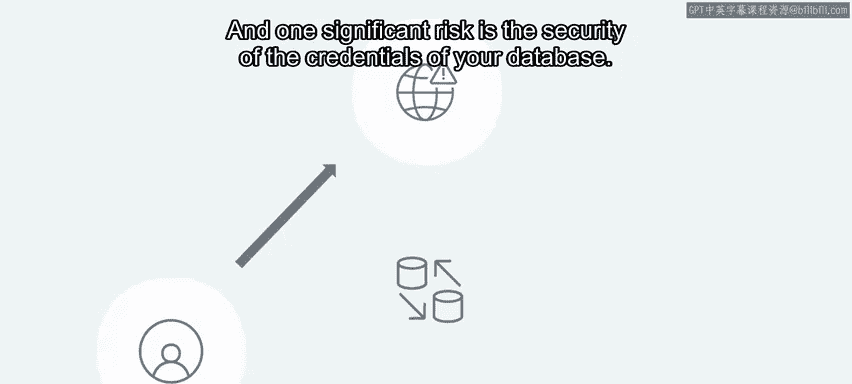

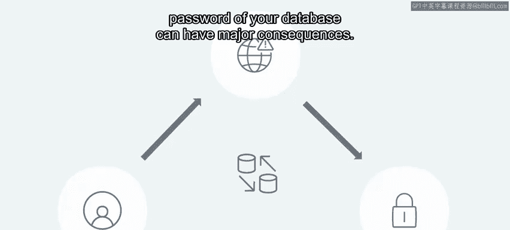

## 总结

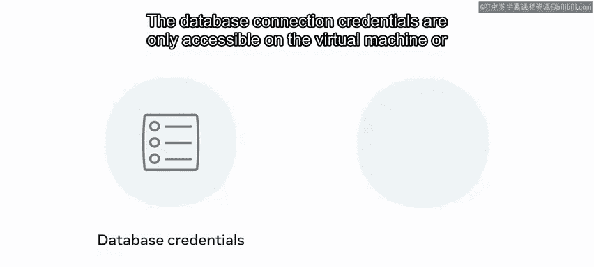

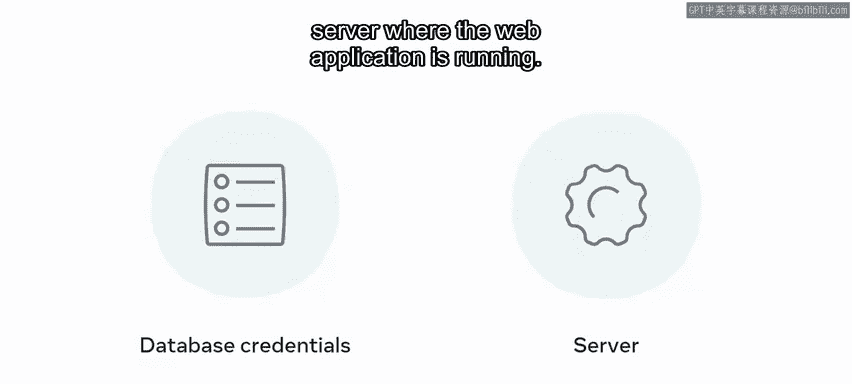

本节课中我们一起学习了如何在Django项目中配置数据库选项。我们首先了解了默认的SQLite数据库及其适用场景，然后探讨了切换到MySQL等生产级数据库的必要性和步骤。我们学习了Django支持的多种数据库、配置MySQL连接的具体参数（如地址、端口、驱动），以及手动创建数据库和安全保护凭据的重要性。理解这些内容对于构建可扩展且安全的Web应用至关重要。