# 41：模板 🧩

在本节课中，我们将要学习 Django 框架中模板的概念与使用方法。模板是生成动态网页内容的核心工具，它允许开发者将静态的 HTML 结构与动态的数据内容分离。

---

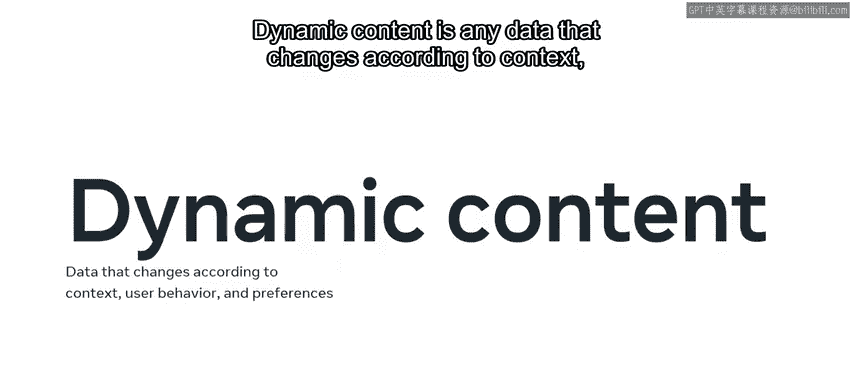

Web 框架通常需要生成动态内容以在网页上呈现。由于 Django 是一个 Web 框架，它提供了一种便捷的方式来动态生成 HTML。

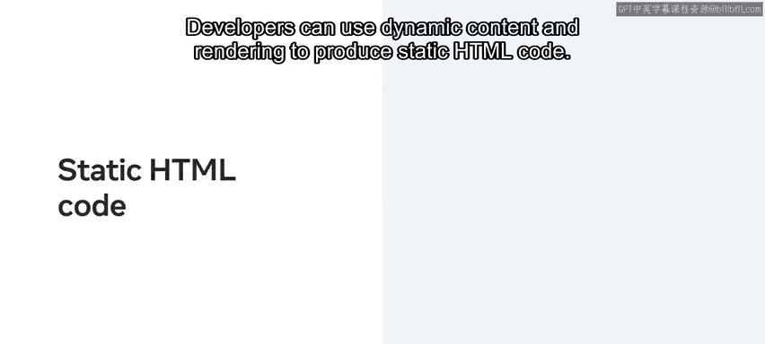

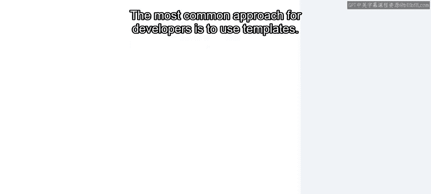

动态内容是指根据上下文、用户行为和偏好而变化的任何数据。

开发者可以利用动态内容和渲染来生成静态的 HTML 代码。

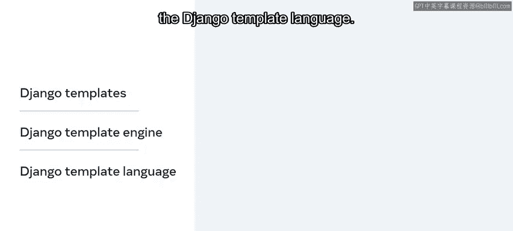

对于开发者而言，最常用的方法是使用模板。

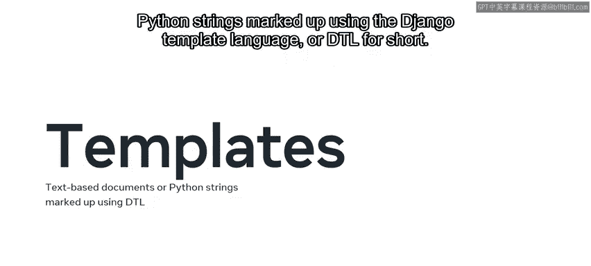

接下来，我们将深入了解如何在 Django 中使用模板，并探索 Django 模板引擎和 Django 模板语言的概念。

---

## 什么是模板？📄

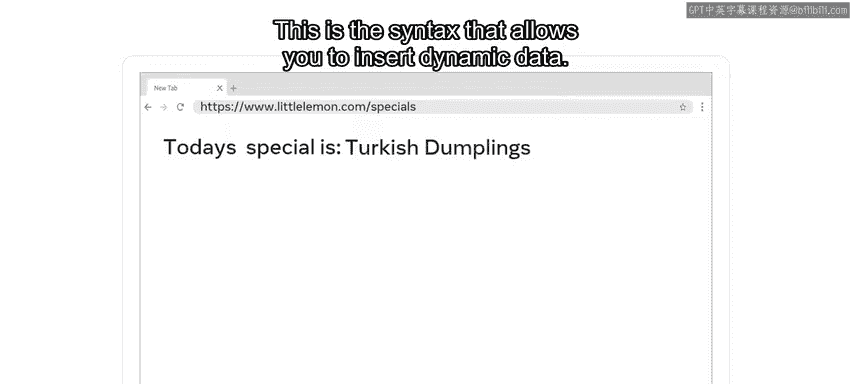

模板是基于文本的文档，或者是使用 Django 模板语言标记的 Python 字符串。Django 模板语言简称为 DTL。

模板主要包含两种类型的内容。第一种是静态内容，即网页上不会改变的 HTML 代码。第二种是模板语言，这是一种允许你插入动态数据的语法。

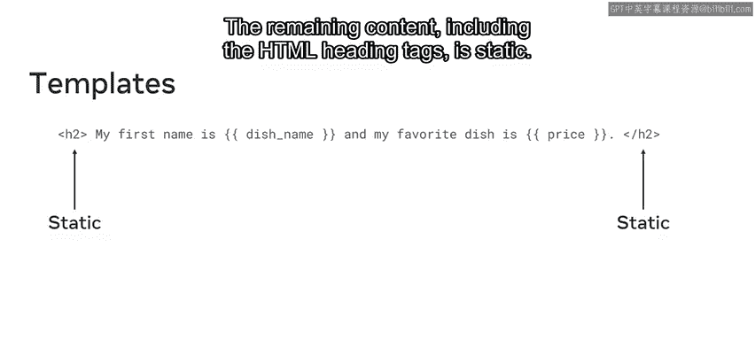

让我们通过一个例子来探索如何使用动态内容创建一个 HTML 标题元素。在这个例子中，变量 `dish_name` 和 `price` 被放置在双花括号 `{{ }}` 内。这些变量代表了动态内容。其余的内容，包括 HTML 标题标签，则是静态的。

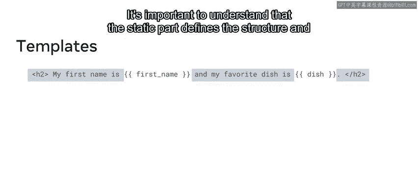

**示例代码：**
```html
<h1>{{ dish_name }} - ${{ price }}</h1>
```

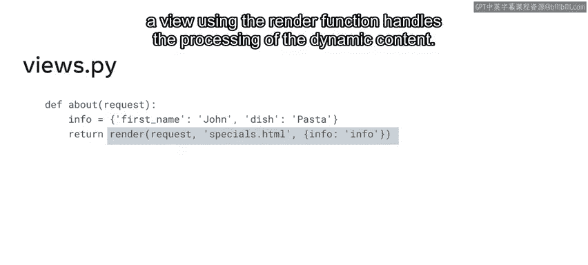

理解静态部分定义了页面的结构和布局这一点非常重要。

而一个使用 `render` 函数的视图则负责处理动态内容。

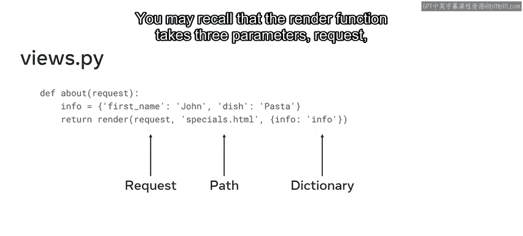

---

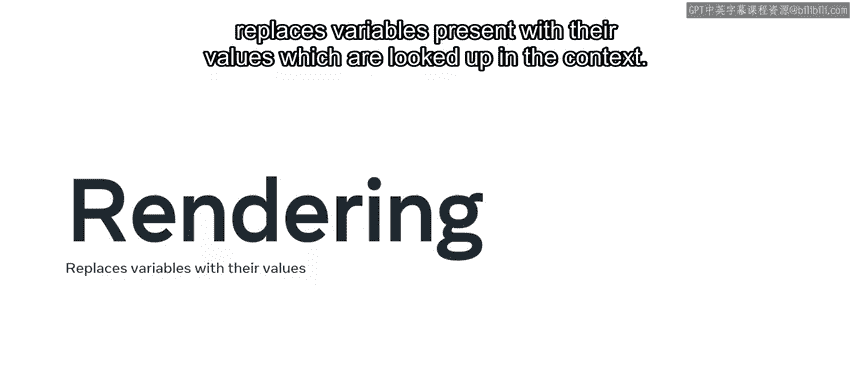

## 模板的渲染过程 🔄

你可能还记得，`render` 函数接受三个参数：`request`、模板路径和一个变量字典。

**函数调用示例：**
```python
return render(request, ‘template.html‘, {‘dish_name‘: ‘Pizza‘, ‘price‘: 12.99})
```

当你将字典对象传递给 `render` 函数时，渲染过程会用上下文中的值替换模板中存在的变量。

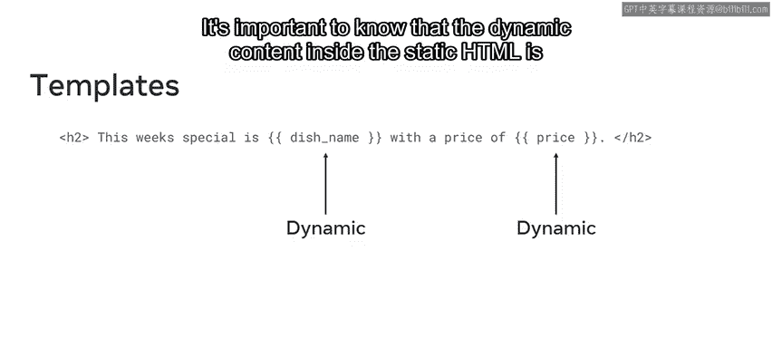

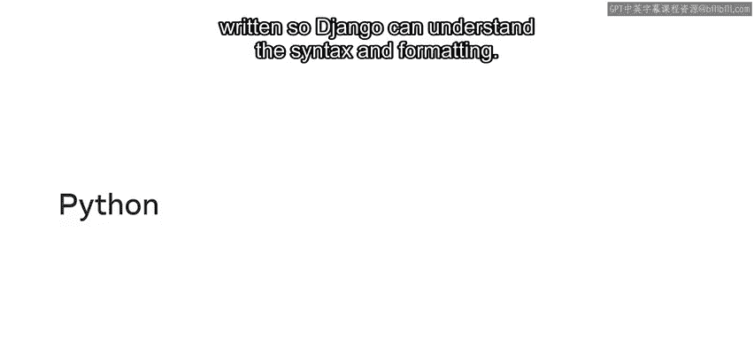

虽然你使用模板语言来渲染动态内容，但模板的概念构成了 MVT 架构中的表示层。这有助于实现逻辑分离，因为模板处理的是网页的用户界面逻辑。

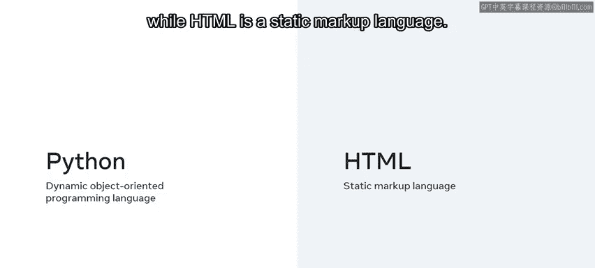

需要知道的是，静态 HTML 内部的动态内容是以 Django 能够理解的语法和格式编写的。

---

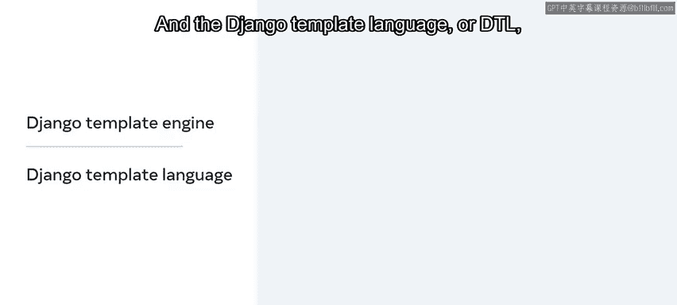

## Django 模板引擎与语言 ⚙️

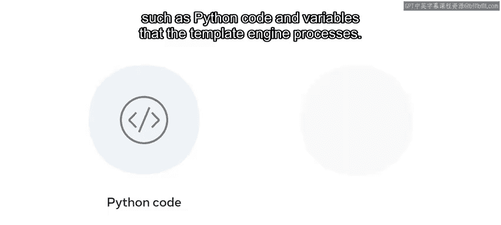

Python 是一种动态的、面向对象的编程语言，而 HTML 是一种静态的标记语言。

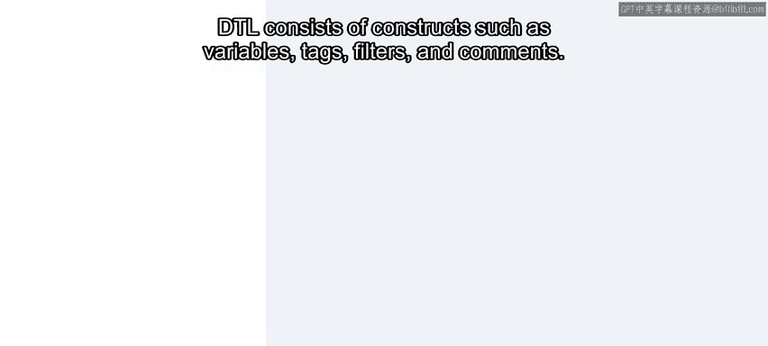

为了弥合这一差距，Django 利用了 Django 模板引擎和 Django 模板语言。DTL 是用于添加动态内容的语言。

DTL 可以包含嵌入的动态内容，例如 Python 代码和变量，这些内容由模板引擎处理。

DTL 由变量、标签、过滤器和注释等结构组成。

每个结构都有特定的语法，帮助 Django 理解代码逻辑。例如，你可以使用标签和注释来构建一个 `for` 循环以显示列表项元素。标签映射来自上下文的字典值，并帮助向模板添加逻辑。你将在本课后面学到更多关于这些结构的内容。

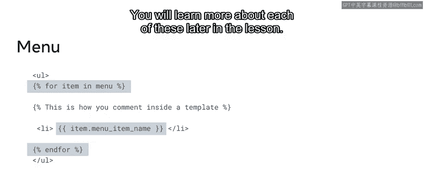

此外，Django 还提供了一个用于加载和渲染模板的 API。

---

## 模板引擎配置 ⚙️

你在项目目录下的 `settings.py` 文件中定义模板引擎的配置设置。必须将 `APP_DIRS` 设置设为 `True`，这一点很重要。

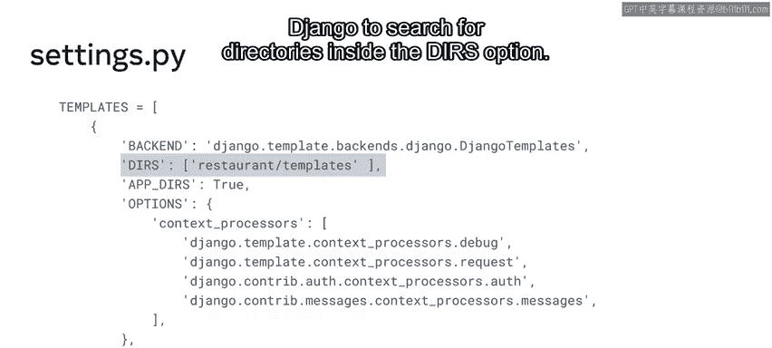

这个设置告诉 Django 在哪里搜索模板。例如，在项目中每个应用的名为 `templates` 的子目录内进行搜索。

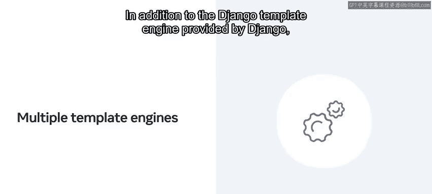

你还可以在 `DIRS` 选项内的 `directory` 设置中添加特定位置，以便 Django 在其中搜索目录。

除了 Django 提供的默认模板引擎，你还可以通过使用一个或多个模板引擎来扩展其功能。

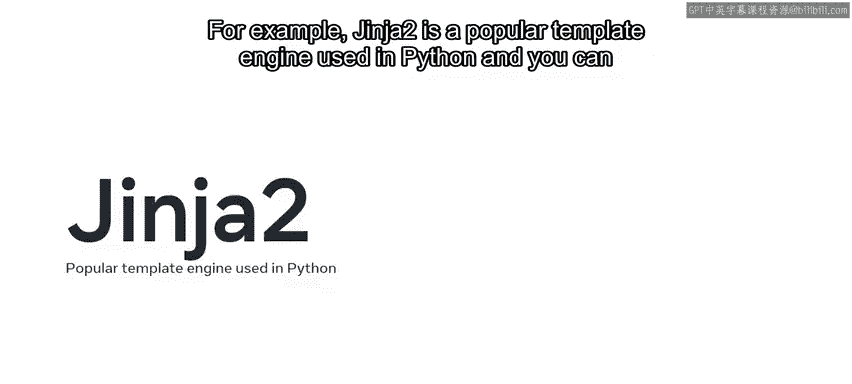

例如，Jinja2 是 Python 中一个流行的模板引擎，你可以在 `settings.py` 文件中配置添加这些扩展的设置。

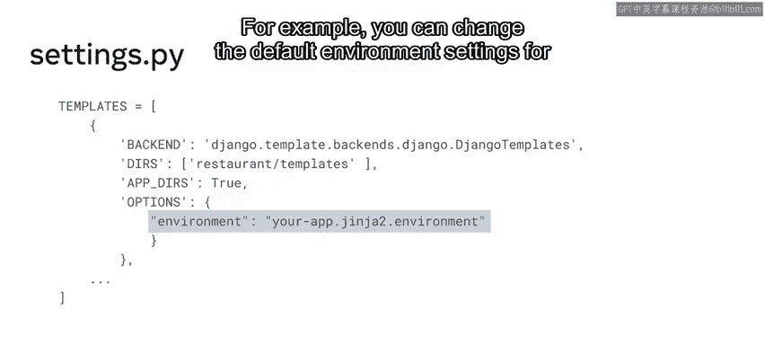

例如，你可以更改 Django 的默认环境设置以使用 Jinja2。

---

## 模板继承与代码复用 ♻️

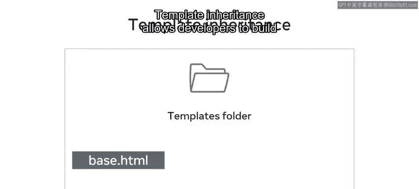

现在你了解了模板引擎，让我们探索代码复用的概念。Django 通过使用模板和一种称为“模板继承”的机制来帮助实现代码复用。

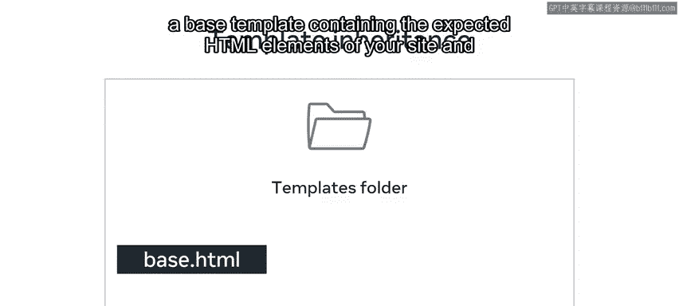

模板继承允许开发者构建一个包含网站预期 HTML 元素的基础模板，并定义子模板可以覆盖的块。

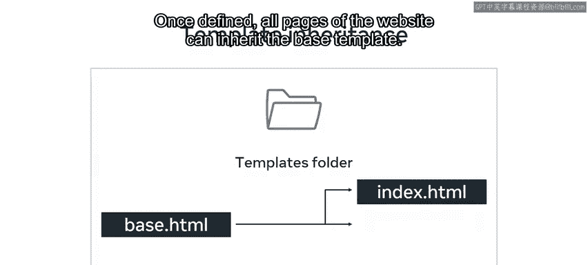

一旦定义好，网站的所有页面都可以继承这个基础模板。

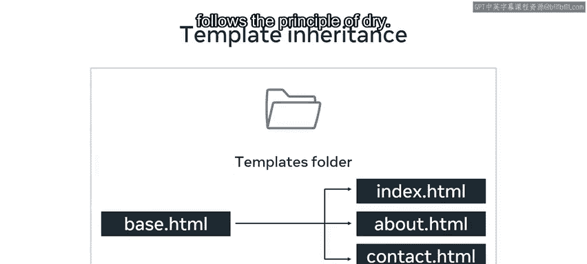

这种代码复用性有助于节省开发者的时间和精力，并遵循 DRY（不要重复自己）原则。

例如，你可以创建一个包含网站头部、主体和主要部分 HTML 代码的基础模板。然后，在一个子网页中，你继承这个基础模板并放置页面的特定内容。

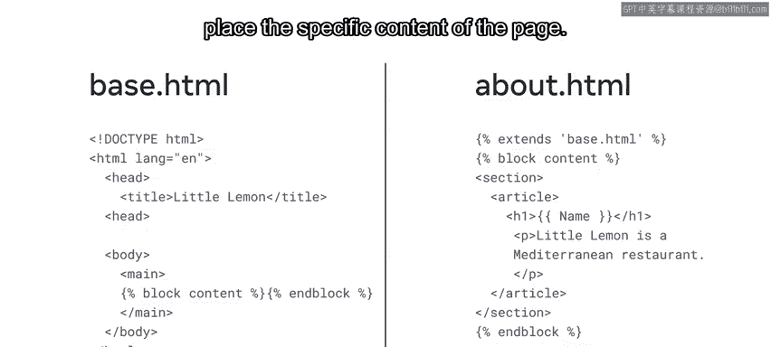

将模板文件放置在名为 `templates` 的文件夹内是一种标准的、最佳实践的做法。

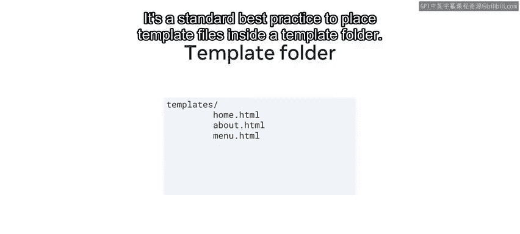

---

## 总结 📝

本节课中，我们一起学习了如何在 Django 中使用模板，并探索了 Django 模板引擎和 Django 模板语言的概念。模板是 Django 中一个相当广泛的主题，在本课程的剩余部分，你将学到更多关于它们的知识。