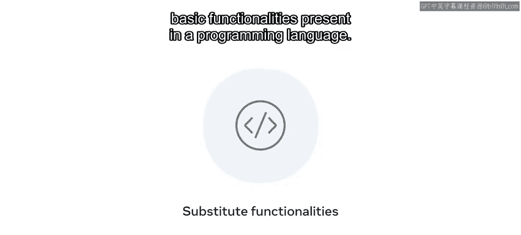
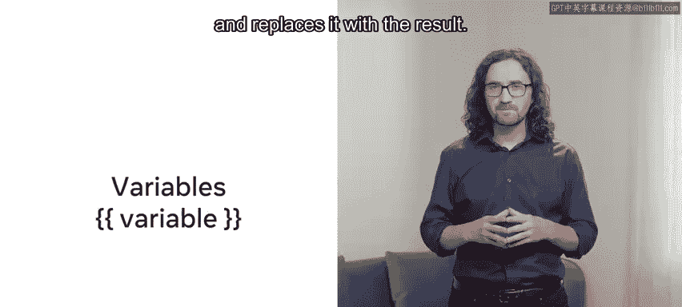
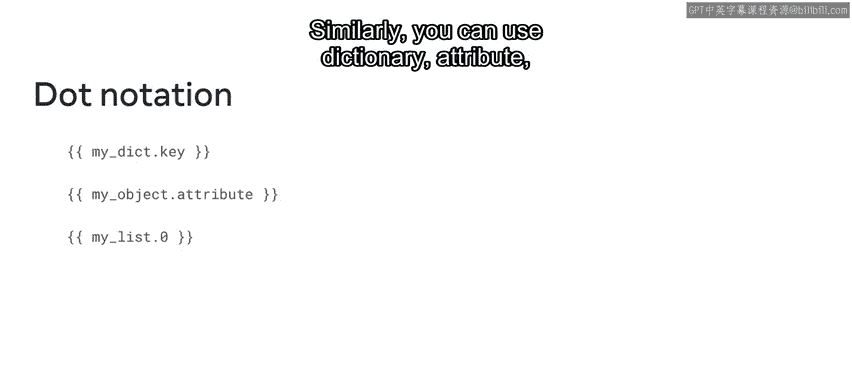
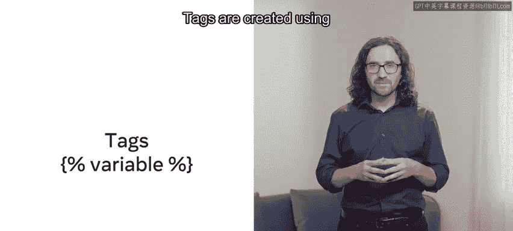
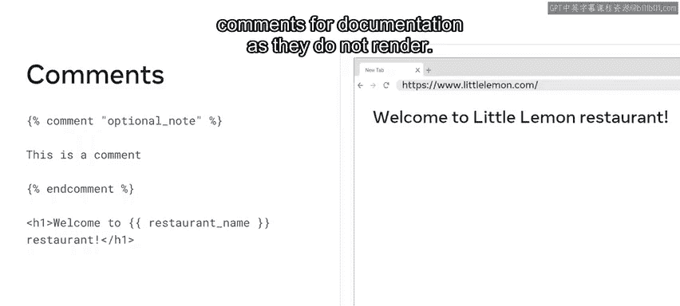

# 43：使用模板语言 🧩

## 概述
在本节课中，我们将要学习Django模板语言（DTL）。DTL是Django用于在HTML标记中嵌入动态数据的关键工具。我们将了解其核心语法，包括变量、标签、过滤器和注释，并学习如何使用它们来分离表示层和应用逻辑，从而创建动态的网页内容。

---

## 变量：动态数据的占位符
上一节我们介绍了DTL的基本概念，本节中我们来看看其第一个核心构造：变量。变量用于在模板中插入动态数据。

变量由双花括号 `{{ }}` 包围。当模板引擎遇到一个变量时，它会计算该变量的值并用结果替换它。

变量可以返回类似字典的对象，将键映射到值。例如，如果上下文中有 `{"restaurant_name": "Little Lemon"}`，在模板中使用 `{{ restaurant_name }}` 将渲染为 “Little Lemon”。

同样，您可以使用点符号进行字典属性或列表索引查找。
*   **字典属性查找**：`{{ my_dict.key }}`
*   **列表索引查找**：`{{ my_list.0 }}`



---

## 标签：模板中的逻辑控制
了解了变量之后，让我们继续学习标签。标签为模板提供了逻辑控制能力。



标签使用花括号和百分号 `` 创建。最常用的标签是控制结构，如 `if` 条件判断和 `for` 循环。

`if` 标签用于根据条件渲染不同的输出。一个典型的用例是检查用户的登录状态。



以下是 `if` 标签的示例代码：
```django

    <p>Welcome back!</p>

    <a href="/login">Please log in.</a>

```
这段代码检查布尔变量 `logged_in` 的值。如果为真，页面渲染欢迎语句；如果为假，则渲染登录链接。



另一个常见的工作流程是遍历字典或列表以显示内容。为此，您需要使用 `for` 循环。

假设您有一个包含餐厅菜单项的简单列表。要静态创建此菜单，您需要为每个菜单项手动编写HTML。而使用模板动态创建，您可以添加一个 `for` 循环。

以下是 `for` 循环的示例代码：
```django
<ul>

    <li>{{ item.name }}: ${{ item.price }}</li>

</ul>
```
在这段代码中，变量 `item` 在迭代过程中会依次引用 `menu_items` 列表中的每个对象。循环将遍历菜单列表并显示每个菜品的名称和价格。

除了 `if` 和 `for`，还有许多其他标签，例如 `extends` 和 `include`，您将在后续课程中学习。

---

## 过滤器：修改变量的值
现在，让我们来探索过滤器。与标签不同，过滤器可以修改变量的值。

过滤器在变量后使用竖线 `|` 符号调用。例如，如果您添加一个 `upper` 过滤器，它会将输入字符串转换为大写。
*   **公式/代码**：`{{ variable_name|upper }}`

过滤器也可以接受参数，例如在使用 `date` 过滤器时。
*   **公式/代码**：`{{ a_date_variable|date:"Y-m-d" }}`
这个例子传递了年、月、日的格式参数，从而生成指定格式的日期字符串。

---

## 注释：用于文档说明
最后，我们来了解一下注释。您可以使用花括号和百分号创建注释，Django会忽略这两个标签之间的所有内容。

注释的语法如下：
```django

    这里是多行注释。
    这些内容不会在最终页面中渲染。

```
需要注意的是，开发者使用注释进行文档说明，因为它们不会被渲染到最终页面上。



---

## 总结
本节课中我们一起学习了Django模板语言（DTL）的核心组成部分。我们了解到，变量 `{{ }}` 用于插入数据，标签 `` 用于控制逻辑流程（如 `if` 和 `for`），过滤器 `|` 用于格式化或修改变量值，而注释则用于代码说明。开发者经常结合使用标签和过滤器来创建动态的网页内容。掌握DTL是构建灵活、可维护Django应用视图层的基础。