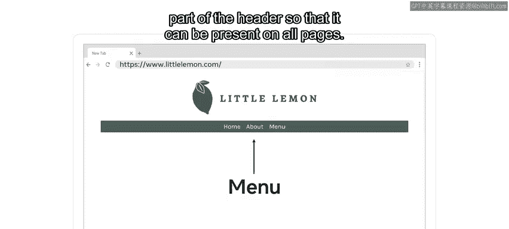
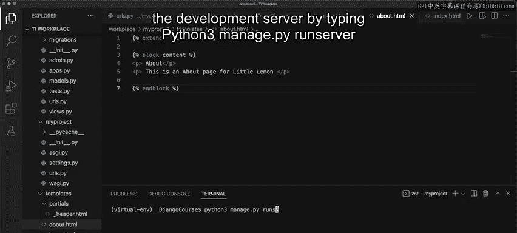
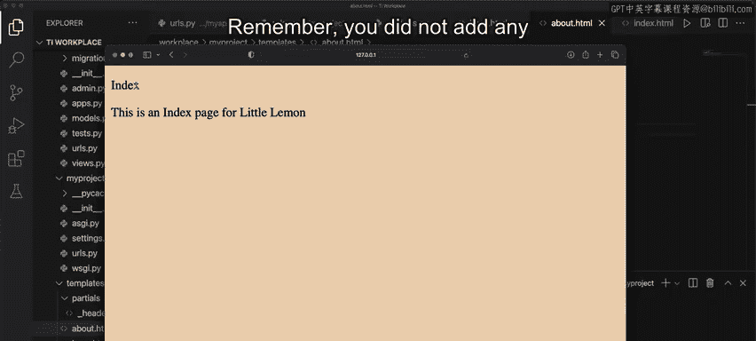
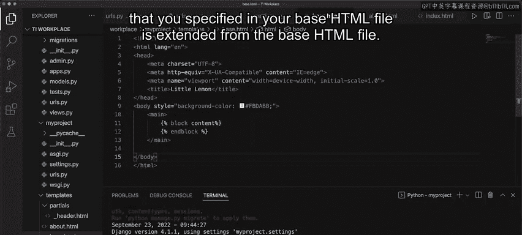
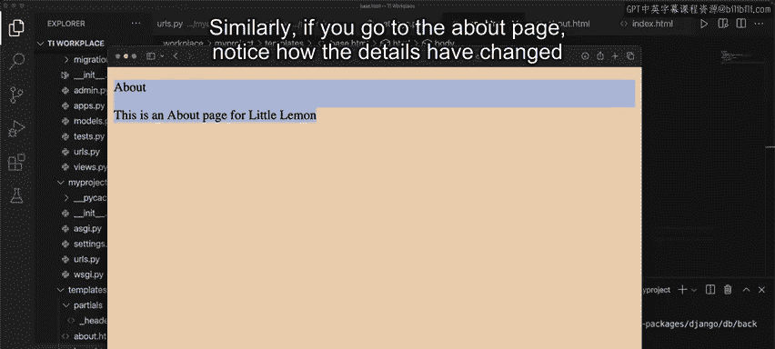
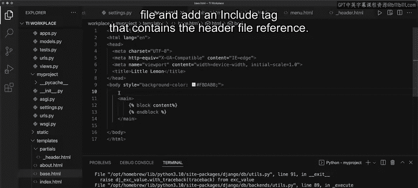
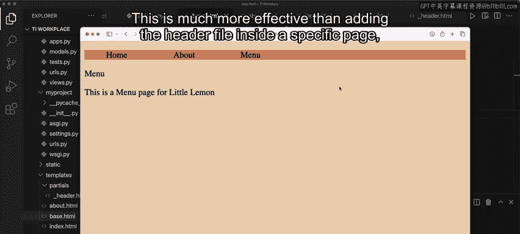
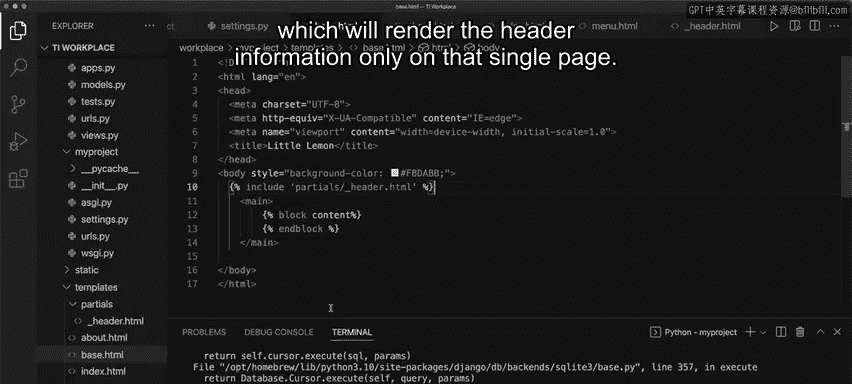

# 47：使用模板继承 🧩

在本节课中，我们将要学习如何在Django中使用模板继承。模板继承是一种强大的技术，它允许你创建一个基础模板（父模板），其他模板（子模板）可以继承并覆盖其中的特定部分。这有助于保持网站设计的一致性，并减少重复代码。

上一节我们介绍了模板继承的概念，本节中我们来看看如何在Django项目中实际应用 `extends` 和 `include` 标签。

---

## 项目场景与目标

假设你需要为一家名为“小柠檬”的餐厅设计一个网站。该网站包含三个页面：**主页**、**菜单页**和**关于页**。虽然每个页面的内容不同，但一些基本的样式组件（如页眉、页脚）需要在所有页面上保持一致。此外，你可能希望导航菜单作为页眉的一部分，出现在所有页面上。

我们的目标是使用Django的模板继承功能来实现这个需求。

## 实施步骤

以下是实现模板继承的具体步骤。

### 1. 设置视图与URL



首先，你需要在 `views.py` 文件中设置三个视图函数，分别对应三个页面。

```python
# views.py
from django.shortcuts import render

def home(request):
    return render(request, ‘index.html‘)

def about(request):
    return render(request, ‘about.html‘)

def menu(request):
    return render(request, ‘menu.html‘)
```

确保在项目级和应用级的 `urls.py` 文件中配置好URL映射，将相应的URL路径指向这些视图。

接着，更新 `settings.py` 文件，将你的应用添加到 `INSTALLED_APPS` 列表中，并配置模板目录 `DIRS`。

### 2. 创建模板文件结构

为了使用模板，你需要在项目文件夹下创建一个名为 `templates` 的文件夹。

当使用模板继承时，通常还会在 `templates` 文件夹内创建一个名为 `partials` 的子文件夹，用于存放可复用的模板片段（如页眉、页脚）。

现在，让我们在 `templates` 文件夹内创建以下文件：
*   `base.html`： 作为所有页面的基础模板。
*   `index.html`： 主页模板。
*   `about.html`： 关于页模板。
*   `menu.html`： 菜单页模板。

在 `partials` 文件夹内创建一个文件：
*   `_header.html`： 页眉模板片段。

### 3. 编写基础模板 (`base.html`)

基础模板包含了所有页面共有的结构和样式。你可以通过输入 `!` 然后按回车来快速生成基本的HTML结构。

```html
<!-- templates/base.html -->
<!DOCTYPE html>
<html lang=“en”>
<head>
    <meta charset=“UTF-8”>
    <title>小柠檬 🍋</title>
    <style>
        body {
            background-color: #f0f8ff; /* 浅蓝色背景 */
        }
    </style>
</head>
<body>
    <main>
        
        <!-- 子模板的内容将在这里被插入 -->
        
    </main>
</body>
</html>
```

代码解释：
*   `` 和 `` 定义了一个名为 `content` 的块。子模板可以覆盖这个块，并填入自己的内容。
*   我们在 `body` 标签中添加了背景色样式，这个样式将被所有继承自 `base.html` 的页面共享。

### 4. 编写子模板并继承

现在，让我们编辑主页模板 `index.html`，让它继承基础模板并填充自己的内容。

```html
<!-- templates/index.html -->



    <h1>欢迎来到小柠檬餐厅！</h1>
    <p>我们提供最新鲜、最美味的柠檬风味菜肴。</p>
    <p>请浏览我们的菜单，了解更多信息。</p>

```

代码解释：
*   `` 声明此模板继承自 `base.html`。
*   ` ... ` 覆盖了父模板中同名的 `content` 块，并提供了主页特有的HTML内容。

对 `about.html` 和 `menu.html` 文件重复类似的步骤，填入各自页面的内容。

### 5. 运行服务器并查看效果

保存所有文件，然后在终端运行开发服务器：



```bash
python3 manage.py runserver
```

在浏览器中访问 `http://127.0.0.1:8000/home`（或你配置的主页URL）。你会看到主页成功渲染，并且继承了 `base.html` 中定义的背景色。

**为什么背景色生效了？**
因为你没有在 `index.html` 中指定背景色，所以它自动使用了父模板 `base.html` 中定义的样式。这就是继承的作用：子模板获得了父模板的所有特性，除非它明确覆盖了它们。



同样，访问“关于”页面，你会发现页面结构一致，但内容已变为关于页的信息。



**总结一下**：`base.html` 模板在每个页面上渲染，但每个页面独特的 `content` 块内容会显示在指定的区域。

### 6. 使用 `include` 标签添加页眉



`include` 标签用于将另一个模板的内容包含到当前模板中。这非常适合用于添加像页眉、页脚这样的公共组件。

首先，在 `_header.html` 文件中添加页眉内容并保存。

```html
<!-- templates/partials/_header.html -->
<header>
    <nav>
        <a href=“/home”>主页</a> |
        <a href=“/menu”>菜单</a> |
        <a href=“/about”>关于我们</a>
    </nav>
    <hr>
</header>
```

然后，修改 `base.html` 文件，使用 `include` 标签将页眉包含进来。



```html
<!-- templates/base.html -->
<!DOCTYPE html>
<html lang=“en”>
<head>
    <meta charset=“UTF-8”>
    <title>小柠檬 🍋</title>
    <style>
        body {
            background-color: #f0f8ff;
        }
    </style>
</head>
<body>
     <!-- 包含页眉 -->
    <main>
        
        
    </main>
</body>
</html>
```

保存文件并刷新浏览器中的网页。现在，你会看到页眉信息显示在页面的顶部。这个页眉将出现在所有继承自 `base.html` 的页面上，而不会影响页面的其他信息。

**这比将页眉代码单独添加到每个页面要高效得多**，后者只会让页眉信息出现在单个页面上。

---

## 本节课总结





在本节课中，我们一起学习了如何在Django中使用 `include` 和 `extends` 标签来实现模板继承。

*   **`extends` 标签**：用于建立模板间的父子继承关系。子模板可以覆盖父模板中定义的 `block`。
*   **`include` 标签**：用于将一个模板的渲染结果包含到当前模板中，非常适合复用如页眉、页脚、侧边栏等组件。

掌握这项技能将为你未来的Web开发项目节省大量时间，使你能够更高效地构建和维护具有一致外观的网站。