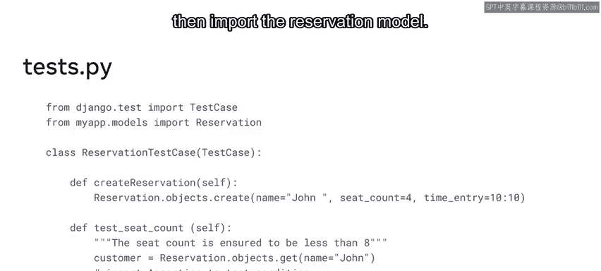
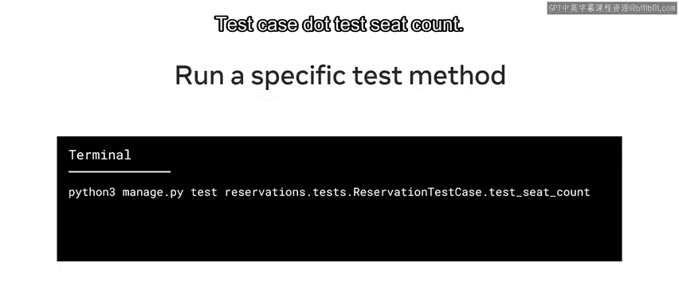
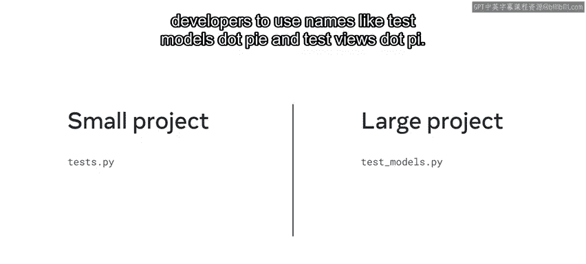
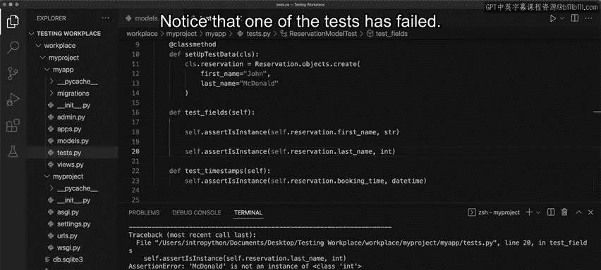

# 49：Django中的测试 🧪

## 概述

在本节课中，我们将要学习Django框架中的测试概念。测试是软件开发周期中的重要组成部分，它能确保代码的质量、可靠性和性能。我们将重点了解如何使用Python的`unittest`模块在Django中进行单元测试。

## 测试的重要性

测试是软件开发生命周期中的一个重要组成部分。

调试更侧重于消除应用程序的错误和缺陷。

测试则考量质量、可靠性和性能等指标。

它能有效地为开发者节省大量时间。

## Django中的测试选项

每种语言和框架都有许多测试选项，开发者会根据项目需求做出适当的选择。

许多测试包和工具都能与Django良好配合。一个流行的方法是单元测试。

你可以使用单元测试来隔离一个函数、类或方法，并只测试那一段代码。

## 单元测试基础

上一节我们介绍了测试的重要性，本节中我们来看看进行单元测试时需要了解的基础信息。

以下是进行单元测试时需要了解的基础信息：

*   **测试目标**：测试针对代码中的细粒度功能，即可测试的最小单元。
*   **测试输出**：测试的输出结果将是**通过**、**失败**或**错误**。



在本视频中，你将通过Python的`unittest`模块示例，学习Django中的测试概念。

## Django的测试模块

在Django中，`unittest`模块采用基于类的方法。

你将测试添加在一个继承自Django测试包中`TestCase`类的类内部。

假设你编写了一个名为`Reservation`的模型并想测试它。首先，导入继承自`TestCase`的测试类，然后导入`Reservation`模型。

```python
from django.test import TestCase
from .models import Reservation
```

## 运行测试

创建测试后，使用命令`python3 manage.py test`来运行。



此外，你可以添加特定配置来运行特定包内的所有测试，例如：

运行命令：`python3 manage.py test reservations`。

要运行特定的测试用例，使用命令：`python3 manage.py test reservations.tests.ReservationTestCase`。

或者，假设你想运行测试用例中的一个特定测试方法，例如一个计算座位数的方法。你可以运行如下命令：`python3 manage.py test reservations.tests.ReservationTestCase.test_seat_count`。

## 测试文件组织



了解开发者通常如何组织测试文件很重要。

在小型项目中，开发者通常将测试用例放在特定应用文件夹下创建的一个或多个文件中，并常见地将文件命名为`tests.py`。

在可能包含多个测试文件的大型项目中，开发者通常使用诸如`test_models.py`和`test_views.py`这样的名称。

## 实践示例：创建单元测试

好了，现在你了解了Django中测试的概念。让我们打开VS Code，探索一个创建单元测试的例子。

之前你学习了如何在Python中使用单元测试来测试代码。在这个例子中，你将探索Django如何将`unittest`模块与`TestCase`包结合使用。

让我们探索如何使用测试用例来测试Django应用程序内的模型数据。

请注意，项目已经创建，并且应用配置已在`settings.py`文件的`INSTALLED_APPS`列表中设置好。

在这个例子中，你将处理两个文件：`models.py`和`tests.py`。在`models.py`中，你创建一个模型，并将测试代码写在`tests.py`文件中。

如果这些文件不存在，你可以在`myapp`目录中创建它们。

### 第一步：创建模型

首先，在`models.py`文件中添加一个模型。该模型将记录顾客在Little Lemon网站上进行预订时的**名字**、**姓氏**和**预订时间**。

`booking_time`字段中的`auto_now`参数会记录系统的当前时间，并设置为`True`。

```python
from django.db import models

class Reservation(models.Model):
    first_name = models.CharField(max_length=100)
    last_name = models.CharField(max_length=100)
    booking_time = models.DateTimeField(auto_now=True)
```

接下来，保存文件并转到`tests.py`。

### 第二步：编写测试

请注意，`django.test`包中的`TestCase`模块已经被导入。

此外，你必须导入所需的`datetime`包。

你还必须导入需要使用的模型，即`Reservation`模型。

下一步是创建一个名为`ReservationModelTest`的类，并让它继承`TestCase`。

```python
from django.test import TestCase
from datetime import datetime
from .models import Reservation

class ReservationModelTest(TestCase):
```

接下来，你添加一个`setUpTestData`类方法，并在其中传入一个类对象。

`setUpTestData`是`TestCase`中存在的一个方法，用于向模型中添加数据。

因此，在这个例子中，为`first_name`和`last_name`输入数据。

需要注意的是，由于`auto_now`参数设置为`True`，`booking_time`会自动更新。

```python
    @classmethod
    def setUpTestData(cls):
        cls.reservation = Reservation.objects.create(
            first_name='John',
            last_name='Doe'
        )
```

接下来，你创建一个名为`test_fields`的函数，用于检查接收到的名字和姓氏是否为字符串格式。

你使用`assert`语句来执行检查，以验证名字和姓氏都是字符串数据类型。

```python
    def test_fields(self):
        self.assertIsInstance(self.reservation.first_name, str)
        self.assertIsInstance(self.reservation.last_name, str)
```

同样，你必须创建另一个名为`test_timestamps`的函数。在这个函数内部，插入另一个`assert`语句，例如`assertIsInstance`。这次，将`booking_time`与导入的`datetime`进行比较。

```python
    def test_timestamps(self):
        self.assertIsInstance(self.reservation.booking_time, datetime)
```

这个步骤的最后一部分是记住添加`@classmethod`装饰器，因为这是一个类方法。

现在保存文件。

### 第三步：运行迁移与测试



代码完成后，你现在可以通过在终端中输入`python3 manage.py test`来运行测试。

按回车键，注意应用程序运行并通过了两个测试。测试的运行由终端中显示的两个点表示。

回到模型中，让我们将其中一个字段从字符串改为整数，看看测试是否会产生不同的结果。

保存文件并再次运行测试。注意，其中一个测试失败了。

此外，显示了一个断言错误，指出你分配的姓氏不是整数类的实例。

断言错误也由字符`F.`表示，这意味着一个测试失败，另一个测试通过。

如果你熟悉在Python中使用单元测试，请注意其实现方式与你在传统Python代码中找到的类似。

## 总结

本节课中我们一起学习了Django框架中的测试概念。这个例子演示了如何在Django中实现一个基本测试。

Django作为一个平台和框架非常庞大。因此，重要的是要记住，开发者可以探索许多可用的测试配置和选项。

在本视频中，你通过Python的`unittest`模块示例，学习了Django中的测试概念。