# 50：模块总结：模板 📝

在本节课中，我们将回顾模板模块的核心内容。我们将总结Django模板的定义、Django模板语言（DTL）的构成、模板继承的原理，以及调试与测试的基本方法。

---

## 模板模块核心要点回顾 🎯

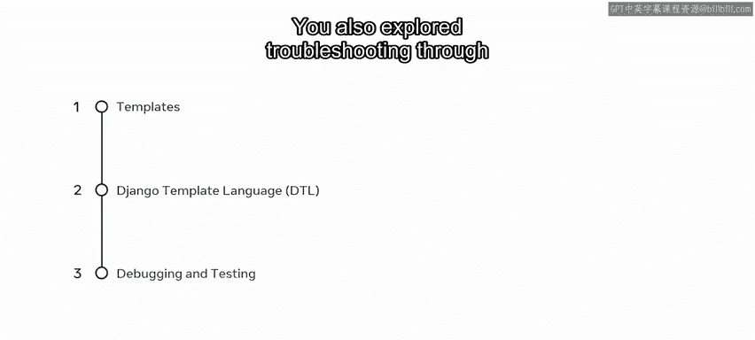

恭喜你完成了模板模块的学习。在本模块中，你学习了如何创建模板，并使用模板语言来生成HTML标记。你还探索了通过调试和测试过程来进行故障排除。

现在，是时候回顾一下关键点了。

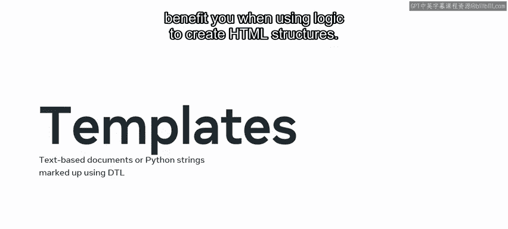

---

### 什么是Django模板？ 🤔

你从探索模板开始了本模块。完成第一课后，你现在可以阐述Django中的模板是什么，以及在使用逻辑创建HTML结构时，模板如何使你受益。

Django模板是一种将动态数据与静态HTML结构分离的机制。它允许开发者使用特殊的语法在HTML中嵌入变量和逻辑。

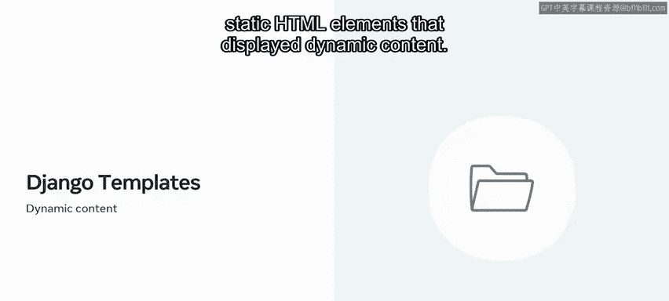

---

### Django模板语言（DTL）简介 🔤

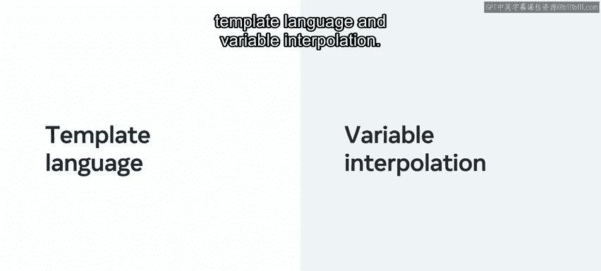

你被介绍了Django模板语言，简称DTL。它由变量、标签、过滤器和注释等结构组成。

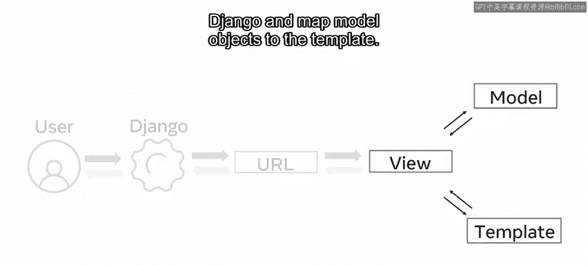

以下是DTL的核心概念：

*   **变量**： 使用双花括号 `{{ variable_name }}` 在模板中输出上下文传递过来的值。
*   **标签**： 使用花括号和百分号 `` 提供模板逻辑，如循环和条件判断。
    ```django
    
        <li>{{ item.name }}</li>
    
    ```
*   **过滤器**： 在变量输出时对其进行修改，使用管道符号 `|`。
    ```django
    {{ title|upper }}
    ```
*   **注释**： 使用 `{# comment #}` 在模板中添加不会被渲染的注释。

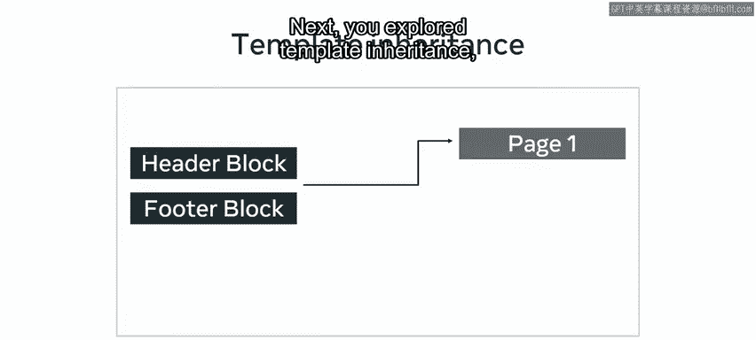

然后，你练习了如何创建模板来渲染静态HTML元素，并显示动态内容。

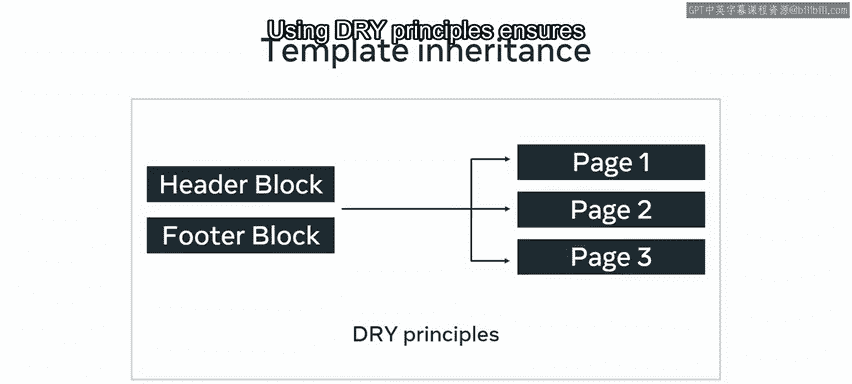

---

### 使用模板与变量插值 💻

在第一课之后，你学习了如何使用模板，更具体地说，你探索了如何使用模板语言和**变量插值**。

变量插值是将上下文中的数据（如从视图传递的模型对象）嵌入到模板指定位置的过程。你现在能够在Django中创建动态模板，并将模型对象映射到模板中。

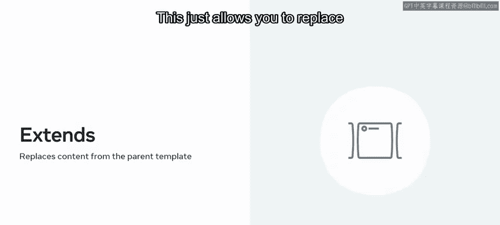

---

### 模板继承与DRY原则 🔄

接下来，你探索了**模板继承**。通过模板继承，你可以将内容拆分为独立的组件（如页眉、页脚），并在多个HTML页面中重用这些片段。

使用**DRY（Don‘t Repeat Yourself）原则**可以确保你不会重复工作，提高代码的可维护性。

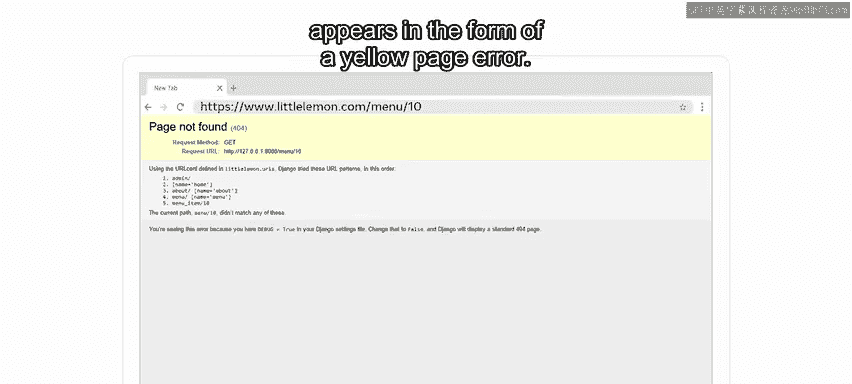

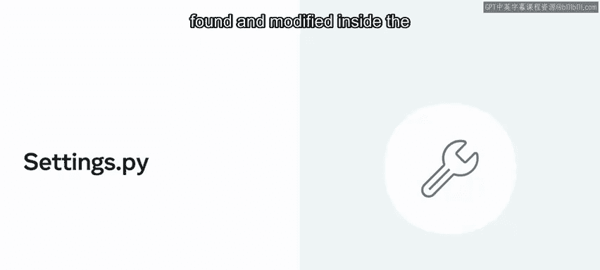

你了解到模板继承主要使用两个标签：

1.  **`` 标签**： 用于渲染另一个模板。
    ```django
    
    ```
2.  **`` 标签**： 用于指定当前模板继承自哪个父模板。它通常使用字符串字面量或变量值。
    ```django
    
    ```
    这允许你替换父模板中定义的块（``）的内容。

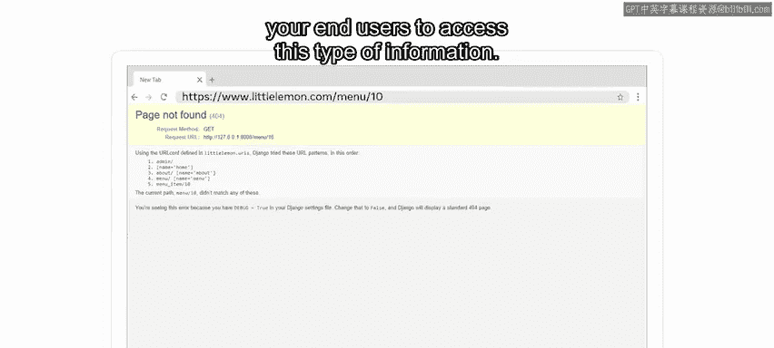

---

### 调试与测试 🐛

最后，你学习了调试和测试。在这里，你了解了如何调试Django应用程序。

Django有一个独特的调试器，当 `DEBUG = True` 且发生错误时，它会以黄色错误页面的形式出现。这个默认的错误页面会为开发者显示一些技术信息，但你**不希望最终用户访问这类信息**。

这可以通过在项目的 `settings.py` 文件中将设置更改为 `DEBUG = False` 来防止。

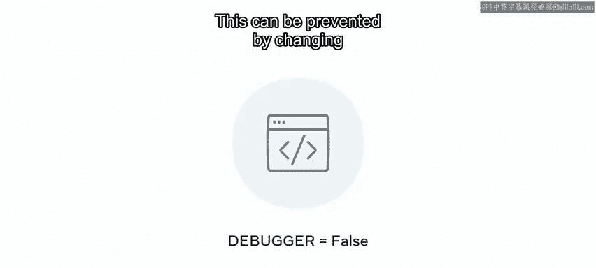

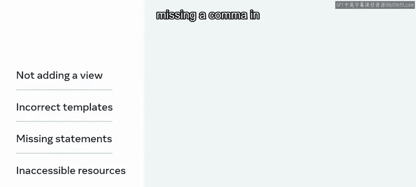

错误可能以多种形式出现在开发过程的任何阶段，包括：忘记添加视图、创建不正确的模板、缺少导入语句、无法访问的资源（如模型数据），甚至在函数中传递属性时缺少逗号。

你还了解到，**调试**更侧重于消除应用程序的错误和缺陷，而**测试**则考虑质量、可靠性和性能的度量标准。它有效地为开发者节省了大量时间。

---

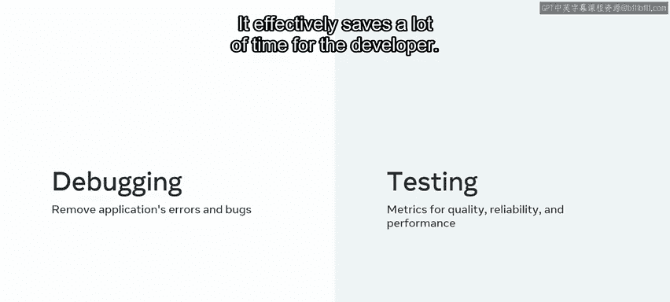

### Django中的单元测试 🧪

你知道每种语言和框架都有许多测试选项。在Django中，一个流行的方法是**单元测试**，你可以用它来隔离一个函数、类或方法，并只测试那一段代码。

在Django中，单元测试模块采用基于类的方法。你可以将测试添加到一个类中，该类继承自Django测试包中的 `TestCase` 类。
```python
from django.test import TestCase

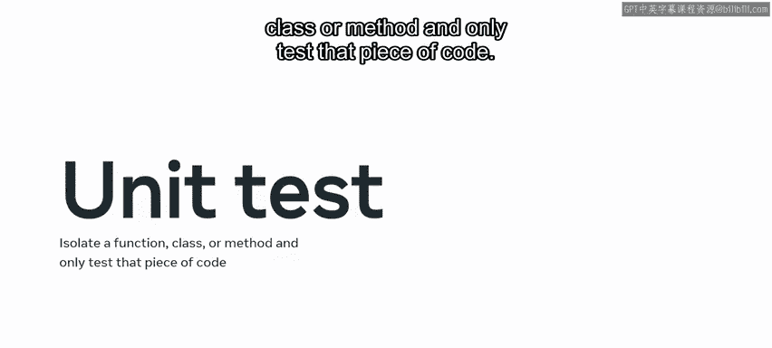

class MyViewTests(TestCase):
    def test_homepage_status_code(self):
        response = self.client.get(‘/‘)
        self.assertEqual(response.status_code， 200)
```

---

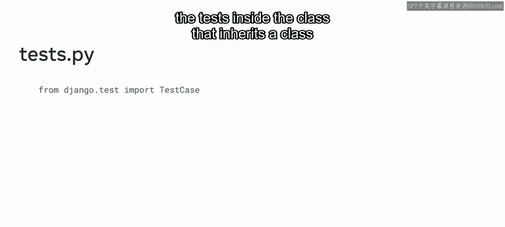

## 总结 📋

在本节课中，我们一起回顾了模板模块的核心知识。

你已经完成了本模块的学习，现在对模板已经很熟悉了。你可以创建模板并使用模板语言来生成HTML；你可以使用模板并将第三方库集成到你的Django应用中；你也可以在Django中使用基于类的视图，并在整个项目中重用它们。

做得好！