# 51：课程回顾与总结 📚

在本节课中，我们将一起回顾Django Web框架课程的核心内容。我们将系统梳理从项目结构、MVT框架的各个组成部分到具体实践操作的关键知识点，帮助你巩固所学，并为接下来的实践项目做好准备。

---

## 课程概述

在本课程中，你学习了Django框架的核心原则。现在，让我们花一些时间回顾一下你所学到的关键主题。

---

## Django框架简介 🏁

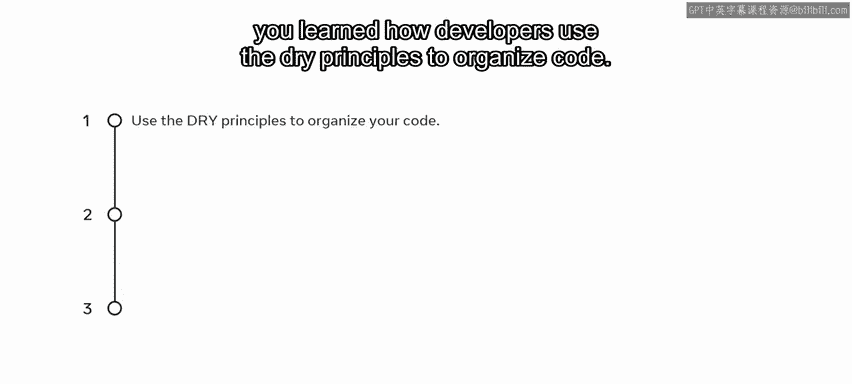

在开篇课程中，你学习了Django框架的简介。在此介绍中，你了解了开发者如何使用**DRY（Don‘t Repeat Yourself）原则**来组织代码。你还探索了如何使用**MVT（Model-View-Template）框架**来确保代码的可重用性。

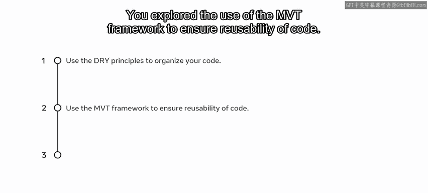

---

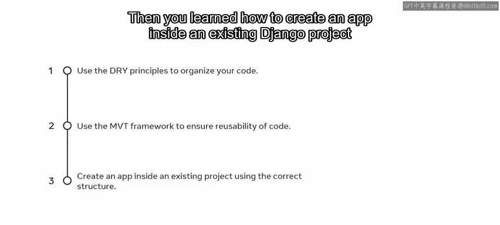

## 项目与应用结构 🗂️

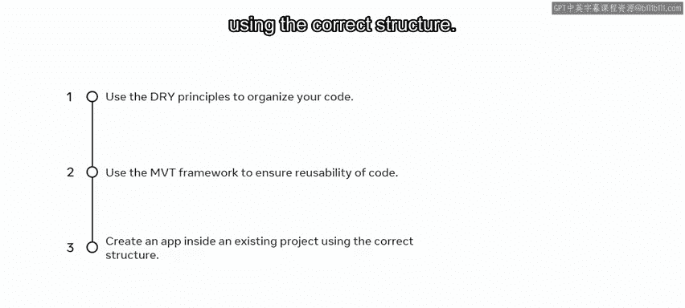

上一节我们介绍了Django的基本理念，本节中我们来看看如何构建项目。

你学习了如何在现有的Django项目中使用正确的结构创建一个应用。

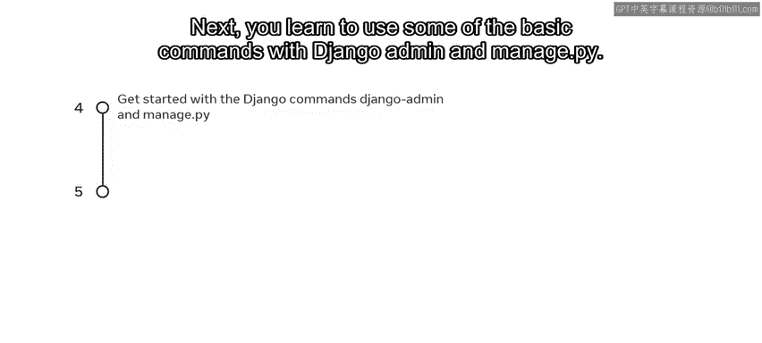

接下来，你学习了如何使用Django Admin和`manage.py`的一些基本命令，并最终区分了**应用（App）** 和**项目（Project）** 的结构。

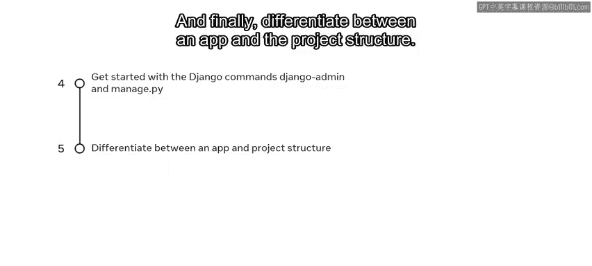

以下是应用与项目结构的关键区别：
*   **项目（Project）**：是整个网站的容器，包含全局配置。
*   **应用（App）**：是一个专门的功能模块，可以在不同项目中复用。

---

## 探索MVT框架：视图（View） 👁️

理解了项目结构后，我们进入到MVT框架的核心部分。你接着探索了MVT框架中的**视图（View）** 部分。

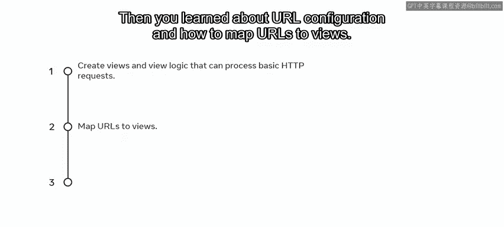

在这个主题中，你学习了如何创建视图和视图逻辑，以处理基本的HTTP请求。

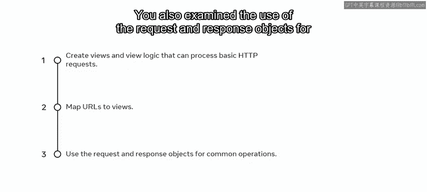

然后，你学习了URL配置，以及如何将URL映射到视图。

你还研究了如何使用**请求（request）和响应（response）对象**进行常见操作。

之后，你学习了如何使用**正则表达式**创建不同的URL模式。

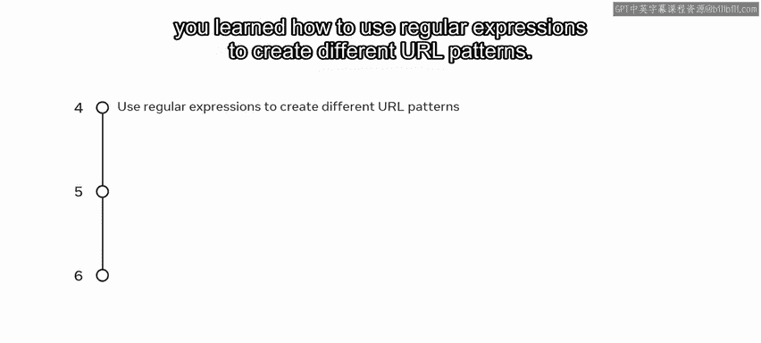

接着，你学习了如何区分参数，以及它们如何与**GET、PUT、POST和DELETE**等HTTP方法关联。

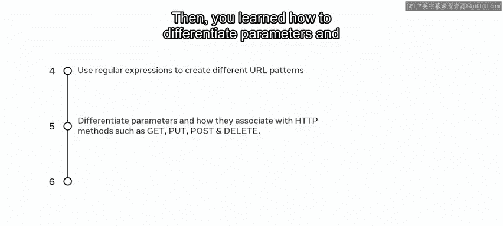

最后，你探索了如何在HTTP视图逻辑和视图级别处理错误。

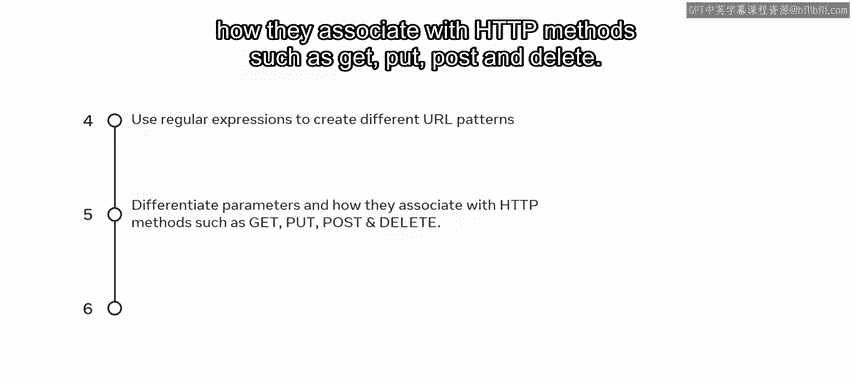

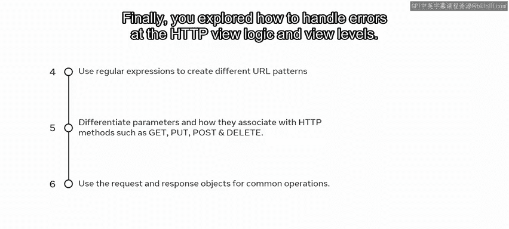

---

## 探索MVT框架：模型（Model） 🗃️

掌握了视图部分后，我们继续学习MVT框架的另一个支柱。你接着学习了MVT框架中的**模型（Model）** 部分。

在这个主题中，你学习了如何创建模型。

然后，你了解了**迁移（Migrations）** 的概念，以及如何使用最佳实践方法应用它们。

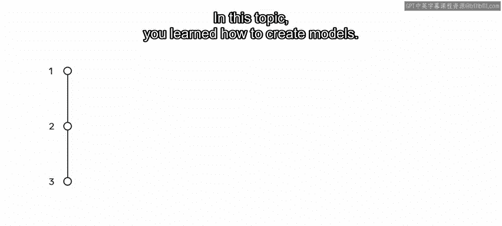

你还研究了如何使用**查询集API（QuerySet API）** 与数据库进行交互。

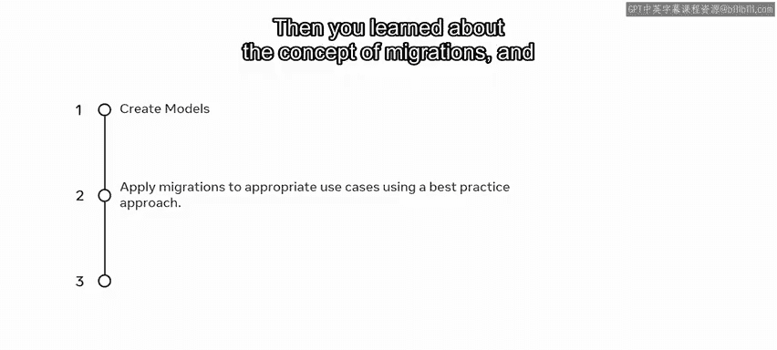

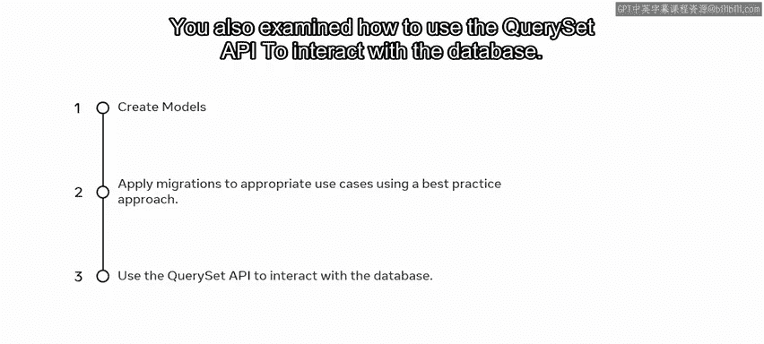

之后，你学习了如何创建表单，并使用**表单API**将数据绑定到对象。

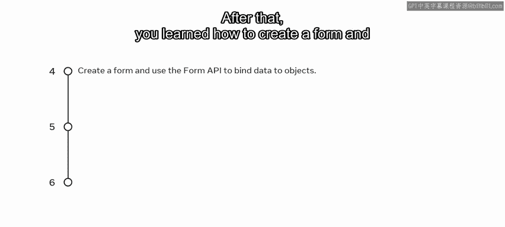

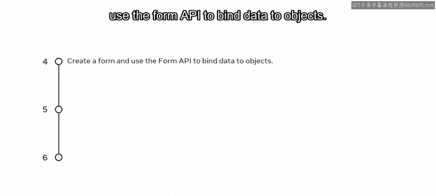

接着，你学习了如何使用**Django管理面板**来添加和控制用户及组的权限。

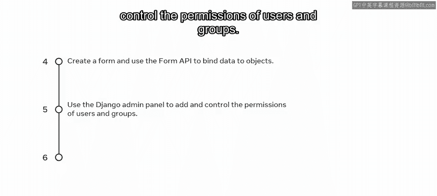

最后，你探索了如何为你的Django应用设置**MySQL数据库**。

---

## 探索MVT框架：模板（Template） 🎨

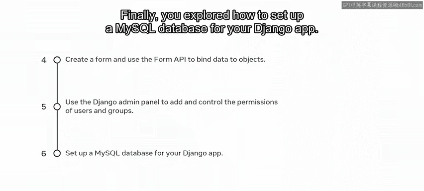

数据层和业务逻辑层之后，我们来到展示层。接下来，你探索了MVT框架中的**模板（Template）** 部分。

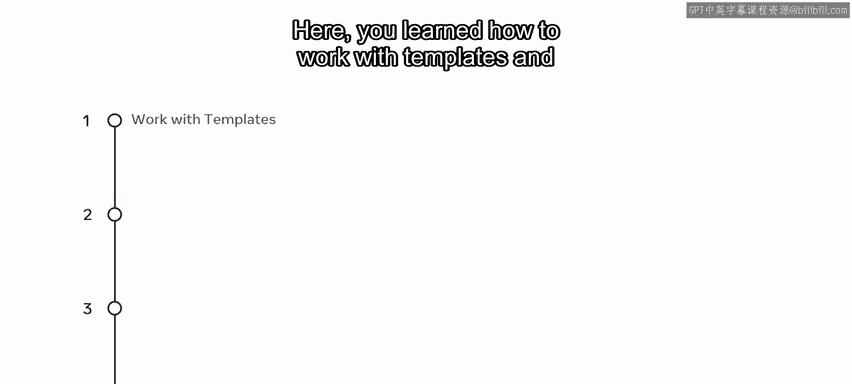

在这里，你学习了如何处理模板，并使用**模板技术**来生成HTML。

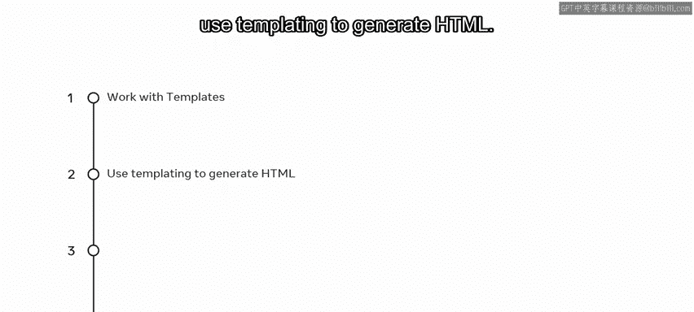

你还学习了如何创建模板，并使用**Django模板语言（DTL）** 来创建标记。

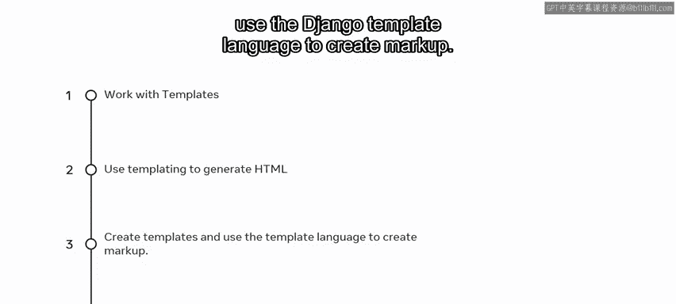

最后，你扩展了这些知识，使用**模板继承**来创建丰富的模板。

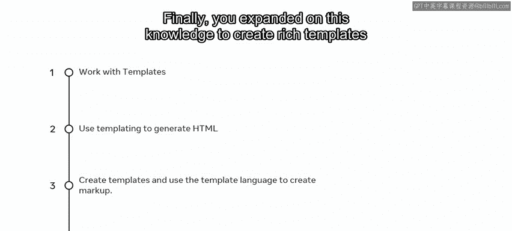

---

## 课程总结与实践 🚀

本节课中我们一起回顾了Django Web框架课程的全部核心内容，从DRY原则、MVT架构到具体的视图、模型、模板操作。

你是否确信自己已经掌握了本课程的这些技能？如果答案是肯定的，那么你现在已经准备好将所学知识付诸实践了。

对于课程的评分评估，你需要为“Little Lemon”网站创建菜单页面。

是时候展示你的技能，展示你在课程中学到的东西了。祝你好运。