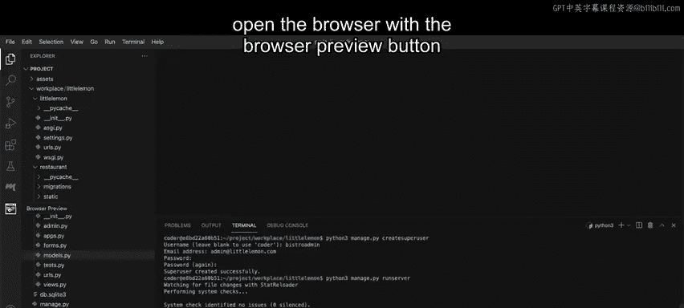
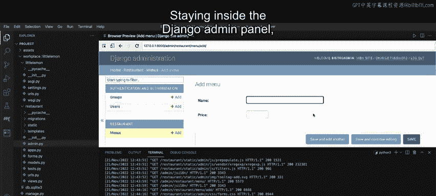
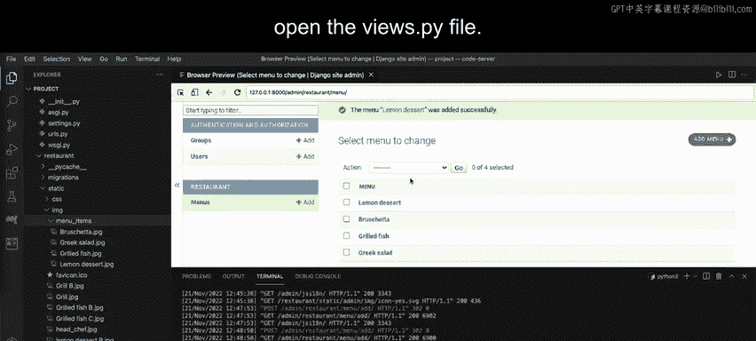
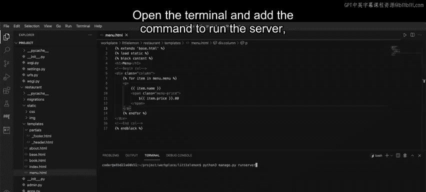
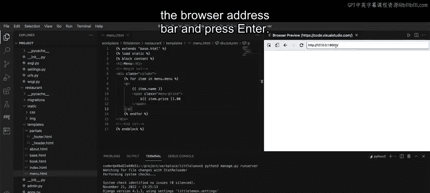

# 52：解决方案第1部分：创建菜单页面 🍽️

在本节课中，我们将学习如何完成一个Django项目的评分评估，具体任务是创建一个菜单页面。我们将从定义数据模型开始，逐步完成视图、URL配置和模板的开发，最终在浏览器中展示菜单项。

## 概述

本节教程将指导你完成Django项目“Little Lemon”中菜单页面的创建。整个过程包括：在`models.py`中定义菜单模型，在`admin.py`中注册模型，执行数据库迁移，在Django管理后台添加数据，创建视图函数，配置URL路由，以及编写模板文件来渲染菜单数据。

## 创建菜单模型

上一节我们完成了项目的基础设置，本节中我们来看看如何定义数据模型。

首先，打开`models.py`文件，创建一个名为`Menu`的模型类。确保在模型类内部定义一个`__str__`方法，以便在Django管理后台中清晰显示对象名称。

```python
from django.db import models

class Menu(models.Model):
    name = models.CharField(max_length=200)
    price = models.DecimalField(max_digits=6, decimal_places=2)
    # ... 可以添加其他字段，如描述、分类等

    def __str__(self):
        return self.name
```

## 注册模型到管理后台

模型创建好后，需要将其注册到Django管理后台，以便通过图形界面管理数据。

打开`admin.py`文件，从`models.py`中导入`Menu`模型，并使用`admin.site.register()`方法进行注册。



```python
from django.contrib import admin
from .models import Menu

admin.site.register(Menu)
```

## 执行数据库迁移

模型变更后，需要生成并应用数据库迁移文件，以在数据库中创建对应的表。

在命令行中运行以下命令：
```bash
python manage.py makemigrations
python manage.py migrate
```

## 配置URL路径

确保项目级和应用级的`urls.py`文件已正确配置，以便能够访问到我们即将创建的视图。



## 在管理后台添加菜单内容



现在，我们需要通过Django管理后台为菜单模型添加具体数据。

以下是创建超级用户并登录管理后台的步骤：
1.  在命令行中运行创建超级用户的命令，并按照提示输入信息（例如：用户名 `Bisttro admin`，邮箱 `admin@littlelemon.com`，密码 `Lemon@786!`）。
    ```bash
    python manage.py createsuperuser
    ```
2.  启动开发服务器。
    ```bash
    python manage.py runserver
    ```
3.  在浏览器中访问 `http://localhost:8000/admin`，使用刚创建的超级用户凭证登录。
4.  在管理面板中找到名为 `restaurant` 的应用下的 `Menu` 模型。
5.  点击“添加菜单”按钮，根据提供的菜单项文本文件（通常在项目资源压缩包中），逐一输入菜单名称和价格等信息并保存。

添加完成后，你可以在菜单列表页面看到所有已添加的菜单项。

## 创建菜单视图函数

数据准备就绪后，我们需要创建视图函数来处理用户对菜单页面的请求。

打开`views.py`文件。你会注意到`home`、`about`和`booking`的视图函数已经存在。现在，创建一个名为`menu`的新视图函数。

```python
from django.shortcuts import render
from .models import Menu

def menu(request):
    # 从数据库获取所有菜单对象
    menu_data = Menu.objects.all()
    # 构建传递给模板的上下文数据
    main_data = {"menu": menu_data}
    # 渲染并返回响应
    return render(request, 'menu.html', main_data)
```

**代码解释**：
*   `Menu.objects.all()`：这是一个**查询集（QuerySet）**，用于从数据库获取`Menu`表的所有记录。
*   `main_data`：这是一个**字典（Dictionary）**，键`"menu"`对应的值`menu_data`将传递给模板。
*   `render(request, 'menu.html', main_data)`：这是Django的**渲染函数**，它接收请求对象、模板文件名和上下文数据，并返回一个HTTP响应。

## 配置菜单页面的URL路由

视图函数创建后，需要为其配置一个URL路径，这样用户才能通过浏览器访问。

打开应用级的`urls.py`文件，使用`path`函数为`menu`视图添加一条路由。

```python
from django.urls import path
from . import views

urlpatterns = [
    path('admin/', admin.site.urls),
    path('', views.home, name='home'),
    # ... 其他路径
    path('menu/', views.menu, name='menu'), # 新增菜单路径
]
```

## 创建菜单模板

最后一步是创建用于展示菜单的HTML模板。视图函数将数据传递给模板，模板负责将这些数据渲染成用户看到的网页。

在应用目录下的`templates`文件夹中，创建一个名为`menu.html`的文件。首先添加基础HTML结构，然后使用Django模板语言（DTL）动态插入数据。

以下是模板内容的关键部分：

```html

<p>
    {{ item.name }}
    <span>${{ item.price|floatformat:2 }}</span>
</p>

```

**模板语言解释**：
*   ``：这是一个**for循环标签**，用于遍历从视图传递过来的`menu`列表。
*   `{{ item.name }}` 和 `{{ item.price }}`：这是**变量输出标签**，用于显示每个`item`对象的`name`和`price`属性。
*   `|floatformat:2`：这是一个**过滤器（Filter）**，用于将价格格式化为保留两位小数。
*   ``：用于结束for循环块。

## 测试菜单页面

至此，菜单页面的所有代码已完成。让我们运行开发服务器进行测试。



1.  在终端中启动开发服务器（如果尚未启动）。
2.  复制终端中生成的本地URL（通常是 `http://127.0.0.1:8000`）。
3.  在浏览器地址栏中粘贴该URL并访问网站首页。
4.  在浏览器地址栏中手动追加 `/menu` 路径（例如 `http://127.0.0.1:8000/menu`）并访问，你应该能看到列出了所有菜单项及其价格的页面。

## 总结



本节课中我们一起学习了创建Django菜单页面的完整流程。我们首先在`models.py`中定义了`Menu`数据模型，然后在`admin.py`中注册了该模型。接着，我们执行了数据库迁移，并通过Django管理后台添加了具体的菜单数据。之后，我们创建了`menu`视图函数来从数据库获取数据，并在`urls.py`中配置了对应的URL路由。最后，我们编写了`menu.html`模板文件，使用Django模板语言循环遍历并渲染出所有菜单项。

现在，菜单页面的第一部分已经成功完成。在接下来的部分，我们将继续完善这个项目。