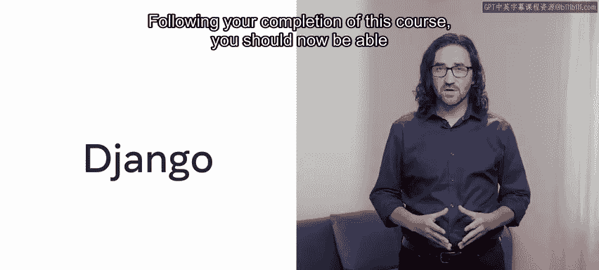
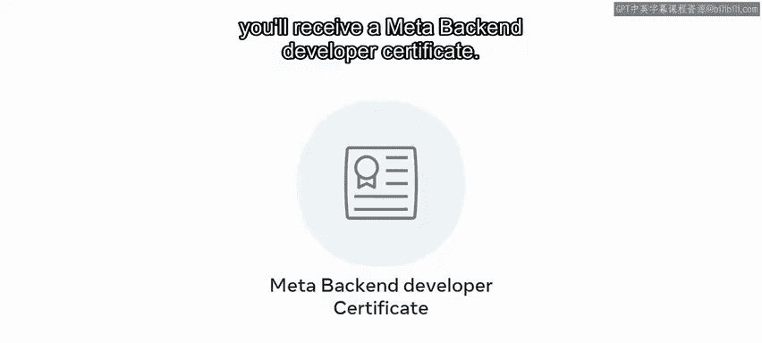

# 55：祝贺与总结 🎉

在本节课中，我们将一起回顾您在Meta后端开发课程中的学习成果，并展望未来的学习路径。您已经完成了这门由Meta提供的课程，通过努力学习和实践，掌握了Django框架开发Web应用的核心技能。

## 课程回顾与成就

上一节我们介绍了课程的核心内容，本节中我们来看看您已经达成的具体学习目标。

您已经到达了这门Meta后端开发课程的终点。您付出了辛勤的努力，并在此过程中掌握了许多新技能。

您在Django的学习之旅中取得了巨大进步。您现在应该理解了使用Django框架进行Web应用程序开发的基本原理。

您能够通过为“小柠檬”网站创建原型的课程作业，展示部分理论学习成果以及您的实践Django技能集。

## 掌握的核心技能

以下是您在完成本课程后应具备的能力总结：

*   **设计Django Web应用**：您应该能够使用Python、HTML和CSS设计一个Django Web应用程序。
*   **评估交互设计**：您应该能够使用设计方法论和最佳实践原则来评估交互设计。
*   **理解HTTP请求/响应周期**：您应该能够通过创建视图、路由和模板来描述和实现HTTP请求/响应周期。
*   **构建数据模型**：您应该能够描述和构建数据模型，以创建数据库表和动态Web表单。
*   **使用Django模板语言**：您应该能够探索Django模板语言，以创建能显示数据库中存储数据的动态网页。
*   **创建与测试应用**：您应该能够使用行业标准、最佳实践和指南来创建、共享和测试您的Web应用程序。

课程中的分级评估所衡量的关键技能，证明了您在这些主题上的能力。

## 下一步计划

这门Django课程为您初步介绍了几个关键领域。您可能意识到自己仍有更多需要学习的内容。

因此，如果您觉得本课程有帮助并希望了解更多，那么为什么不注册下一门课程呢？

无论您是刚起步的技术专业人士、学生还是商业用户，本课程及项目都证明了您对Django框架价值和能力的了解。

最终的作业通过您在Django中的实际技能应用，巩固了您的能力。

但它还有另一个重要的好处。这意味着您拥有一个可以在作品集中引用的真实设计。

这有助于向潜在雇主展示您的技能。它不仅向雇主表明您具有自我驱动力和创新精神，也充分说明了您作为个人的特质以及您新获得的知识。

一旦您完成了所有课程，您将获得Meta后端开发人员证书。

## 总结与祝福

本节课中我们一起回顾了您在Django课程中的学习历程、掌握的核心技能以及未来的发展方向。

感谢您。能与您一同踏上这段探索之旅是我的荣幸。

祝您未来一切顺利。