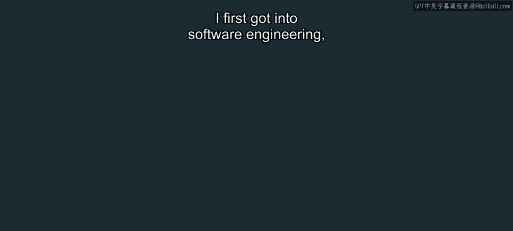
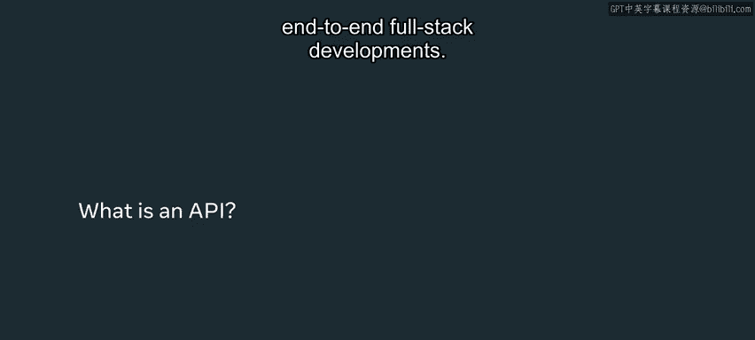
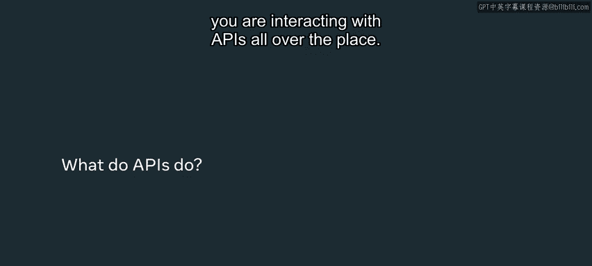
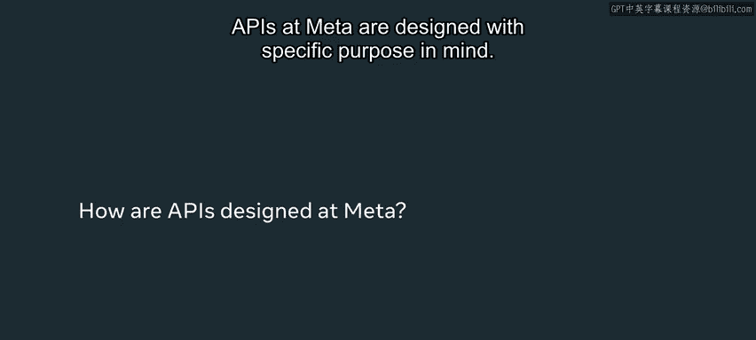
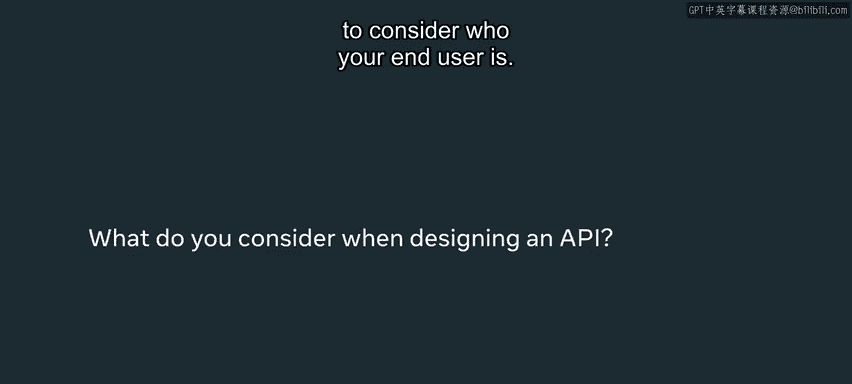
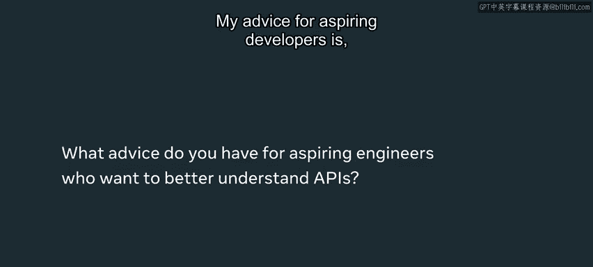

# 57：API在现实世界中的应用 🚀

在本节课中，我们将学习API（应用程序编程接口）在现实世界中的核心作用、设计理念以及它们如何作为软件组件交互的桥梁。我们将通过Meta软件工程师Selena的分享，了解API设计的关键考量与实际应用。

---

## 概述

API设计本身近乎一门艺术，它需要大量的技巧与深思熟虑，以呈现给最终用户。本节将探讨API的本质、设计过程及其在大型产品（如Instagram）中的具体角色。



---

## 什么是API？🔧

上一节我们介绍了API的概念，本节中我们来看看它的核心定义与比喻。

API是全栈端到端开发的基石。之所以称之为“基石”，是因为它在描述软件组件如何相互交互方面至关重要。

你可以将API视为**最终用户与后端服务之间的中介**。一个恰当的比喻是：API如同银行柜员，而后端服务所托管的数据如同银行里的钱。当客户想从银行存取款时，并非直接与钱交互，而是通过柜员（即API）进行沟通。API处理用户与后端服务之间的通信，并告知用户可以访问多少“钱”或数据。

**核心公式**：
```
最终用户 <-> [API] <-> 后端服务/数据
```

每当您打开Instagram应用，您都在与各种API交互。例如：
*   一组特定的API负责在您的主页信息流中渲染故事、照片和视频。
*   另一组API在“探索”页面执行相同的渲染功能。
*   还有API负责处理诸如双击帖子点赞等操作，并通知您的设备将那个小心形图标渲染为红色。





---

## API的设计过程与考量 🤝

理解了API的基本角色后，我们来看看在实际项目中如何设计一个API。

在Meta，API的设计具有明确的目的。例如，目标是设计一个面向用户的产品或功能的API。通常，流程如下：

1.  **产品设计**：设计师创建产品原型，产品经理提供关于最终产品或服务应达成的高级目标的信息。
2.  **工程师协作**：实际的API设计是多名工程师（通常是后端和前端工程师）之间达成的一项“握手协议”。他们共同商定API的结构、请求的格式以及响应的格式。

在设计API时，有两点至关重要：




*   **明确最终用户**：必须考虑API的最终使用者是谁。
*   **保障安全与完整性**：需要考虑哪些人或系统将访问数据及API服务。因此，必须在请求中添加凭证（credentials）形式的安全层，以保护数据的完整性。

**核心代码概念**（伪代码示例）：
```python
# 一个受保护的API端点示例
@app.route(‘/api/data‘, methods=[‘GET‘])
def get_protected_data():
    user_credentials = request.headers.get(‘Authorization‘) # 从请求头获取凭证
    if validate_credentials(user_credentials): # 验证凭证
        return jsonify(fetch_data()) # 返回数据
    else:
        return jsonify({“error“: “Unauthorized“}), 401 # 返回未授权错误
```

---



## 给开发者的建议 💡

设计API不仅关乎技术，更关乎协作与视野。

我的建议是，以开放的心态对待API设计。请记住，这将是一个涉及多名工程师、可能还包括产品经理和设计师的协作过程。这些人都将非常关心以产品、应用或服务形式呈现的API成果。

即使你在构建一个API，也必须将其组件视为更大整体的一部分。当你的产出能够反映现实世界应用程序中的所见时，其中自有一种美感。因此，尽情享受这个过程，与工程师们一起头脑风暴，共同构想API的目标架构。



---

## 总结

本节课中，我们一起学习了API在软件开发生命周期中的核心地位。我们了解到API是连接用户与后端服务的中介，其设计是一个需要明确用户、保障安全并注重团队协作的过程。虽然前方还有许多工作，但坚持学习是值得的，因为理解这些不同组件如何交互至关重要。