# 58：你对HTTP有什么了解？ 🌐

在本节课中，我们将要学习HTTP和HTTPS的工作原理、HTTP方法、HTTP请求与响应的结构，以及HTTP状态码。这些是构建和管理API的基础知识。

## HTTP与HTTPS概述

现在，你已经知道HTTP代表**超文本传输协议**，并且它是互联网上传输数据最广泛使用的通信协议之一。

在深入更复杂的主题之前，让我们简要回顾一下HTTP和HTTPS。

当你浏览网页、查看图片或提交表单时，你的数据是通过HTTP或其安全版本HTTPS传输的。那么，HTTP和HTTPS的传输分别是如何工作的呢？

## HTTP与HTTPS的工作原理

HTTP通信至少需要两个部分：**客户端**（请求信息）和**服务器**（响应请求并提供内容）。

HTTPS是HTTP的安全版本，在需要安全性的场景中更为适用。让我们看看它是如何工作的。

使用HTTPS时，客户端的计算机在数据发送到服务器之前会先对其进行**加密**。服务器随后**解密**这些来自客户端的数据并进行处理。同时，Web服务器也会对响应数据进行加密，并将加密后的内容发送回你的浏览器。你的浏览器再**解密**响应并显示内容。

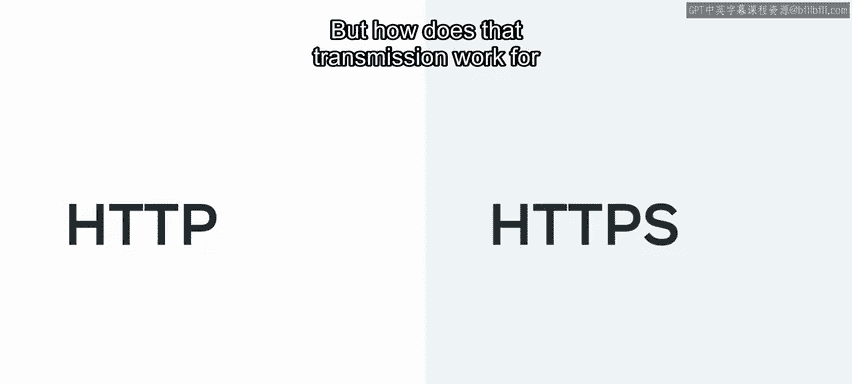

```
客户端 -> 加密请求 -> 服务器
客户端 <- 加密响应 <- 服务器
```

由于内容被加密，它更加安全，信息很难被窃取或获取。对于提交信用卡信息等敏感数据，始终建议使用HTTPS以确保数据安全。


## HTTP方法

上一节我们介绍了HTTP与HTTPS的基本工作原理，本节中我们来看看HTTP方法。

HTTP方法也被称为HTTP动词。通过HTTP访问内容时，常用的有五种方法。

以下是五种主要的HTTP方法：

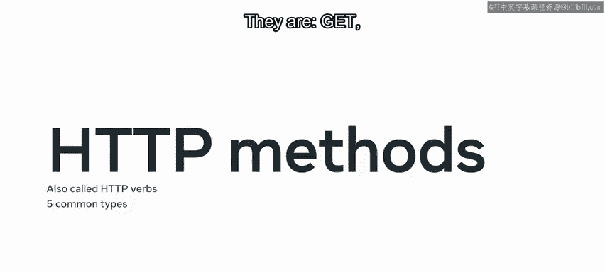

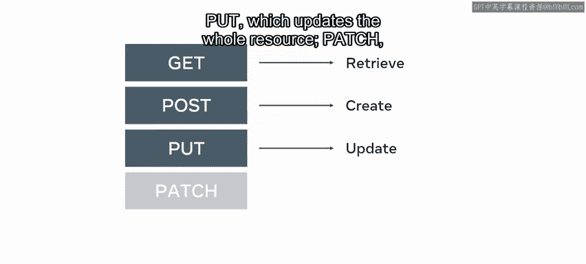

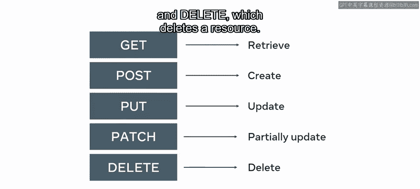

*   **GET**：用于**检索**一个资源。
*   **POST**：用于向服务器**发送**数据以**创建**一条记录。
*   **PUT**：用于**更新**整个资源。
*   **PATCH**：用于**部分更新**一个资源。
*   **DELETE**：用于**删除**一个资源。

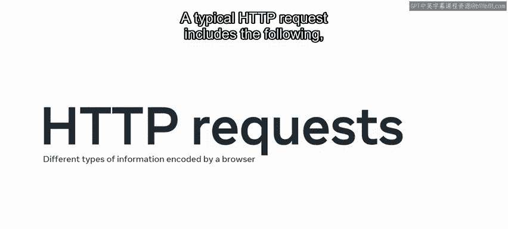

## HTTP请求

接下来是HTTP请求，它包含了用户浏览器作为编码数据发送的不同类型信息。

一个典型的HTTP请求包括以下部分：

*   **HTTP版本类型**：例如，1.1 或 2.0。
*   **URL或路径**：请求的目标地址。
*   **HTTP方法**：如GET、POST等。
*   **HTTP请求头**：包含额外信息。
*   **可选的HTTP请求体**：包含发送的数据。

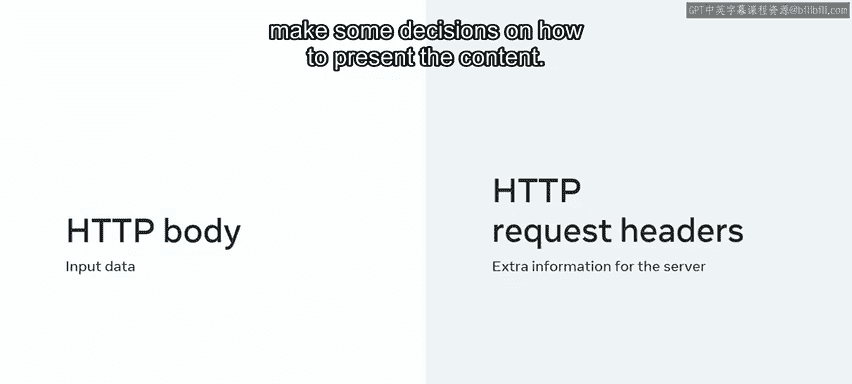

那么，HTTP请求头和请求体具体是什么呢？

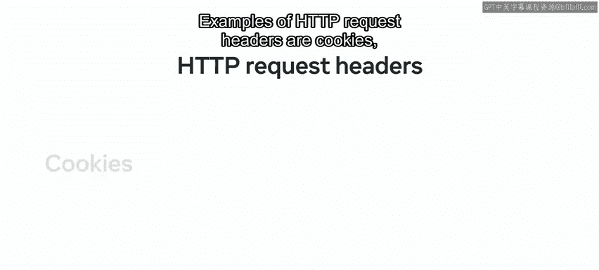

当你提交一个表单（例如输入用户名和密码登录网站）时，该数据会作为HTTP请求体传递给Web服务器，其格式可以是原始的**JSON字符串**或**表单URL编码字符串**。

另一方面，HTTP请求头是每个HTTP请求的核心部分，它可能包含额外信息，帮助服务器决定如何呈现内容。

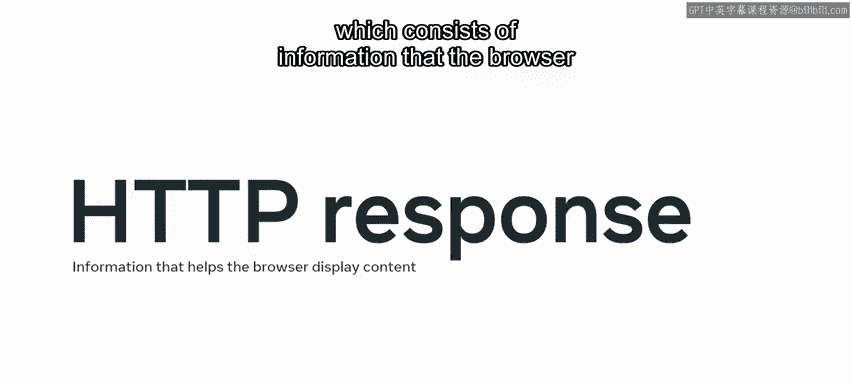

以下是HTTP请求头的一些例子：

*   **Cookies**：用于状态管理。
*   **User-Agent**：标识客户端（如浏览器）类型。
*   **Referer**：表示请求来源的页面。

## HTTP响应

HTTP请求之后便是HTTP响应，它包含了浏览器用于正确显示响应体内容的信息。

响应包含所请求的资源，同时也包含诸如内容长度、内容类型以及Cookie等头部信息。它还包含**ETag**（实体标签）和内容最后修改时间。

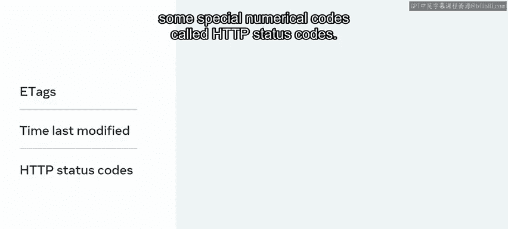

最后，响应还包含一些特殊的数字代码，称为**HTTP状态码**。

你一定见过这些HTTP状态码，但可能不知道它们的用途。实际上，它们并非直接面向用户的消息，而是向你的浏览器提供关于资源的额外信息。

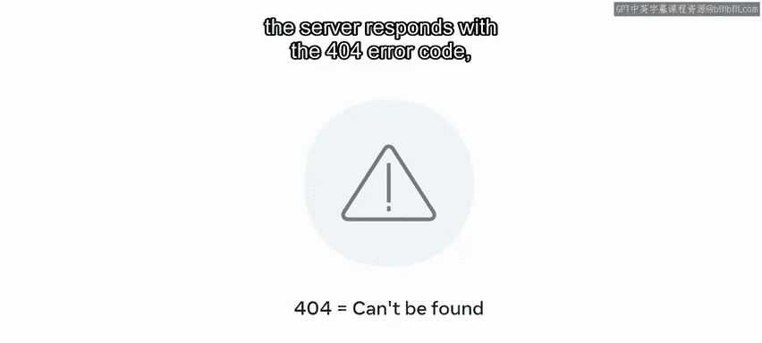

例如，如果一切正常，服务器会发送**200**。你通常不会察觉到这一点，因为它甚至不会显示在你的浏览器中。

或者，如果找不到请求的内容，服务器会以**404**错误代码响应，这通常会显示在浏览器中，因为没有其他内容可展示。

## HTTP状态码详解

上一节我们提到了状态码，本节中我们来详细看看它们的分类和含义。

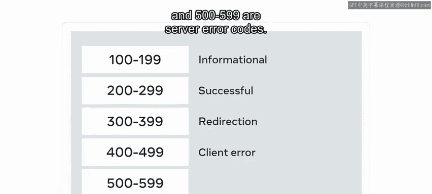

以下是一系列状态码及其含义的范围：

*   **100 到 199**：用于**信息性**消息。
*   **200 到 299**：表示**成功**的响应。
*   **300 到 399**：提供**重定向**信息。
*   **400 到 499**：表示**客户端错误**响应。
*   **500 到 599**：表示**服务器错误**代码。

服务器错误通常发生在服务器端代码缺乏适当的错误检查、配置不匹配、包依赖不正确等情况。

客户端错误通常发生在客户端发出错误的API请求（请求体信息不足），或客户端请求服务器上不存在的资源时。

但请注意，有时相同的状态码在不同上下文中可能传达不同的信息。例如：
*   对于GET请求，**200**状态码意味着找到了内容。
*   对于PUT请求，同样的**200**代码意味着数据传输和更新过程成功。
*   类似地，对于DELETE请求，**200**状态码意味着资源被成功删除。

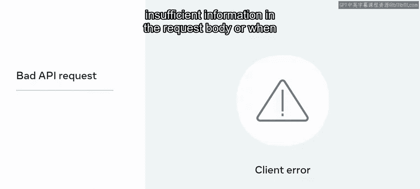

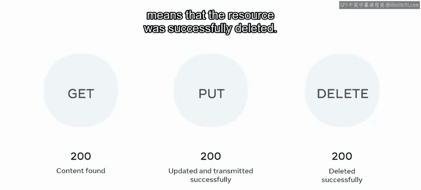

一些最常用的状态码包括：**200**和**201**、**303**和**304**、**400**、**401**、**403**和**404**，以及**500**。

随着课程的深入，你将了解更多关于这些状态码的具体含义。

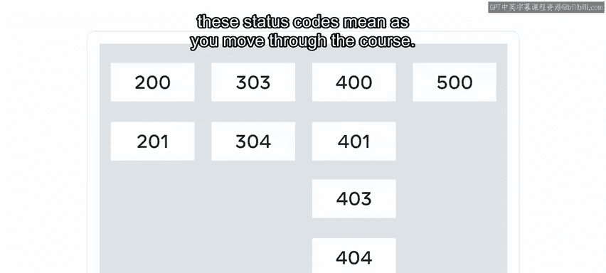

## 总结

本节课中我们一起学习了HTTP的回顾内容，包括HTTP与HTTPS、HTTP方法、HTTP请求与响应以及HTTP状态码。这些是用于开发可持续和可管理API的基本概念。